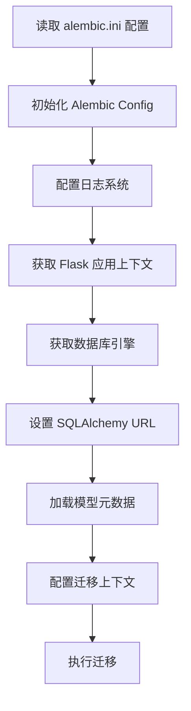

# 迁移流程

<cite>
**本文档中引用的文件**  
- [env.py](file://api/migrations/env.py)
- [alembic.ini](file://api/migrations/alembic.ini)
- [commands.py](file://api/commands.py)
- [app.py](file://api/app.py)
</cite>

## 目录
1. [环境准备](#环境准备)
2. [Alembic环境配置](#alembic环境配置)
3. [生成迁移脚本](#生成迁移脚本)
4. [应用数据库迁移](#应用数据库迁移)
5. [迁移状态检查与版本控制](#迁移状态检查与版本控制)
6. [实际操作示例](#实际操作示例)
7. [权限控制与审批机制](#权限控制与审批机制)

## 环境准备

在执行Dify平台数据库迁移之前，必须确保开发、测试和生产环境均已正确配置。迁移流程依赖于Flask-Migrate和Alembic工具链，通过`flask db`命令进行管理。系统使用Redis锁机制（`db_upgrade_lock`）防止并发迁移操作，确保数据库变更的安全性。迁移命令通过`commands.py`中的`upgrade_db`函数触发，该函数会获取Redis锁后调用`flask_migrate.upgrade()`执行实际迁移。

**Section sources**
- [commands.py](file://api/commands.py#L676-L718)
- [app.py](file://api/app.py#L0-L40)

## Alembic环境配置

Dify平台的Alembic环境配置位于`api/migrations/env.py`文件中，该文件负责设置迁移上下文和数据库连接。配置过程包括以下几个关键步骤：

1. **数据库引擎获取**：通过`get_engine()`函数从Flask应用的`migrate`扩展中获取数据库引擎实例。
2. **URL配置**：`get_engine_url()`函数将数据库URL渲染为字符串并转义百分号，然后通过`config.set_main_option('sqlalchemy.url', ...)`设置Alembic配置。
3. **元数据配置**：从`models.base`导入`Base`类，并通过`get_metadata()`函数提供模型的元数据对象，用于支持自动迁移生成功能。
4. **对象过滤**：`include_object`函数用于过滤迁移过程中的数据库对象，特别地，它会排除外键约束以避免不必要的迁移脚本生成。

此外，`alembic.ini`文件定义了迁移文件的命名模板（包含年月日时分的时间戳格式）和日志配置，其中Alembic日志级别设置为INFO，便于监控迁移过程。

**Diagram sources**
- [env.py](file://api/migrations/env.py#L0-L50)
- [alembic.ini](file://api/migrations/alembic.ini#L0-L51)

**Section sources**
- [env.py](file://api/migrations/env.py#L0-L50)
- [alembic.ini](file://api/migrations/alembic.ini#L0-L51)

## 生成迁移脚本

生成新的数据库迁移脚本使用标准的Flask-Migrate命令`flask db migrate`。该命令会比较当前模型定义与数据库模式，自动生成包含升级（upgrade）和降级（downgrade）操作的Python脚本，并保存在`api/migrations/versions/`目录下。脚本文件名遵循`YYYY_MM_DD_HHMM-revision_slug`的格式，确保按时间顺序排列。

在`env.py`中，`process_revision_directives`回调函数用于优化迁移脚本生成：当检测到模式没有变化时（`script.upgrade_ops.is_empty()`），它会清空迁移指令并记录日志，避免生成空的迁移脚本。这有助于保持迁移历史的整洁和可读性。

**Section sources**
- [env.py](file://api/migrations/env.py#L45-L87)

## 应用数据库迁移

应用数据库迁移通过`flask db upgrade`命令执行，该命令会运行所有未应用的迁移脚本，将数据库模式更新到最新版本。在Dify平台中，这一过程被封装在`commands.py`的`upgrade_db`命令中，实现了额外的安全措施：

- **分布式锁**：使用Redis锁`db_upgrade_lock`（超时60秒）确保同一时间只有一个迁移进程在运行，防止多实例部署时的并发问题。
- **异常处理**：迁移过程被try-catch块包围，任何异常都会被记录到日志中，确保迁移失败时系统状态的可追溯性。
- **原子性**：每个迁移脚本在事务中执行，保证了升级操作的原子性，要么全部成功，要么全部回滚。

对于开发、测试和生产环境，迁移流程相同，但建议在生产环境应用前先在测试环境充分验证。

**Section sources**
- [commands.py](file://api/commands.py#L676-L718)

## 迁移状态检查与版本控制

Dify平台提供了完整的迁移状态检查和版本控制功能。Alembic会在数据库中创建一个名为`alembic_version`的表，用于跟踪当前的迁移版本。通过以下命令可以检查迁移状态：

- `flask db current`：显示当前数据库版本。
- `flask db heads`：显示所有分支的最新版本。
- `flask db history`：显示完整的迁移历史。
- `flask db show <revision>`：预览特定迁移脚本的详细内容。

这些命令可以帮助开发人员在应用迁移前评估其影响，确保变更符合预期。

## 实际操作示例

一个典型的迁移流程如下：
1. 修改数据模型（如在`models/`目录下添加新字段）。
2. 生成迁移脚本：`flask db migrate -m "Add new field to User model"`。
3. 检查生成的脚本（位于`versions/`目录），确认SQL语句正确。
4. 在开发环境应用迁移：`flask db upgrade`。
5. 测试应用功能，确保兼容性。
6. 将迁移脚本和代码变更提交到版本控制系统。
7. 在测试和生产环境按顺序应用迁移。

## 权限控制与审批机制

Dify平台的数据库迁移流程内置了安全机制以确保变更的安全性。通过Redis锁实现了迁移操作的互斥性，防止了因并发执行导致的数据损坏。虽然代码中未直接体现复杂的审批工作流，但迁移脚本作为代码的一部分，必须经过标准的代码审查（Code Review）流程才能合并到主分支。这种将数据库变更纳入版本控制的做法，本身就是一种有效的审批和审计机制，确保了所有数据库变更都可追溯、可审查。

**Section sources**
- [commands.py](file://api/commands.py#L676-L718)
- [env.py](file://api/migrations/env.py#L85-L109)