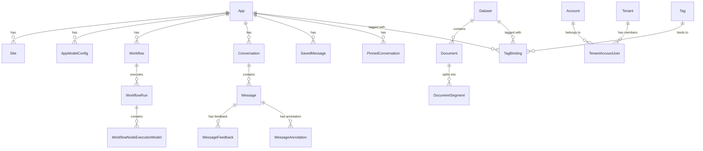
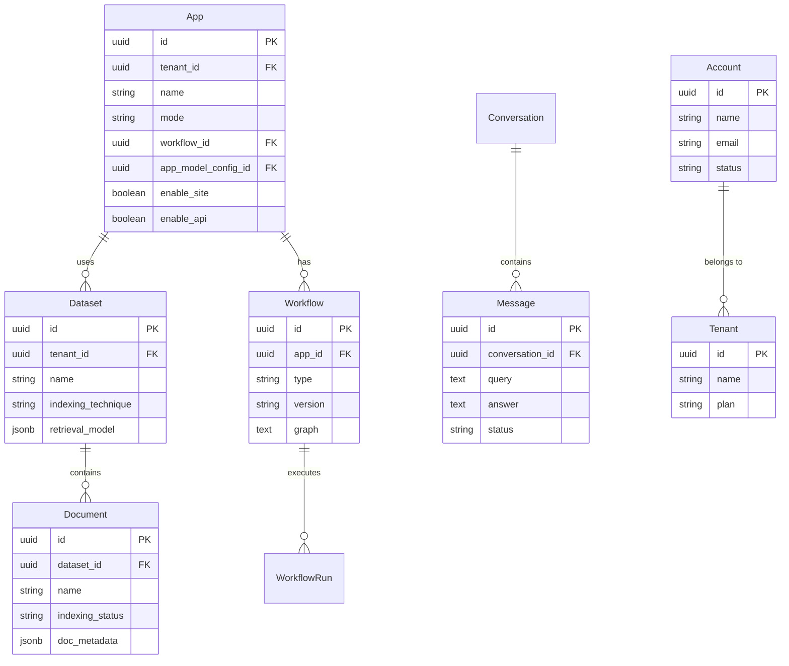

# 数据模型

<cite>
**本文档中引用的文件**  
- [dataset.py](file://api/models/dataset.py)
- [workflow.py](file://api/models/workflow.py)
- [account.py](file://api/models/account.py)
- [model.py](file://api/models/model.py)
- [web.py](file://api/models/web.py)
- [base.py](file://api/models/base.py)
- [enums.py](file://api/models/enums.py)
- [types.py](file://api/models/types.py)
</cite>

## 目录
1. [引言](#引言)
2. [核心实体关系模型](#核心实体关系模型)
3. [字段定义与数据结构](#字段定义与数据结构)
4. [数据库模式图](#数据库模式图)
5. [数据生命周期管理策略](#数据生命周期管理策略)
6. [数据访问模式与查询优化](#数据访问模式与查询优化)
7. [数据验证规则与业务约束](#数据验证规则与业务约束)
8. [数据库迁移策略与版本管理](#数据库迁移策略与版本管理)
9. [结论](#结论)

## 引言
Dify平台的数据模型设计围绕核心实体（如App、Dataset、Document、Message、Workflow等）构建，支持复杂的AI应用开发与知识管理。该模型通过清晰的实体关系和字段定义，确保了数据的一致性、可扩展性和高性能访问。本文档详细描述了这些核心实体的关系模型、字段定义、数据生命周期管理策略、访问模式及完整性保障机制。

## 核心实体关系模型
Dify平台的核心实体包括App、Dataset、Document、Workflow、Message、Account和Tenant。这些实体通过外键和关联表建立复杂的关系网络，支持多租户、权限控制和知识检索等功能。

- **App** 是应用的核心，可关联一个 **Workflow** 或 **AppModelConfig**，并可启用站点或API访问。
- **Dataset** 代表知识库，包含多个 **Document**，每个文档可被分割为多个 **DocumentSegment**。
- **Workflow** 支持工作流应用，包含节点执行记录 **WorkflowNodeExecutionModel** 和运行实例 **WorkflowRun**。
- **Message** 存储对话消息，属于某个 **Conversation**，并可被保存为 **SavedMessage**。
- **Account** 和 **Tenant** 实现多租户和用户权限管理，通过 **TenantAccountJoin** 建立关联。

**图示来源**  
- [model.py](file://api/models/model.py#L100-L300)
- [dataset.py](file://api/models/dataset.py#L50-L150)
- [workflow.py](file://api/models/workflow.py#L50-L150)

**本节来源**  
- [model.py](file://api/models/model.py#L1-L500)
- [dataset.py](file://api/models/dataset.py#L1-L200)
- [workflow.py](file://api/models/workflow.py#L1-L200)

## 字段定义与数据结构
### App 实体
- `id`: 应用唯一标识符（UUID）
- `tenant_id`: 租户ID，关联 **Tenant**
- `name`: 应用名称
- `mode`: 应用模式（completion, workflow, chat等）
- `workflow_id`: 关联的 **Workflow** ID
- `app_model_config_id`: 关联的 **AppModelConfig** ID

### Dataset 实体
- `id`: 数据集唯一标识符（UUID）
- `tenant_id`: 租户ID
- `name`: 数据集名称
- `indexing_technique`: 索引技术（high_quality, economy）
- `retrieval_model`: 检索模型配置（JSONB）

### Document 实体
- `id`: 文档唯一标识符（UUID）
- `dataset_id`: 所属数据集ID
- `indexing_status`: 索引状态（waiting, parsing, completed等）
- `doc_metadata`: 文档元数据（JSONB）

### Workflow 实体
- `id`: 工作流唯一标识符（UUID）
- `app_id`: 关联的应用ID
- `type`: 工作流类型（workflow, chat）
- `graph`: 工作流图结构（JSON）
- `version`: 版本号

### Message 实体
- `id`: 消息唯一标识符（UUID）
- `conversation_id`: 所属会话ID
- `query`: 用户输入
- `answer`: AI回复
- `status`: 消息状态（normal, error）

**本节来源**  
- [model.py](file://api/models/model.py#L100-L500)
- [dataset.py](file://api/models/dataset.py#L50-L200)
- [workflow.py](file://api/models/workflow.py#L50-L200)

## 数据库模式图

**图示来源**  
- [model.py](file://api/models/model.py#L100-L300)
- [dataset.py](file://api/models/dataset.py#L50-L150)
- [workflow.py](file://api/models/workflow.py#L50-L150)

**本节来源**  
- [model.py](file://api/models/model.py#L1-L500)
- [dataset.py](file://api/models/dataset.py#L1-L200)
- [workflow.py](file://api/models/workflow.py#L1-L200)

## 数据生命周期管理策略
### 创建
- **App** 创建时自动生成 **Site** 记录，并初始化默认配置。
- **Dataset** 创建后，可通过上传文件或爬取网站添加 **Document**。
- **Workflow** 的草稿版本（version='draft'）支持多次编辑，发布后生成新版本。

### 更新
- **Document** 的元数据和内容在索引完成后可更新，触发重新索引任务。
- **Workflow** 的草稿版本可随时修改，保存时更新 `updated_at` 时间戳。

### 删除
- 删除 **Dataset** 时，关联的 **Document** 和 **DocumentSegment** 被级联删除。
- 删除 **App** 时，相关 **Conversation** 和 **Message** 被标记为已删除（软删除）。

### 归档
- **Document** 可通过 `archived` 字段归档，归档后不再参与检索。
- **Conversation** 可通过 `is_deleted` 字段软删除，保留历史记录。

**本节来源**  
- [dataset.py](file://api/models/dataset.py#L200-L300)
- [workflow.py](file://api/models/workflow.py#L200-L300)
- [model.py](file://api/models/model.py#L500-L600)

## 数据访问模式与查询优化
### 访问模式
- **App** 通过 `tenant_id` 进行分区查询，支持快速检索租户下的所有应用。
- **Dataset** 使用 `retrieval_model_idx` GIN索引优化检索模型查询。
- **Document** 通过 `dataset_id_idx` 索引加速数据集文档列表查询。

### 查询优化
- 使用 `created_at` 和 `updated_at` 字段支持时间范围查询。
- **Message** 表通过 `conversation_id` 索引优化会话消息加载。
- 复杂JSON查询使用 `JSONB` 类型和Gin索引提升性能。

**本节来源**  
- [dataset.py](file://api/models/dataset.py#L50-L100)
- [model.py](file://api/models/model.py#L100-L150)
- [web.py](file://api/models/web.py#L10-L20)

## 数据验证规则与业务约束
### 数据验证
- **App** 的 `mode` 字段必须是预定义枚举值（completion, workflow等）。
- **Dataset** 的 `indexing_technique` 限制为 `high_quality`, `economy` 或 `None`。
- **Workflow** 的 `graph` 字段必须是有效JSON，包含 `nodes` 和 `edges`。

### 业务约束
- **TenantAccountJoin** 表通过唯一约束 `unique_tenant_account_join` 防止重复成员。
- **Document** 的 `batch` 字段确保同一批次文档的原子性操作。
- **WorkflowRun** 的 `triggered_from` 字段区分调试和应用运行。

### 完整性检查
- 外键约束确保引用完整性，如 `document.dataset_id` 必须存在对应 **Dataset**。
- `created_by` 和 `updated_by` 字段关联 **Account**，确保操作可追溯。

**本节来源**  
- [enums.py](file://api/models/enums.py#L1-L20)
- [types.py](file://api/models/types.py#L1-L50)
- [account.py](file://api/models/account.py#L100-L150)

## 数据库迁移策略与版本管理
### 迁移策略
- 使用Alembic进行数据库迁移，迁移脚本位于 `migrations/versions`。
- 每次模式变更生成新迁移文件，包含 `upgrade()` 和 `downgrade()` 方法。
- 生产环境迁移前需在测试环境验证。

### 版本管理
- **Workflow** 使用 `version` 字段管理版本，草稿版本固定为 `draft`。
- **AppModelConfig** 与 **App** 关联，通过 `updated_at` 时间戳追踪变更。
- 数据库整体版本记录在 `dify_setups` 表中，确保应用与数据库兼容。

**本节来源**  
- [model.py](file://api/models/model.py#L50-L100)
- [workflow.py](file://api/models/workflow.py#L50-L100)
- [base.py](file://api/models/base.py#L1-L10)

## 结论
Dify平台的数据模型设计充分考虑了AI应用的复杂需求，通过清晰的实体关系、严格的验证规则和高效的查询优化，实现了高性能、可扩展的数据管理。该模型支持完整的数据生命周期管理，并通过迁移策略确保系统演进过程中的数据一致性。未来可进一步优化索引策略和引入物化视图以提升复杂查询性能。