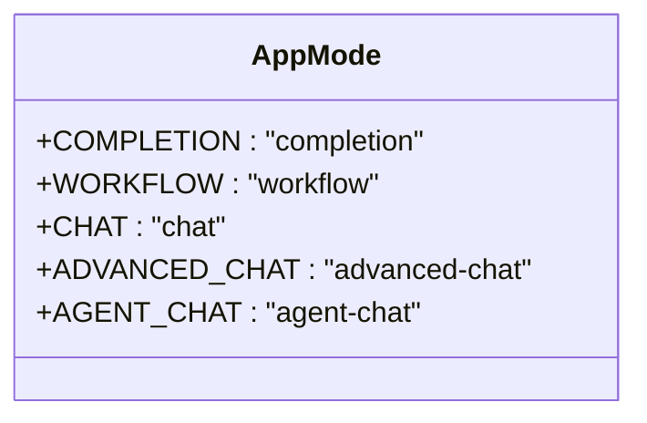
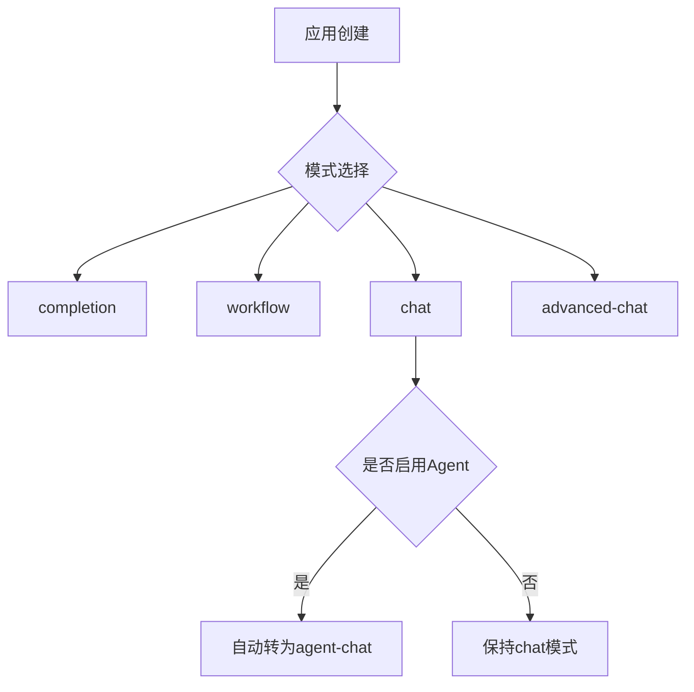
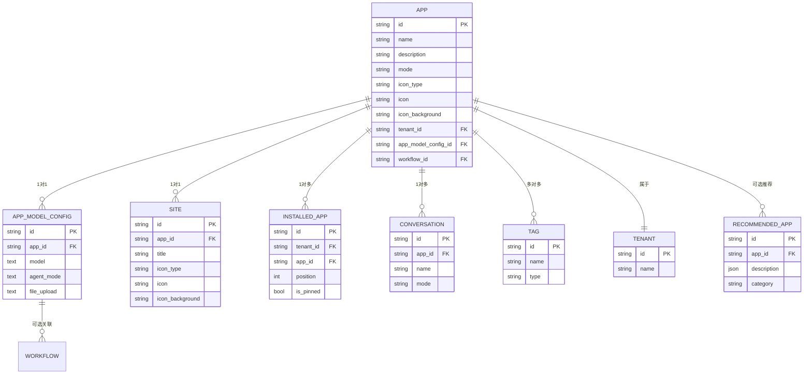
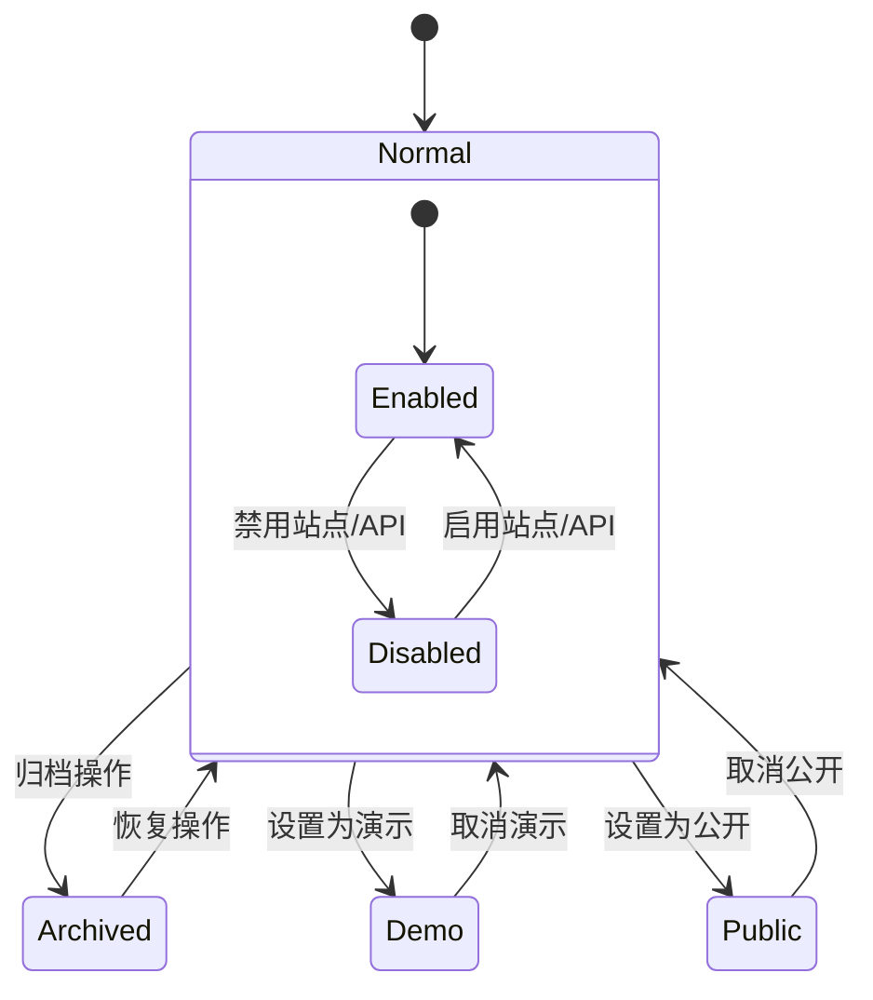
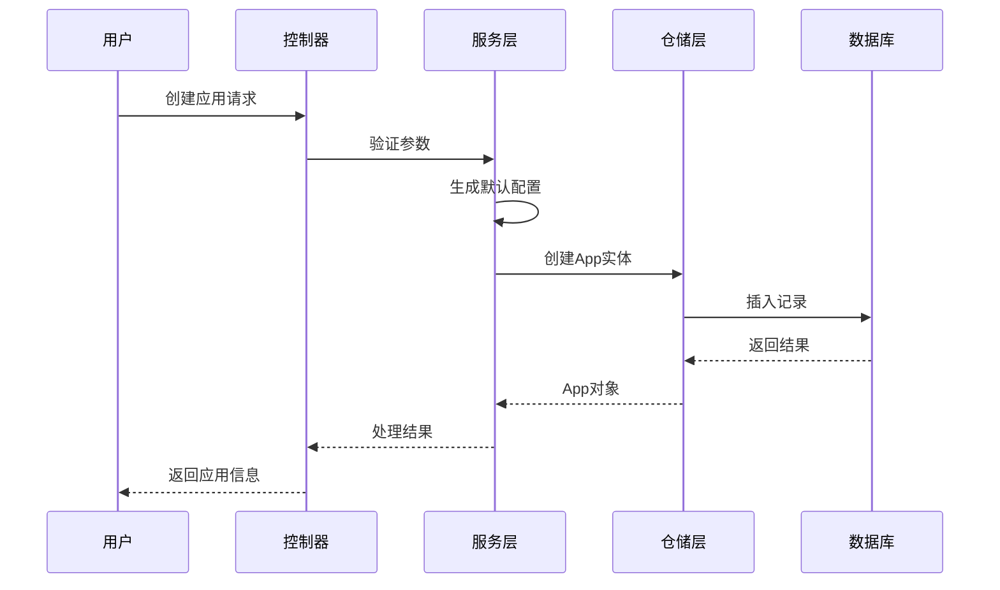
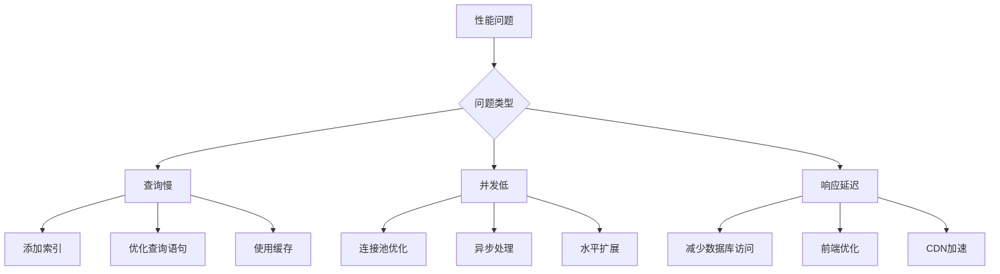

# App模型

<cite>
**本文档引用的文件**   
- [model.py](file://api/models/model.py)
- [app.ts](file://web/types/app.ts)
</cite>

## 目录
1. [App实体字段定义](#app实体字段定义)
2. [应用模式配置差异](#应用模式配置差异)
3. [App与相关实体的关系](#app与相关实体的关系)
4. [应用状态管理机制](#应用状态管理机制)
5. [生命周期管理](#生命周期管理)
6. [数据验证与约束](#数据验证与约束)
7. [数据库表结构](#数据库表结构)
8. [性能优化建议](#性能优化建议)

## App实体字段定义

App实体包含以下核心字段：

**基础信息字段**
- `id`: 字符串类型，UUID格式，主键，自动生成
- `name`: 字符串类型，最大长度255，应用名称，必填
- `description`: 文本类型，应用描述，可为空，默认为空字符串
- `mode`: 字符串类型，应用模式，必填，取值范围见应用模式配置差异章节
- `icon_type`: 字符串类型，可为空，图标类型，取值为"image"或"emoji"
- `icon`: 字符串类型，最大长度255，图标标识，当icon_type为"image"时存储文件ID
- `icon_background`: 字符串类型，可为空，图标背景色，仅当icon_type为null或"emoji"时有效

**配置关联字段**
- `app_model_config_id`: 字符串类型，UUID格式，可为空，关联的应用模型配置ID
- `workflow_id`: 字符串类型，UUID格式，可为空，关联的工作流ID

**状态与权限字段**
- `status`: 字符串类型，最大长度255，状态，必填，默认值为"normal"
- `enable_site`: 布尔类型，是否启用站点访问，必填
- `enable_api`: 常类型，是否启用API访问，必填
- `api_rpm`: 整数类型，API每分钟请求限制，必填，默认值为0
- `api_rph`: 整数类型，API每小时请求限制，必填，默认值为0
- `is_demo`: 布尔类型，是否为演示应用，必填，默认值为false
- `is_public`: 布尔类型，是否为公开应用，必填，默认值为false
- `is_universal`: 布尔类型，是否为通用应用，必填，默认值为false

**审计字段**
- `created_by`: 字符串类型，UUID格式，可为空，创建者ID
- `created_at`: 日期时间类型，创建时间，必填，自动生成
- `updated_by`: 字符串类型，UUID格式，可为空，更新者ID
- `updated_at`: 日期时间类型，更新时间，必填，自动生成

**Section sources**
- [model.py](file://api/models/model.py#L100-L150)

## 应用模式配置差异

App支持多种应用模式，通过`mode`字段区分，不同模式具有不同的配置特性和功能：

**应用模式枚举**


**模式特性对比**

| 模式 | 说明 | 特殊配置 |
|------|------|----------|
| completion | 补全模式 | 使用completion_prompt_config配置 |
| workflow | 工作流模式 | 关联workflow_id，支持复杂流程 |
| chat | 聊天模式 | 支持对话历史，使用chat_prompt_config配置 |
| advanced-chat | 高级聊天模式 | 支持覆盖模型配置，更灵活的对话管理 |
| agent-chat | Agent聊天模式 | 自动启用Agent功能，支持工具调用 |

**模式兼容性**
当应用模式为"chat"且启用了Agent功能时，系统会自动将模式兼容性设置为"agent-chat"。Agent功能的启用通过`app_model_config`中的`agent_mode`配置决定，当`agent_mode`的`enabled`为true且`strategy`为"function_call"或"react"时，应用被视为Agent应用。



**Section sources**
- [model.py](file://api/models/model.py#L80-L95)
- [app.ts](file://web/types/app.ts#L50-L55)

## App与相关实体的关系

App实体与其他核心实体存在多种关联关系，构成了应用生态系统的基础。

**核心关系图**


**关系说明**

**App与AppModelConfig**
App与AppModelConfig是一对一关系，每个App关联一个AppModelConfig。AppModelConfig存储了应用的模型配置、提示词配置、文件上传配置等核心设置。通过`app_model_config_id`外键关联。

**App与Site**
App与Site是一对一关系，每个App可以有一个站点配置。Site实体存储了站点的标题、描述、主题颜色等前端展示相关的配置。通过`app_id`外键关联。

**App与InstalledApp**
App与InstalledApp是一对多关系，一个App可以被多个工作区安装。InstalledApp记录了App在不同工作区的安装位置、是否置顶等信息。通过`app_id`外键关联。

**App与Tag**
App与Tag是多对多关系，通过TagBinding中间表实现。App可以有多个标签，标签类型为"app"。标签用于应用分类和搜索。

**App与Tenant**
App属于特定的Tenant（工作区），通过`tenant_id`外键关联。Tenant代表了应用的所有者和运行环境。

**App与Workflow**
App可选关联一个Workflow，通过`workflow_id`外键关联。当应用模式为"workflow"时，此关联必填。

**Section sources**
- [model.py](file://api/models/model.py#L100-L200)
- [model.py](file://api/models/model.py#L300-L400)

## 应用状态管理机制

App实体的状态管理通过多个字段和属性实现，确保应用的生命周期得到有效控制。

**状态字段**
- `status`: 字符串类型，表示应用的当前状态，如"normal"（正常）、"archived"（归档）等
- `enable_site`: 布尔类型，控制站点访问的启用状态
- `enable_api`: 布尔类型，控制API访问的启用状态
- `is_demo`: 布尔类型，标识是否为演示应用
- `is_public`: 布尔类型，标识是否为公开应用

**状态转换**


**动态属性**
App实体定义了多个动态属性，用于简化状态判断和数据获取：

- `desc_or_prompt`: 获取应用描述，若描述为空则返回模型配置中的预提示词
- `site`: 获取关联的站点配置对象
- `app_model_config`: 获取关联的应用模型配置对象
- `workflow`: 获取关联的工作流对象
- `tenant`: 获取所属的工作区对象
- `is_agent`: 判断是否为Agent应用，基于模型配置中的agent_mode
- `mode_compatible_with_agent`: 获取与Agent功能兼容的模式
- `tags`: 获取关联的标签列表
- `author_name`: 获取创建者的姓名

这些属性通过数据库查询动态计算，提供了便捷的数据访问接口。

**Section sources**
- [model.py](file://api/models/model.py#L150-L250)

## 生命周期管理

App的生命周期包括创建、更新、删除等操作，系统提供了完整的管理机制。

**创建流程**


**更新流程**
应用更新遵循以下原则：
1. 字段验证：确保所有更新的字段符合数据约束
2. 审计追踪：自动更新`updated_by`和`updated_at`字段
3. 状态检查：确保应用处于可编辑状态
4. 关联更新：必要时更新关联实体（如站点配置）

**删除流程**
应用删除采用软删除与硬删除结合的策略：
- 软删除：设置状态为"deleted"，保留数据用于审计
- 硬删除：物理删除记录，通常用于测试数据清理
- 级联删除：删除关联的会话、消息等数据

系统通过事件处理器（event_handlers）处理应用删除时的清理工作，如删除关联的数据集连接、清理缓存等。

**Section sources**
- [model.py](file://api/models/model.py#L100-L300)
- [events](file://api/events)

## 数据验证与约束

App模型实施了严格的数据验证和约束机制，确保数据的完整性和一致性。

**数据库约束**
- 主键约束：`id`字段为主键
- 索引约束：`tenant_id`字段有索引，提高查询性能
- 非空约束：关键字段如`name`、`mode`、`created_at`等不可为空
- 默认值约束：多个字段有默认值，如`status`默认为"normal"

**字段验证规则**
- `name`: 最大长度255字符，不能为空
- `description`: 文本类型，可为空
- `mode`: 必须是预定义的模式之一（completion, workflow, chat等）
- `icon_type`: 如果提供，必须是"image"或"emoji"
- `api_rpm`和`api_rph`: 必须为非负整数
- `created_at`和`updated_at`: 自动填充，不可手动修改

**业务规则验证**
- 租户隔离：应用只能访问所属租户的数据
- 权限控制：只有授权用户才能创建、更新或删除应用
- 唯一性约束：应用名称在租户内应保持唯一（虽然数据库未强制，但业务逻辑应保证）

**Section sources**
- [model.py](file://api/models/model.py#L100-L150)

## 数据库表结构

App实体对应的数据库表结构如下：

**apps表结构**
```sql
CREATE TABLE apps (
    id UUID PRIMARY KEY DEFAULT uuid_generate_v4(),
    tenant_id UUID NOT NULL,
    name VARCHAR(255) NOT NULL,
    description TEXT DEFAULT '',
    mode VARCHAR(255) NOT NULL,
    icon_type VARCHAR(255),
    icon VARCHAR(255),
    icon_background VARCHAR(255),
    app_model_config_id UUID,
    workflow_id UUID,
    status VARCHAR(255) DEFAULT 'normal',
    enable_site BOOLEAN NOT NULL,
    enable_api BOOLEAN NOT NULL,
    api_rpm INTEGER DEFAULT 0,
    api_rph INTEGER DEFAULT 0,
    is_demo BOOLEAN DEFAULT FALSE,
    is_public BOOLEAN DEFAULT FALSE,
    is_universal BOOLEAN DEFAULT FALSE,
    tracing TEXT,
    max_active_requests INTEGER,
    created_by UUID,
    created_at TIMESTAMP NOT NULL DEFAULT CURRENT_TIMESTAMP,
    updated_by UUID,
    updated_at TIMESTAMP NOT NULL DEFAULT CURRENT_TIMESTAMP,
    use_icon_as_answer_icon BOOLEAN DEFAULT FALSE NOT NULL,
    
    CONSTRAINT fk_tenant FOREIGN KEY (tenant_id) REFERENCES tenants(id),
    CONSTRAINT fk_app_model_config FOREIGN KEY (app_model_config_id) REFERENCES app_model_configs(id),
    CONSTRAINT fk_workflow FOREIGN KEY (workflow_id) REFERENCES workflows(id)
);

CREATE INDEX idx_app_tenant_id ON apps(tenant_id);
```

**索引策略**
- 主键索引：`id`字段的主键索引
- 租户索引：`tenant_id`字段的索引，支持按租户查询
- 组合索引：根据查询模式可能需要添加组合索引，如`(tenant_id, created_at)`用于按租户和时间排序查询

**Section sources**
- [model.py](file://api/models/model.py#L100-L150)

## 性能优化建议

为确保App模型在高并发场景下的性能表现，建议采取以下优化措施：

**查询优化**
- 使用适当的索引：确保`tenant_id`、`created_at`等常用查询字段有索引
- 避免N+1查询：使用预加载（eager loading）一次性加载关联数据
- 分页查询：对大型数据集使用分页，避免一次性加载过多数据

**缓存策略**
- 应用元数据缓存：缓存频繁访问的应用基本信息
- 配置缓存：缓存应用模型配置，减少数据库查询
- 标签缓存：缓存应用标签，提高标签相关查询性能

**数据库优化**
- 连接池：使用数据库连接池，提高连接复用率
- 批量操作：对批量创建、更新操作使用批量SQL
- 读写分离：在高负载场景下考虑读写分离架构

**代码层面优化**
- 懒加载：对不常用的关联数据使用懒加载
- 属性缓存：对计算成本高的动态属性考虑缓存
- 异步处理：对耗时操作（如文件处理）使用异步任务



**Section sources**
- [model.py](file://api/models/model.py)
- [services](file://api/services)