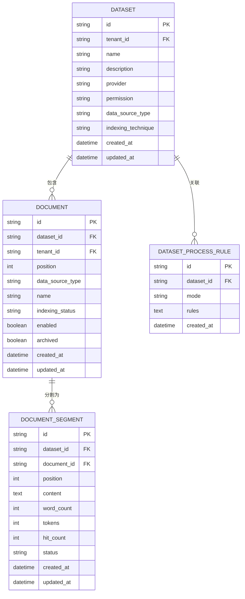
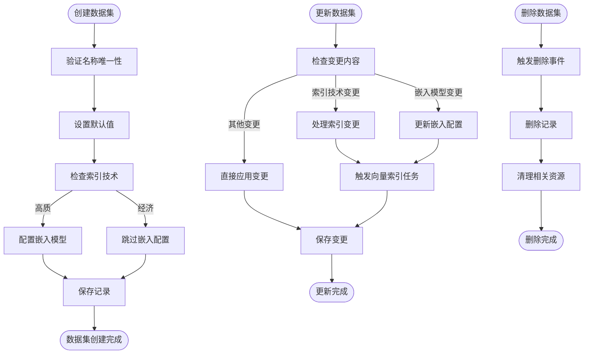

# Dataset模型

<cite>
**本文档中引用的文件**   
- [dataset.py](file://api/models/dataset.py)
- [dataset_service.py](file://api/services/dataset_service.py)
- [dataset_fields.py](file://api/fields/dataset_fields.py)
</cite>

## 目录
1. [简介](#简介)
2. [核心实体与字段定义](#核心实体与字段定义)
3. [数据关系模型](#数据关系模型)
4. [生命周期管理](#生命周期管理)
5. [数据验证与索引策略](#数据验证与索引策略)
6. [数据源处理规则](#数据源处理规则)
7. [性能优化建议](#性能优化建议)

## 简介

Dataset模型是知识库系统的核心实体，用于组织和管理文档集合。该模型支持多种数据源类型和索引技术，为应用程序提供检索能力。Dataset与文档、向量存储和检索配置之间存在复杂的关联关系，构成了完整的知识管理架构。

**Section sources**
- [dataset.py](file://api/models/dataset.py#L40-L261)

## 核心实体与字段定义

### Dataset实体字段

| 字段名 | 数据类型 | 约束条件 | 描述 |
|-------|--------|--------|------|
| id | StringUUID | 主键，自动生成 | 唯一标识符 |
| tenant_id | StringUUID | 非空 | 租户ID |
| name | String(255) | 非空 | 数据集名称 |
| description | Text | 可为空 | 描述信息 |
| provider | String(255) | 默认值'vendor' | 提供商类型 |
| permission | String(255) | 默认值'only_me' | 权限设置 |
| data_source_type | String(255) | | 数据源类型 |
| indexing_technique | String(255) | 可为空 | 索引技术 |
| index_struct | Text | 可为空 | 索引结构 |
| created_by | StringUUID | 非空 | 创建者ID |
| created_at | DateTime | 非空，自动生成 | 创建时间 |
| updated_by | StringUUID | 可为空 | 更新者ID |
| updated_at | DateTime | 非空，自动生成 | 更新时间 |
| embedding_model | String(255) | 可为空 | 嵌入模型 |
| embedding_model_provider | String(255) | 可为空 | 嵌入模型提供商 |
| collection_binding_id | StringUUID | 可为空 | 集合绑定ID |
| retrieval_model | JSONB | 可为空 | 检索模型配置 |
| built_in_field_enabled | Boolean | 非空，默认false | 是否启用内置字段 |

**Section sources**
- [dataset.py](file://api/models/dataset.py#L40-L261)

### DatasetProcessRule实体字段

| 字段名 | 数据类型 | 约束条件 | 描述 |
|-------|--------|--------|------|
| id | StringUUID | 主键，自动生成 | 唯一标识符 |
| dataset_id | StringUUID | 非空 | 关联数据集ID |
| mode | String(255) | 非空，默认'automatic' | 处理模式 |
| rules | Text | 可为空 | 处理规则 |
| created_by | StringUUID | 非空 | 创建者ID |
| created_at | DateTime | 非空，自动生成 | 创建时间 |

**Section sources**
- [dataset.py](file://api/models/dataset.py#L264-L301)

### Document实体字段

| 字段名 | 数据类型 | 约束条件 | 描述 |
|-------|--------|--------|------|
| id | StringUUID | 主键，自动生成 | 唯一标识符 |
| tenant_id | StringUUID | 非空 | 租户ID |
| dataset_id | StringUUID | 非空 | 关联数据集ID |
| position | Integer | 非空 | 位置序号 |
| data_source_type | String(255) | 非空 | 数据源类型 |
| data_source_info | Text | 可为空 | 数据源信息 |
| dataset_process_rule_id | StringUUID | 可为空 | 处理规则ID |
| batch | String(255) | 非空 | 批次标识 |
| name | String(255) | 非空 | 文档名称 |
| created_from | String(255) | 非空 | 创建来源 |
| created_by | StringUUID | 非空 | 创建者ID |
| created_at | DateTime | 非空，自动生成 | 创建时间 |
| indexing_status | String(255) | 非空，默认'waiting' | 索引状态 |
| enabled | Boolean | 非空，默认true | 是否启用 |
| archived | Boolean | 非空，默认false | 是否归档 |
| doc_form | String(255) | 非空，默认'text_model' | 文档形式 |

**Section sources**
- [dataset.py](file://api/models/dataset.py#L304-L643)

### DocumentSegment实体字段

| 字段名 | 数据类型 | 约束条件 | 描述 |
|-------|--------|--------|------|
| id | StringUUID | 主键，自动生成 | 唯一标识符 |
| tenant_id | StringUUID | 非空 | 租户ID |
| dataset_id | StringUUID | 非空 | 关联数据集ID |
| document_id | StringUUID | 非空 | 关联文档ID |
| position | Integer | | 位置序号 |
| content | Text | 非空 | 内容 |
| answer | Text | 可为空 | 答案 |
| word_count | Integer | | 词数 |
| tokens | Integer | | token数 |
| keywords | JSON | 可为空 | 关键词 |
| index_node_id | String(255) | 可为空 | 索引节点ID |
| index_node_hash | String(255) | 可为空 | 索引节点哈希 |
| hit_count | Integer | 非空，默认0 | 命中次数 |
| enabled | Boolean | 非空，默认true | 是否启用 |
| status | String(255) | 默认'waiting' | 状态 |
| created_by | StringUUID | 非空 | 创建者ID |
| created_at | DateTime | 非空，自动生成 | 创建时间 |

**Section sources**
- [dataset.py](file://api/models/dataset.py#L646-L796)

## 数据关系模型



**Diagram sources **
- [dataset.py](file://api/models/dataset.py#L40-L800)

## 生命周期管理

### 创建流程
1. 验证数据集名称在租户内唯一
2. 设置默认权限为"仅自己"
3. 根据索引技术初始化嵌入模型配置
4. 创建数据集记录并提交到数据库

### 索引构建流程
1. 文档解析：将原始文档转换为文本内容
2. 数据清洗：应用预处理规则（去除多余空格、URL/邮箱等）
3. 文本分割：根据分隔符和最大token数进行分块
4. 向量索引：为每个文本块生成嵌入向量并存储

### 更新规则
- **索引技术变更**：从"economy"切换到"high_quality"时，需要配置嵌入模型；反之则移除嵌入模型配置
- **嵌入模型更新**：当索引技术不变但嵌入模型改变时，触发向量索引更新任务
- **权限变更**：支持在"仅自己"、"团队成员"和"部分成员"之间切换

### 删除规则
1. 触发`dataset_was_deleted`事件
2. 删除数据集记录
3. 相关文档和索引会通过事件处理器进行清理



**Diagram sources **
- [dataset_service.py](file://api/services/dataset_service.py#L200-L500)
- [dataset.py](file://api/models/dataset.py#L40-L800)

**Section sources**
- [dataset_service.py](file://api/services/dataset_service.py#L200-L500)
- [dataset.py](file://api/models/dataset.py#L40-L800)

## 数据验证与索引策略

### 数据验证逻辑
- **名称验证**：确保在同一租户内数据集名称唯一
- **权限验证**：检查用户是否有权访问或修改特定数据集
- **模型配置验证**：验证嵌入模型和重排序模型的可用性
- **外部知识库验证**：确认外部API模板存在且配置有效

### 索引策略
- **高质索引**：使用嵌入模型生成向量，支持语义搜索
- **经济索引**：仅使用关键词匹配，不生成向量
- **混合检索**：结合向量搜索和关键词搜索的结果

### 检索模型配置
```json
{
  "search_method": "semantic_search",
  "reranking_enable": false,
  "reranking_model": {
    "reranking_provider_name": "",
    "reranking_model_name": ""
  },
  "top_k": 2,
  "score_threshold_enabled": false
}
```

**Section sources**
- [dataset_service.py](file://api/services/dataset_service.py#L500-L700)
- [dataset.py](file://api/models/dataset.py#L100-L200)

## 数据源处理规则

### 文本文件处理
- 支持上传的文件类型包括PDF、DOCX、TXT等
- 文件大小限制由系统参数控制
- 解析后按段落进行分割，最大500个token

### 网站爬取处理
- 支持从指定URL爬取网页内容
- 自动提取标题、正文和元数据
- 处理JavaScript渲染的动态内容
- 支持定期同步更新

### 外部知识库处理
- 支持连接Notion等外部知识库
- 通过API获取数据并同步到本地
- 支持增量更新和全量同步
- 处理认证和权限验证

### 处理模式
- **自动模式**：使用预设的处理规则
- **自定义模式**：允许用户自定义分割规则
- **分层模式**：支持父子文档结构，适用于复杂文档

**Section sources**
- [dataset.py](file://api/models/dataset.py#L304-L643)
- [dataset_service.py](file://api/services/dataset_service.py#L700-L900)

## 性能优化建议

1. **批量操作**：对大量文档进行批量索引，减少数据库事务开销
2. **异步处理**：将耗时的索引操作放入任务队列异步执行
3. **缓存策略**：缓存常用的检索结果和元数据
4. **索引优化**：为常用查询字段创建数据库索引
5. **资源监控**：监控索引任务的执行时间和资源消耗
6. **分页查询**：对大数据集使用分页查询避免内存溢出
7. **连接池**：使用数据库连接池提高并发性能

**Section sources**
- [dataset_service.py](file://api/services/dataset_service.py#L900-L1100)
- [dataset.py](file://api/models/dataset.py#L800-L1000)