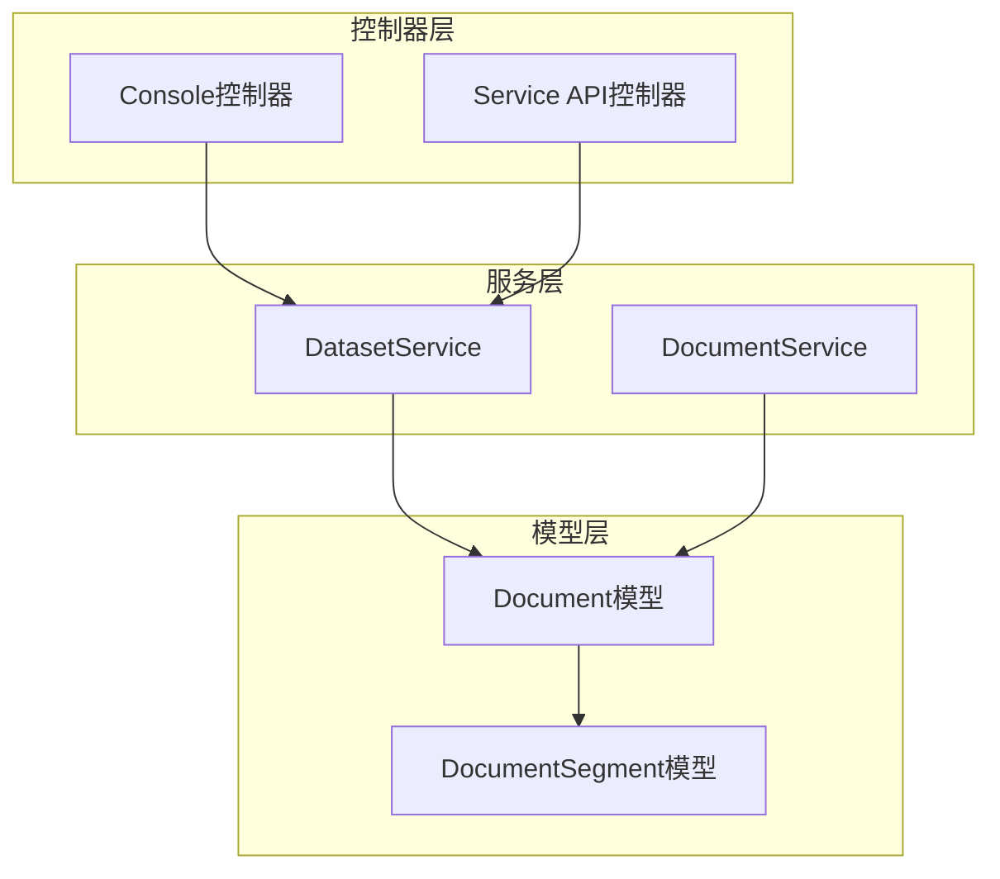
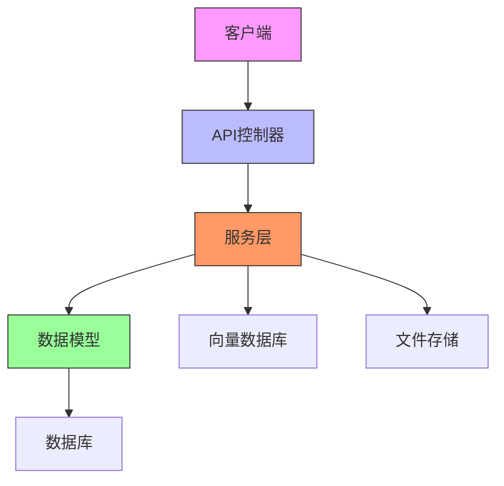
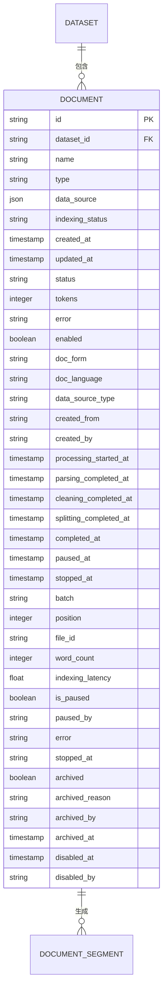
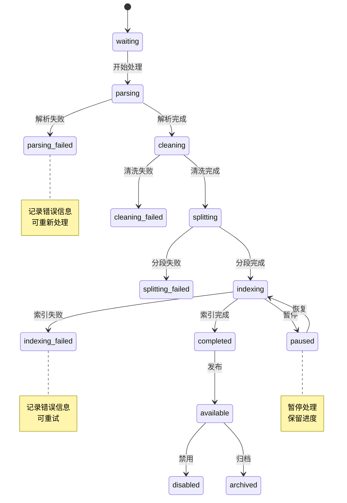
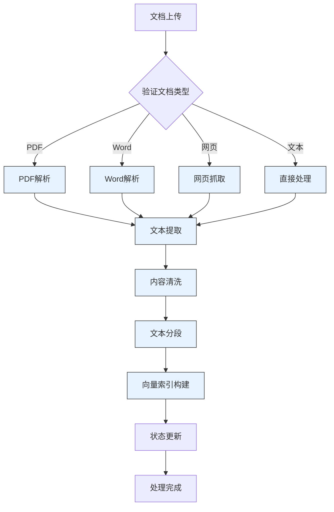
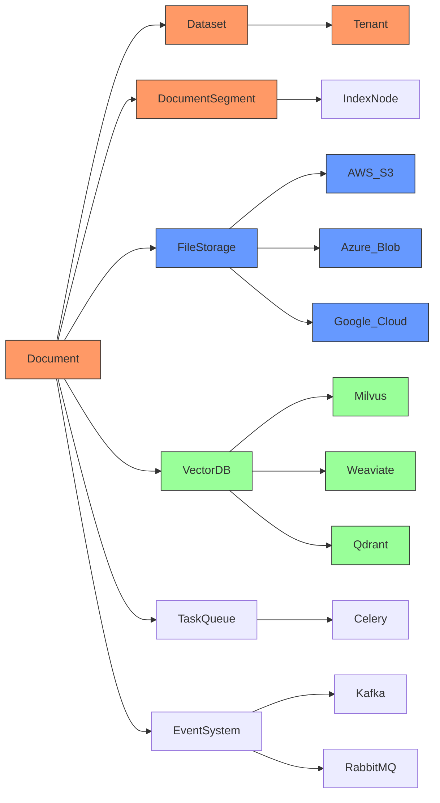
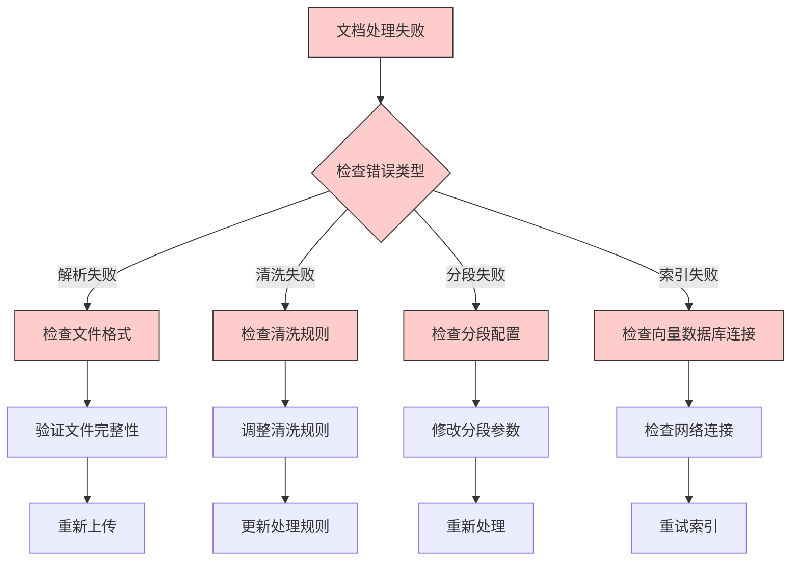

# Document模型

<cite>
**本文档中引用的文件**
- [dataset.py](file://api/models/dataset.py#L557-L586)
- [document_fields.py](file://api/fields/document_fields.py#L69-L85)
- [datasets_document.py](file://api/controllers/console/datasets/datasets_document.py#L628-L660)
- [document.py](file://api/controllers/service_api/dataset/document.py#L561-L583)
- [dataset_service.py](file://api/services/dataset_service.py#L1400-L1440)
- [error.py](file://api/controllers/console/datasets/error.py#L0-L42)
</cite>

## 目录
1. [简介](#简介)
2. [项目结构](#项目结构)
3. [核心组件](#核心组件)
4. [架构概述](#架构概述)
5. [详细组件分析](#详细组件分析)
6. [依赖分析](#依赖分析)
7. [性能考虑](#性能考虑)
8. [故障排除指南](#故障排除指南)
9. [结论](#结论)

## 简介
Document模型是Dify系统中用于管理知识库文档的核心数据实体。该模型负责文档的全生命周期管理，包括上传、解析、分段、索引构建和状态变更。文档与数据集、分段和向量索引之间存在紧密的关系，构成了系统知识检索的基础架构。

## 项目结构
Document模型主要分布在`api/models/dataset.py`文件中，相关的控制器和服务分布在`api/controllers/console/datasets/`和`api/services/`目录下。模型定义了文档的字段属性、状态机和业务规则，而控制器和服务则实现了文档的CRUD操作和生命周期管理。

**Diagram sources**
- [dataset.py](file://api/models/dataset.py#L557-L586)
- [datasets_document.py](file://api/controllers/console/datasets/datasets_document.py#L628-L660)

**Section sources**
- [dataset.py](file://api/models/dataset.py#L557-L586)
- [datasets_document.py](file://api/controllers/console/datasets/datasets_document.py#L628-L660)

## 核心组件
Document模型的核心组件包括文档元数据、处理规则、索引状态和生命周期管理。模型通过`indexing_status`字段跟踪文档的处理进度，并通过`data_source`字段记录文档来源信息。文档与数据集之间存在一对多的关系，每个文档属于一个特定的数据集。

**Section sources**
- [dataset.py](file://api/models/dataset.py#L557-L586)
- [document_fields.py](file://api/fields/document_fields.py#L69-L85)

## 架构概述
Document模型的架构设计遵循了分层原则，将数据模型、业务逻辑和接口层分离。模型层定义了文档的结构和约束，服务层实现了文档的业务规则，控制器层提供了RESTful API接口。这种分层架构确保了系统的可维护性和可扩展性。

**Diagram sources**
- [dataset.py](file://api/models/dataset.py#L557-L586)
- [datasets_document.py](file://api/controllers/console/datasets/datasets_document.py#L628-L660)
- [document.py](file://api/controllers/service_api/dataset/document.py#L561-L583)

## 详细组件分析

### 文档字段定义分析
Document模型包含多个关键字段，每个字段都有特定的数据类型和约束条件：

**Diagram sources**
- [dataset.py](file://api/models/dataset.py#L557-L586)

**Section sources**
- [dataset.py](file://api/models/dataset.py#L557-L586)

### 文档状态机分析
Document模型通过`indexing_status`字段实现了一个完整的状态机，管理文档的生命周期：

**Diagram sources**
- [dataset.py](file://api/models/dataset.py#L557-L586)
- [document_fields.py](file://api/fields/document_fields.py#L69-L85)

**Section sources**
- [dataset.py](file://api/models/dataset.py#L557-L586)
- [document_fields.py](file://api/fields/document_fields.py#L69-L85)

### 文档处理流程分析
Document模型的处理流程涉及多个阶段，每个阶段都有特定的业务规则：

**Diagram sources**
- [dataset_service.py](file://api/services/dataset_service.py#L1400-L1440)
- [dataset.py](file://api/models/dataset.py#L557-L586)

**Section sources**
- [dataset_service.py](file://api/services/dataset_service.py#L1400-L1440)

## 依赖分析
Document模型依赖于多个外部组件和服务，形成了复杂的依赖关系网络：

**Diagram sources**
- [dataset.py](file://api/models/dataset.py#L557-L586)
- [dataset_service.py](file://api/services/dataset_service.py#L1400-L1440)

**Section sources**
- [dataset.py](file://api/models/dataset.py#L557-L586)
- [dataset_service.py](file://api/services/dataset_service.py#L1400-L1440)

## 性能考虑
Document模型的性能优化主要集中在以下几个方面：
- 索引构建的异步处理
- 大文档的分块处理
- 状态更新的批量操作
- 数据库查询的索引优化
- 缓存机制的应用

## 故障排除指南
Document模型常见的问题和解决方案：

**Section sources**
- [error.py](file://api/controllers/console/datasets/error.py#L0-L42)
- [dataset.py](file://api/models/dataset.py#L557-L586)

## 结论
Document模型是Dify系统中知识管理的核心组件，通过精心设计的数据结构和状态机，实现了文档全生命周期的管理。模型与数据集、分段和向量索引之间的关系构成了系统知识检索的基础。通过异步处理和分层架构，模型能够高效地处理各种类型的文档，为上层应用提供可靠的知识服务。