# Message模型

<cite>
**本文档引用的文件**
- [model.py](file://api/models/model.py#L890-L1774)
- [message_event.py](file://api/events/message_event.py#L1-L3)
- [test_message_service.py](file://api/tests/test_containers_integration_tests/services/test_message_service.py#L191-L608)
</cite>

## 目录
1. [简介](#简介)
2. [项目结构](#项目结构)
3. [核心组件](#核心组件)
4. [架构概述](#架构概述)
5. [详细组件分析](#详细组件分析)
6. [依赖分析](#依赖分析)
7. [性能考虑](#性能考虑)
8. [故障排除指南](#故障排除指南)
9. [结论](#结论)
10. [附录](#附录)（如有必要）

## 简介
Message模型是Dify应用中的核心数据实体，用于存储和管理用户与AI助手之间的对话消息。该模型不仅记录了消息的基本内容，还包含了丰富的元数据信息，如消息来源、创建者、状态、价格等。Message模型与Conversation、Application、Workflow等其他核心实体建立了紧密的关联关系，形成了完整的对话管理系统。该模型支持消息的创建、更新、流式传输和归档等全生命周期管理，同时提供了完善的数据验证、性能优化和存储策略。

## 项目结构
Message模型主要分布在API模块的models包中，与其他核心数据模型共同构成了应用的数据层。该模型通过SQLAlchemy ORM实现，与数据库表messages建立了映射关系。相关的业务逻辑和服务方法分布在services包中，而事件处理机制则位于events包中。测试用例覆盖了消息服务的主要功能，确保了系统的稳定性和可靠性。

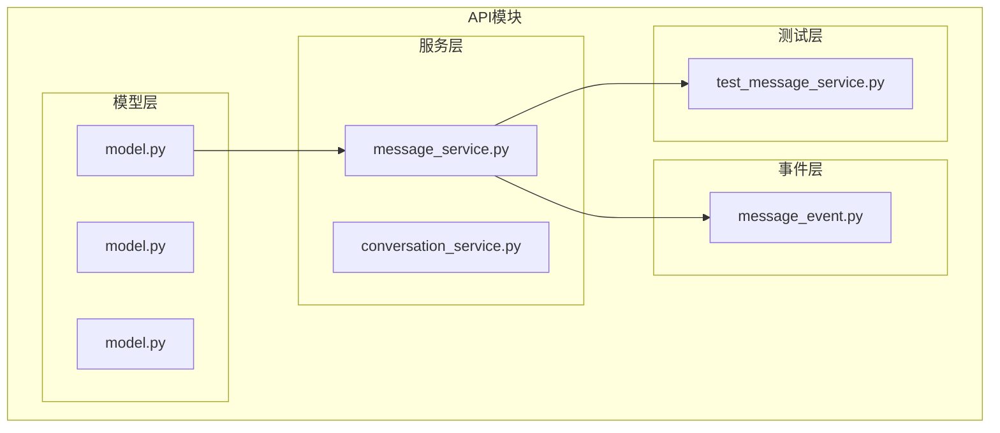

**Diagram sources**
- [model.py](file://api/models/model.py#L890-L1774)
- [message_service.py](file://api/services/message_service.py)
- [message_event.py](file://api/events/message_event.py)

**Section sources**
- [model.py](file://api/models/model.py#L890-L1774)
- [message_event.py](file://api/events/message_event.py#L1-L3)

## 核心组件
Message模型的核心组件包括消息实体本身、消息文件关联、消息反馈、消息标注等。消息实体包含了id、conversation_id、input、output、message_type、agent_thought等关键属性，这些属性共同定义了消息的完整信息。消息文件关联实现了消息与文件的多对多关系，支持文件上传和管理。消息反馈机制允许用户对消息进行点赞或点踩，为模型优化提供数据支持。消息标注功能则用于存储人工审核和修正的内容，提高对话质量。

**Section sources**
- [model.py](file://api/models/model.py#L890-L1774)

## 架构概述
Message模型的架构设计遵循了微服务和领域驱动设计的原则，将数据访问、业务逻辑和事件处理分离。数据访问层通过SQLAlchemy ORM实现，提供了类型安全的数据库操作接口。业务逻辑层封装了消息的创建、更新、删除等操作，确保了数据的一致性和完整性。事件处理层通过blinker信号机制实现了消息创建等关键事件的发布和订阅，支持异步处理和系统解耦。这种分层架构提高了代码的可维护性和可扩展性。

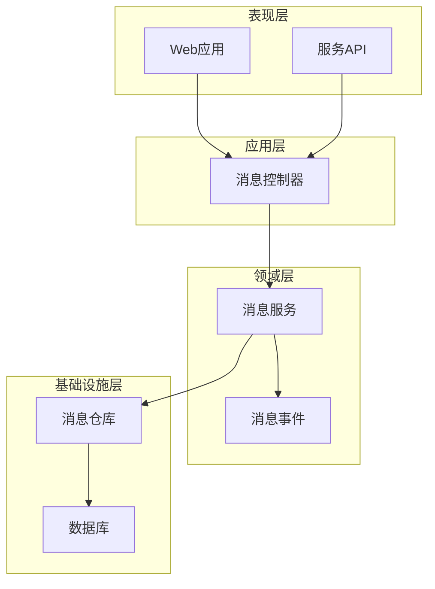

**Diagram sources**
- [model.py](file://api/models/model.py#L890-L1774)
- [message_service.py](file://api/services/message_service.py)
- [message_event.py](file://api/events/message_event.py)

## 详细组件分析
### Message实体分析
Message实体是对话系统的核心数据结构，包含了消息的完整信息。该实体通过SQLAlchemy ORM映射到数据库表messages，每个字段都有明确的数据类型和约束条件。实体的属性分为基本属性、输入输出属性、状态属性、价格属性和审计属性等类别，便于理解和维护。

#### Message实体属性
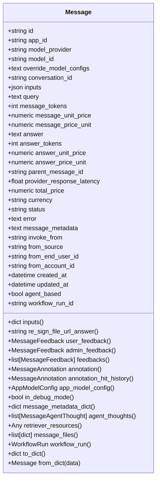

**Diagram sources**
- [model.py](file://api/models/model.py#L890-L1774)

**Section sources**
- [model.py](file://api/models/model.py#L890-L1774)

### 消息生命周期管理
消息的生命周期管理涵盖了从创建到归档的全过程。消息创建时会触发message_was_created事件，通知相关系统进行处理。消息更新操作会自动更新updated_at字段，确保数据的时效性。流式传输功能支持大消息的分块处理，提高用户体验。归档规则通过数据库索引和查询优化实现，确保历史消息的高效访问。

#### 消息生命周期流程
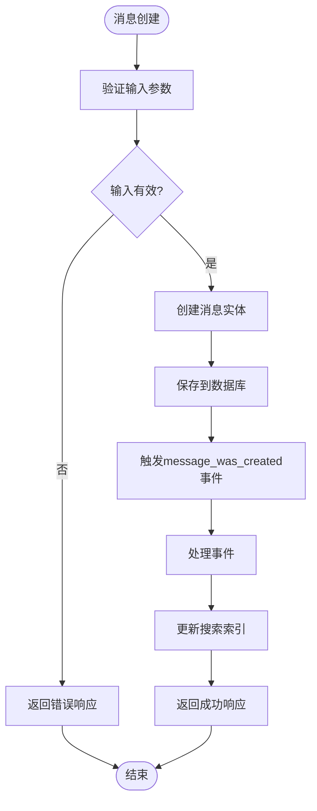

**Diagram sources**
- [model.py](file://api/models/model.py#L890-L1774)
- [message_event.py](file://api/events/message_event.py#L1-L3)

**Section sources**
- [model.py](file://api/models/model.py#L890-L1774)
- [message_event.py](file://api/events/message_event.py#L1-L3)

### 数据验证逻辑
Message模型实现了多层次的数据验证逻辑，确保数据的完整性和一致性。在ORM层面，通过字段的nullable、server_default等参数定义了基本的约束条件。在业务逻辑层面，通过属性的getter和setter方法实现了复杂的验证规则。在服务层面，通过专门的验证函数对输入数据进行全面检查。

#### 数据验证规则
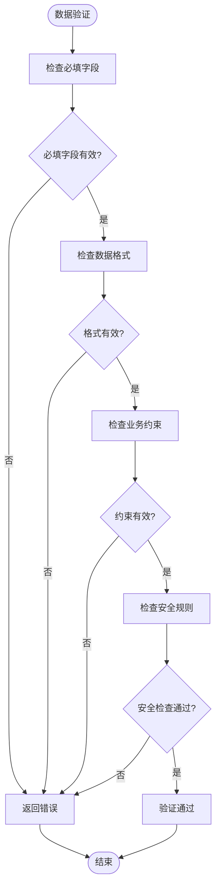

**Diagram sources**
- [model.py](file://api/models/model.py#L890-L1774)

**Section sources**
- [model.py](file://api/models/model.py#L890-L1774)

### 性能优化建议
Message模型的性能优化主要体现在数据库设计、查询优化和缓存策略三个方面。数据库设计上，通过合理的索引策略提高查询效率。查询优化上，采用批量操作和延迟加载减少数据库访问次数。缓存策略上，利用Redis等缓存系统存储热点数据，降低数据库压力。

#### 性能优化策略
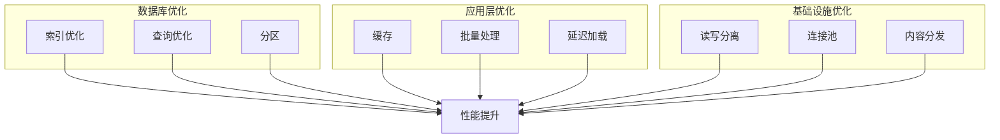

**Diagram sources**
- [model.py](file://api/models/model.py#L890-L1774)

**Section sources**
- [model.py](file://api/models/model.py#L890-L1774)

### 存储策略
Message模型的存储策略综合考虑了数据量、访问频率和成本等因素。热数据存储在高性能的关系型数据库中，支持复杂的查询和事务处理。温数据通过归档机制转移到成本较低的存储系统中。冷数据则采用压缩和加密的方式长期保存，确保数据的安全性和合规性。

#### 存储分层策略
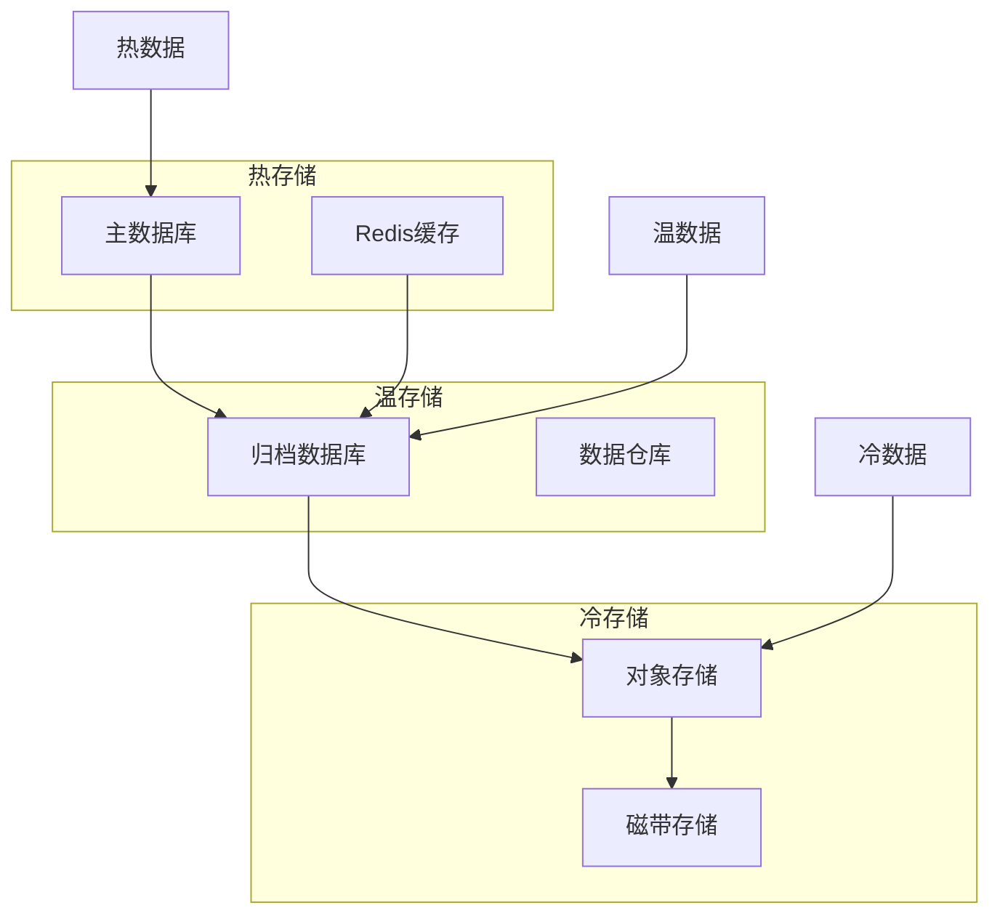

**Diagram sources**
- [model.py](file://api/models/model.py#L890-L1774)

**Section sources**
- [model.py](file://api/models/model.py#L890-L1774)

### 消息状态管理
Message模型通过status字段实现了消息的状态管理，支持normal、error等状态。状态转换通过业务逻辑控制，确保状态的合法性和一致性。状态监控通过事件机制实现，可以实时跟踪消息的处理进度。

#### 消息状态转换
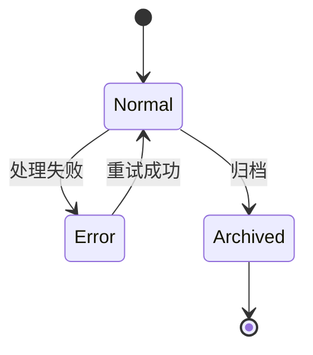

**Diagram sources**
- [model.py](file://api/models/model.py#L890-L1774)

**Section sources**
- [model.py](file://api/models/model.py#L890-L1774)

### 错误处理机制
Message模型的错误处理机制通过error字段和异常处理流程实现。当消息处理失败时，详细的错误信息会被记录在error字段中，便于问题排查。异常处理流程通过try-catch块实现，确保系统的稳定性和可靠性。

#### 错误处理流程
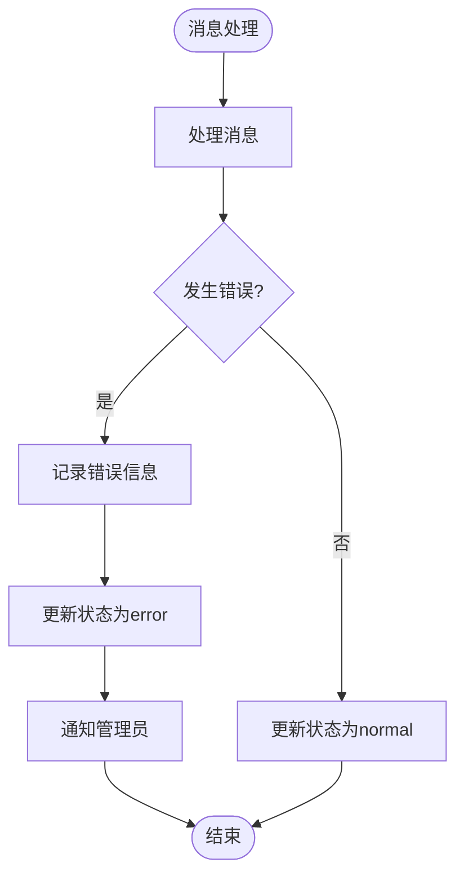

**Diagram sources**
- [model.py](file://api/models/model.py#L890-L1774)

**Section sources**
- [model.py](file://api/models/model.py#L890-L1774)

### 审计日志功能
Message模型的审计日志功能通过created_at、updated_at等时间戳字段和操作日志表实现。所有关键操作都会被记录，包括创建、更新、删除等。审计日志支持按时间、用户、操作类型等条件查询，满足合规性要求。

#### 审计日志流程
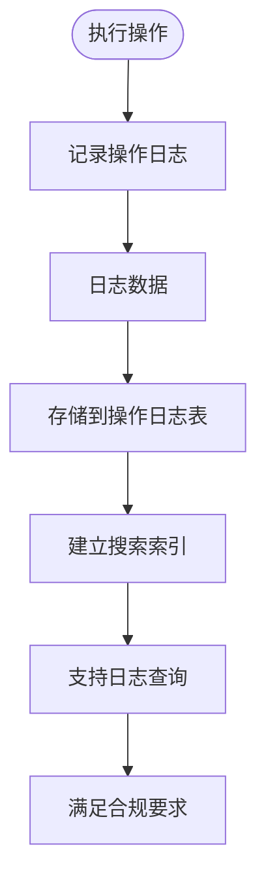

**Diagram sources**
- [model.py](file://api/models/model.py#L890-L1774)

**Section sources**
- [model.py](file://api/models/model.py#L890-L1774)

## 依赖分析
Message模型与其他核心组件存在紧密的依赖关系。与Conversation模型的关联实现了消息的会话管理，与App模型的关联实现了应用级别的消息隔离，与Workflow模型的关联支持了复杂的工作流场景。这些依赖关系通过外键约束和ORM关系映射实现，确保了数据的一致性和完整性。

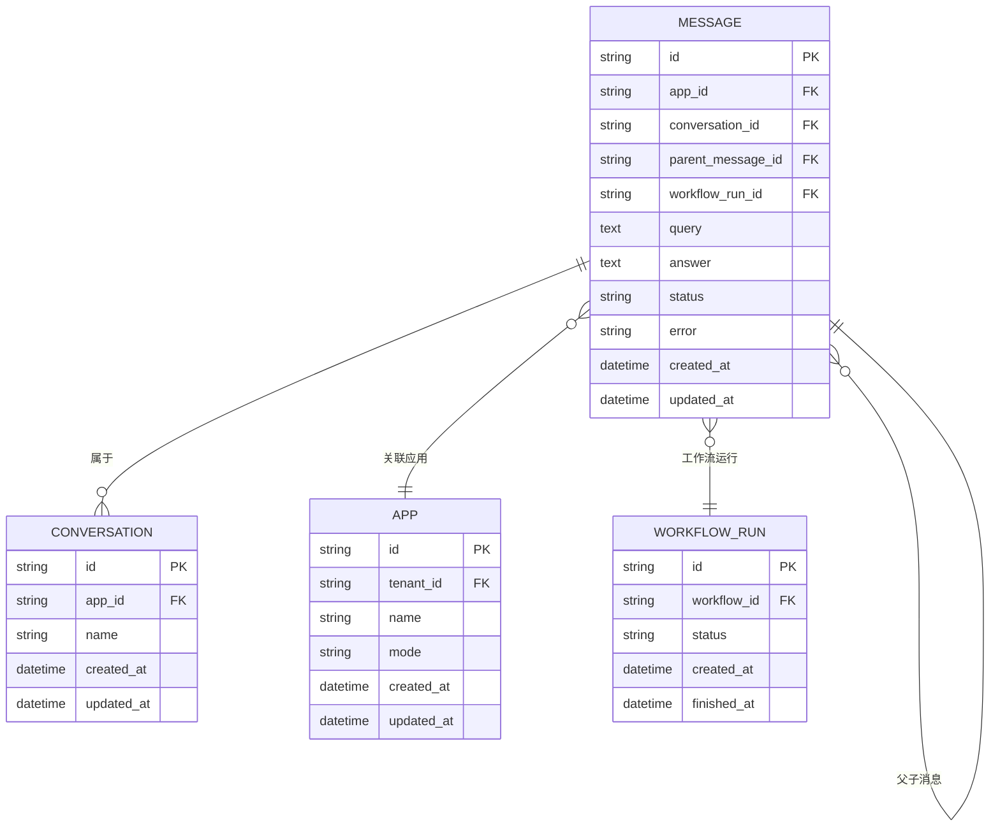

**Diagram sources**
- [model.py](file://api/models/model.py#L890-L1774)

**Section sources**
- [model.py](file://api/models/model.py#L890-L1774)

## 性能考虑
Message模型的性能考虑主要集中在查询优化、索引策略和缓存机制三个方面。通过合理的索引设计，可以显著提高查询效率。通过批量操作和延迟加载，可以减少数据库访问次数。通过缓存热点数据，可以降低数据库压力，提高系统响应速度。

**Section sources**
- [model.py](file://api/models/model.py#L890-L1774)

## 故障排除指南
Message模型的故障排除主要关注数据一致性、性能瓶颈和错误处理三个方面。通过检查数据库约束和事务日志，可以解决数据一致性问题。通过分析慢查询日志和性能监控数据，可以定位性能瓶颈。通过查看错误日志和堆栈跟踪，可以快速定位和修复错误。

**Section sources**
- [model.py](file://api/models/model.py#L890-L1774)
- [test_message_service.py](file://api/tests/test_containers_integration_tests/services/test_message_service.py#L191-L608)

## 结论
Message模型是Dify应用的核心数据实体，通过精心设计的字段定义、关系映射和业务逻辑，实现了完整的对话消息管理功能。该模型不仅满足了基本的消息存储需求，还提供了丰富的元数据支持、灵活的扩展能力和强大的性能优化特性。通过遵循本文档的指导原则，开发者可以更好地理解和使用Message模型，构建高效、可靠的对话应用。