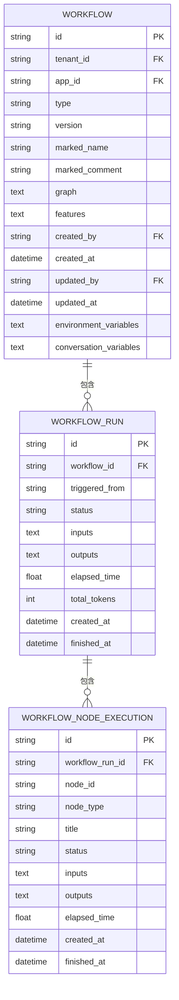
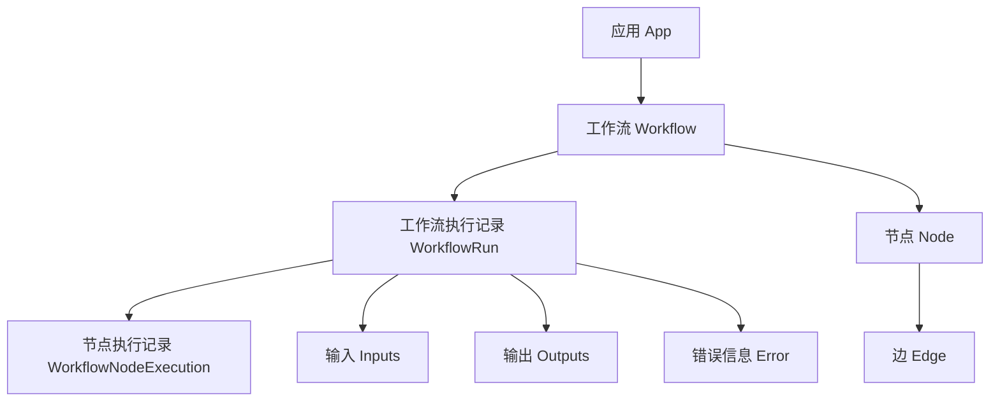
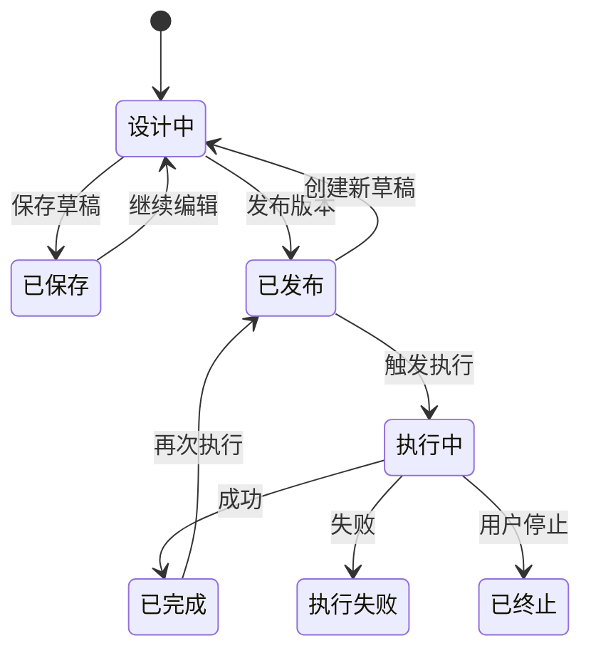
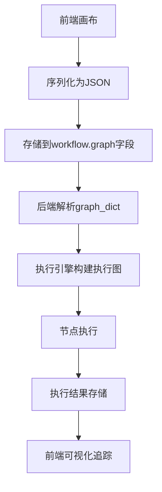
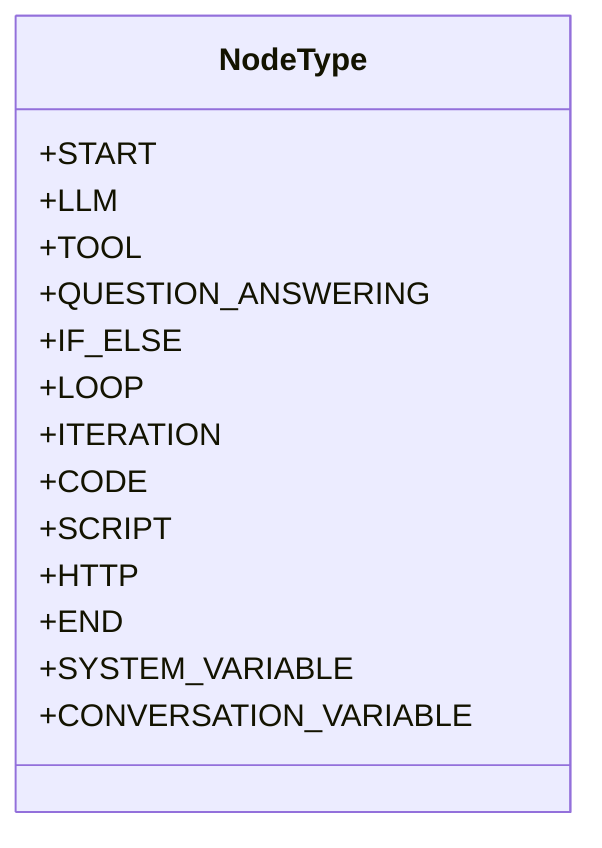
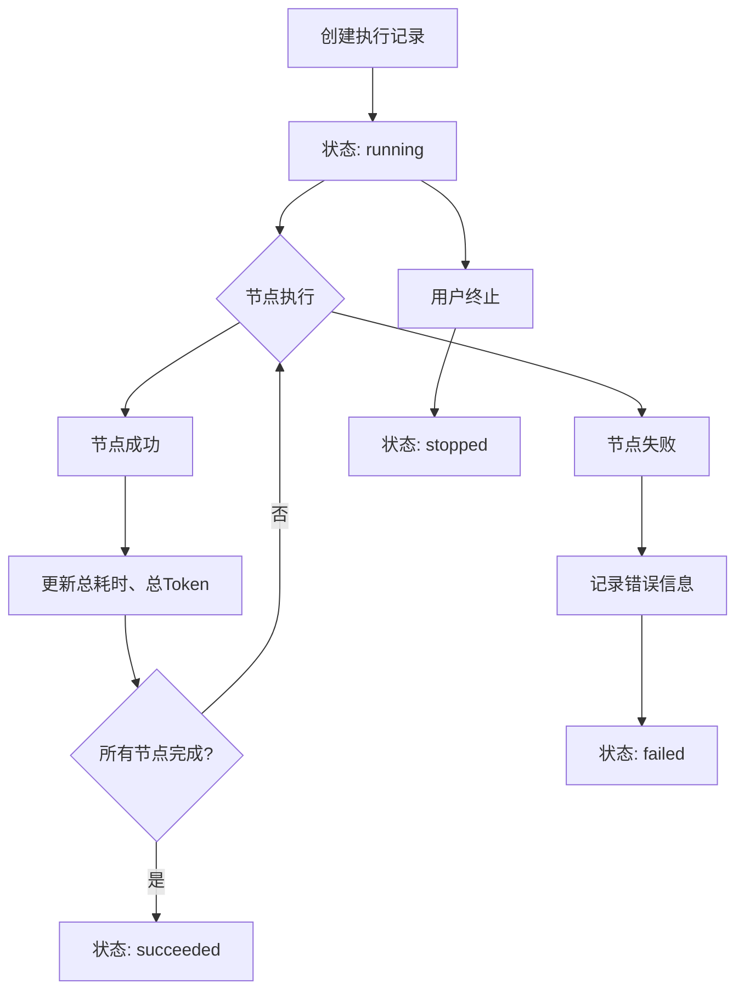

# Workflow模型

<cite>
**本文档中引用的文件**  
- [workflow.py](file://api/models/workflow.py)
- [workflow_fields.py](file://api/fields/workflow_fields.py)
- [types.ts](file://web/app/components/workflow/types.ts)
- [simple-node/types.ts](file://web/app/components/workflow/simple-node/types.ts)
- [__init__.py](file://api/core/workflow/nodes/__init__.py)
</cite>

## 目录
1. [介绍](#介绍)
2. [核心组件](#核心组件)
3. [数据模型详解](#数据模型详解)
4. [工作流与应用、节点、执行记录的关系](#工作流与应用节点执行记录的关系)
5. [生命周期管理](#生命周期管理)
6. [数据验证与图结构存储](#数据验证与图结构存储)
7. [节点类型与连接机制](#节点类型与连接机制)
8. [执行状态管理](#执行状态管理)
9. [性能优化建议](#性能优化建议)

## 介绍
Workflow模型是Dify平台中用于构建和管理自动化流程的核心数据结构。它支持两种主要类型：独立的“工作流应用”和“聊天应用中的工作流模式”。该模型通过图形化界面定义复杂的业务逻辑，支持版本控制、变量管理、执行追踪等功能，适用于从简单任务编排到复杂AI驱动流程的多种场景。

## 核心组件

**Section sources**
- [workflow.py](file://api/models/workflow.py#L32-L87)
- [workflow_fields.py](file://api/fields/workflow_fields.py#L62-L81)

## 数据模型详解

### Workflow实体字段定义

**Diagram sources**
- [workflow.py](file://api/models/workflow.py#L80-L122)

#### 主要字段说明

- **id**: 工作流唯一标识符，UUID格式，主键
- **tenant_id**: 所属工作空间ID，用于多租户隔离
- **app_id**: 关联的应用ID，表示该工作流属于哪个应用
- **type**: 工作流类型，枚举值包括：
  - `workflow`: 独立工作流应用
  - `chat`: 聊天应用中的工作流模式
- **version**: 版本号，特殊值`draft`表示草稿版本，每个应用仅有一个草稿版本
- **graph**: 工作流画布配置，JSON格式文本，包含节点（nodes）和边（edges）的完整定义
- **features**: 功能特性配置，JSON格式文本，存储如文件上传限制、图像处理能力等特性
- **created_by**: 创建者ID，关联用户账户
- **created_at**: 创建时间，UTC时间戳
- **updated_by**: 最后更新者ID，可选
- **updated_at**: 最后更新时间，UTC时间戳
- **environment_variables**: 环境变量，JSON格式文本，存储加密的环境变量配置
- **conversation_variables**: 对话变量，JSON格式文本，存储会话级别的变量配置

**Section sources**
- [workflow.py](file://api/models/workflow.py#L80-L189)

## 工作流与应用、节点、执行记录的关系

### 实体关系图

**Diagram sources**
- [workflow.py](file://api/models/workflow.py#L80-L122)

#### 关系说明

- **工作流与应用**: 一对多关系，一个应用可以有多个工作流版本，但只有一个草稿版本（version='draft'）
- **工作流与执行记录**: 一对多关系，一个工作流可以被多次执行，每次执行生成一条WorkflowRun记录
- **执行记录与节点执行**: 一对多关系，一次工作流执行包含多个节点的执行过程，每个节点执行生成一条WorkflowNodeExecution记录
- **工作流与节点**: 工作流的graph字段中包含节点列表，节点通过ID在图中进行连接
- **节点与边**: 边定义了节点之间的连接关系，形成有向无环图（DAG）

**Section sources**
- [workflow.py](file://api/models/workflow.py#L80-L122)

## 生命周期管理

### 工作流生命周期状态机

**Diagram sources**
- [workflow.py](file://api/models/workflow.py#L80-L122)

#### 生命周期规则

- **设计阶段**: 用户在图形界面中拖拽节点、配置参数、连接边线，所有更改保存在草稿版本中
- **保存规则**: 每次保存更新`updated_at`时间戳和`updated_by`用户，草稿版本始终为`version='draft'`
- **发布规则**: 发布操作创建一个新的版本号（通常为时间戳），将当前草稿内容复制到新版本，原草稿可继续编辑
- **执行规则**: 可执行任意已发布版本，执行记录中保存了当时的完整graph和features配置
- **版本控制**: 支持版本回滚，通过workflow_id和version组合唯一确定一个可执行的工作流实例

**Section sources**
- [workflow.py](file://api/models/workflow.py#L146-L189)

## 数据验证与图结构存储

### 图结构存储策略

**Diagram sources**
- [workflow.py](file://api/models/workflow.py#L80-L122)

#### 数据验证逻辑

- **图结构验证**: 通过`get_node_config_by_id`方法验证节点ID存在性，确保图的完整性
- **节点类型验证**: 使用`get_node_type_from_node_config`方法验证节点类型的有效性
- **循环结构验证**: 通过`get_enclosing_node_type_and_id`方法验证循环和迭代节点的正确嵌套
- **变量验证**: 使用`variable_factory`进行变量类型匹配验证，防止类型错误
- **特征兼容性验证**: `features`属性的setter方法会自动转换旧版特征结构到新版，确保向后兼容

**Section sources**
- [workflow.py](file://api/models/workflow.py#L80-L122)

## 节点类型与连接机制

### 节点类型枚举

**Diagram sources**
- [__init__.py](file://api/core/workflow/nodes/__init__.py#L0-L2)

#### 节点连接机制

- **有向边**: 节点之间通过有向边连接，定义执行顺序
- **条件分支**: IF_ELSE节点根据条件输出不同分支的执行路径
- **循环结构**: LOOP节点支持固定次数或条件循环，ITERATION节点支持对列表数据的逐项处理
- **并行执行**: 支持多个下游节点同时执行，实现并行处理
- **数据传递**: 上游节点的输出作为下游节点的输入，通过变量名进行数据绑定

**Section sources**
- [__init__.py](file://api/core/workflow/nodes/__init__.py#L0-L2)

## 执行状态管理

### 执行状态流转

**Diagram sources**
- [workflow.py](file://api/models/workflow.py#L200-L250)

#### 状态管理机制

- **执行记录状态**: 包括`running`、`succeeded`、`failed`、`stopped`四种主要状态
- **节点执行状态**: 每个节点执行记录包含独立的状态，用于精细化追踪
- **异常处理**: 捕获执行过程中的异常，记录到error字段，支持错误恢复和重试
- **性能监控**: 记录`elapsed_time`、`total_tokens`等性能指标，用于成本分析和优化
- **审计追踪**: 通过`created_by_role`和`created_by`记录执行者信息，支持操作审计

**Section sources**
- [workflow.py](file://api/models/workflow.py#L200-L300)

## 性能优化建议

### 优化策略

1. **图结构缓存**: 考虑对`graph_dict`属性使用缓存机制，避免重复的JSON解析开销
2. **批量操作**: 执行大量节点时，采用批量数据库操作减少I/O开销
3. **异步执行**: 对于耗时操作（如LLM调用），采用异步非阻塞模式提高吞吐量
4. **索引优化**: 确保在tenant_id、app_id、workflow_id等常用查询字段上建立数据库索引
5. **数据压缩**: 对于大型graph配置，考虑启用数据库级压缩或应用级压缩
6. **分页查询**: 对执行记录的查询采用分页机制，避免一次性加载过多数据
7. **连接池**: 使用数据库连接池管理数据库连接，提高并发性能

**Section sources**
- [workflow.py](file://api/models/workflow.py#L80-L122)