# 核心实体模型

<cite>
**本文档中引用的文件**  
- [dataset.py](file://api/models/dataset.py)
- [workflow.py](file://api/models/workflow.py)
- [model.py](file://api/models/model.py)
- [account.py](file://api/models/account.py)
</cite>

## 目录
1. [引言](#引言)
2. [项目结构](#项目结构)
3. [核心组件](#核心组件)
4. [架构概述](#架构概述)
5. [详细组件分析](#详细组件分析)
6. [依赖分析](#依赖分析)
7. [性能考虑](#性能考虑)
8. [故障排除指南](#故障排除指南)
9. [结论](#结论)
10. [附录](#附录)（如有必要）

## 引言
本文档深入分析Dify平台的核心数据实体，详细描述每个实体的字段定义、数据类型、约束条件和业务含义。重点解释App（应用）、Dataset（数据集）、Document（文档）、Message（消息）、Workflow（工作流）等核心模型的实现细节。说明各实体的生命周期管理机制，包括创建、更新、删除和状态变更规则。提供实际代码示例展示模型定义和数据验证逻辑。解释各字段的业务用途和使用场景，以及与其他系统的集成方式。

## 项目结构
Dify平台的项目结构清晰地划分为多个模块，包括API接口、核心业务逻辑、模型定义、服务层、控制器、任务调度等。模型定义位于`api/models`目录下，包含了所有核心数据实体的定义。

**图示来源**
- [dataset.py](file://api/models/dataset.py#L1-L1169)
- [workflow.py](file://api/models/workflow.py#L1-L1267)
- [model.py](file://api/models/model.py#L1-L1913)
- [account.py](file://api/models/account.py#L1-L340)

**章节来源**
- [dataset.py](file://api/models/dataset.py#L1-L1169)
- [workflow.py](file://api/models/workflow.py#L1-L1267)
- [model.py](file://api/models/model.py#L1-L1913)
- [account.py](file://api/models/account.py#L1-L340)

## 核心组件
Dify平台的核心组件包括App（应用）、Dataset（数据集）、Document（文档）、Message（消息）、Workflow（工作流）等。这些组件构成了平台的基础架构，支持各种AI应用的开发和运行。

**章节来源**
- [dataset.py](file://api/models/dataset.py#L1-L1169)
- [workflow.py](file://api/models/workflow.py#L1-L1267)
- [model.py](file://api/models/model.py#L1-L1913)
- [account.py](file://api/models/account.py#L1-L340)

## 架构概述
Dify平台采用分层架构设计，主要包括API层、服务层、核心业务逻辑层和数据访问层。各层之间通过明确定义的接口进行通信，确保系统的可维护性和可扩展性。

**图示来源**
- [dataset.py](file://api/models/dataset.py#L1-L1169)
- [workflow.py](file://api/models/workflow.py#L1-L1267)
- [model.py](file://api/models/model.py#L1-L1913)
- [account.py](file://api/models/account.py#L1-L340)

## 详细组件分析

### App（应用）分析
App是Dify平台的核心实体之一，代表一个独立的应用实例。每个App都有唯一的ID、名称、描述、模式（如聊天、工作流等）、图标、状态等属性。App可以配置不同的模型和工作流，支持多种交互方式。

#### App模型定义

**图示来源**
- [model.py](file://api/models/model.py#L1-L1913)

**章节来源**
- [model.py](file://api/models/model.py#L1-L1913)

### Dataset（数据集）分析
Dataset是Dify平台中用于存储和管理知识库的核心实体。每个Dataset包含多个Document，支持多种数据源（如上传文件、Notion导入、网站爬取等）。Dataset可以配置不同的索引技术和检索模型，支持高效的语义搜索。

#### Dataset模型定义

**图示来源**
- [dataset.py](file://api/models/dataset.py#L1-L1169)

**章节来源**
- [dataset.py](file://api/models/dataset.py#L1-L1169)

### Workflow（工作流）分析
Workflow是Dify平台中用于构建复杂AI应用的核心实体。每个Workflow由多个节点组成，支持多种节点类型（如开始、结束、条件判断、循环等）。Workflow可以配置不同的执行模式和环境变量，支持灵活的业务逻辑实现。

#### Workflow模型定义

```mermaid
classDiagram
class Workflow {
+String id
+String tenant_id
+String app_id
+String type
+String version
+String marked_name
+String marked_comment
+String graph
+String _features
+String created_by
+DateTime created_at
+String updated_by
+DateTime updated_at
+String _environment_variables
+String _conversation_variables
+String VERSION_DRAFT
+Workflow new(tenant_id, app_id, type, version, graph, features, created_by, environment_variables, conversation_variables, marked_name, marked_comment)
+Account created_by_account()
+Account updated_by_account()
+dict graph_dict()
+dict get_node_config_by_id(String node_id)
+NodeType get_node_type_from_node_config(dict node_config)
+tuple~NodeType, String~ get_enclosing_node_type_and_id(dict node_config)
+String features()
+void features(String value)
+dict features_dict()
+Any[] user_input_form(Boolean to_old_structure)
+String unique_hash()
+Boolean tool_published()
+Variable[] environment_variables()
+void environment_variables(Variable[] value)
+Variable[] conversation_variables()
+void conversation_variables(Variable[] value)
+String version_from_datetime(DateTime d)
}
class WorkflowRun {
+String id
+String tenant_id
+String app_id
+String workflow_id
+String type
+String triggered_from
+String version
+String graph
+String inputs
+String status
+String outputs
+String error
+Float elapsed_time
+Integer total_tokens
+Integer total_steps
+String created_by_role
+String created_by
+DateTime created_at
+DateTime finished_at
+Integer exceptions_count
+Account created_by_account()
+EndUser created_by_end_user()
+dict graph_dict()
+dict inputs_dict()
+dict outputs_dict()
+Message message()
+Workflow workflow()
+dict to_dict()
+WorkflowRun from_dict(dict data)
}
class WorkflowNodeExecutionModel {
+String id
+String tenant_id
+String app_id
+String workflow_id
+String triggered_from
+String workflow_run_id
+Integer index
+String predecessor_node_id
+String node_execution_id
+String node_id
+String node_type
+String title
+String inputs
+String process_data
+String outputs
+String status
+String error
+Float elapsed_time
+String execution_metadata
+DateTime created_at
+String created_by_role
+String created_by
+DateTime finished_at
+Account created_by_account()
+EndUser created_by_end_user()
+dict inputs_dict()
+dict outputs_dict()
+dict process_data_dict()
+dict execution_metadata_dict()
+dict extras()
}
Workflow --> WorkflowRun : "has"
Workflow --> WorkflowNodeExecutionModel : "has"
```

**图示来源**
- [workflow.py](file://api/models/workflow.py#L1-L1267)

**章节来源**
- [workflow.py](file://api/models/workflow.py#L1-L1267)

### Message（消息）分析
Message是Dify平台中用于记录用户与AI交互的核心实体。每个Message包含用户输入、AI回复、对话上下文等信息。Message可以关联到特定的Conversation和App，支持多轮对话和上下文管理。

#### Message模型定义

**图示来源**
- [model.py](file://api/models/model.py#L1-L1913)

**章节来源**
- [model.py](file://api/models/model.py#L1-L1913)

## 依赖分析
Dify平台的各个核心组件之间存在复杂的依赖关系。App依赖于AppModelConfig、Site和Workflow；Dataset依赖于DatasetProcessRule和Document；Document依赖于DocumentSegment；Workflow依赖于WorkflowRun和WorkflowNodeExecutionModel；Conversation依赖于Message。这些依赖关系通过外键和关联属性实现，确保数据的一致性和完整性。

**图示来源**
- [dataset.py](file://api/models/dataset.py#L1-L1169)
- [workflow.py](file://api/models/workflow.py#L1-L1267)
- [model.py](file://api/models/model.py#L1-L1913)

**章节来源**
- [dataset.py](file://api/models/dataset.py#L1-L1169)
- [workflow.py](file://api/models/workflow.py#L1-L1267)
- [model.py](file://api/models/model.py#L1-L1913)

## 性能考虑
在设计和实现Dify平台的核心实体时，需要考虑性能因素。例如，对于大型Dataset，应优化索引和检索性能；对于复杂的Workflow，应减少不必要的计算和I/O操作；对于频繁访问的Message，应使用缓存机制提高响应速度。此外，还应定期监控系统性能，及时发现和解决性能瓶颈。

## 故障排除指南
在使用Dify平台时，可能会遇到各种问题。以下是一些常见的故障排除方法：
- **App无法启动**：检查App的配置是否正确，特别是AppModelConfig和Workflow的配置。
- **Dataset索引失败**：检查数据源是否可用，索引技术是否正确配置。
- **Workflow执行错误**：检查Workflow的节点配置是否正确，特别是条件判断和循环节点。
- **Message丢失**：检查Conversation的配置是否正确，特别是消息存储和检索的配置。

**章节来源**
- [dataset.py](file://api/models/dataset.py#L1-L1169)
- [workflow.py](file://api/models/workflow.py#L1-L1267)
- [model.py](file://api/models/model.py#L1-L1913)

## 结论
Dify平台的核心实体模型设计合理，功能强大，能够支持各种复杂的AI应用。通过深入分析这些核心实体，我们可以更好地理解平台的工作原理，为开发和维护提供有力支持。未来，可以进一步优化这些模型，提高系统的性能和可靠性。

## 附录
### 核心实体字段定义
| 实体 | 字段 | 数据类型 | 约束条件 | 业务含义 |
| --- | --- | --- | --- | --- |
| App | id | String | 主键 | 应用ID |
| App | name | String | 非空 | 应用名称 |
| App | description | String | 可为空 | 应用描述 |
| App | mode | String | 非空 | 应用模式 |
| App | icon_type | String | 可为空 | 图标类型 |
| App | icon | String | 可为空 | 图标 |
| App | icon_background | String | 可为空 | 图标背景 |
| App | app_model_config_id | String | 可为空 | 模型配置ID |
| App | workflow_id | String | 可为空 | 工作流ID |
| App | status | String | 非空 | 应用状态 |
| App | enable_site | Boolean | 非空 | 是否启用站点 |
| App | enable_api | Boolean | 非空 | 是否启用API |
| App | api_rpm | Integer | 非空 | API每分钟请求次数 |
| App | api_rph | Integer | 非空 | API每小时请求次数 |
| App | is_demo | Boolean | 非空 | 是否为演示应用 |
| App | is_public | Boolean | 非空 | 是否为公开应用 |
| App | is_universal | Boolean | 非空 | 是否为通用应用 |
| App | tracing | String | 可为空 | 跟踪信息 |
| App | max_active_requests | Integer | 可为空 | 最大活跃请求数 |
| App | created_by | String | 可为空 | 创建者ID |
| App | created_at | DateTime | 非空 | 创建时间 |
| App | updated_by | String | 可为空 | 更新者ID |
| App | updated_at | DateTime | 非空 | 更新时间 |
| App | use_icon_as_answer_icon | Boolean | 非空 | 是否使用图标作为回答图标 |
| Dataset | id | String | 主键 | 数据集ID |
| Dataset | tenant_id | String | 非空 | 租户ID |
| Dataset | name | String | 非空 | 数据集名称 |
| Dataset | description | String | 可为空 | 数据集描述 |
| Dataset | provider | String | 非空 | 提供者 |
| Dataset | permission | String | 非空 | 权限 |
| Dataset | data_source_type | String | 非空 | 数据源类型 |
| Dataset | indexing_technique | String | 可为空 | 索引技术 |
| Dataset | index_struct | String | 可为空 | 索引结构 |
| Dataset | created_by | String | 非空 | 创建者ID |
| Dataset | created_at | DateTime | 非空 | 创建时间 |
| Dataset | updated_by | String | 可为空 | 更新者ID |
| Dataset | updated_at | DateTime | 非空 | 更新时间 |
| Dataset | embedding_model | String | 可为空 | 嵌入模型 |
| Dataset | embedding_model_provider | String | 可为空 | 嵌入模型提供者 |
| Dataset | collection_binding_id | String | 可为空 | 集合绑定ID |
| Dataset | retrieval_model | JSONB | 可为空 | 检索模型 |
| Dataset | built_in_field_enabled | Boolean | 非空 | 是否启用内置字段 |
| Document | id | String | 主键 | 文档ID |
| Document | tenant_id | String | 非空 | 租户ID |
| Document | dataset_id | String | 非空 | 数据集ID |
| Document | position | Integer | 非空 | 位置 |
| Document | data_source_type | String | 非空 | 数据源类型 |
| Document | data_source_info | String | 可为空 | 数据源信息 |
| Document | dataset_process_rule_id | String | 可为空 | 数据集处理规则ID |
| Document | batch | String | 非空 | 批次 |
| Document | name | String | 非空 | 文档名称 |
| Document | created_from | String | 非空 | 创建来源 |
| Document | created_by | String | 非空 | 创建者ID |
| Document | created_api_request_id | String | 可为空 | 创建API请求ID |
| Document | created_at | DateTime | 非空 | 创建时间 |
| Document | processing_started_at | DateTime | 可为空 | 处理开始时间 |
| Document | file_id | String | 可为空 | 文件ID |
| Document | word_count | Integer | 可为空 | 字数 |
| Document | parsing_completed_at | DateTime | 可为空 | 解析完成时间 |
| Document | cleaning_completed_at | DateTime | 可为空 | 清理完成时间 |
| Document | splitting_completed_at | DateTime | 可为空 | 分割完成时间 |
| Document | tokens | Integer | 可为空 | 令牌数 |
| Document | indexing_latency | Float | 可为空 | 索引延迟 |
| Document | completed_at | DateTime | 可为空 | 完成时间 |
| Document | is_paused | Boolean | 可为空 | 是否暂停 |
| Document | paused_by | String | 可为空 | 暂停者ID |
| Document | paused_at | DateTime | 可为空 | 暂停时间 |
| Document | error | String | 可为空 | 错误信息 |
| Document | stopped_at | DateTime | 可为空 | 停止时间 |
| Document | indexing_status | String | 非空 | 索引状态 |
| Document | enabled | Boolean | 非空 | 是否启用 |
| Document | disabled_at | DateTime | 可为空 | 禁用时间 |
| Document | disabled_by | String | 可为空 | 禁用者ID |
| Document | archived | Boolean | 非空 | 是否归档 |
| Document | archived_reason | String | 可为空 | 归档原因 |
| Document | archived_by | String | 可为空 | 归档者ID |
| Document | archived_at | DateTime | 可为空 | 归档时间 |
| Document | updated_at | DateTime | 非空 | 更新时间 |
| Document | doc_type | String | 可为空 | 文档类型 |
| Document | doc_metadata | JSONB | 可为空 | 文档元数据 |
| Document | doc_form | String | 非空 | 文档形式 |
| Document | doc_language | String | 可为空 | 文档语言 |
| Workflow | id | String | 主键 | 工作流ID |
| Workflow | tenant_id | String | 非空 | 租户ID |
| Workflow | app_id | String | 非空 | 应用ID |
| Workflow | type | String | 非空 | 工作流类型 |
| Workflow | version | String | 非空 | 版本 |
| Workflow | marked_name | String | 可为空 | 标记名称 |
| Workflow | marked_comment | String | 可为空 | 标记注释 |
| Workflow | graph | String | 非空 | 图形配置 |
| Workflow | _features | String | 非空 | 特性 |
| Workflow | created_by | String | 非空 | 创建者ID |
| Workflow | created_at | DateTime | 非空 | 创建时间 |
| Workflow | updated_by | String | 可为空 | 更新者ID |
| Workflow | updated_at | DateTime | 非空 | 更新时间 |
| Workflow | _environment_variables | String | 非空 | 环境变量 |
| Workflow | _conversation_variables | String | 非空 | 对话变量 |
| WorkflowRun | id | String | 主键 | 运行ID |
| WorkflowRun | tenant_id | String | 非空 | 租户ID |
| WorkflowRun | app_id | String | 非空 | 应用ID |
| WorkflowRun | workflow_id | String | 非空 | 工作流ID |
| WorkflowRun | type | String | 非空 | 工作流类型 |
| WorkflowRun | triggered_from | String | 非空 | 触发来源 |
| WorkflowRun | version | String | 非空 | 版本 |
| WorkflowRun | graph | String | 可为空 | 图形配置 |
| WorkflowRun | inputs | String | 可为空 | 输入参数 |
| WorkflowRun | status | String | 非空 | 执行状态 |
| WorkflowRun | outputs | String | 可为空 | 输出内容 |
| WorkflowRun | error | String | 可为空 | 错误原因 |
| WorkflowRun | elapsed_time | Float | 非空 | 时间消耗 |
| WorkflowRun | total_tokens | Integer | 非空 | 总令牌数 |
| WorkflowRun | total_steps | Integer | 非空 | 总步骤数 |
| WorkflowRun | created_by_role | String | 非空 | 创建者角色 |
| WorkflowRun | created_by | String | 非空 | 运行者ID |
| WorkflowRun | created_at | DateTime | 非空 | 运行时间 |
| WorkflowRun | finished_at | DateTime | 可为空 | 结束时间 |
| WorkflowNodeExecutionModel | id | String | 主键 | 执行ID |
| WorkflowNodeExecutionModel | tenant_id | String | 非空 | 租户ID |
| WorkflowNodeExecutionModel | app_id | String | 非空 | 应用ID |
| WorkflowNodeExecutionModel | workflow_id | String | 非空 | 工作流ID |
| WorkflowNodeExecutionModel | triggered_from | String | 非空 | 触发来源 |
| WorkflowNodeExecutionModel | workflow_run_id | String | 可为空 | 工作流运行ID |
| WorkflowNodeExecutionModel | index | Integer | 非空 | 执行序列号 |
| WorkflowNodeExecutionModel | predecessor_node_id | String | 可为空 | 前驱节点ID |
| WorkflowNodeExecutionModel | node_execution_id | String | 可为空 | 节点执行ID |
| WorkflowNodeExecutionModel | node_id | String | 非空 | 节点ID |
| WorkflowNodeExecutionModel | node_type | String | 非空 | 节点类型 |
| WorkflowNodeExecutionModel | title | String | 非空 | 节点标题 |
| WorkflowNodeExecutionModel | inputs | String | 可为空 | 输入参数 |
| WorkflowNodeExecutionModel | process_data | String | 可为空 | 处理数据 |
| WorkflowNodeExecutionModel | outputs | String | 可为空 | 输出内容 |
| WorkflowNodeExecutionModel | status | String | 非空 | 执行状态 |
| WorkflowNodeExecutionModel | error | String | 可为空 | 错误原因 |
| WorkflowNodeExecutionModel | elapsed_time | Float | 非空 | 时间消耗 |
| WorkflowNodeExecutionModel | execution_metadata | String | 可为空 | 执行元数据 |
| WorkflowNodeExecutionModel | created_at | DateTime | 非空 | 运行时间 |
| WorkflowNodeExecutionModel | created_by_role | String | 非空 | 创建者角色 |
| WorkflowNodeExecutionModel | created_by | String | 非空 | 运行者ID |
| WorkflowNodeExecutionModel | finished_at | DateTime | 可为空 | 结束时间 |
| Message | id | String | 主键 | 消息ID |
| Message | conversation_id | String | 非空 | 对话ID |
| Message | app_id | String | 非空 | 应用ID |
| Message | app_model_config_id | String | 非空 | 模型配置ID |
| Message | from_source | String | 非空 | 来源 |
| Message | from_end_user_id | String | 可为空 | 终端用户ID |
| Message | from_account_id | String | 可为空 | 账户ID |
| Message | query | String | 非空 | 查询 |
| Message | answer | String | 非空 | 回答 |
| Message | tokens | Integer | 非空 | 令牌数 |
| Message | agent_thoughts | Float | 可为空 | 代理思考 |
| Message | provider_response_latency | Float | 可为空 | 提供者响应延迟 |
| Message | model_provider | String | 可为空 | 模型提供者 |
| Message | model_id | String | 可为空 | 模型ID |
| Message | model_kwargs | String | 可为空 | 模型参数 |
| Message | provider_response_meta | String | 可为空 | 提供者响应元数据 |
| Message | indexing_latency | String | 可为空 | 索引延迟 |
| Message | created_at | DateTime | 非空 | 创建时间 |
| Message | updated_at | DateTime | 非空 | 更新时间 |
| Message | status | String | 非空 | 状态 |
| Message | error | String | 可为空 | 错误信息 |
| Message | stopped_at | DateTime | 可为空 | 停止时间 |
| Message | workflow_run_id | String | 可为空 | 工作流运行ID |
| Message | parent_message_id | String | 可为空 | 父消息ID |
| Message | ancestor_ids | String | 可为空 | 祖先ID |
| Message | message_metadata | String | 可为空 | 消息元数据 |
| Message | message_files | String | 可为空 | 消息文件 |
| Message | message_feedback | String | 可为空 | 消息反馈 |
| Message | message_annotation | String | 可为空 | 消息注释 |
| Message | message_trace | String | 可为空 | 消息跟踪 |
| Message | message_log | String | 可为空 | 消息日志 |
| Message | message_tag | String | 可为空 | 消息标签 |
| Message | message_variable | String | 可为空 | 消息变量 |
| Message | message_workflow | String | 可为空 | 消息工作流 |
| Message | message_conversation | String | 可为空 | 消息对话 |
| Message | message_app | String | 可为空 | 消息应用 |
| Message | message_tenant | String | 可为空 | 消息租户 |
| Message | message_account | String | 可为空 | 消息账户 |
| Message | message_end_user | String | 可为空 | 消息终端用户 |
| Message | message_workflow_run | String | 可为空 | 消息工作流运行 |
| Message | message_workflow_node_execution | String | 可为空 | 消息工作流节点执行 |
| Message | message_workflow_app_log | String | 可为空 | 消息工作流应用日志 |
| Message | message_workflow_app_log_created_from | String | 可为空 | 消息工作流应用日志创建来源 |
| Message | message_workflow_app_log_status | String | 可为空 | 消息工作流应用日志状态 |
| Message | message_workflow_app_log_error | String | 可为空 | 消息工作流应用日志错误 |
| Message | message_workflow_app_log_stopped_at | DateTime | 可为空 | 消息工作流应用日志停止时间 |
| Message | message_workflow_app_log_finished_at | DateTime | 可为空 | 消息工作流应用日志结束时间 |
| Message | message_workflow_app_log_created_at | DateTime | 可为空 | 消息工作流应用日志创建时间 |
| Message | message_workflow_app_log_updated_at | DateTime | 可为空 | 消息工作流应用日志更新时间 |
| Message | message_workflow_app_log_version | String | 可为空 | 消息工作流应用日志版本 |
| Message | message_workflow_app_log_graph | String | 可为空 | 消息工作流应用日志图形配置 |
| Message | message_workflow_app_log_inputs | String | 可为空 | 消息工作流应用日志输入参数 |
| Message | message_workflow_app_log_outputs | String | 可为空 | 消息工作流应用日志输出内容 |