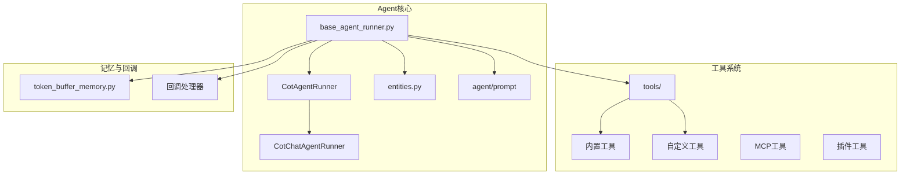
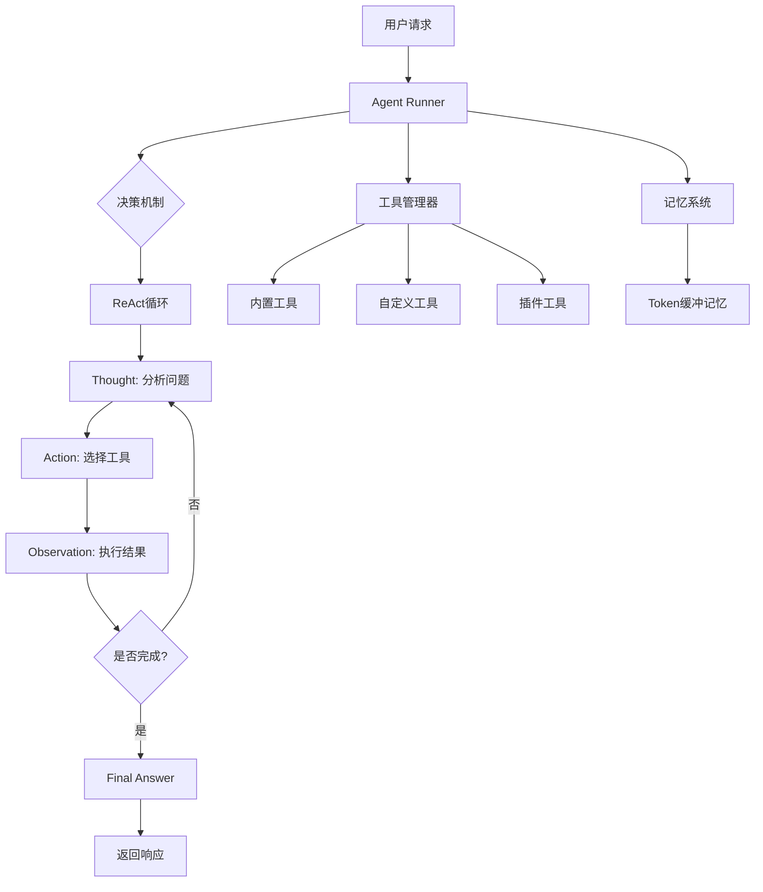
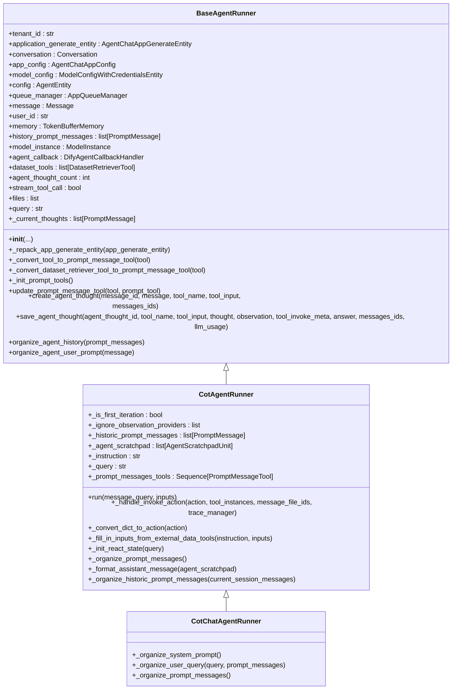
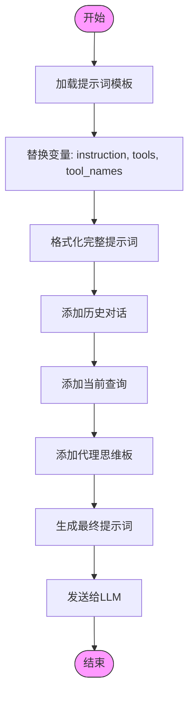
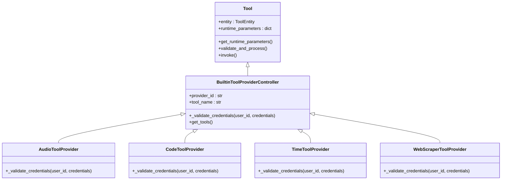
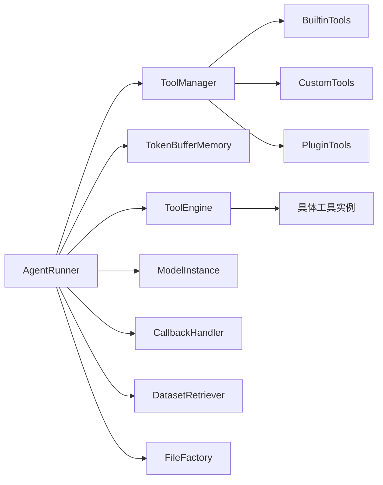

# Agent系统

<cite>
**本文档引用的文件**  
- [base_agent_runner.py](file://api/core/agent/base_agent_runner.py)
- [cot_agent_runner.py](file://api/core/agent/cot_agent_runner.py)
- [cot_chat_agent_runner.py](file://api/core/agent/cot_chat_agent_runner.py)
- [entities.py](file://api/core/agent/entities.py)
- [template.py](file://api/core/agent/prompt/template.py)
- [token_buffer_memory.py](file://api/core/memory/token_buffer_memory.py)
- [tool_engine.py](file://api/core/tools/tool_engine.py)
- [tool.py](file://api/core/tools/__base/tool.py)
- [builtin_tool](file://api/core/tools/builtin_tool)
</cite>

## 目录
1. [引言](#引言)
2. [项目结构](#项目结构)
3. [核心组件](#核心组件)
4. [架构概述](#架构概述)
5. [详细组件分析](#详细组件分析)
6. [依赖分析](#依赖分析)
7. [性能考虑](#性能考虑)
8. [故障排除指南](#故障排除指南)
9. [结论](#结论)

## 引言
Dify Agent系统是一个基于ReAct（Reasoning-Acting）模式的智能代理框架，旨在通过自主推理和工具调用来完成复杂任务。该系统能够解析用户请求、选择合适的工具组合并执行任务，支持超过50种内置工具，并具备自主规划能力。本文档深入解析Agent的决策机制、提示词设计、记忆管理、错误恢复策略以及与外部系统的集成方法。

## 项目结构
Dify Agent系统的代码组织清晰，主要功能集中在`api/core/agent`和`api/core/tools`目录下。系统采用模块化设计，分离了代理逻辑、工具管理、记忆机制和提示工程等核心功能。



**图示来源**  
- [base_agent_runner.py](file://api/core/agent/base_agent_runner.py#L1-L50)
- [cot_agent_runner.py](file://api/core/agent/cot_agent_runner.py#L1-L30)
- [tool_engine.py](file://api/core/tools/tool_engine.py#L1-L20)

## 核心组件

Dify Agent系统的核心组件包括代理运行器（Agent Runner）、工具引擎（Tool Engine）、记忆机制（Memory）和提示词系统（Prompt System）。这些组件协同工作，实现智能决策和任务执行。

**组件来源**  
- [base_agent_runner.py](file://api/core/agent/base_agent_runner.py#L1-L100)
- [tool_engine.py](file://api/core/tools/tool_engine.py#L1-L50)
- [token_buffer_memory.py](file://api/core/memory/token_buffer_memory.py#L1-L20)

## 架构概述

Dify Agent采用分层架构，从上到下分为应用层、代理层、工具层和数据层。代理层是核心，负责决策和流程控制；工具层提供具体功能实现；记忆层维护上下文状态。



**图示来源**  
- [cot_agent_runner.py](file://api/core/agent/cot_agent_runner.py#L1-L100)
- [tool_engine.py](file://api/core/tools/tool_engine.py#L1-L30)
- [token_buffer_memory.py](file://api/core/memory/token_buffer_memory.py#L1-L10)

## 详细组件分析

### Agent运行器分析

Agent运行器是系统的执行中枢，负责管理ReAct循环的整个生命周期。它通过`run`方法启动代理执行流程，维护代理的思维过程和工具调用。

#### 类图


**图示来源**  
- [base_agent_runner.py](file://api/core/agent/base_agent_runner.py#L1-L500)
- [cot_agent_runner.py](file://api/core/agent/cot_agent_runner.py#L1-L400)
- [cot_chat_agent_runner.py](file://api/core/agent/cot_chat_agent_runner.py#L1-L100)

### ReAct决策流程分析

ReAct模式是Agent系统的核心决策机制，通过"思考-行动-观察"的循环实现复杂任务的分解和执行。

#### 序列图
```mermaid
sequenceDiagram
participant 用户
participant AgentRunner
participant LLM
participant ToolEngine
participant 工具实例
用户->>AgentRunner : 发送请求
AgentRunner->>AgentRunner : 初始化ReAct状态
loop ReAct循环
AgentRunner->>LLM : 发送提示词(包含Thought/Action/Observation格式)
LLM-->>AgentRunner : 返回Action JSON
AgentRunner->>AgentRunner : 解析Action
alt 是Final Answer
AgentRunner->>用户 : 返回最终答案
break 循环结束
else 是工具调用
AgentRunner->>ToolEngine : 调用工具
ToolEngine->>工具实例 : 执行工具
工具实例-->>ToolEngine : 返回结果
ToolEngine-->>AgentRunner : Observation结果
AgentRunner->>AgentRunner : 更新记忆和历史
end
end
```

**图示来源**  
- [cot_agent_runner.py](file://api/core/agent/cot_agent_runner.py#L50-L400)
- [tool_engine.py](file://api/core/tools/tool_engine.py#L1-L50)

### 提示词系统分析

提示词系统是引导LLM遵循ReAct模式的关键，通过精心设计的模板确保模型输出符合预期格式。

#### 流程图


**图示来源**  
- [template.py](file://api/core/agent/prompt/template.py#L1-L100)
- [cot_chat_agent_runner.py](file://api/core/agent/cot_chat_agent_runner.py#L20-L50)

### 内置工具系统分析

Dify Agent提供了丰富的内置工具，涵盖音频处理、代码执行、时间操作和网页抓取等50多种功能。

#### 类图


**图示来源**  
- [tool.py](file://api/core/tools/__base/tool.py#L1-L50)
- [builtin_tool](file://api/core/tools/builtin_tool#L1-L20)
- [audio.py](file://api/core/tools/builtin_tool/providers/audio/audio.py#L1-L10)
- [code.py](file://api/core/tools/builtin_tool/providers/code/code.py#L1-L10)

## 依赖分析

Agent系统依赖多个核心组件协同工作，形成完整的功能链条。



**图示来源**  
- [base_agent_runner.py](file://api/core/agent/base_agent_runner.py#L1-L100)
- [tool_manager.py](file://api/core/tools/tool_manager.py#L1-L20)
- [tool_engine.py](file://api/core/tools/tool_engine.py#L1-L30)

## 性能考虑

Agent系统的性能受多个因素影响，包括LLM调用延迟、工具执行时间和上下文长度管理。系统通过Token缓冲记忆机制优化上下文管理，避免超出模型的最大token限制。同时，异步处理和流式响应机制确保了良好的用户体验。

## 故障排除指南

### 常见问题及解决方案

1. **工具调用失败**
   - 检查工具凭证是否正确配置
   - 验证工具参数是否符合要求
   - 查看工具执行日志获取详细错误信息

2. **ReAct循环卡住**
   - 检查LLM是否返回了有效的Action JSON
   - 验证提示词模板是否正确
   - 确认工具列表与模型能力匹配

3. **上下文过长**
   - 调整记忆系统的Token缓冲大小
   - 优化历史对话的压缩策略
   - 考虑使用摘要式记忆替代完整历史

4. **性能低下**
   - 检查是否有不必要的工具调用
   - 优化工具执行逻辑
   - 考虑并行执行独立的工具调用

**问题来源**  
- [base_agent_runner.py](file://api/core/agent/base_agent_runner.py#L300-L400)
- [cot_agent_runner.py](file://api/core/agent/cot_agent_runner.py#L200-L300)
- [tool_engine.py](file://api/core/tools/tool_engine.py#L100-L150)

## 结论

Dify Agent系统通过ReAct模式实现了强大的自主决策能力，结合丰富的内置工具和灵活的扩展机制，能够处理各种复杂任务。系统的模块化设计使得各组件职责清晰，便于维护和扩展。通过合理的提示词设计和记忆管理，Agent能够在保持上下文连贯性的同时高效完成任务。未来可以通过增加更多工具类型、优化决策算法和提升错误恢复能力来进一步增强系统功能。