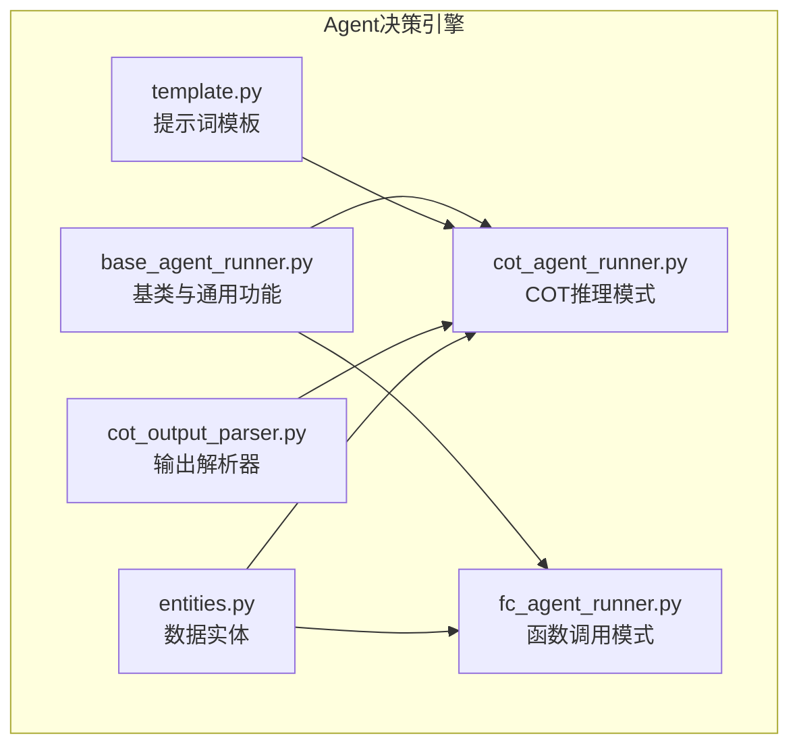
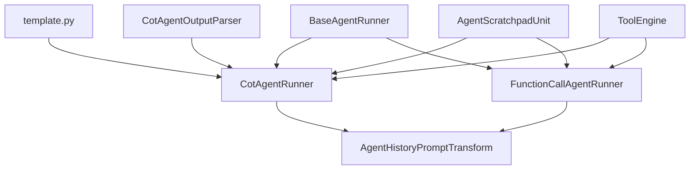

# 决策引擎

<cite>
**本文档引用的文件**  
- [cot_agent_runner.py](file://api/core/agent/cot_agent_runner.py)
- [fc_agent_runner.py](file://api/core/agent/fc_agent_runner.py)
- [template.py](file://api/core/agent/prompt/template.py)
- [base_agent_runner.py](file://api/core/agent/base_agent_runner.py)
- [cot_output_parser.py](file://api/core/agent/output_parser/cot_output_parser.py)
- [entities.py](file://api/core/agent/entities.py)
</cite>

## 目录
1. [引言](#引言)
2. [项目结构](#项目结构)
3. [核心组件](#核心组件)
4. [架构概述](#架构概述)
5. [详细组件分析](#详细组件分析)
6. [依赖分析](#依赖分析)
7. [性能考量](#性能考量)
8. [故障排除指南](#故障排除指南)
9. [结论](#结论)

## 引言
本文档旨在深入解析Dify Agent决策引擎的内部机制，重点阐述其基于ReAct（Reasoning & Acting）模式的决策流程。文档将详细说明COT（Chain-of-Thought）和Function Calling两种核心推理模式的实现原理、适用场景及代码级实现。通过对`cot_agent_runner.py`和`fc_agent_runner.py`中核心算法的剖析，揭示系统如何解析用户意图、生成推理链并选择执行动作。同时，文档将解释提示词模板在引导模型思考过程中的关键作用，提供决策流程的时序图和状态机图，并通过具体分析展示从输入到决策输出的完整过程。最后，文档将包含性能瓶颈分析和优化建议。

## 项目结构
Dify Agent决策引擎的核心逻辑位于`api/core/agent`目录下。该模块遵循清晰的分层设计，主要包含以下子模块和文件：

- **runner**: 包含决策引擎的执行核心，如`cot_agent_runner.py`和`fc_agent_runner.py`。
- **prompt**: 包含引导模型思考的提示词模板，如`template.py`。
- **output_parser**: 包含解析模型输出的工具，如`cot_output_parser.py`。
- **entities**: 定义了决策过程中使用的数据结构，如`AgentScratchpadUnit`。
- **base_agent_runner.py**: 提供了所有Agent Runner的基类和通用功能。



**图示来源**
- [cot_agent_runner.py](file://api/core/agent/cot_agent_runner.py)
- [fc_agent_runner.py](file://api/core/agent/fc_agent_runner.py)
- [template.py](file://api/core/agent/prompt/template.py)
- [base_agent_runner.py](file://api/core/agent/base_agent_runner.py)

## 核心组件
决策引擎的核心由两个主要的Agent Runner类构成：`CotAgentRunner`和`FunctionCallAgentRunner`。它们都继承自`BaseAgentRunner`，实现了不同的推理模式。

`CotAgentRunner`实现了基于思维链（COT）的ReAct模式，它通过特定的提示词模板，引导模型以“思考-行动-观察”的循环方式进行推理。`FunctionCallAgentRunner`则利用大语言模型（LLM）原生的函数调用（Function Calling）能力，直接解析模型输出的结构化工具调用指令。

**组件来源**
- [cot_agent_runner.py](file://api/core/agent/cot_agent_runner.py)
- [fc_agent_runner.py](file://api/core/agent/fc_agent_runner.py)

## 架构概述
Dify Agent决策引擎采用ReAct模式，其核心架构围绕“推理”与“行动”两个阶段循环展开。系统通过精心设计的提示词模板引导模型生成推理过程，并根据模型的输出决定是调用外部工具还是给出最终答案。

```mermaid
graph LR
A[用户输入] --> B{解析用户意图}
B --> C[生成推理链<br/>(Thought)]
C --> D{需要调用工具吗？}
D --> |是| E[选择并执行动作<br/>(Action)]
E --> F[获取工具返回结果<br/>(Observation)]
F --> C
D --> |否| G[生成最终答案<br/>(Final Answer)]
G --> H[返回响应]
```

**图示来源**
- [cot_agent_runner.py](file://api/core/agent/cot_agent_runner.py)
- [fc_agent_runner.py](file://api/core/agent/fc_agent_runner.py)

## 详细组件分析
本节将深入分析`CotAgentRunner`和`FunctionCallAgentRunner`的实现细节。

### COT推理模式分析
`CotAgentRunner`通过`run`方法实现了一个迭代的决策循环。其核心流程如下：

1.  **初始化**: 调用`_init_react_state`方法初始化状态，包括用户查询、推理草稿本（`_agent_scratchpad`）和历史消息。
2.  **组织提示词**: 在每次迭代中，通过`_organize_prompt_messages`方法（由子类实现）构建发送给LLM的完整提示词。该提示词包含了系统指令、工具描述、历史交互和当前的推理草稿。
3.  **调用模型**: 调用`model_instance.invoke_llm`方法，以流式方式获取模型的输出。
4.  **解析输出**: 使用`CotAgentOutputParser.handle_react_stream_output`对模型的流式输出进行实时解析。解析器会识别出“Thought”、“Action”和“Final Answer”等关键部分。
5.  **执行动作**: 如果解析出一个有效的`Action`，则调用`_handle_invoke_action`方法，通过`ToolEngine`来执行相应的工具，并获取`Observation`（观察结果）。
6.  **循环迭代**: 将`Thought`、`Action`和`Observation`记录到`_agent_scratchpad`中，并将这些信息作为下一次迭代的上下文，重复上述过程。
7.  **返回最终答案**: 当模型输出`Final Answer`或达到最大迭代次数时，循环结束，将最终答案返回给用户。

```mermaid
sequenceDiagram
participant User as 用户
participant CotRunner as CotAgentRunner
participant LLM as 大语言模型
participant Tool as 外部工具
User->>CotRunner : 发送查询
loop 决策循环
CotRunner->>LLM : 组织提示词并调用
LLM-->>CotRunner : 流式返回输出
CotRunner->>CotRunner : 解析输出 (CotOutputParser)
alt 解析出 Action
CotRunner->>Tool : 调用工具 (ToolEngine)
Tool-->>CotRunner : 返回观察结果
CotRunner->>CotRunner : 更新草稿本
else 解析出 Final Answer
CotRunner->>User : 返回最终答案
break
end
end
```

**图示来源**
- [cot_agent_runner.py](file://api/core/agent/cot_agent_runner.py#L26-L425)
- [cot_output_parser.py](file://api/core/agent/output_parser/cot_output_parser.py#L9-L219)

#### COT输出解析器
`CotAgentOutputParser`是COT模式的关键组件，负责从模型的非结构化文本流中提取结构化的`Action`。它通过一个状态机来识别文本中的模式：
- **识别关键词**: 监听“Thought:”和“Action:”等前缀。
- **提取JSON块**: 识别并解析位于```json```代码块中的JSON对象。
- **解析单个JSON**: 识别并解析独立的JSON对象。
- **返回结果**: 将解析出的`action`和`action_input`封装成`AgentScratchpadUnit.Action`对象返回。

**组件来源**
- [cot_output_parser.py](file://api/core/agent/output_parser/cot_output_parser.py#L9-L219)
- [entities.py](file://api/core/agent/entities.py#L30-L64)

### 函数调用推理模式分析
`FunctionCallAgentRunner`利用LLM原生的函数调用能力，其流程更为直接：

1.  **初始化**: 初始化状态和工具列表。
2.  **组织提示词**: 通过`_organize_prompt_messages`方法构建提示词，其中工具以结构化的方式（如OpenAI的`tools`参数）提供给模型。
3.  **调用模型**: 调用`model_instance.invoke_llm`，并传入`prompt_messages_tools`。模型会直接返回一个包含`tool_calls`的结构化响应。
4.  **检查并提取工具调用**: 通过`check_tool_calls`和`extract_tool_calls`方法检查流式输出中是否包含工具调用，并提取出工具名称和参数。
5.  **执行工具**: 遍历所有提取出的工具调用，通过`ToolEngine`执行工具，并将结果（`ToolPromptMessage`）添加到对话历史中。
6.  **循环迭代**: 将工具调用和结果作为上下文，进行下一次迭代，直到模型不再请求调用工具。
7.  **返回最终答案**: 将所有非工具调用的响应内容拼接为最终答案返回。

```mermaid
sequenceDiagram
participant User as 用户
participant FcRunner as FunctionCallAgentRunner
participant LLM as 大语言模型
participant Tool as 外部工具
User->>FcRunner : 发送查询
loop 决策循环
FcRunner->>LLM : 组织提示词并调用 (含tools参数)
LLM-->>FcRunner : 返回结构化响应 (含tool_calls)
alt 存在 tool_calls
FcRunner->>FcRunner : 提取所有工具调用
loop 遍历每个工具调用
FcRunner->>Tool : 调用工具 (ToolEngine)
Tool-->>FcRunner : 返回结果
FcRunner->>FcRunner : 记录结果到对话历史
end
else 无 tool_calls
FcRunner->>User : 返回最终答案
break
end
end
```

**图示来源**
- [fc_agent_runner.py](file://api/core/agent/fc_agent_runner.py#L32-L463)

### 提示词模板的作用
位于`api/core/agent/prompt/template.py`的提示词模板是引导COT模式的核心。它通过以下方式塑造模型的输出：
- **定义角色和指令**: 明确模型需要“有帮助且准确地回应”。
- **列出可用工具**: 向模型提供所有可用工具的名称、描述和参数。
- **规定输出格式**: 强制要求模型使用特定的JSON格式来指定工具调用，例如`{"action": "tool_name", "action_input": {...}}`。
- **提供思维链模板**: 通过“Thought:”、“Action:”、“Observation:”的格式，引导模型显式地展示其推理过程。

这种模板化的提示词确保了模型的输出是可预测和可解析的，是COT模式得以实现的基础。

**组件来源**
- [template.py](file://api/core/agent/prompt/template.py#L0-L106)

## 依赖分析
决策引擎的各个组件之间存在紧密的依赖关系。



**图示来源**
- [cot_agent_runner.py](file://api/core/agent/cot_agent_runner.py)
- [fc_agent_runner.py](file://api/core/agent/fc_agent_runner.py)
- [base_agent_runner.py](file://api/core/agent/base_agent_runner.py)

## 性能考量
决策引擎的性能受多种因素影响：
- **迭代次数**: 每次工具调用都会增加一次完整的LLM调用，过多的迭代会显著增加延迟和成本。
- **工具执行时间**: 外部工具的响应速度是整个流程的瓶颈之一。
- **模型流式处理**: COT模式依赖于流式解析，对解析器的效率要求较高。
- **上下文长度**: 随着推理链的增长，上下文会越来越长，可能达到模型的token限制。

优化建议包括：合理设置`max_iteration`以防止无限循环；优化工具的执行效率；监控并管理上下文长度。

## 故障排除指南
- **模型无法生成有效的Action**: 检查提示词模板是否正确，确保模型支持ReAct模式。
- **工具调用失败**: 检查`_handle_invoke_action`方法中的日志，确认工具实例是否存在，参数是否正确。
- **解析器无法识别Action**: 检查模型输出是否符合预期格式，可能需要调整`CotAgentOutputParser`的正则表达式。
- **性能低下**: 检查迭代次数和工具执行时间，考虑是否可以通过更强大的模型或优化的提示词来减少迭代。

**组件来源**
- [cot_agent_runner.py](file://api/core/agent/cot_agent_runner.py#L26-L425)
- [fc_agent_runner.py](file://api/core/agent/fc_agent_runner.py#L32-L463)

## 结论
Dify Agent决策引擎通过`CotAgentRunner`和`FunctionCallAgentRunner`两种模式，实现了灵活且强大的决策能力。COT模式通过提示词工程，适用于不支持原生函数调用的模型，而函数调用模式则利用了现代LLM的结构化输出能力，更加高效和可靠。两者都依赖于`BaseAgentRunner`提供的通用功能和`ToolEngine`来执行外部动作。理解这两种模式的实现原理和适用场景，对于开发和优化基于Agent的应用至关重要。