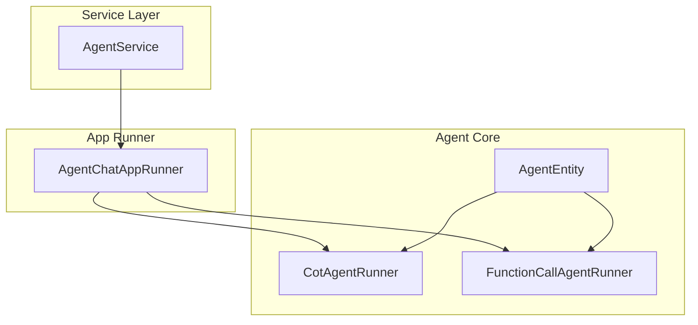
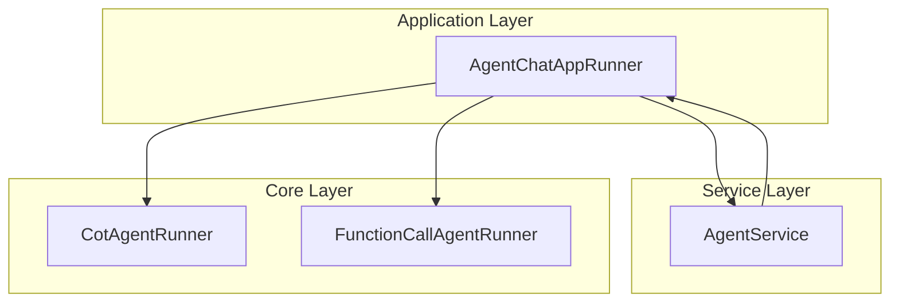
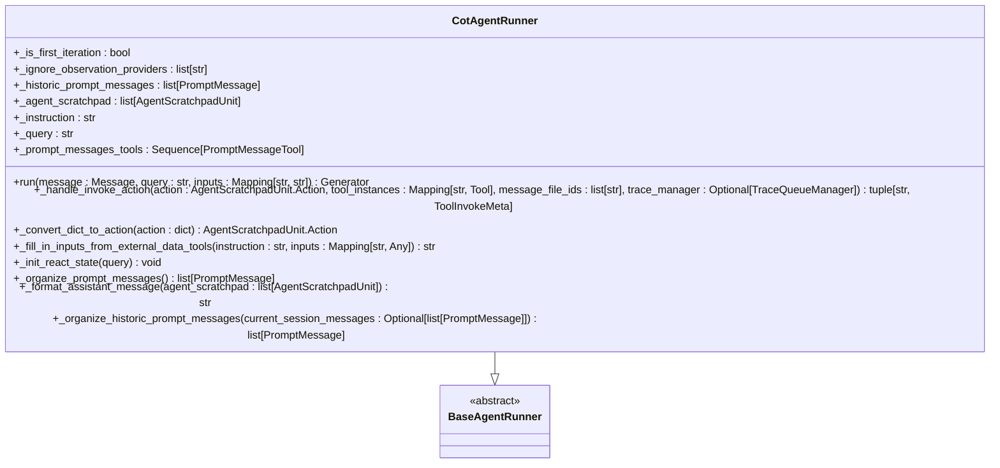
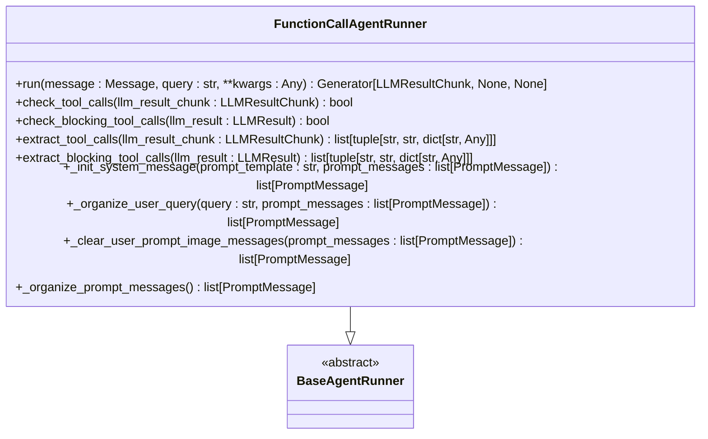
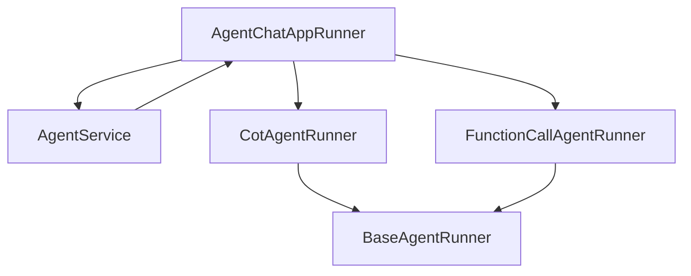

# 推理模式

<cite>
**本文档中引用的文件**   
- [cot_agent_runner.py](file://api/core/agent/cot_agent_runner.py)
- [fc_agent_runner.py](file://api/core/agent/fc_agent_runner.py)
- [agent_service.py](file://api/services/agent_service.py)
- [entities.py](file://api/core/agent/entities.py)
- [app_runner.py](file://api/core/app/apps/agent_chat/app_runner.py)
</cite>

## 目录
1. [简介](#简介)
2. [项目结构](#项目结构)
3. [核心组件](#核心组件)
4. [架构概述](#架构概述)
5. [详细组件分析](#详细组件分析)
6. [依赖分析](#依赖分析)
7. [性能考虑](#性能考虑)
8. [故障排除指南](#故障排除指南)
9. [结论](#结论)

## 简介
本文档深入探讨了Dify Agent的两种核心推理模式：思维链（Chain-of-Thought, COT）和函数调用（Function Calling）。文档详细阐述了`cot_agent_runner.py`中如何实现思维链推理，包括问题分解、中间步骤生成和最终答案合成的算法逻辑。同时，分析了`fc_agent_runner.py`中函数调用的实现机制，包括工具选择、参数提取和执行调度。通过代码片段展示了两种模式在`agent_service.py`中的调用流程和决策逻辑。此外，文档还说明了每种模式的适用场景、性能特点和潜在的错误处理策略，并提供了选择合适模式的决策树。

## 项目结构
Dify Agent的推理模式主要分布在`api/core/agent`目录下，其中`cot_agent_runner.py`和`fc_agent_runner.py`分别实现了思维链和函数调用两种模式。`agent_service.py`提供了服务层接口，用于获取和管理Agent的配置和日志。`entities.py`定义了Agent的核心实体和策略枚举。

**图源**
- [cot_agent_runner.py](file://api/core/agent/cot_agent_runner.py)
- [fc_agent_runner.py](file://api/core/agent/fc_agent_runner.py)
- [agent_service.py](file://api/services/agent_service.py)
- [app_runner.py](file://api/core/app/apps/agent_chat/app_runner.py)

**节源**
- [cot_agent_runner.py](file://api/core/agent/cot_agent_runner.py)
- [fc_agent_runner.py](file://api/core/agent/fc_agent_runner.py)
- [agent_service.py](file://api/services/agent_service.py)
- [app_runner.py](file://api/core/app/apps/agent_chat/app_runner.py)

## 核心组件
Dify Agent的核心组件包括`CotAgentRunner`和`FunctionCallAgentRunner`，它们分别继承自`BaseAgentRunner`，实现了不同的推理策略。`AgentEntity`定义了Agent的配置和策略，而`AgentService`提供了服务层接口。

**节源**
- [cot_agent_runner.py](file://api/core/agent/cot_agent_runner.py)
- [fc_agent_runner.py](file://api/core/agent/fc_agent_runner.py)
- [entities.py](file://api/core/agent/entities.py)
- [agent_service.py](file://api/services/agent_service.py)

## 架构概述
Dify Agent的架构分为三层：应用层、服务层和核心层。应用层通过`AgentChatAppRunner`启动Agent，根据配置选择合适的`AgentRunner`。服务层通过`AgentService`提供配置和日志管理。核心层实现了具体的推理逻辑。

**图源**
- [app_runner.py](file://api/core/app/apps/agent_chat/app_runner.py)
- [agent_service.py](file://api/services/agent_service.py)
- [cot_agent_runner.py](file://api/core/agent/cot_agent_runner.py)
- [fc_agent_runner.py](file://api/core/agent/fc_agent_runner.py)

## 详细组件分析

### 思维链推理模式分析
`CotAgentRunner`实现了思维链推理模式，通过问题分解、中间步骤生成和最终答案合成来解决问题。

#### 类图

**图源**
- [cot_agent_runner.py](file://api/core/agent/cot_agent_runner.py)

**节源**
- [cot_agent_runner.py](file://api/core/agent/cot_agent_runner.py)

### 函数调用模式分析
`FunctionCallAgentRunner`实现了函数调用模式，通过工具选择、参数提取和执行调度来解决问题。

#### 类图

**图源**
- [fc_agent_runner.py](file://api/core/agent/fc_agent_runner.py)

**节源**
- [fc_agent_runner.py](file://api/core/agent/fc_agent_runner.py)

## 依赖分析
Dify Agent的依赖关系主要体现在`AgentChatAppRunner`根据配置选择合适的`AgentRunner`，并通过`AgentService`获取配置和日志。

**图源**
- [app_runner.py](file://api/core/app/apps/agent_chat/app_runner.py)
- [agent_service.py](file://api/services/agent_service.py)
- [cot_agent_runner.py](file://api/core/agent/cot_agent_runner.py)
- [fc_agent_runner.py](file://api/core/agent/fc_agent_runner.py)

**节源**
- [app_runner.py](file://api/core/app/apps/agent_chat/app_runner.py)
- [agent_service.py](file://api/services/agent_service.py)
- [cot_agent_runner.py](file://api/core/agent/cot_agent_runner.py)
- [fc_agent_runner.py](file://api/core/agent/fc_agent_runner.py)

## 性能考虑
思维链模式由于需要多次迭代和中间步骤生成，可能会导致较高的延迟和资源消耗。函数调用模式通过直接调用工具，通常具有较低的延迟和较高的效率。选择合适的模式需要根据具体的应用场景和性能要求进行权衡。

## 故障排除指南
在使用Dify Agent时，可能会遇到配置错误、工具调用失败等问题。建议通过`AgentService`获取详细的日志信息，检查配置和工具的正确性，并根据日志中的错误信息进行调试。

**节源**
- [agent_service.py](file://api/services/agent_service.py)

## 结论
Dify Agent提供了两种核心推理模式：思维链和函数调用。思维链模式适用于需要复杂问题分解和中间步骤生成的场景，而函数调用模式适用于需要直接调用工具的场景。通过合理选择和配置，可以充分发挥Dify Agent的潜力，实现高效和智能的推理。