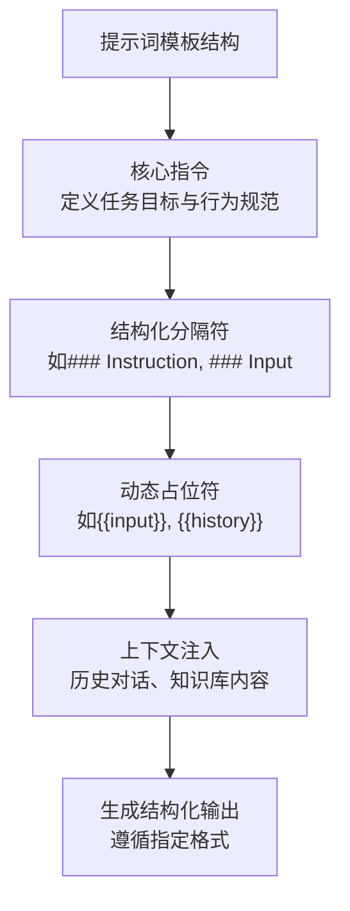
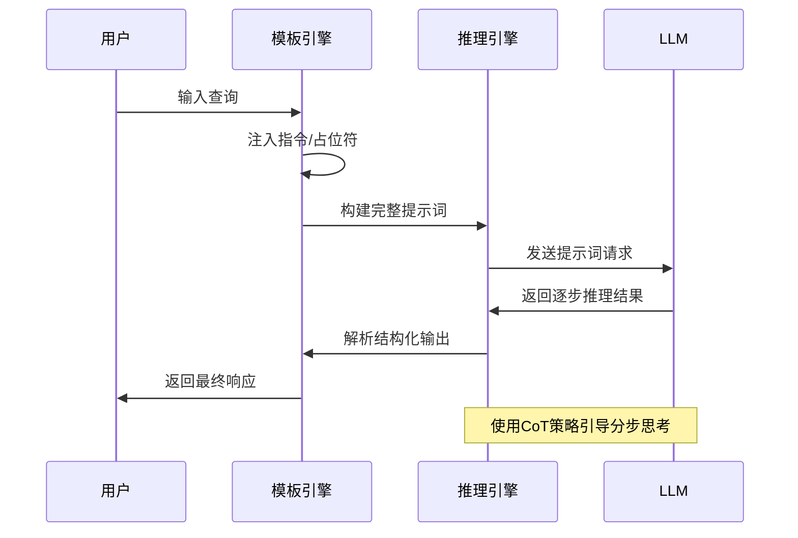
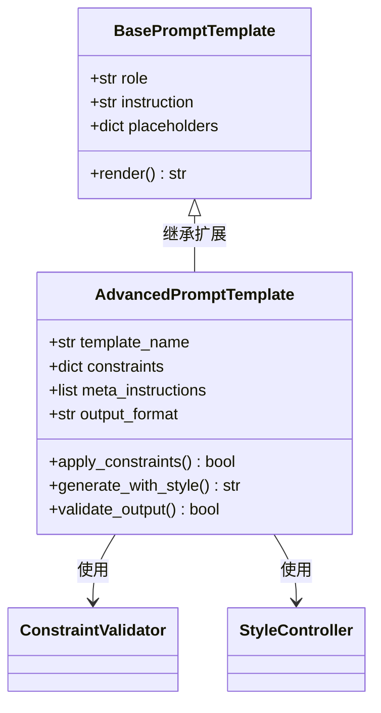
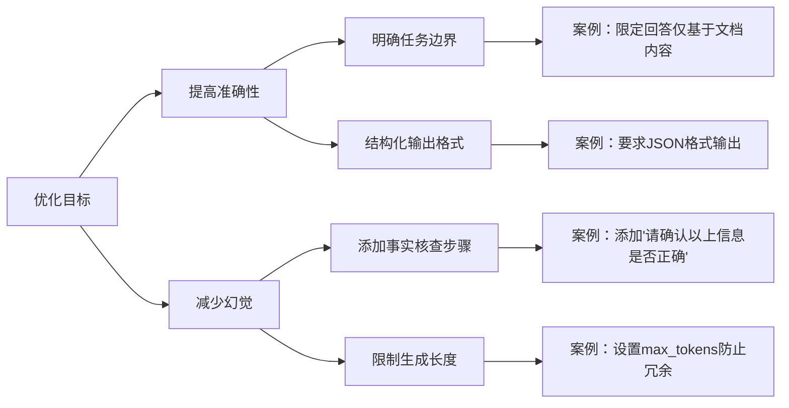

# 提示词设计

<cite>
**本文档引用的文件**   
- [template.py](file://api/core/agent/prompt/template.py)
- [cot_agent_runner.py](file://api/core/agent/cot_agent_runner.py)
- [advanced_prompt_templates.py](file://api/core/prompt/prompt_templates/advanced_prompt_templates.py)
- [prompt_transform.py](file://api/core/prompt/prompt_transform.py)
- [agent_history_prompt_transform.py](file://api/core/prompt/agent_history_prompt_transform.py)
- [advanced_prompt_transform.py](file://api/core/prompt/advanced_prompt_transform.py)
</cite>

## 目录
1. [引言](#引言)
2. [核心组件](#核心组件)
3. [提示词模板结构分析](#提示词模板结构分析)
4. [模板与推理机制的协同工作](#模板与推理机制的协同工作)
5. [高级提示词设计原则](#高级提示词设计原则)
6. [提示词优化技巧与案例](#提示词优化技巧与案例)
7. [结论](#结论)

## 引言
本文档旨在深入解析Dify Agent中提示词设计的核心机制，重点阐述提示词模板在引导大语言模型（LLM）进行有效推理中的关键作用。通过分析`prompt/template.py`中的模板结构、`cot_agent_runner.py`中的推理流程以及`advanced_prompt_templates.py`中的高级设计模式，全面揭示如何构建清晰的思维框架以提升模型决策准确性并减少幻觉现象。

## 核心组件

本节分析Dify Agent中与提示词设计密切相关的几个核心组件及其交互关系。

**Section sources**
- [template.py](file://api/core/agent/prompt/template.py#L1-L50)
- [cot_agent_runner.py](file://api/core/agent/cot_agent_runner.py#L1-L40)
- [advanced_prompt_templates.py](file://api/core/prompt/prompt_templates/advanced_prompt_templates.py#L1-L30)

## 提示词模板结构分析

Dify Agent的提示词模板通过精心设计的指令、分隔符和占位符来构建清晰的思维框架。这些元素共同作用，引导模型按照预设逻辑进行逐步推理。

**Diagram sources **
- [template.py](file://api/core/agent/prompt/template.py#L15-L60)

**Section sources**
- [template.py](file://api/core/agent/prompt/template.py#L10-L80)

## 模板与推理机制的协同工作

提示词模板与`cot_agent_runner.py`中的推理引擎协同工作，激发模型的逐步推理能力。该机制通过将复杂问题分解为多个中间步骤，引导模型显式地展示其思考过程。

**Diagram sources **
- [cot_agent_runner.py](file://api/core/agent/cot_agent_runner.py#L20-L70)
- [template.py](file://api/core/agent/prompt/template.py#L30-L50)

**Section sources**
- [cot_agent_runner.py](file://api/core/agent/cot_agent_runner.py#L10-L100)
- [template.py](file://api/core/agent/prompt/template.py#L20-L60)

## 高级提示词设计原则

`advanced_prompt_templates.py`中定义了高级提示词的设计原则，强调在指令明确性与模型创造性之间取得平衡。这包括使用元指令控制生成风格、设置约束条件防止偏离主题以及引入反思机制提升输出质量。

**Diagram sources **
- [advanced_prompt_templates.py](file://api/core/prompt/prompt_templates/advanced_prompt_templates.py#L10-L50)
- [prompt_transform.py](file://api/core/prompt/prompt_transform.py#L15-L35)

**Section sources**
- [advanced_prompt_templates.py](file://api/core/prompt/prompt_templates/advanced_prompt_templates.py#L5-L60)
- [advanced_prompt_transform.py](file://api/core/prompt/advanced_prompt_transform.py#L10-L40)

## 提示词优化技巧与案例

为提高决策准确性和减少幻觉，提示词优化应遵循以下实用技巧：
- 明确限定回答范围和格式要求
- 引入验证步骤要求模型自我检查
- 利用历史上下文增强一致性
- 设置负面约束避免不期望的行为

**Diagram sources **
- [agent_history_prompt_transform.py](file://api/core/prompt/agent_history_prompt_transform.py#L20-L40)
- [advanced_prompt_transform.py](file://api/core/prompt/advanced_prompt_transform.py#L30-L50)

**Section sources**
- [agent_history_prompt_transform.py](file://api/core/prompt/agent_history_prompt_transform.py#L10-L50)
- [advanced_prompt_transform.py](file://api/core/prompt/advanced_prompt_transform.py#L20-L60)

## 结论
Dify Agent的提示词设计体系通过模板化结构、协同推理机制和高级设计原则，有效提升了LLM的推理能力和输出质量。未来可进一步探索动态模板生成、自适应指令调整等方向，持续优化人机协作的智能水平。