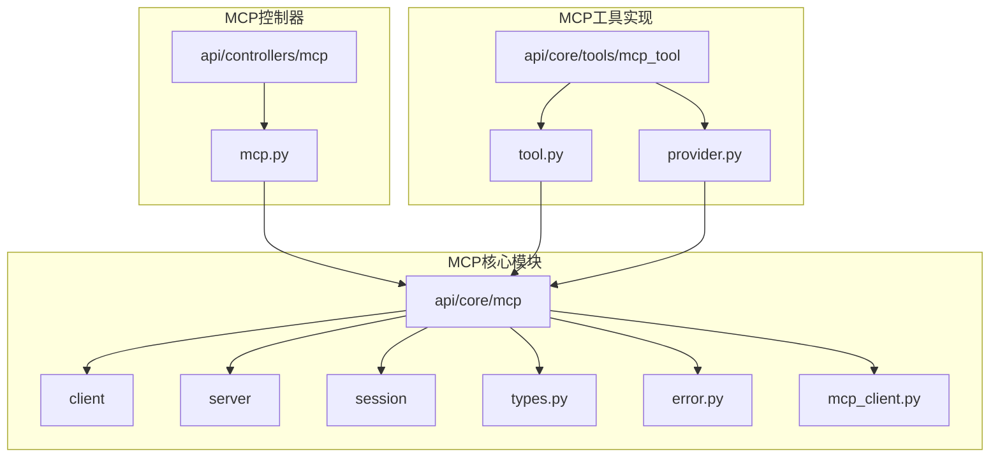
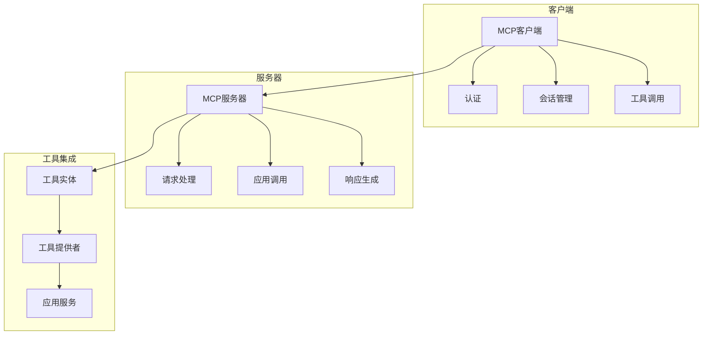
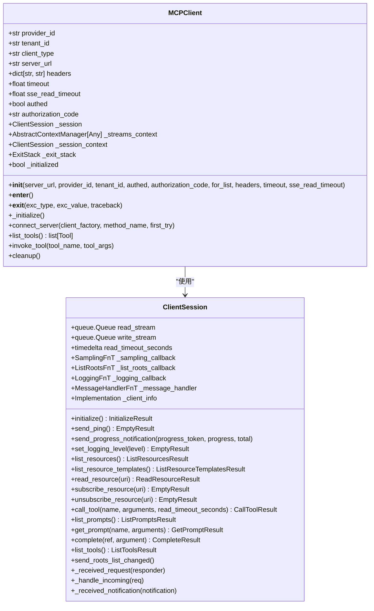
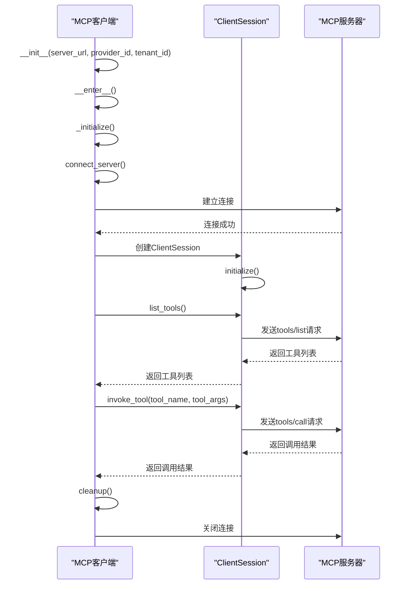
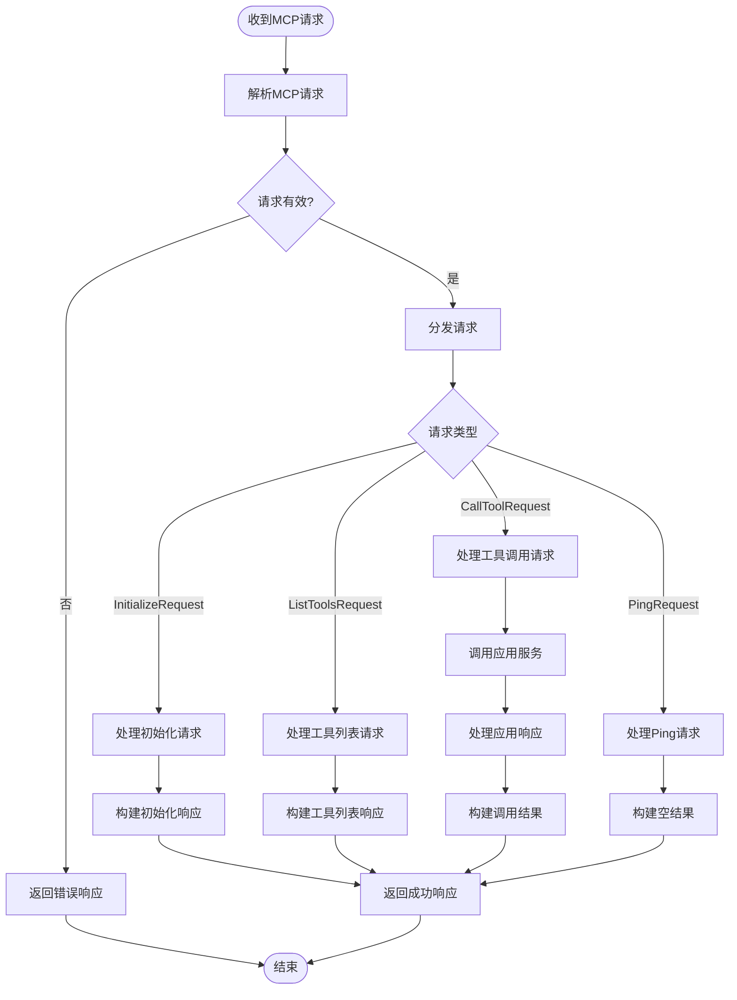
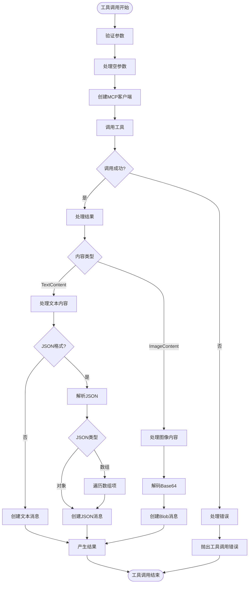
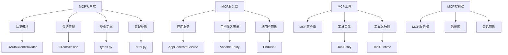

# MCP工具

<cite>
**本文档中引用的文件**
- [mcp_client.py](file://api/core/mcp/mcp_client.py)
- [client_session.py](file://api/core/mcp/session/client_session.py)
- [types.py](file://api/core/mcp/types.py)
- [error.py](file://api/core/mcp/error.py)
- [tool.py](file://api/core/tools/mcp_tool/tool.py)
- [provider.py](file://api/core/tools/mcp_tool/provider.py)
- [mcp.py](file://api/controllers/mcp/mcp.py)
- [streamable_http.py](file://api/core/mcp/server/streamable_http.py)
</cite>

## 目录
1. [介绍](#介绍)
2. [项目结构](#项目结构)
3. [核心组件](#核心组件)
4. [架构概述](#架构概述)
5. [详细组件分析](#详细组件分析)
6. [依赖分析](#依赖分析)
7. [性能考虑](#性能考虑)
8. [故障排除指南](#故障排除指南)
9. [结论](#结论)
10. [附录](#附录)（如有必要）

## 介绍
本文档全面文档化MCP（Model Calling Protocol）工具系统，详细解释`mcp_tool`的架构设计和`core/mcp`模块的交互机制。文档说明了MCP工具的发现、连接和调用流程，包括认证机制和会话管理。同时描述了MCP工具的元数据格式、方法调用协议和错误处理策略，并提供配置MCP服务器和集成外部MCP工具的详细步骤，包括安全配置和性能调优建议。

## 项目结构
MCP工具系统主要分布在`api/core/mcp`和`api/core/tools/mcp_tool`目录中。`api/core/mcp`包含MCP协议的核心实现，包括客户端、服务器、会话管理和类型定义。`api/core/tools/mcp_tool`包含MCP工具的具体实现，包括工具类和提供者类。控制器层的`api/controllers/mcp/mcp.py`处理MCP请求的入口。

**图示来源**
- [mcp_client.py](file://api/core/mcp/mcp_client.py#L1-L160)
- [tool.py](file://api/core/tools/mcp_tool/tool.py#L1-L108)
- [provider.py](file://api/core/tools/mcp_tool/provider.py#L1-L148)

**节来源**
- [mcp_client.py](file://api/core/mcp/mcp_client.py#L1-L160)
- [tool.py](file://api/core/tools/mcp_tool/tool.py#L1-L108)
- [provider.py](file://api/core/tools/mcp_tool/provider.py#L1-L148)
- [mcp.py](file://api/controllers/mcp/mcp.py#L1-L244)

## 核心组件
MCP工具系统的核心组件包括MCP客户端、MCP服务器、会话管理和工具实体。MCP客户端负责与MCP服务器建立连接并调用工具，MCP服务器处理来自客户端的请求，会话管理确保连接的稳定性和安全性，工具实体封装了具体的工具功能。

**节来源**
- [mcp_client.py](file://api/core/mcp/mcp_client.py#L1-L160)
- [streamable_http.py](file://api/core/mcp/server/streamable_http.py#L1-L262)
- [client_session.py](file://api/core/mcp/session/client_session.py#L1-L364)
- [tool.py](file://api/core/tools/mcp_tool/tool.py#L1-L108)

## 架构概述
MCP工具系统的架构分为客户端、服务器和工具集成三层。客户端通过MCP协议与服务器通信，服务器处理请求并调用相应的应用逻辑，工具集成层将MCP功能与Dify平台的其他组件集成。

**图示来源**
- [mcp_client.py](file://api/core/mcp/mcp_client.py#L1-L160)
- [streamable_http.py](file://api/core/mcp/server/streamable_http.py#L1-L262)
- [tool.py](file://api/core/tools/mcp_tool/tool.py#L1-L108)
- [provider.py](file://api/core/tools/mcp_tool/provider.py#L1-L148)

## 详细组件分析

### MCP客户端分析
MCP客户端是与MCP服务器通信的主要组件，负责建立连接、认证和调用工具。

#### 类图

**图示来源**
- [mcp_client.py](file://api/core/mcp/mcp_client.py#L1-L160)
- [client_session.py](file://api/core/mcp/session/client_session.py#L1-L364)

#### 调用流程序列图

**图示来源**
- [mcp_client.py](file://api/core/mcp/mcp_client.py#L1-L160)
- [client_session.py](file://api/core/mcp/session/client_session.py#L1-L364)

**节来源**
- [mcp_client.py](file://api/core/mcp/mcp_client.py#L1-L160)
- [client_session.py](file://api/core/mcp/session/client_session.py#L1-L364)

### MCP服务器分析
MCP服务器处理来自客户端的请求，包括初始化、工具列表查询和工具调用。

#### 请求处理流程图

**图示来源**
- [mcp.py](file://api/controllers/mcp/mcp.py#L1-L244)
- [streamable_http.py](file://api/core/mcp/server/streamable_http.py#L1-L262)

**节来源**
- [mcp.py](file://api/controllers/mcp/mcp.py#L1-L244)
- [streamable_http.py](file://api/core/mcp/server/streamable_http.py#L1-L262)

### MCP工具实体分析
MCP工具实体封装了具体的工具功能，负责调用MCP客户端执行实际操作。

#### 工具调用流程图

**图示来源**
- [tool.py](file://api/core/tools/mcp_tool/tool.py#L1-L108)

**节来源**
- [tool.py](file://api/core/tools/mcp_tool/tool.py#L1-L108)

## 依赖分析
MCP工具系统依赖于多个核心模块和外部组件，这些依赖关系确保了系统的完整性和功能性。

**图示来源**
- [mcp_client.py](file://api/core/mcp/mcp_client.py#L1-L160)
- [streamable_http.py](file://api/core/mcp/server/streamable_http.py#L1-L262)
- [tool.py](file://api/core/tools/mcp_tool/tool.py#L1-L108)
- [mcp.py](file://api/controllers/mcp/mcp.py#L1-L244)

**节来源**
- [mcp_client.py](file://api/core/mcp/mcp_client.py#L1-L160)
- [streamable_http.py](file://api/core/mcp/server/streamable_http.py#L1-L262)
- [tool.py](file://api/core/tools/mcp_tool/tool.py#L1-L108)
- [mcp.py](file://api/controllers/mcp/mcp.py#L1-L244)

## 性能考虑
MCP工具系统的性能主要受网络延迟、序列化开销和并发处理能力的影响。系统通过使用流式传输和连接复用等技术来优化性能。

- **连接管理**：MCP客户端使用ExitStack管理连接上下文，确保资源的正确释放。
- **超时设置**：支持配置连接超时和SSE读取超时，避免长时间等待。
- **流式传输**：支持SSE和可流式HTTP客户端，适用于长时间运行的操作。
- **会话复用**：通过ClientSession复用连接，减少重复建立连接的开销。

**节来源**
- [mcp_client.py](file://api/core/mcp/mcp_client.py#L1-L160)
- [client_session.py](file://api/core/mcp/session/client_session.py#L1-L364)

## 故障排除指南
本节提供MCP工具系统常见问题的解决方案。

### 认证失败
当出现认证失败时，检查以下几点：
- 确认OAuth提供者配置正确
- 检查访问令牌是否有效
- 验证授权码是否正确

**节来源**
- [mcp_client.py](file://api/core/mcp/mcp_client.py#L1-L160)
- [auth_flow.py](file://api/core/mcp/auth/auth_flow.py#L1-L50)

### 连接失败
连接失败可能由以下原因引起：
- 服务器URL配置错误
- 网络连接问题
- 服务器未启动或不可访问

**节来源**
- [mcp_client.py](file://api/core/mcp/mcp_client.py#L1-L160)
- [error.py](file://api/core/mcp/error.py#L1-L10)

### 工具调用失败
工具调用失败的常见原因包括：
- 工具名称错误
- 参数格式不正确
- 服务器不支持该工具

**节来源**
- [tool.py](file://api/core/tools/mcp_tool/tool.py#L1-L108)
- [streamable_http.py](file://api/core/mcp/server/streamable_http.py#L1-L262)

## 结论
MCP工具系统通过标准化的协议实现了Dify平台与外部工具的集成。系统采用分层架构，将客户端、服务器和工具集成分离，提高了代码的可维护性和扩展性。通过详细的错误处理和认证机制，确保了系统的安全性和可靠性。未来可以进一步优化性能，支持更多的传输协议和认证方式。

## 附录

### MCP协议版本支持
| 版本 | 支持状态 | 说明 |
|------|----------|------|
| 2025-03-26 | 客户端支持 | 最新协议版本 |
| 2024-11-05 | 服务器支持 | 兼容Claude使用 |

**节来源**
- [types.py](file://api/core/mcp/types.py#L1-L799)

### 错误代码定义
| 错误代码 | 含义 | 处理建议 |
|---------|------|----------|
| -32700 | 解析错误 | 检查JSON格式 |
| -32600 | 无效请求 | 验证请求参数 |
| -32601 | 方法未找到 | 检查方法名称 |
| -32602 | 无效参数 | 验证参数类型和格式 |
| -32603 | 内部错误 | 检查服务器日志 |

**节来源**
- [types.py](file://api/core/mcp/types.py#L1-L799)
- [error.py](file://api/core/mcp/error.py#L1-L10)