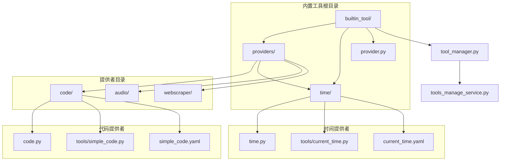
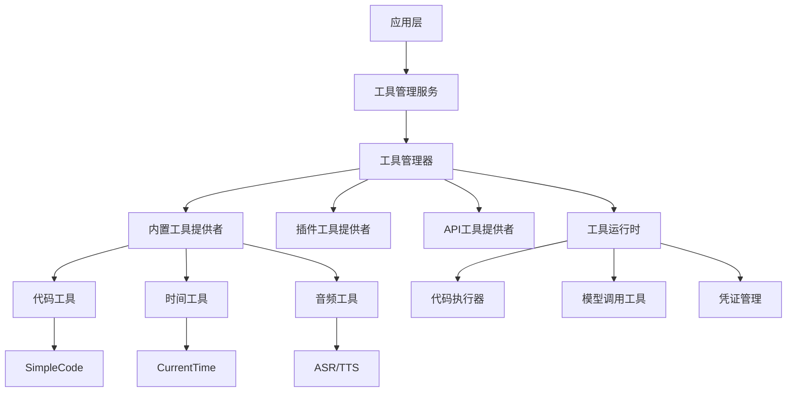
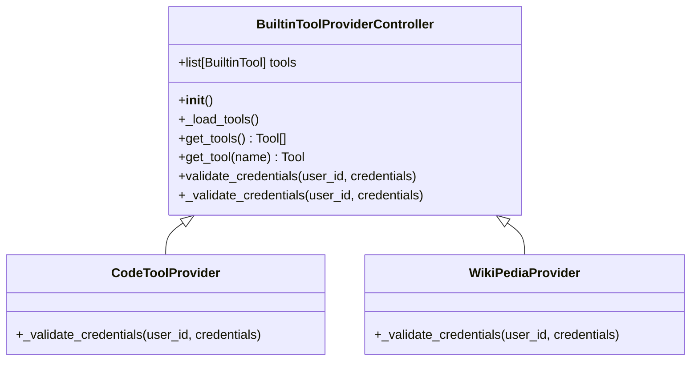
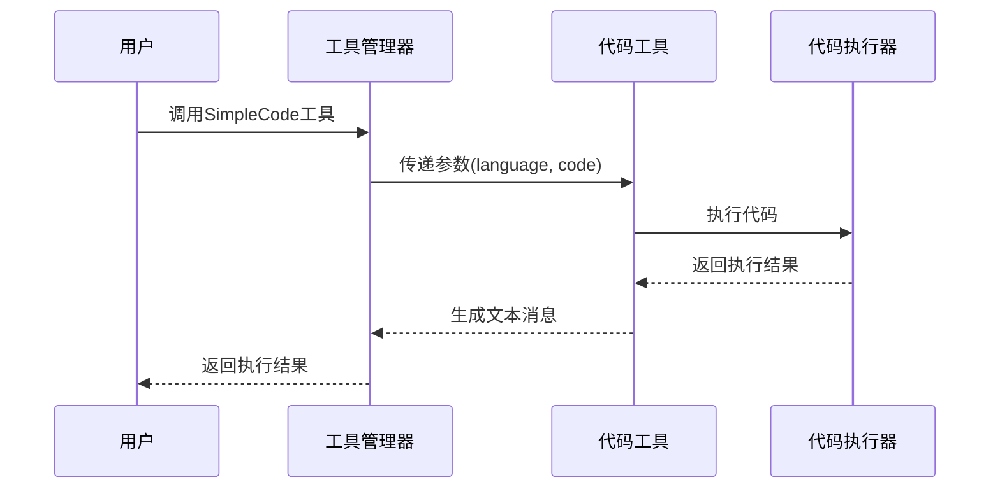
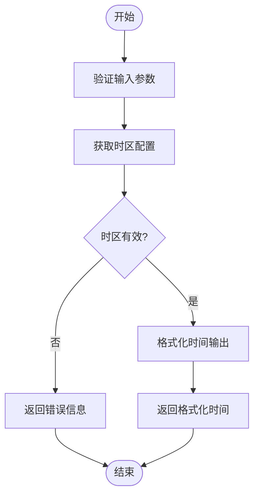
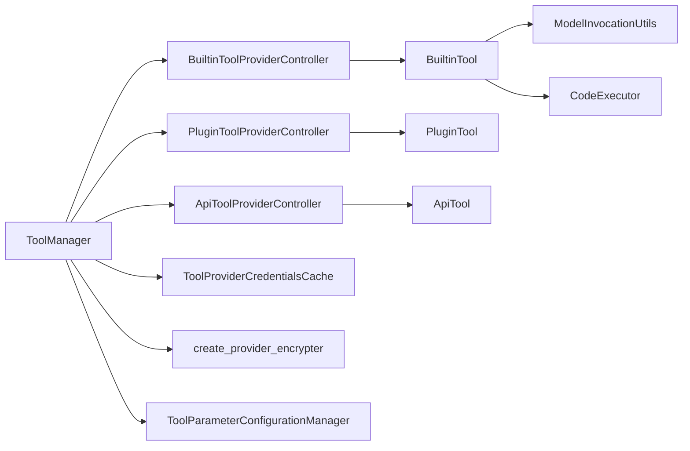

# 内置工具

<cite>
**本文档中引用的文件**  
- [builtin_tool/tool.py](file://api/core/tools/builtin_tool/tool.py)
- [builtin_tool/provider.py](file://api/core/tools/builtin_tool/provider.py)
- [builtin_tool/providers/code/code.py](file://api/core/tools/builtin_tool/providers/code/code.py)
- [builtin_tool/providers/code/tools/simple_code.py](file://api/core/tools/builtin_tool/providers/code/tools/simple_code.py)
- [builtin_tool/providers/time/time.py](file://api/core/tools/builtin_tool/providers/time/time.py)
- [builtin_tool/providers/time/tools/current_time.py](file://api/core/tools/builtin_tool/providers/time/tools/current_time.py)
- [tools_manage_service.py](file://api/services/tools/tools_manage_service.py)
- [tool_manager.py](file://api/core/tools/tool_manager.py)
</cite>

## 目录
1. [简介](#简介)
2. [项目结构](#项目结构)
3. [核心组件](#核心组件)
4. [架构概述](#架构概述)
5. [详细组件分析](#详细组件分析)
6. [依赖分析](#依赖分析)
7. [性能考虑](#性能考虑)
8. [故障排除指南](#故障排除指南)
9. [结论](#结论)

## 简介
Dify的内置工具系统为应用提供了可扩展的功能模块，支持代码执行、时间处理、音频处理等多种能力。本系统通过模块化设计，将工具提供者（Provider）与具体工具（Tool）分离，实现了灵活的注册、发现和执行机制。内置工具无需外部依赖，通过YAML配置定义接口，并由`tools_manage_service.py`统一管理生命周期。系统支持参数验证、安全沙箱执行和性能优化，是Dify工作流和智能代理功能的核心支撑。

## 项目结构
Dify的内置工具系统位于`api/core/tools/builtin_tool`目录下，采用分层结构组织代码。每个工具提供者独立成模块，包含自身的工具集合和配置文件。系统通过统一的接口抽象实现工具的动态加载与调用。

**Diagram sources**
- [builtin_tool](file://api/core/tools/builtin_tool)
- [builtin_tool/provider.py](file://api/core/tools/builtin_tool/provider.py)
- [builtin_tool/tool.py](file://api/core/tools/builtin_tool/tool.py)

**Section sources**
- [builtin_tool](file://api/core/tools/builtin_tool)
- [tool_manager.py](file://api/core/tools/tool_manager.py)

## 核心组件
内置工具系统的核心组件包括工具基类`BuiltinTool`、提供者控制器`BuiltinToolProviderController`以及工具管理器`ToolManager`。这些组件共同实现了工具的抽象、实例化和运行时管理。工具通过YAML文件声明元数据，Python文件实现具体逻辑，形成声明与实现分离的设计模式。系统支持动态加载和缓存机制，确保高性能的工具发现与调用。

**Section sources**
- [builtin_tool/tool.py](file://api/core/tools/builtin_tool/tool.py)
- [builtin_tool/provider.py](file://api/core/tools/builtin_tool/provider.py)
- [tool_manager.py](file://api/core/tools/tool_manager.py)

## 架构概述
Dify内置工具系统采用分层架构设计，实现了工具提供者与具体工具的解耦。系统通过统一的接口抽象，支持多种类型的工具集成。工具管理器负责全局工具的注册与发现，而运行时环境则确保工具在安全沙箱中执行。

**Diagram sources**
- [tool_manager.py](file://api/core/tools/tool_manager.py)
- [builtin_tool/provider.py](file://api/core/tools/builtin_tool/provider.py)
- [builtin_tool/tool.py](file://api/core/tools/builtin_tool/tool.py)

## 详细组件分析

### 工具提供者分析
工具提供者控制器负责管理一组相关工具的生命周期。每个提供者通过继承`BuiltinToolProviderController`实现具体的验证逻辑，并通过YAML配置文件声明元数据。系统在初始化时自动扫描所有提供者并注册到全局管理器中。

**Diagram sources**
- [builtin_tool/provider.py](file://api/core/tools/builtin_tool/provider.py)
- [builtin_tool/providers/code/code.py](file://api/core/tools/builtin_tool/providers/code/code.py)
- [builtin_tool/providers/time/time.py](file://api/core/tools/builtin_tool/providers/time/time.py)

**Section sources**
- [builtin_tool/provider.py](file://api/core/tools/builtin_tool/provider.py)
- [builtin_tool/providers/code/code.py](file://api/core/tools/builtin_tool/providers/code/code.py)

### 具体工具分析
具体工具实现`BuiltinTool`基类，重写`_invoke`方法定义核心逻辑。工具通过YAML文件声明参数配置，系统自动进行参数验证和类型转换。执行结果通过生成器模式返回，支持流式输出。

#### 代码工具分析
代码执行工具在安全沙箱中运行用户提供的代码片段，支持Python3和JavaScript语言。系统通过代码执行器隔离运行环境，防止恶意代码对主机造成影响。

**Diagram sources**
- [builtin_tool/providers/code/tools/simple_code.py](file://api/core/tools/builtin_tool/providers/code/tools/simple_code.py)
- [helper/code_executor.py](file://api/core/helper/code_executor.py)

**Section sources**
- [builtin_tool/providers/code/tools/simple_code.py](file://api/core/tools/builtin_tool/providers/code/tools/simple_code.py)

#### 时间工具分析
时间工具提供多种时间相关的功能，包括获取当前时间、时区转换等。工具通过参数化配置支持不同的时区和时间格式，满足国际化应用的需求。

**Diagram sources**
- [builtin_tool/providers/time/tools/current_time.py](file://api/core/tools/builtin_tool/providers/time/tools/current_time.py)

**Section sources**
- [builtin_tool/providers/time/tools/current_time.py](file://api/core/tools/builtin_tool/providers/time/tools/current_time.py)

## 依赖分析
内置工具系统依赖多个核心模块协同工作。工具管理器作为中枢组件，协调工具提供者、运行时环境和凭证管理等多个子系统。系统通过依赖注入模式实现组件间的松耦合。

**Diagram sources**
- [tool_manager.py](file://api/core/tools/tool_manager.py)
- [builtin_tool/provider.py](file://api/core/tools/builtin_tool/provider.py)
- [builtin_tool/tool.py](file://api/core/tools/builtin_tool/tool.py)

**Section sources**
- [tool_manager.py](file://api/core/tools/tool_manager.py)
- [helper/code_executor.py](file://api/core/helper/code_executor.py)
- [utils/model_invocation_utils.py](file://api/core/tools/utils/model_invocation_utils.py)

## 性能考虑
内置工具系统通过多种机制优化性能表现。首先，系统采用懒加载和缓存策略，避免重复解析YAML配置文件。其次，工具实例在初始化后被缓存，减少对象创建开销。对于频繁调用的工具，系统支持连接池和会话复用。此外，代码执行工具通过沙箱预热机制减少启动延迟。建议在生产环境中对高频工具进行性能监控，并根据实际负载调整缓存策略和资源配额。

## 故障排除指南
当内置工具出现异常时，应首先检查工具配置文件的语法正确性。对于需要凭证的工具，验证凭证格式和有效期。代码执行工具的常见问题包括语法错误和超时限制，建议通过调试模式获取详细的错误堆栈。时间工具的时区配置错误可能导致输出异常，应确保时区名称符合IANA标准。系统日志记录了所有工具调用的详细信息，可通过日志分析定位问题根源。对于复杂的集成问题，建议使用单元测试验证工具的独立功能。

**Section sources**
- [builtin_tool/tool.py](file://api/core/tools/builtin_tool/tool.py)
- [builtin_tool/provider.py](file://api/core/tools/builtin_tool/provider.py)
- [errors.py](file://api/core/tools/errors.py)

## 结论
Dify的内置工具系统通过模块化设计和分层架构，实现了功能丰富且安全可靠的工具执行环境。系统支持多种工具类型，具有良好的扩展性和维护性。通过统一的接口抽象和运行时管理，开发者可以轻松集成新的功能模块。未来可进一步优化性能监控和资源隔离机制，提升系统的稳定性和安全性。