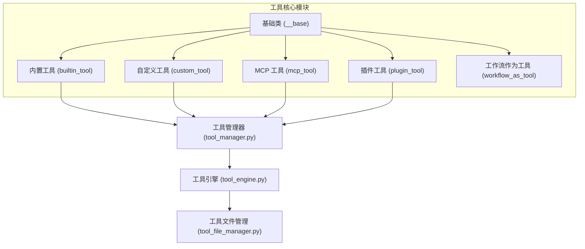
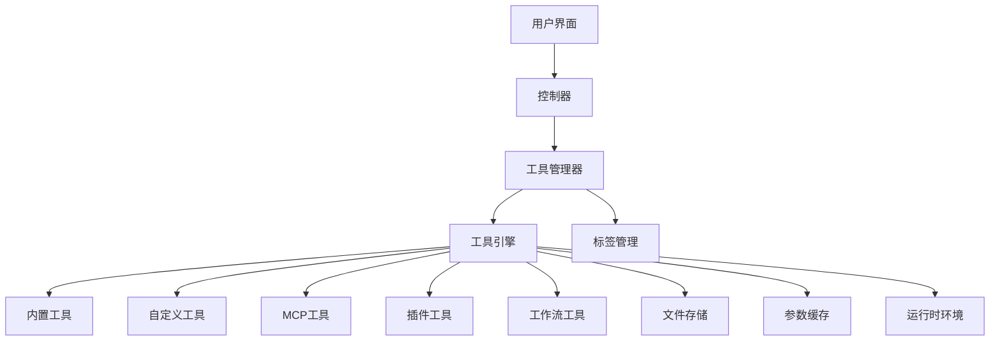
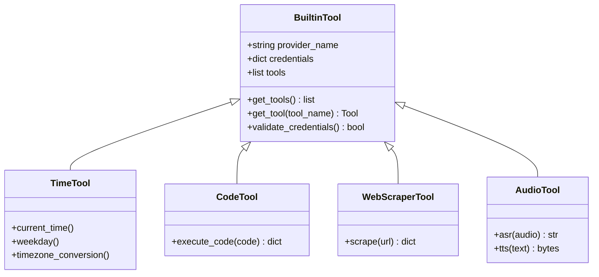
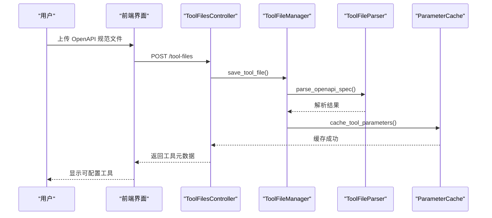
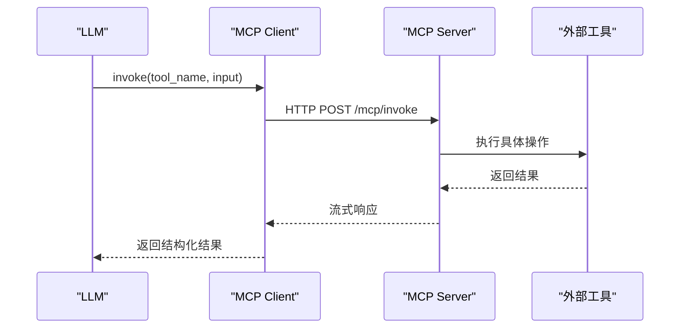
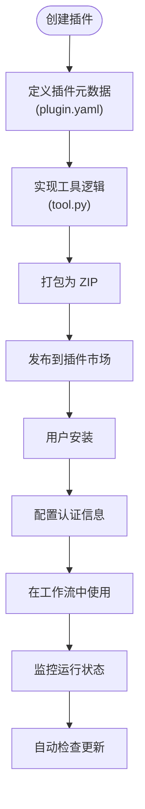
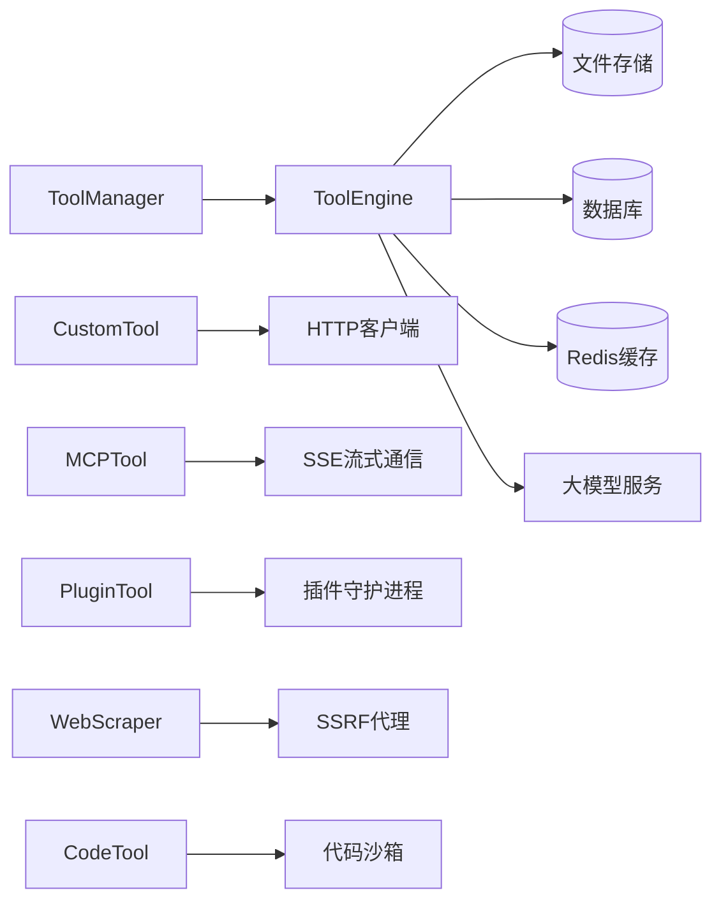

# 工具开发指南

<cite>
**本文档中引用的文件**  
- [tool.py](file://api/core/tools/__base/tool.py)
- [tool_provider.py](file://api/core/tools/__base/tool_provider.py)
- [tool_runtime.py](file://api/core/tools/__base/tool_runtime.py)
- [builtin_tool.py](file://api/core/tools/builtin_tool/tool.py)
- [custom_tool.py](file://api/core/tools/custom_tool/tool.py)
- [mcp_tool.py](file://api/core/tools/mcp_tool/tool.py)
- [plugin_tool.py](file://api/core/tools/plugin_tool/tool.py)
- [tool_manager.py](file://api/core/tools/tool_manager.py)
- [tool_engine.py](file://api/core/tools/tool_engine.py)
- [tool_file_manager.py](file://api/core/tools/tool_file_manager.py)
- [tool_label_manager.py](file://api/core/tools/tool_label_manager.py)
- [mcp.py](file://api/controllers/mcp/mcp.py)
- [plugin.py](file://api/core/plugin/entities/plugin.py)
- [tool_entities.py](file://api/core/tools/entities/tool_entities.py)
- [tool_bundle.py](file://api/core/tools/entities/tool_bundle.py)
- [tool_files.py](file://api/controllers/files/tool_files.py)
- [tool_file_parser.py](file://api/core/file/tool_file_parser.py)
- [tool_parameter_cache.py](file://api/core/helper/tool_parameter_cache.py)
- [tools_transform_service.py](file://api/services/tools/tools_transform_service.py)
- [docker-compose.yaml](file://docker/docker-compose.yaml)
</cite>

## 目录
1. [简介](#简介)
2. [项目结构](#项目结构)
3. [核心组件](#核心组件)
4. [架构概述](#架构概述)
5. [详细组件分析](#详细组件分析)
6. [依赖分析](#依赖分析)
7. [性能考虑](#性能考虑)
8. [故障排除指南](#故障排除指南)
9. [结论](#结论)

## 简介
Dify 是一个支持多种工具类型的低代码开发平台，允许开发者通过内置、自定义、MCP（Model Control Protocol）和插件四种方式扩展其功能。本指南系统性地介绍这四种工具类型的开发流程、最佳实践、元数据定义、参数验证、错误处理和性能监控机制。同时涵盖从开发环境搭建、调试测试到部署上线的完整工作流，并提供常见问题解决方案与安全优化建议，确保工具的稳定性与可靠性。

## 项目结构
Dify 的工具系统主要分布在 `api/core/tools` 目录下，采用模块化设计，分别对应四种工具类型：内置工具、自定义工具、MCP 工具和插件工具。每种工具类型都有独立的实现模块，并通过统一的基类和接口进行抽象管理。

**Diagram sources**
- [builtin_tool](file://api/core/tools/builtin_tool/tool.py)
- [custom_tool](file://api/core/tools/custom_tool/tool.py)
- [mcp_tool](file://api/core/tools/mcp_tool/tool.py)
- [plugin_tool](file://api/core/tools/plugin_tool/tool.py)
- [tool_manager.py](file://api/core/tools/tool_manager.py)
- [tool_engine.py](file://api/core/tools/tool_engine.py)

**Section sources**
- [tool.py](file://api/core/tools/__base/tool.py)
- [tool_provider.py](file://api/core/tools/__base/tool_provider.py)
- [tool_runtime.py](file://api/core/tools/__base/tool_runtime.py)

## 核心组件
Dify 的工具系统由多个核心组件构成，包括工具抽象基类、工具管理器、工具引擎、文件管理器和标签管理器。这些组件共同实现了工具的注册、调用、执行、参数处理和生命周期管理。

**Section sources**
- [tool.py](file://api/core/tools/__base/tool.py)
- [tool_manager.py](file://api/core/tools/tool_manager.py)
- [tool_engine.py](file://api/core/tools/tool_engine.py)
- [tool_file_manager.py](file://api/core/tools/tool_file_manager.py)
- [tool_label_manager.py](file://api/core/tools/tool_label_manager.py)

## 架构概述
Dify 的工具架构采用分层设计，上层为用户界面和控制器，中层为工具管理与调度，底层为具体工具实现和运行时环境。工具通过统一接口接入系统，支持动态加载、参数校验、安全沙箱执行和结果返回。

**Diagram sources**
- [tool_manager.py](file://api/core/tools/tool_manager.py)
- [tool_engine.py](file://api/core/tools/tool_engine.py)
- [tool_file_manager.py](file://api/core/tools/tool_file_manager.py)
- [tool_label_manager.py](file://api/core/tools/tool_label_manager.py)

## 详细组件分析

### 内置工具分析
内置工具是 Dify 预置的功能模块，如时间处理、代码执行、网页抓取等，无需额外配置即可使用。

**Diagram sources**
- [builtin_tool.py](file://api/core/tools/builtin_tool/tool.py)
- [providers/time/time.py](file://api/core/tools/builtin_tool/providers/time/time.py)
- [providers/code/code.py](file://api/core/tools/builtin_tool/providers/code/code.py)
- [providers/webscraper/webscraper.py](file://api/core/tools/builtin_tool/providers/webscraper/webscraper.py)
- [providers/audio/audio.py](file://api/core/tools/builtin_tool/providers/audio/audio.py)

**Section sources**
- [builtin_tool.py](file://api/core/tools/builtin_tool/tool.py)
- [tool_entities.py](file://api/core/tools/entities/tool_entities.py)

### 自定义工具分析
自定义工具允许用户通过 API 接口定义外部服务集成，支持 OAuth 认证、参数映射和响应解析。

**Diagram sources**
- [tool_files.py](file://api/controllers/files/tool_files.py)
- [tool_file_manager.py](file://api/core/tools/tool_file_manager.py)
- [tool_file_parser.py](file://api/core/file/tool_file_parser.py)
- [tool_parameter_cache.py](file://api/core/helper/tool_parameter_cache.py)

**Section sources**
- [custom_tool.py](file://api/core/tools/custom_tool/tool.py)
- [tool_file_parser.py](file://api/core/file/tool_file_parser.py)

### MCP 工具分析
MCP 工具基于 Model Control Protocol 协议实现模型与外部系统的交互，支持流式响应和会话状态管理。

**Diagram sources**
- [mcp.py](file://api/controllers/mcp/mcp.py)
- [mcp_client.py](file://api/core/mcp/mcp_client.py)
- [client_session.py](file://api/core/mcp/session/client_session.py)

**Section sources**
- [mcp_tool.py](file://api/core/tools/mcp_tool/tool.py)
- [mcp.py](file://api/controllers/mcp/mcp.py)

### 插件工具分析
插件工具是独立部署的微服务，通过插件市场进行分发和管理，支持自动升级和权限控制。

**Diagram sources**
- [plugin.py](file://api/core/plugin/entities/plugin.py)
- [plugin_service.py](file://api/services/plugin/plugin_service.py)
- [plugin_auto_upgrade_service.py](file://api/services/plugin/plugin_auto_upgrade_service.py)

**Section sources**
- [plugin_tool.py](file://api/core/tools/plugin_tool/tool.py)
- [plugin.py](file://api/core/plugin/entities/plugin.py)

## 依赖分析
Dify 工具系统依赖多个内部模块和外部服务，形成复杂的调用链路。

**Diagram sources**
- [tool_manager.py](file://api/core/tools/tool_manager.py)
- [tool_engine.py](file://api/core/tools/tool_engine.py)
- [tool_file_manager.py](file://api/core/tools/tool_file_manager.py)
- [docker-compose.yaml](file://docker/docker-compose.yaml)

**Section sources**
- [tool_engine.py](file://api/core/tools/tool_engine.py)
- [tool_file_manager.py](file://api/core/tools/tool_file_manager.py)

## 性能考虑
- **参数缓存**：使用 Redis 缓存工具参数以减少重复解析开销
- **文件存储**：支持多种对象存储后端（S3、OSS、COS 等）提升 I/O 性能
- **异步执行**：长耗时工具通过 Celery 任务队列异步执行
- **连接池**：数据库和缓存使用连接池避免频繁建立连接
- **流式传输**：MCP 工具支持 SSE 流式响应降低延迟

## 故障排除指南
- **工具不显示**：检查 `tool_label_manager` 是否正确注册标签
- **参数验证失败**：确认 `tool_parameter_cache` 中缓存的参数结构正确
- **调用超时**：检查网络策略、SSRF 代理配置和目标服务可用性
- **认证错误**：验证 OAuth 配置或 API Key 是否正确
- **沙箱限制**：确认代码工具的执行环境权限设置

**Section sources**
- [errors.py](file://api/core/tools/errors.py)
- [tool_label_manager.py](file://api/core/tools/tool_label_manager.py)
- [tool_parameter_cache.py](file://api/core/helper/tool_parameter_cache.py)

## 结论
Dify 提供了完整的工具开发体系，支持从简单内置功能到复杂插件系统的全方位扩展。通过标准化的元数据定义、统一的调用接口和健全的运行时环境，开发者可以高效构建安全可靠的 AI 工具。建议遵循最佳实践进行开发，并充分利用平台提供的调试、监控和部署能力。