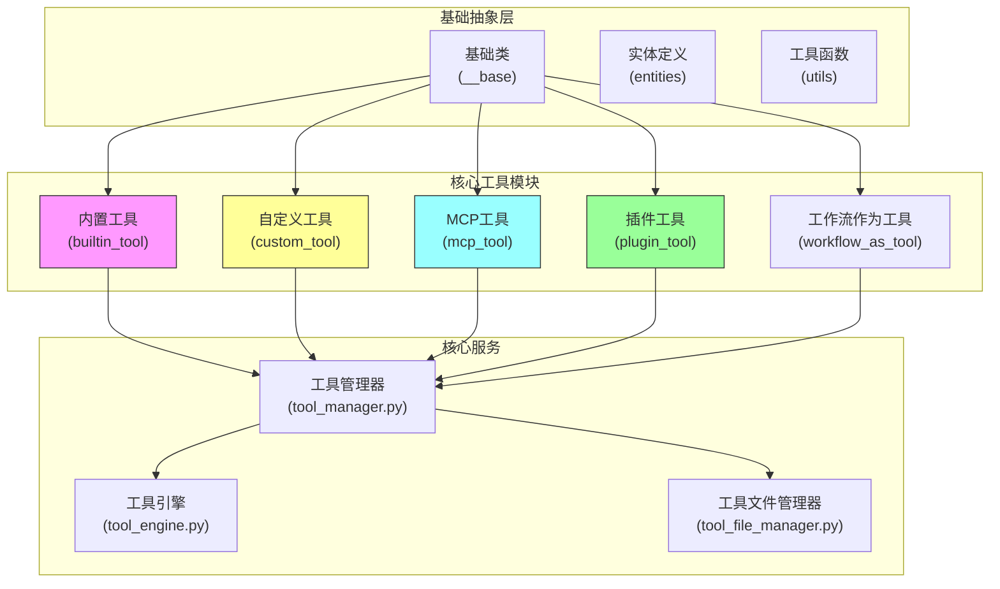
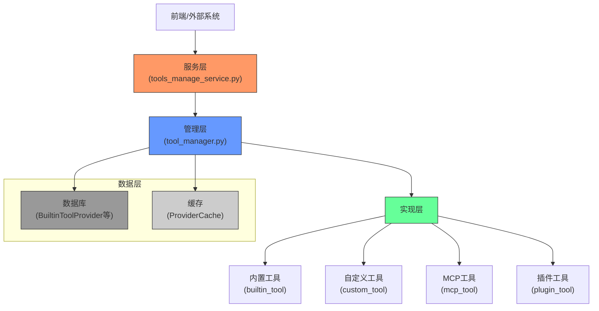
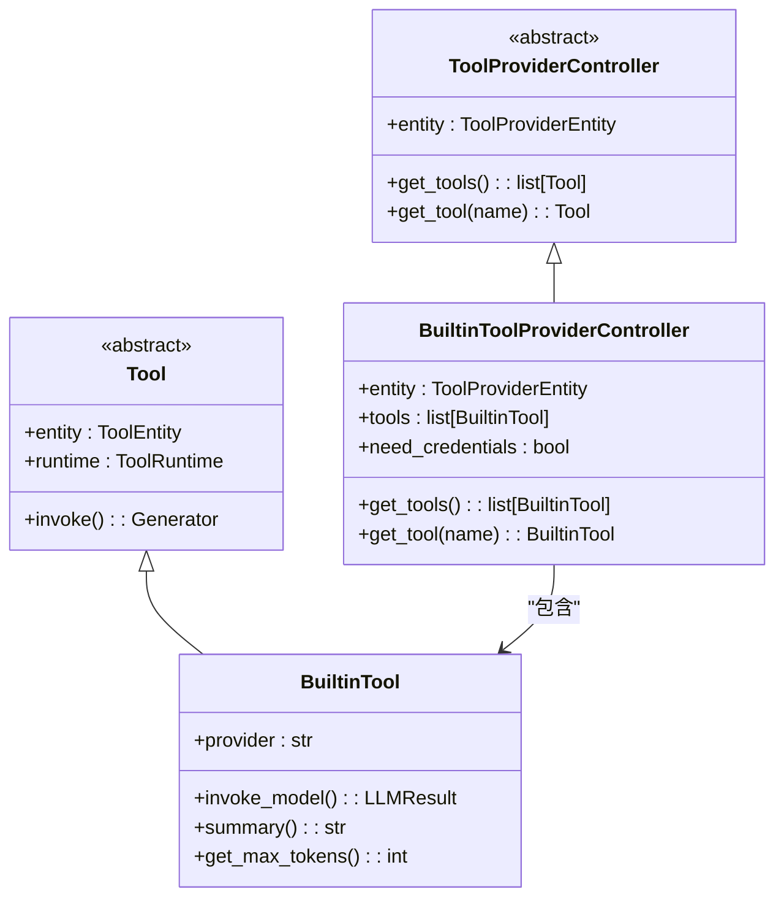
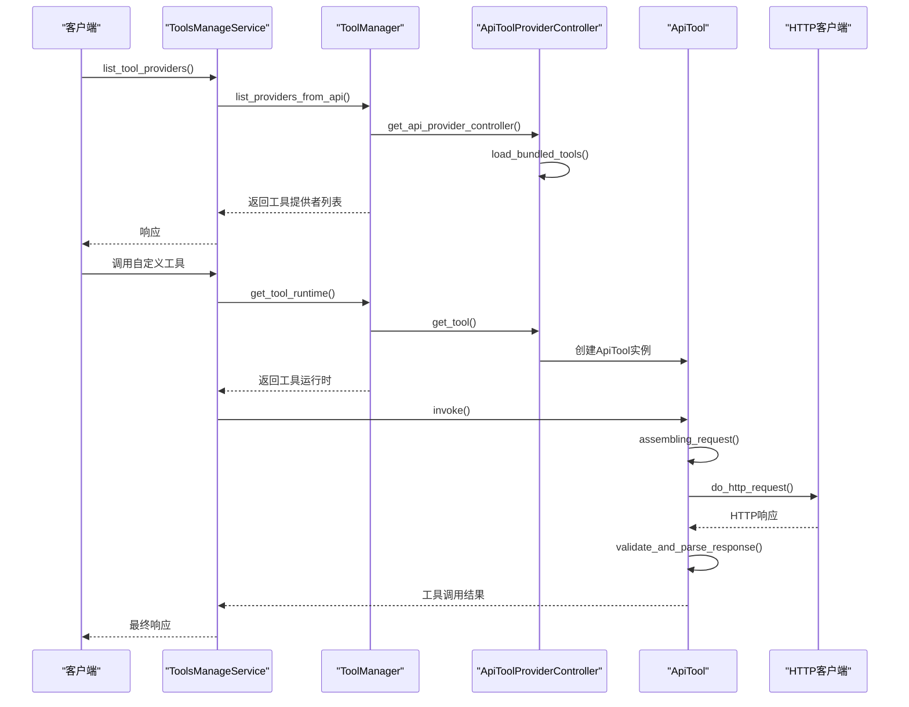
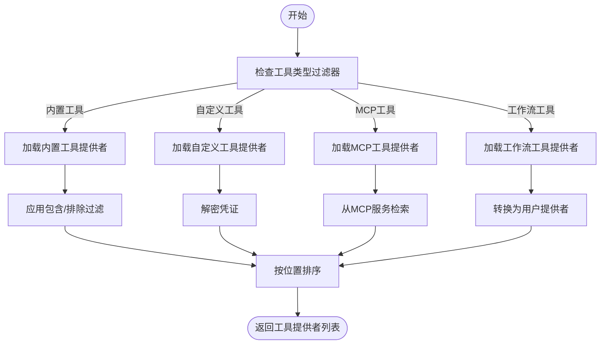
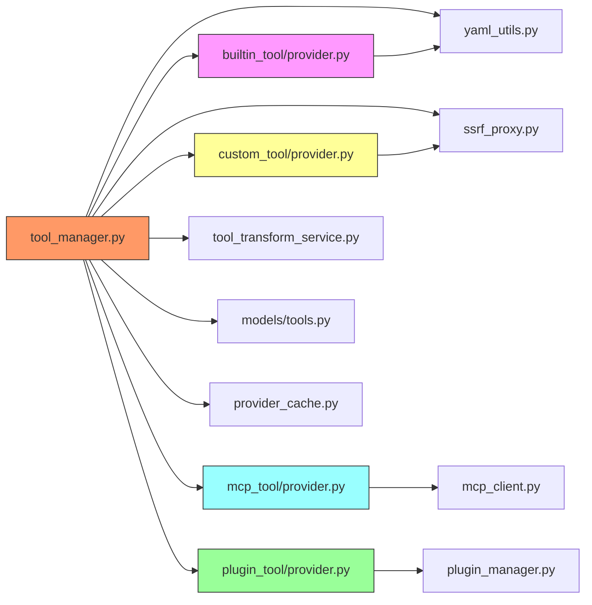

# 工具管理

<cite>
**本文档中引用的文件**  
- [tools_manage_service.py](file://api\services\tools\tools_manage_service.py)
- [tool_manager.py](file://api\core\tools\tool_manager.py)
- [builtin_tool\provider.py](file://api\core\tools\builtin_tool\provider.py)
- [custom_tool\provider.py](file://api\core\tools\custom_tool\provider.py)
- [mcp_tool\provider.py](file://api\core\tools\mcp_tool\provider.py)
- [plugin_tool\provider.py](file://api\core\tools\plugin_tool\provider.py)
- [builtin_tool\tool.py](file://api\core\tools\builtin_tool\tool.py)
- [custom_tool\tool.py](file://api\core\tools\custom_tool\tool.py)
</cite>

## 目录
1. [简介](#简介)
2. [项目结构](#项目结构)
3. [核心组件](#核心组件)
4. [架构概述](#架构概述)
5. [详细组件分析](#详细组件分析)
6. [依赖分析](#依赖分析)
7. [性能考虑](#性能考虑)
8. [故障排除指南](#故障排除指南)
9. [结论](#结论)

## 简介
本文档全面介绍了Dify Agent工具管理系统的架构与实现。系统支持四种工具类型：内置工具（builtin_tool）、自定义工具（custom_tool）、MCP工具（mcp_tool）和插件工具（plugin_tool）。`tools_manage_service.py`负责工具的注册、发现和调用。文档详细说明了工具的元数据定义、参数验证和执行沙箱机制，并提供了从零开始创建自定义工具的分步教程，包括定义工具接口、实现业务逻辑和在前端注册。同时，文档涵盖了工具权限控制、错误处理和性能监控的最佳实践。

## 项目结构
Dify工具管理系统采用模块化设计，核心工具逻辑位于`api/core/tools`目录下。该系统通过分层架构实现了工具的抽象、管理和执行，确保了高内聚低耦合的设计原则。

**图源**
- [builtin_tool](file://api\core\tools\builtin_tool)
- [custom_tool](file://api\core\tools\custom_tool)
- [mcp_tool](file://api\core\tools\mcp_tool)
- [plugin_tool](file://api\core\tools\plugin_tool)
- [tool_manager.py](file://api\core\tools\tool_manager.py)

**本节来源**
- [builtin_tool](file://api\core\tools\builtin_tool)
- [custom_tool](file://api\core\tools\custom_tool)
- [mcp_tool](file://api\core\tools\mcp_tool)
- [plugin_tool](file://api\core\tools\plugin_tool)

## 核心组件
Dify工具管理系统的核心由`tool_manager.py`驱动，它作为中央协调器管理所有工具类型的生命周期。系统通过`ToolProviderController`抽象类定义了统一的工具提供者接口，确保了不同工具类型的一致性。`Tool`基类提供了工具执行的通用框架，而具体的工具类型（如`BuiltinTool`、`ApiTool`）则实现了特定的业务逻辑。`ToolRuntime`类负责管理工具执行时的上下文，包括租户ID、凭证和调用来源等关键信息。

**本节来源**
- [tool_manager.py](file://api\core\tools\tool_manager.py#L0-L1022)
- [__base/tool.py](file://api\core\tools\__base\tool.py)
- [__base/tool_provider.py](file://api\core\tools\__base\tool_provider.py)

## 架构概述
Dify工具管理系统的架构遵循分层设计原则，从上至下分为服务层、管理层和实现层。服务层（如`tools_manage_service.py`）为外部提供API接口；管理层（`tool_manager.py`）负责工具的注册、发现和调用协调；实现层则包含了四种具体工具类型的实现。

**图源**
- [tools_manage_service.py](file://api\services\tools\tools_manage_service.py#L0-L27)
- [tool_manager.py](file://api\core\tools\tool_manager.py#L0-L1022)
- [models/tools.py](file://api\models\tools.py)

## 详细组件分析

### 工具类型架构分析
Dify系统支持四种主要工具类型，每种类型都有其独特的实现方式和使用场景。

#### 内置工具类图

**图源**
- [builtin_tool/provider.py](file://api\core\tools\builtin_tool\provider.py#L0-L221)
- [builtin_tool/tool.py](file://api\core\tools\builtin_tool\tool.py#L0-L148)

#### 自定义工具序列图

**图源**
- [tools_manage_service.py](file://api\services\tools\tools_manage_service.py#L0-L27)
- [tool_manager.py](file://api\core\tools\tool_manager.py#L0-L1022)
- [custom_tool/provider.py](file://api\core\tools\custom_tool\provider.py#L0-L208)
- [custom_tool/tool.py](file://api\core\tools\custom_tool\tool.py#L0-L404)

### 工具注册与发现流程
工具的注册与发现是系统的核心功能，`ToolManager`类通过静态方法`list_providers_from_api`实现了这一过程。该流程首先根据过滤器确定要查询的工具类型，然后从数据库和内存缓存中收集相应类型的工具提供者，并最终进行排序和返回。

**图源**
- [tool_manager.py](file://api\core\tools\tool_manager.py#L500-L600)

**本节来源**
- [tool_manager.py](file://api\core\tools\tool_manager.py#L500-L600)

## 依赖分析
Dify工具管理系统具有清晰的依赖关系，确保了模块间的松耦合。核心依赖包括数据库模型、凭证缓存、YAML解析器和HTTP代理。

**图源**
- [tool_manager.py](file://api\core\tools\tool_manager.py#L0-L1022)
- [builtin_tool/provider.py](file://api\core\tools\builtin_tool\provider.py#L0-L221)
- [custom_tool/provider.py](file://api\core\tools\custom_tool\provider.py#L0-L208)
- [mcp_tool/provider.py](file://api\core\tools\mcp_tool\provider.py#L0-L148)
- [plugin_tool/provider.py](file://api\core\tools\plugin_tool\provider.py#L0-L79)

**本节来源**
- [tool_manager.py](file://api\core\tools\tool_manager.py#L0-L1022)
- [models/tools.py](file://api\models\tools.py)

## 性能考虑
虽然本节不分析具体文件，但系统在设计时已考虑了多项性能优化措施。例如，`ToolManager`使用了内存缓存（`_hardcoded_providers`）来避免重复加载内置工具提供者，显著减少了I/O开销。同时，系统通过`ProviderCache`机制对凭证进行缓存，减少了数据库查询次数。对于HTTP请求，系统使用了SSRF代理和连接池来提高网络性能。此外，工具元数据的批量加载和排序也优化了API响应时间。

## 故障排除指南
当遇到工具管理问题时，应首先检查`tool_manager.py`中的日志输出。常见的错误包括工具提供者未找到（ToolProviderNotFoundError）、凭证验证失败（ToolProviderCredentialValidationError）和参数验证错误（ToolParameterValidationError）。对于自定义工具，应确保OpenAPI规范格式正确，并且HTTP端点可访问。对于需要凭证的工具，应检查凭证是否已正确配置和加密。调试时，可以使用系统的调试模式（InvokeFrom.DEBUGGER）来获取更详细的执行信息。

**本节来源**
- [errors.py](file://api\core\tools\errors.py)
- [tool_manager.py](file://api\core\tools\tool_manager.py#L0-L1022)
- [custom_tool/tool.py](file://api\core\tools\custom_tool\tool.py#L0-L404)

## 结论
Dify Agent工具管理系统通过精心设计的分层架构和模块化实现，提供了一个强大而灵活的工具管理框架。系统支持多种工具类型，满足了从简单内置功能到复杂外部服务集成的各种需求。通过统一的抽象接口和运行时管理，系统确保了工具调用的一致性和安全性。未来的发展方向可以包括更智能的工具发现机制、更细粒度的权限控制和更完善的性能监控体系。