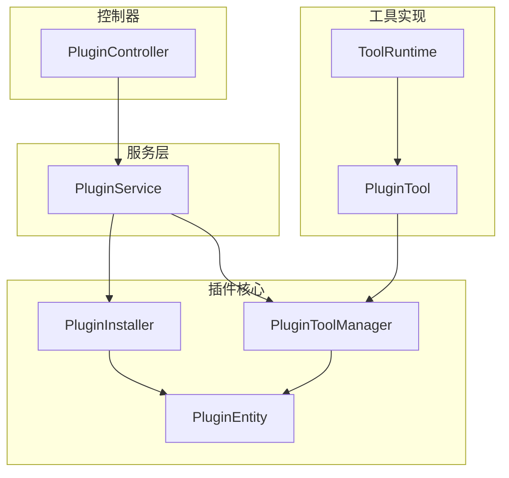
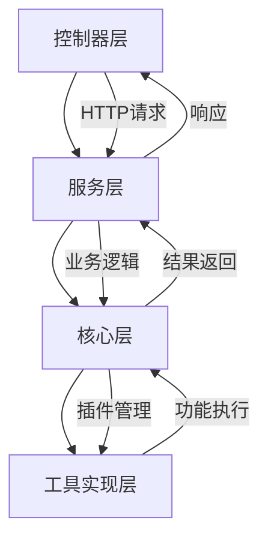
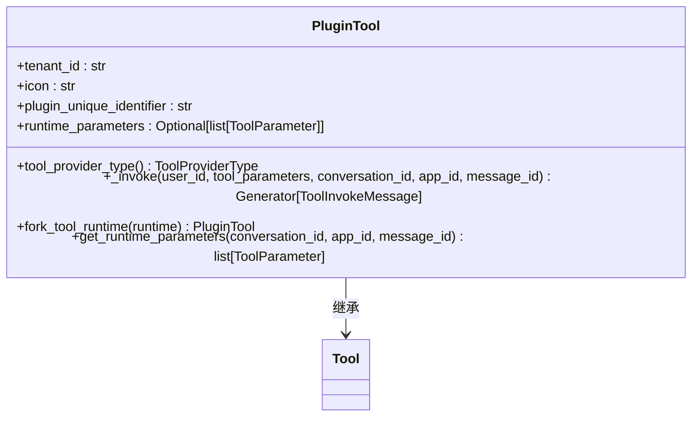
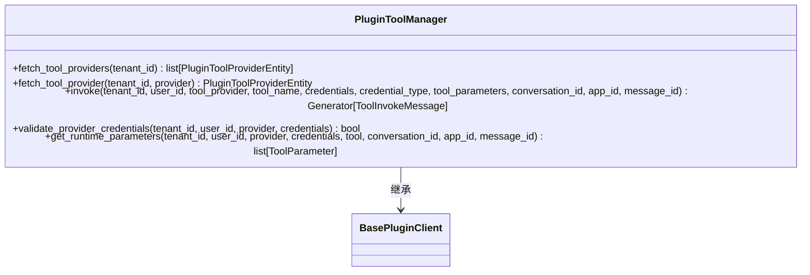
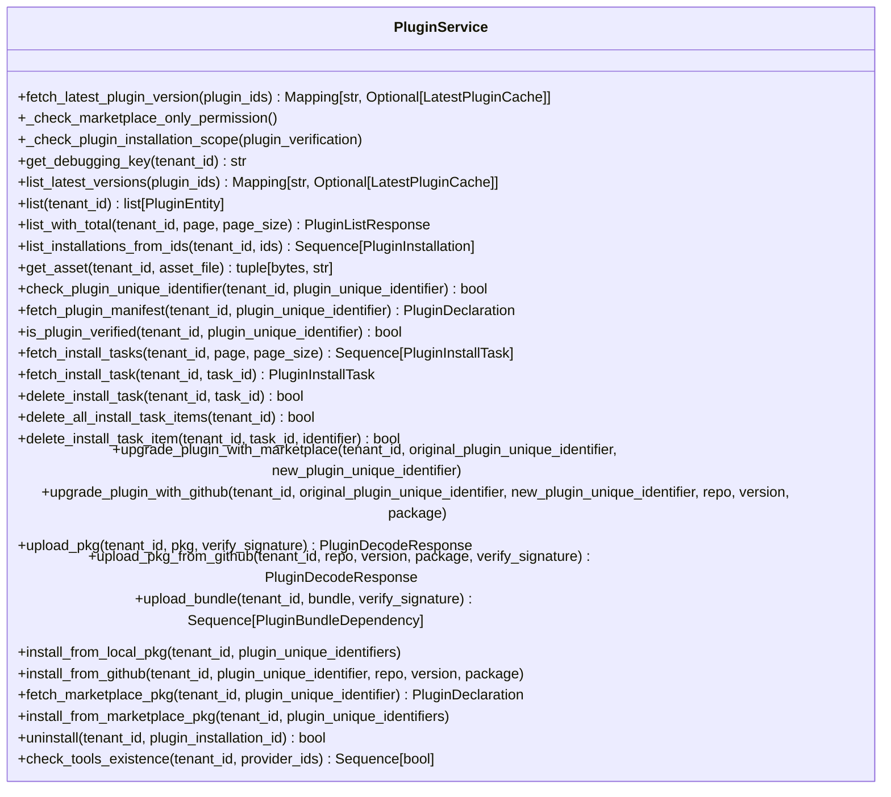
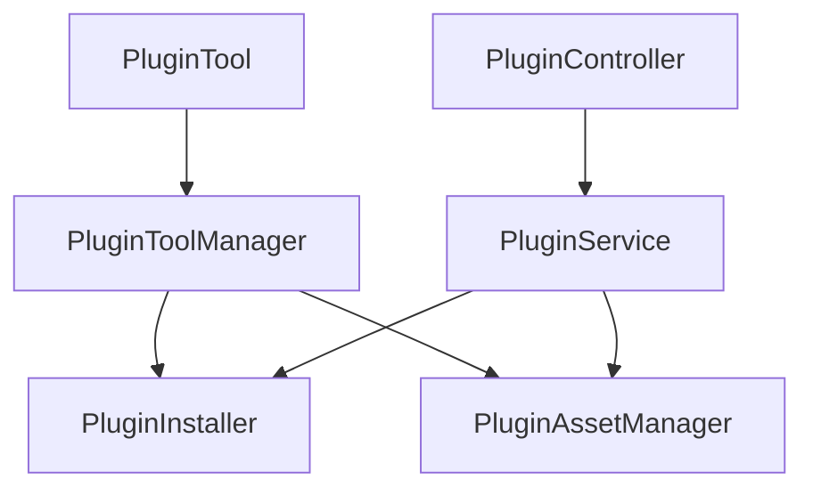

# 插件工具

<cite>
**本文档中引用的文件**  
- [plugin_service.py](file://api/services/plugin/plugin_service.py)
- [tool.py](file://api/core/tools/plugin_tool/tool.py)
- [tool.py](file://api/core/plugin/impl/tool.py)
- [plugin.py](file://api/core/plugin/entities/plugin.py)
- [plugin.py](file://api/controllers/console/workspace/plugin.py)
</cite>

## 目录
1. [介绍](#介绍)
2. [项目结构](#项目结构)
3. [核心组件](#核心组件)
4. [架构概述](#架构概述)
5. [详细组件分析](#详细组件分析)
6. [依赖分析](#依赖分析)
7. [性能考虑](#性能考虑)
8. [故障排除指南](#故障排除指南)
9. [结论](#结论)
10. [附录](#附录)（如有必要）

## 介绍
本文档详细说明了插件工具的架构和实现，重点介绍`plugin_tool`如何与`core/plugin`系统集成。文档涵盖了插件的加载、初始化和生命周期管理，以及插件工具的配置方式、权限控制和安全沙箱机制。同时，文档解释了`plugin_service.py`在插件工具管理中的作用，包括插件的注册、发现和调用流程，并提供开发和部署插件工具的最佳实践。

## 项目结构
插件工具系统主要分布在`api/core/plugin`和`api/core/tools`目录下。`api/core/plugin`包含插件的核心实体、安装器和管理器，而`api/core/tools`包含具体的工具实现。`api/services/plugin`目录包含插件服务的业务逻辑，`api/controllers/console/workspace`包含插件相关的API控制器。

**图示来源**
- [plugin.py](file://api/core/plugin/entities/plugin.py)
- [tool.py](file://api/core/plugin/impl/tool.py)
- [tool.py](file://api/core/tools/plugin_tool/tool.py)

**章节来源**
- [plugin.py](file://api/core/plugin/entities/plugin.py#L1-L241)
- [tool.py](file://api/core/plugin/impl/tool.py#L1-L192)

## 核心组件
插件工具系统的核心组件包括`PluginTool`、`PluginToolManager`和`PluginService`。`PluginTool`是插件工具的具体实现，负责调用插件提供的功能。`PluginToolManager`是插件工具的管理器，负责与插件守护进程通信。`PluginService`是插件服务的业务逻辑层，负责处理插件的安装、升级和卸载等操作。

**章节来源**
- [tool.py](file://api/core/tools/plugin_tool/tool.py#L1-L85)
- [tool.py](file://api/core/plugin/impl/tool.py#L1-L192)
- [plugin_service.py](file://api/services/plugin/plugin_service.py#L1-L494)

## 架构概述
插件工具系统采用分层架构，从上到下分为控制器层、服务层、核心层和工具实现层。控制器层处理HTTP请求，服务层处理业务逻辑，核心层提供插件管理功能，工具实现层具体执行插件功能。

**图示来源**
- [plugin.py](file://api/controllers/console/workspace/plugin.py)
- [plugin_service.py](file://api/services/plugin/plugin_service.py)
- [tool.py](file://api/core/plugin/impl/tool.py)
- [tool.py](file://api/core/tools/plugin_tool/tool.py)

## 详细组件分析

### PluginTool分析
`PluginTool`是插件工具的具体实现类，继承自`Tool`基类。它负责调用插件提供的功能，并处理参数转换和结果返回。

**图示来源**
- [tool.py](file://api/core/tools/plugin_tool/tool.py#L1-L85)

**章节来源**
- [tool.py](file://api/core/tools/plugin_tool/tool.py#L1-L85)

### PluginToolManager分析
`PluginToolManager`是插件工具的管理器，负责与插件守护进程通信，执行工具调用、凭证验证和运行时参数获取等操作。

**图示来源**
- [tool.py](file://api/core/plugin/impl/tool.py#L1-L192)

**章节来源**
- [tool.py](file://api/core/plugin/impl/tool.py#L1-L192)

### PluginService分析
`PluginService`是插件服务的业务逻辑层，负责处理插件的安装、升级、卸载和权限管理等操作。

**图示来源**
- [plugin_service.py](file://api/services/plugin/plugin_service.py#L1-L494)

**章节来源**
- [plugin_service.py](file://api/services/plugin/plugin_service.py#L1-L494)

## 依赖分析
插件工具系统依赖于`core/plugin`核心模块、`core/tools`工具模块和`services`服务模块。`PluginTool`依赖于`PluginToolManager`进行插件调用，`PluginService`依赖于`PluginInstaller`和`PluginAssetManager`进行插件管理。

**图示来源**
- [tool.py](file://api/core/tools/plugin_tool/tool.py)
- [tool.py](file://api/core/plugin/impl/tool.py)
- [plugin_service.py](file://api/services/plugin/plugin_service.py)
- [plugin.py](file://api/controllers/console/workspace/plugin.py)

**章节来源**
- [tool.py](file://api/core/tools/plugin_tool/tool.py#L1-L85)
- [tool.py](file://api/core/plugin/impl/tool.py#L1-L192)
- [plugin_service.py](file://api/services/plugin/plugin_service.py#L1-L494)
- [plugin.py](file://api/controllers/console/workspace/plugin.py#L1-L675)

## 性能考虑
插件工具系统在性能方面主要考虑以下几点：
1. 使用Redis缓存最新插件版本信息，减少对远程仓库的频繁访问。
2. 限制插件包和捆绑包的大小，防止过大的文件影响系统性能。
3. 使用流式响应处理工具调用结果，避免内存占用过高。
4. 对插件调用进行超时控制，防止长时间运行的插件影响系统稳定性。

## 故障排除指南
当插件工具出现问题时，可以按照以下步骤进行排查：
1. 检查插件是否正确安装和激活。
2. 检查插件的配置参数是否正确。
3. 检查插件的权限设置是否满足要求。
4. 查看系统日志，寻找相关错误信息。
5. 使用调试模式运行插件，获取更详细的调试信息。

**章节来源**
- [plugin_service.py](file://api/services/plugin/plugin_service.py#L1-L494)
- [tool.py](file://api/core/plugin/impl/tool.py#L1-L192)

## 结论
插件工具系统通过分层架构实现了插件的加载、初始化和生命周期管理。系统提供了完善的配置方式、权限控制和安全沙箱机制，确保插件的安全性和稳定性。`plugin_service.py`在插件工具管理中扮演着核心角色，负责插件的注册、发现和调用流程。开发和部署插件工具时，应遵循最佳实践，包括版本管理和依赖处理，以确保系统的可靠性和可维护性。