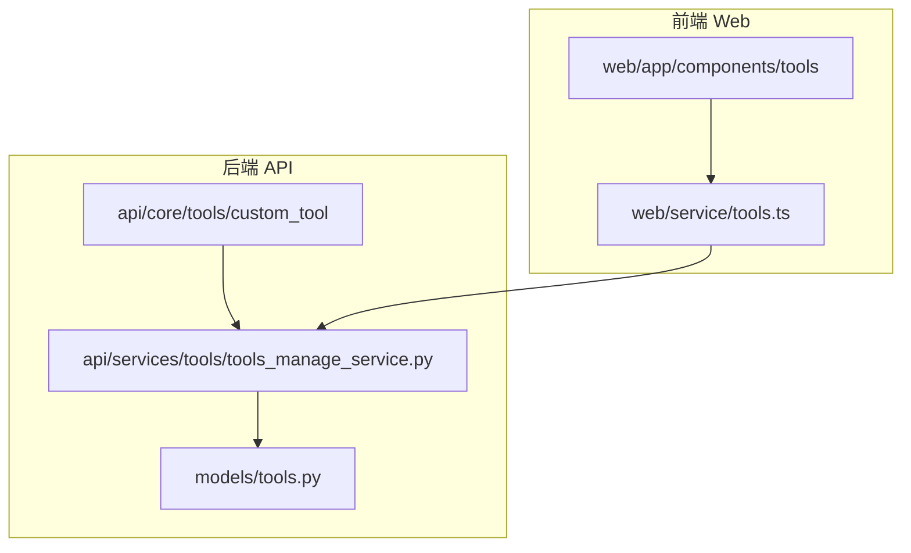
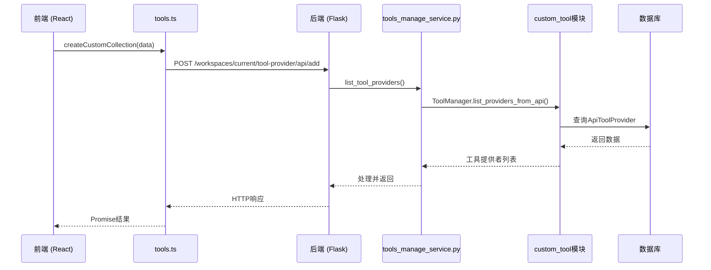
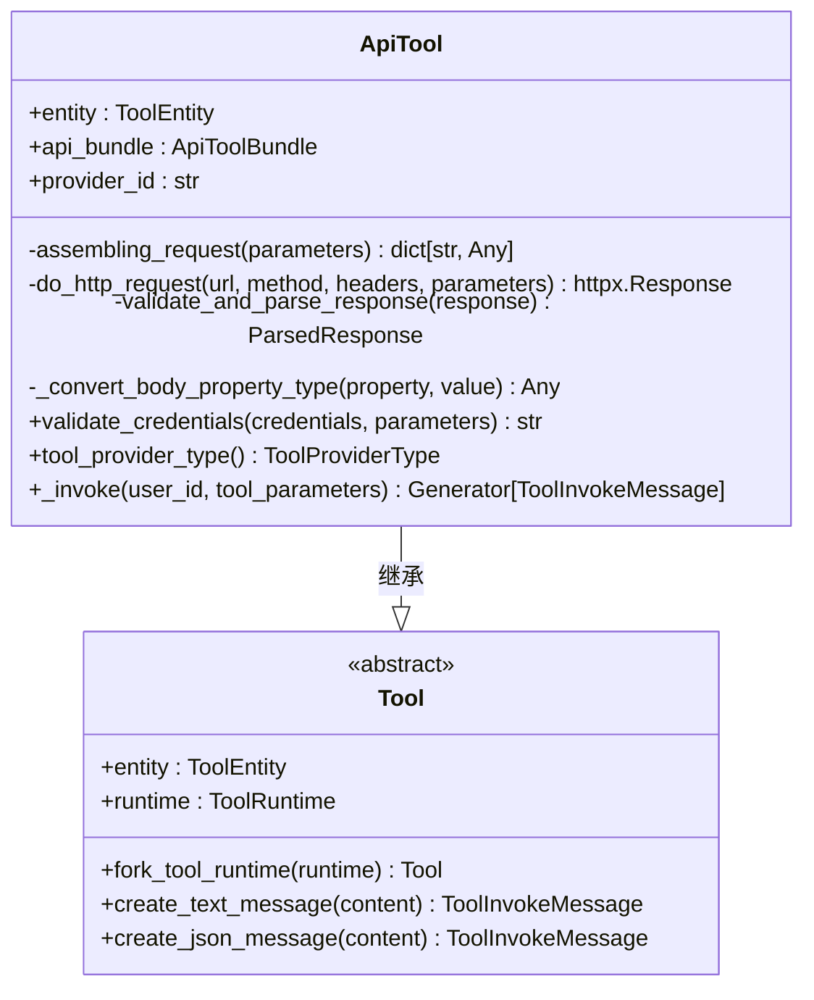
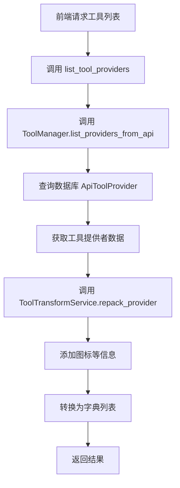
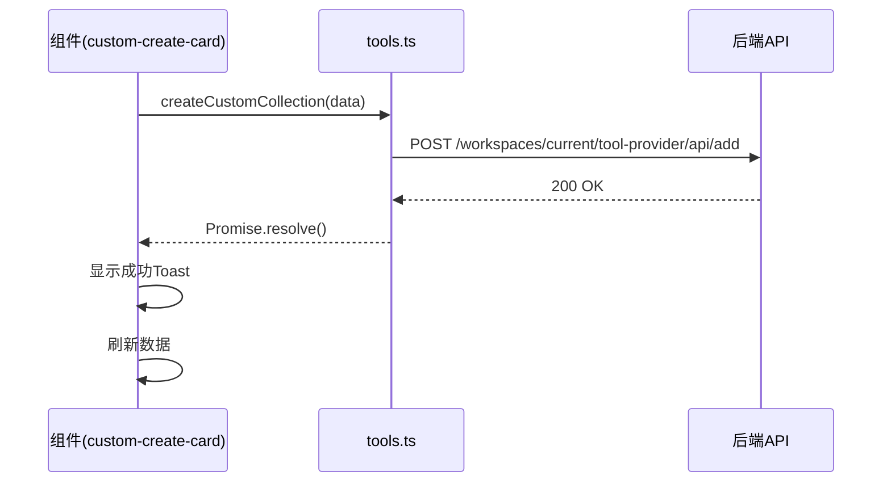
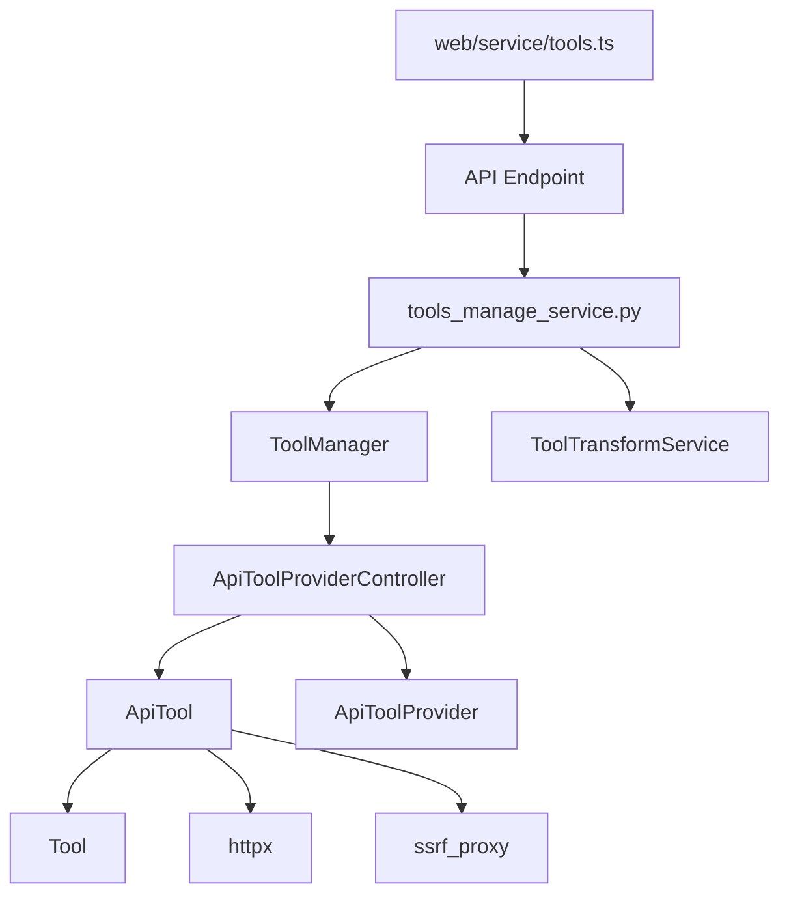

# 自定义工具

<cite>
**本文档中引用的文件**  
- [tools_manage_service.py](file://api/services/tools/tools_manage_service.py)
- [tool.py](file://api/core/tools/custom_tool/tool.py)
- [provider.py](file://api/core/tools/custom_tool/provider.py)
- [tools.ts](file://web/service/tools.ts)
</cite>

## 目录
1. [简介](#简介)
2. [项目结构](#项目结构)
3. [核心组件](#核心组件)
4. [架构概述](#架构概述)
5. [详细组件分析](#详细组件分析)
6. [依赖分析](#依赖分析)
7. [性能考虑](#性能考虑)
8. [故障排除指南](#故障排除指南)
9. [结论](#结论)

## 简介
本文档旨在为开发人员提供创建和管理自定义工具的完整指南。涵盖从工具接口定义、业务逻辑实现、输入输出处理到注册与调用的全流程。重点解析 `custom_tool` 模块的设计架构，`tools_manage_service.py` 中的工具管理机制，以及前端通过 `tools.ts` 调用工具的交互方式。同时提供分步教程和最佳实践。

## 项目结构
自定义工具功能主要分布在后端 `api` 目录和前端 `web` 目录中。后端核心逻辑位于 `api/core/tools/custom_tool`，管理服务位于 `api/services/tools`。前端交互逻辑和服务调用位于 `web/service/tools.ts`。

**Diagram sources**
- [custom_tool](file://api/core/tools/custom_tool)
- [tools_manage_service.py](file://api/services/tools/tools_manage_service.py)
- [tools.ts](file://web/service/tools.ts)

**Section sources**
- [tools_manage_service.py](file://api/services/tools/tools_manage_service.py)
- [tool.py](file://api/core/tools/custom_tool/tool.py)
- [provider.py](file://api/core/tools/custom_tool/provider.py)
- [tools.ts](file://web/service/tools.ts)

## 核心组件
核心组件包括 `ApiTool` 类，负责工具的调用与执行；`ApiToolProviderController` 类，负责工具提供者的管理与工具加载；`ToolManager` 和 `ToolCommonService`，负责全局工具的注册与查询；以及前端 `tools.ts` 服务，负责与后端 API 通信。

**Section sources**
- [tool.py](file://api/core/tools/custom_tool/tool.py#L1-L405)
- [provider.py](file://api/core/tools/custom_tool/provider.py#L1-L209)
- [tools_manage_service.py](file://api/services/tools/tools_manage_service.py#L1-L28)

## 架构概述
自定义工具的架构分为前端交互层、后端服务层和数据持久层。前端通过 `tools.ts` 发起创建、更新、删除和调用请求。后端 `tools_manage_service.py` 处理业务逻辑，`custom_tool` 模块中的 `provider.py` 和 `tool.py` 负责工具实例化和HTTP请求执行。工具元数据存储在数据库的 `ApiToolProvider` 表中。

**Diagram sources**
- [tools_manage_service.py](file://api/services/tools/tools_manage_service.py#L1-L28)
- [tools.ts](file://web/service/tools.ts#L1-L165)
- [provider.py](file://api/core/tools/custom_tool/provider.py#L1-L209)

## 详细组件分析

### 自定义工具实现分析
`ApiTool` 类是自定义工具的核心实现。它继承自基类 `Tool`，并实现了 `validate_credentials` 和 `_invoke` 方法。`validate_credentials` 方法用于验证用户提供的API密钥等凭证，通过向API服务器发送预检请求来确认凭证有效性。`_invoke` 方法是工具的实际执行逻辑，它根据OpenAPI规范组装HTTP请求，发送请求，并解析响应。

**Diagram sources**
- [tool.py](file://api/core/tools/custom_tool/tool.py#L1-L405)

**Section sources**
- [tool.py](file://api/core/tools/custom_tool/tool.py#L1-L405)

### 工具管理服务分析
`ToolCommonService` 是一个静态服务类，提供了 `list_tool_providers` 方法。该方法是前端获取所有工具提供者（包括自定义工具）的入口。它调用 `ToolManager.list_providers_from_api` 获取原始数据，然后通过 `ToolTransformService.repack_provider` 添加图标等信息，最终返回给前端。

**Diagram sources**
- [tools_manage_service.py](file://api/services/tools/tools_manage_service.py#L1-L28)

**Section sources**
- [tools_manage_service.py](file://api/services/tools/tools_manage_service.py#L1-L28)

### 前端调用流程分析
前端通过 `web/service/tools.ts` 中的函数与后端交互。例如，`createCustomCollection` 函数封装了创建自定义工具集合的POST请求。前端组件（如 `custom-create-card.tsx`）调用此函数，并处理成功或失败的反馈。`fetchAllCustomTools` 函数用于获取所有自定义工具，供工作流节点选择器使用。

**Diagram sources**
- [tools.ts](file://web/service/tools.ts#L1-L165)
- [custom-create-card.tsx](file://web/app/components/tools/provider/custom-create-card.tsx#L1-L77)

**Section sources**
- [tools.ts](file://web/service/tools.ts#L1-L165)

## 依赖分析
系统依赖关系清晰。前端 `tools.ts` 依赖后端提供的RESTful API。后端 `tools_manage_service.py` 依赖 `ToolManager` 和 `ToolTransformService` 进行业务逻辑处理。`custom_tool` 模块依赖 `core.tools.__base` 的基类和 `models.tools` 的数据库模型。`ApiTool` 在执行HTTP请求时依赖 `httpx` 库和 `ssrf_proxy` 安全代理。

**Diagram sources**
- [tools.ts](file://web/service/tools.ts#L1-L165)
- [tools_manage_service.py](file://api/services/tools/tools_manage_service.py#L1-L28)
- [provider.py](file://api/core/tools/custom_tool/provider.py#L1-L209)
- [tool.py](file://api/core/tools/custom_tool/tool.py#L1-L405)

**Section sources**
- [tools.ts](file://web/service/tools.ts#L1-L165)
- [tools_manage_service.py](file://api/services/tools/tools_manage_service.py#L1-L28)

## 性能考虑
工具调用的性能主要受外部API响应时间影响。系统通过设置默认超时（连接10秒，读取60秒）来防止长时间阻塞。`API_TOOL_DEFAULT_TIMEOUT` 环境变量允许进行配置。对于文件上传，系统会自动处理 `multipart/form-data` 的边界问题。建议在设计自定义工具时，确保外部API具有良好的响应性能，并合理设置超时参数。

## 故障排除指南
常见问题包括凭证验证失败、参数错误和网络连接问题。凭证验证失败通常是因为API密钥错误或认证方式配置不正确。参数错误可能源于OpenAPI规范与实际API不符，或前端传递的参数类型不匹配。网络问题可能由SSRF代理配置或目标API服务器不可达引起。调试时，应首先检查后端日志中的错误信息，并利用 `testAPIAvailable` 接口进行预检。

**Section sources**
- [tool.py](file://api/core/tools/custom_tool/tool.py#L1-L405)
- [errors.py](file://api/core/tools/errors.py)

## 结论
Dify的自定义工具系统提供了一个强大且灵活的框架，允许用户集成外部API。其架构清晰，前后端职责分明。通过遵循本文档的指南，开发者可以高效地创建、管理和调用自定义工具，从而极大地扩展应用的功能。