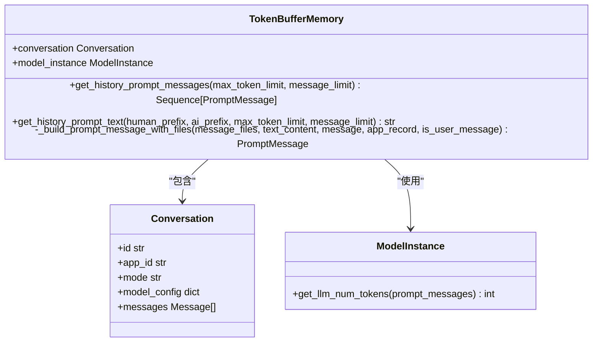
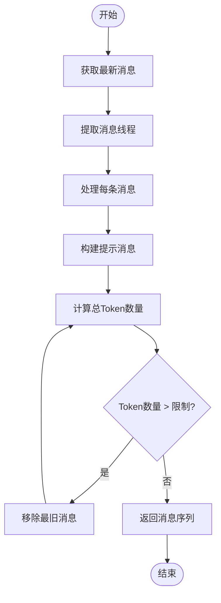
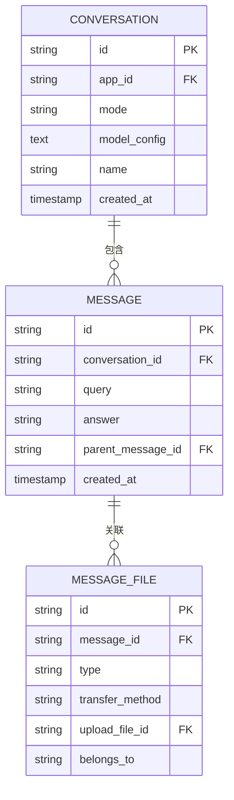
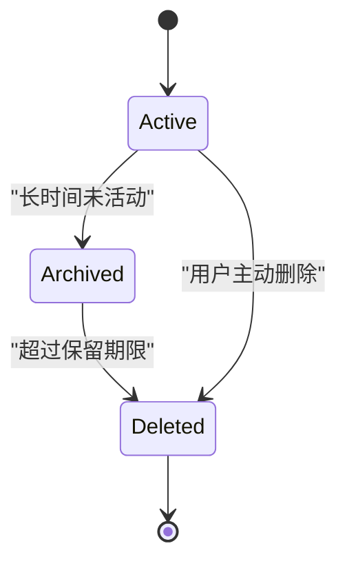

# 记忆机制

<cite>
**本文档引用的文件**   
- [token_buffer_memory.py](file://api/core/memory/token_buffer_memory.py)
- [model.py](file://api/models/model.py)
- [extract_thread_messages.py](file://api/core/prompt/utils/extract_thread_messages.py)
</cite>

## 目录
1. [简介](#简介)
2. [基于Token的缓冲记忆实现](#基于token的缓冲记忆实现)
3. [记忆数据存储结构](#记忆数据存储结构)
4. [持久化与过期机制](#持久化与过期机制)
5. [上下文学习与个性化响应](#上下文学习与个性化响应)
6. [配置与扩展方案](#配置与扩展方案)
7. [代码示例](#代码示例)

## 简介
Dify Agent的记忆机制通过`token_buffer_memory.py`中的`TokenBufferMemory`类实现，采用基于Token数量的缓冲策略，在保证上下文连贯性的同时有效控制成本。该机制通过智能管理对话历史，支持Agent进行上下文学习和个性化响应。

## 基于Token的缓冲记忆实现

`TokenBufferMemory`类实现了基于Token数量的缓冲记忆机制，其核心原理是通过动态计算和限制对话历史的Token数量来平衡上下文连贯性和成本控制。

### 初始化与核心组件
`TokenBufferMemory`在初始化时接收`conversation`和`model_instance`两个关键参数，分别代表当前对话上下文和模型实例。这种设计使得记忆机制能够根据具体的对话和模型特性进行优化。



**Diagram sources**
- [token_buffer_memory.py](file://api/core/memory/token_buffer_memory.py#L15-L223)
- [model.py](file://api/models/model.py#L300-L500)

### 动态Token计算与截断
记忆机制的核心功能`get_history_prompt_messages`通过以下步骤实现：

1. **消息获取**：从数据库中获取指定数量的最新消息（默认最多500条）
2. **线程提取**：使用`extract_thread_messages`工具函数提取与当前对话相关的消息线程
3. **Token计算**：利用`model_instance.get_llm_num_tokens`方法精确计算消息序列的Token数量
4. **动态截断**：当Token数量超过`max_token_limit`时，从历史消息的开头逐个移除，直到满足Token限制

这种基于实际Token消耗的动态截断策略相比简单的消息数量限制更加精确和高效。



**Diagram sources**
- [token_buffer_memory.py](file://api/core/memory/token_buffer_memory.py#L100-L180)
- [extract_thread_messages.py](file://api/core/prompt/utils/extract_thread_messages.py#L1-L25)

## 记忆数据存储结构

记忆数据的存储与`conversation`表紧密相关，通过多个关联表实现完整的记忆体系。

### 核心数据模型
记忆数据主要存储在以下几个表中：

| 表名 | 主要字段 | 说明 |
|------|--------|------|
| conversations | id, app_id, mode, model_config | 存储对话基本信息和配置 |
| messages | id, conversation_id, query, answer, parent_message_id | 存储对话消息内容和层级关系 |
| message_files | id, message_id, type, transfer_method, upload_file_id | 存储消息关联的文件信息 |



**Diagram sources**
- [model.py](file://api/models/model.py#L300-L800)

### 消息关系与线程管理
通过`parent_message_id`字段，系统能够构建消息的树状结构，支持复杂的对话分支。`extract_thread_messages`函数利用这一结构，从最新的消息开始向上追溯，提取出完整的对话线程。

```python
def extract_thread_messages(messages: Sequence[Message]):
    thread_messages: list[Message] = []
    next_message = None

    for message in messages:
        if not message.parent_message_id:
            # 如果消息没有父消息，则是新线程的开始
            thread_messages.append(message)
            break

        if not next_message:
            thread_messages.append(message)
            next_message = message.parent_message_id
        else:
            if next_message in {message.id, UUID_NIL}:
                thread_messages.append(message)
                next_message = message.parent_message_id

    return thread_messages
```

**Section sources**
- [extract_thread_messages.py](file://api/core/prompt/utils/extract_thread_messages.py#L1-L25)

## 持久化与过期机制

### 持久化策略
记忆数据通过数据库事务实现持久化存储，确保数据的一致性和可靠性。当用户发送新消息时，系统会：

1. 创建新的`Message`记录
2. 关联相关的`MessageFile`记录（如果有文件上传）
3. 更新`Conversation`的最后更新时间
4. 提交数据库事务

### 过期机制
系统通过以下方式管理记忆数据的生命周期：

1. **自动清理**：通过后台任务定期清理过期的对话和消息
2. **容量限制**：在`get_history_prompt_messages`中通过Token限制自然淘汰旧消息
3. **手动删除**：用户可以主动删除对话，触发级联删除相关消息



**Section sources**
- [token_buffer_memory.py](file://api/core/memory/token_buffer_memory.py#L100-L180)
- [model.py](file://api/models/model.py#L300-L800)

## 上下文学习与个性化响应

### 上下文学习机制
Agent通过`get_history_prompt_text`方法将历史对话转换为文本格式，作为上下文输入给模型：

```python
def get_history_prompt_text(
    self,
    human_prefix: str = "Human",
    ai_prefix: str = "Assistant",
    max_token_limit: int = 2000,
    message_limit: Optional[int] = None,
) -> str:
    prompt_messages = self.get_history_prompt_messages(max_token_limit=max_token_limit, message_limit=message_limit)

    string_messages = []
    for m in prompt_messages:
        if m.role == PromptMessageRole.USER:
            role = human_prefix
        elif m.role == PromptMessageRole.ASSISTANT:
            role = ai_prefix
        else:
            continue

        if isinstance(m.content, list):
            inner_msg = ""
            for content in m.content:
                if isinstance(content, TextPromptMessageContent):
                    inner_msg += f"{content.data}\n"
                elif isinstance(content, ImagePromptMessageContent):
                    inner_msg += "[image]\n"

            string_messages.append(f"{role}: {inner_msg.strip()}")
        else:
            message = f"{role}: {m.content}"
            string_messages.append(message)

    return "\n".join(string_messages)
```

### 个性化响应
通过分析历史对话模式，Agent能够：
- 学习用户的语言风格和偏好
- 记住用户提到的重要信息
- 提供更加连贯和个性化的响应
- 在多轮对话中保持上下文一致性

**Section sources**
- [token_buffer_memory.py](file://api/core/memory/token_buffer_memory.py#L185-L223)

## 配置与扩展方案

### 记忆窗口大小配置
通过`max_token_limit`参数可以灵活配置记忆窗口大小：

```python
# 示例：设置不同的记忆窗口
memory = TokenBufferMemory(conversation, model_instance)

# 短期记忆（快速响应，低成本）
short_term = memory.get_history_prompt_messages(max_token_limit=1000)

# 长期记忆（更多上下文，更高成本）
long_term = memory.get_history_prompt_messages(max_token_limit=4000)
```

### 记忆压缩算法
系统内置的记忆压缩算法通过以下方式优化：

1. **选择性保留**：优先保留包含关键信息的消息
2. **Token优化**：使用模型原生的Token计算方法确保准确性
3. **文件处理**：智能处理消息中的文件内容，避免不必要的Token消耗

### 长期记忆扩展方案
对于需要长期记忆的场景，可以考虑以下扩展方案：

1. **向量数据库**：将重要对话摘要存储到向量数据库，实现长期记忆检索
2. **摘要生成**：定期生成对话摘要，作为长期记忆的索引
3. **外部存储**：将不常用的历史对话归档到外部存储系统

## 代码示例

### 基本使用
```python
# 创建记忆实例
memory = TokenBufferMemory(conversation, model_instance)

# 获取历史消息（最多2000个Token）
history_messages = memory.get_history_prompt_messages(max_token_limit=2000)

# 获取历史消息文本
history_text = memory.get_history_prompt_text(
    human_prefix="用户",
    ai_prefix="助手",
    max_token_limit=2000
)
```

### 处理带文件的消息
```python
# 系统会自动处理消息中的文件
def _build_prompt_message_with_files(
    self, message_files: list[MessageFile], text_content: str, 
    message: Message, app_record, is_user_message: bool
) -> PromptMessage:
    # 根据应用模式获取文件配置
    if self.conversation.mode in {AppMode.AGENT_CHAT, AppMode.COMPLETION, AppMode.CHAT}:
        file_extra_config = FileUploadConfigManager.convert(self.conversation.model_config)
    elif self.conversation.mode in {AppMode.ADVANCED_CHAT, AppMode.WORKFLOW}:
        # 处理工作流模式
        workflow_run = db.session.scalar(select(WorkflowRun).where(WorkflowRun.id == message.workflow_run_id))
        workflow = db.session.scalar(select(Workflow).where(Workflow.id == workflow_run.workflow_id))
        file_extra_config = FileUploadConfigManager.convert(workflow.features_dict, is_vision=False)
    else:
        raise AssertionError(f"无效的应用模式: {self.conversation.mode}")
    
    # 构建文件对象
    file_objs = [
        file_factory.build_from_message_file(
            message_file=message_file, tenant_id=app_record.tenant_id, config=file_extra_config
        )
        for message_file in message_files
    ]
    
    # 构建包含文件的提示消息
    if file_objs:
        prompt_message_contents: list[PromptMessageContentUnionTypes] = []
        for file in file_objs:
            prompt_message = file_manager.to_prompt_message_content(
                file,
                image_detail_config=detail,
            )
            prompt_message_contents.append(prompt_message)
        prompt_message_contents.append(TextPromptMessageContent(data=text_content))
        
        return UserPromptMessage(content=prompt_message_contents) if is_user_message else AssistantPromptMessage(content=prompt_message_contents)
    else:
        return UserPromptMessage(content=text_content) if is_user_message else AssistantPromptMessage(content=text_content)
```

**Section sources**
- [token_buffer_memory.py](file://api/core/memory/token_buffer_memory.py#L25-L95)