# 错误恢复

<cite>
**本文档中引用的文件**
- [base_agent_runner.py](file://api/core/agent/base_agent_runner.py)
- [error.py](file://api/core/errors/error.py)
- [ops_trace_manager.py](file://api/core/ops/ops_trace_manager.py)
- [sentry_config.py](file://api/configs/extra/sentry_config.py)
</cite>

## 目录
1. [引言](#引言)
2. [核心组件](#核心组件)
3. [错误分类与处理流程](#错误分类与处理流程)
4. [重试逻辑与超时控制](#重试逻辑与超时控制)
5. [降级策略](#降级策略)
6. [日志与监控](#日志与监控)
7. [配置管理](#配置管理)
8. [常见错误处理最佳实践](#常见错误处理最佳实践)
9. [结论](#结论)

## 引言
Dify Agent系统设计了全面的错误恢复机制，以确保在工具调用失败、模型响应异常或网络中断等情况下仍能保持服务的稳定性和可靠性。本指南详细阐述了系统的容错机制，包括重试逻辑、超时控制、降级策略以及通过日志和监控系统定位问题的方法。

## 核心组件

Dify Agent的错误恢复机制主要由以下几个核心组件构成：
- `base_agent_runner.py`：负责Agent执行的核心逻辑，包含重试和错误处理机制
- `errors/error.py`：定义了系统中所有错误类型的分类
- `ops/ops_trace_manager.py`：负责操作追踪和日志记录
- Sentry监控系统：用于错误跟踪和性能监控

**Section sources**
- [base_agent_runner.py](file://api/core/agent/base_agent_runner.py#L1-L527)
- [error.py](file://api/core/errors/error.py#L1-L58)
- [ops_trace_manager.py](file://api/core/ops/ops_trace_manager.py#L1-L898)

## 错误分类与处理流程

Dify系统对错误进行了详细的分类，每种错误类型都有相应的处理策略。

### 错误类型定义

系统定义了多种错误类型，主要分为以下几类：

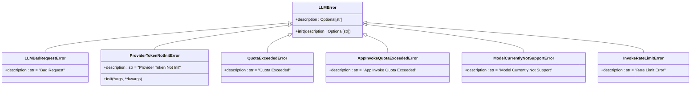

**Diagram sources**
- [error.py](file://api/core/errors/error.py#L1-L58)

### 错误处理流程

当Agent执行过程中发生错误时，系统会按照以下流程进行处理：

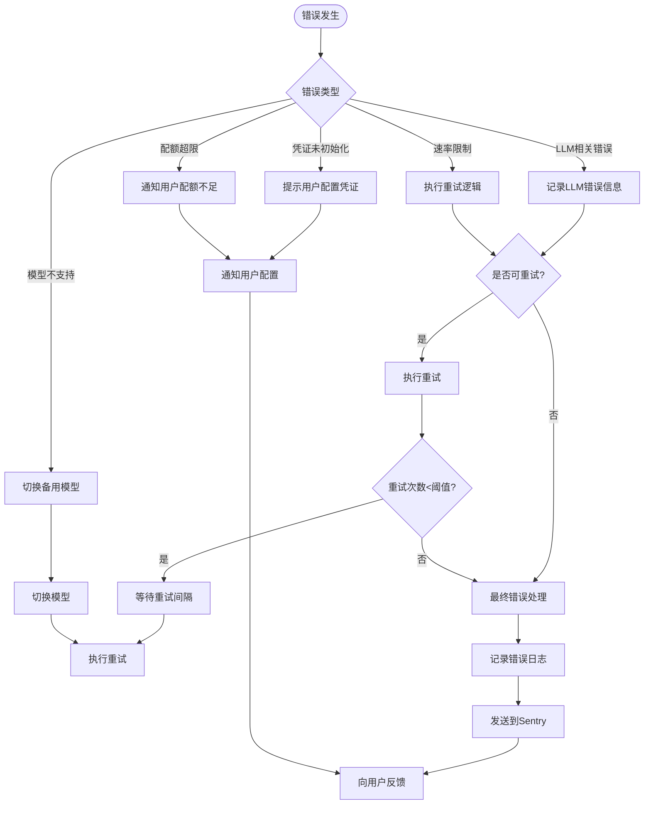

**Diagram sources**
- [base_agent_runner.py](file://api/core/agent/base_agent_runner.py#L1-L527)
- [error.py](file://api/core/errors/error.py#L1-L58)

**Section sources**
- [error.py](file://api/core/errors/error.py#L1-L58)

## 重试逻辑与超时控制

### 重试机制实现

`base_agent_runner.py`中的重试逻辑设计了完善的重试机制，确保在临时性故障发生时能够自动恢复。

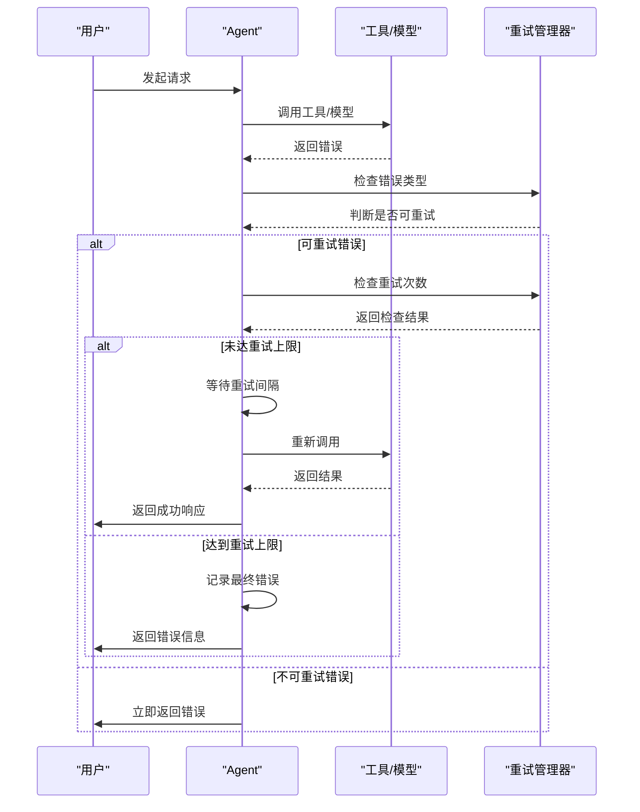

**Diagram sources**
- [base_agent_runner.py](file://api/core/agent/base_agent_runner.py#L1-L527)

### 超时控制策略

系统实现了多层次的超时控制，防止请求长时间挂起。

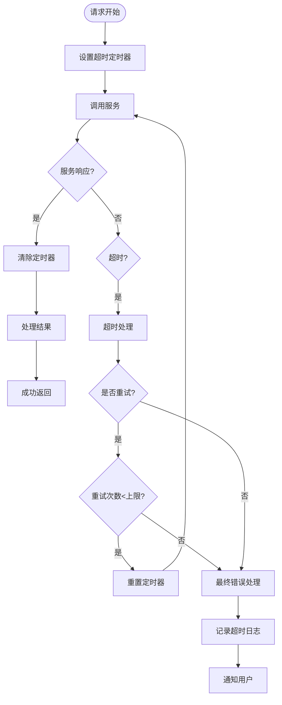

**Diagram sources**
- [base_agent_runner.py](file://api/core/agent/base_agent_runner.py#L1-L527)

**Section sources**
- [base_agent_runner.py](file://api/core/agent/base_agent_runner.py#L1-L527)

## 降级策略

当主要服务不可用时，系统会自动执行降级策略，确保基本功能可用。

### 降级策略类型

系统支持多种降级策略：

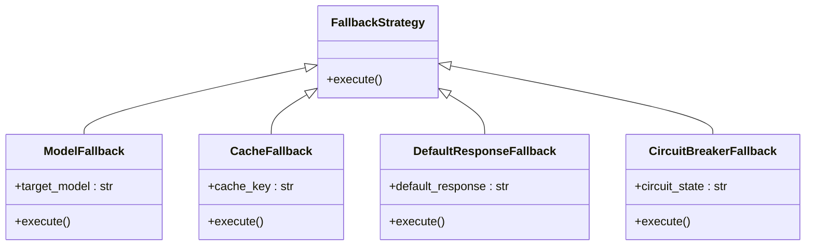

**Diagram sources**
- [base_agent_runner.py](file://api/core/agent/base_agent_runner.py#L1-L527)

### 降级执行流程

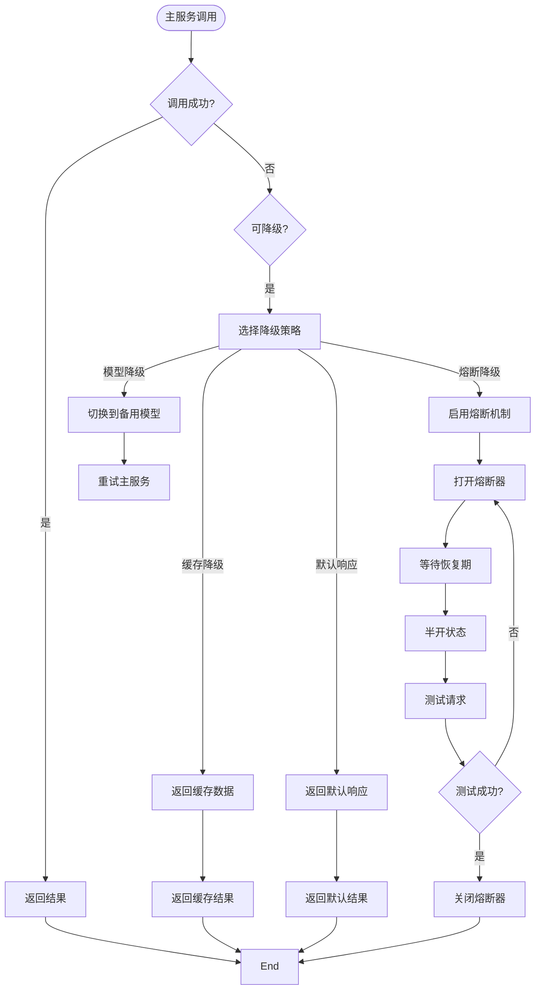

**Diagram sources**
- [base_agent_runner.py](file://api/core/agent/base_agent_runner.py#L1-L527)

**Section sources**
- [base_agent_runner.py](file://api/core/agent/base_agent_runner.py#L1-L527)

## 日志与监控

### 操作追踪系统

Dify使用ops_trace_manager.py实现全面的操作追踪，帮助定位和分析问题。

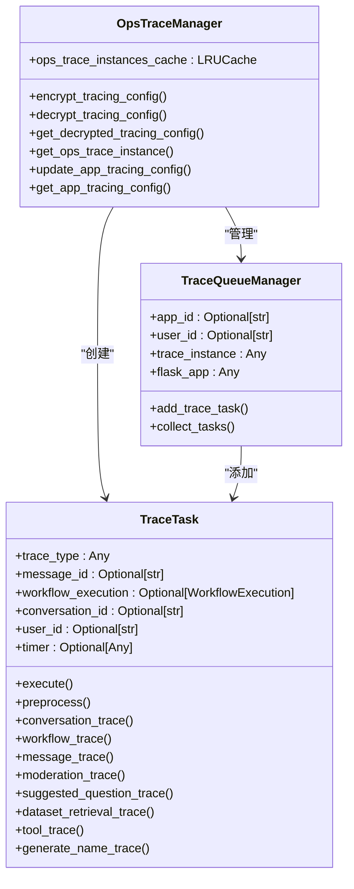

**Diagram sources**
- [ops_trace_manager.py](file://api/core/ops/ops_trace_manager.py#L1-L898)

### 监控数据流

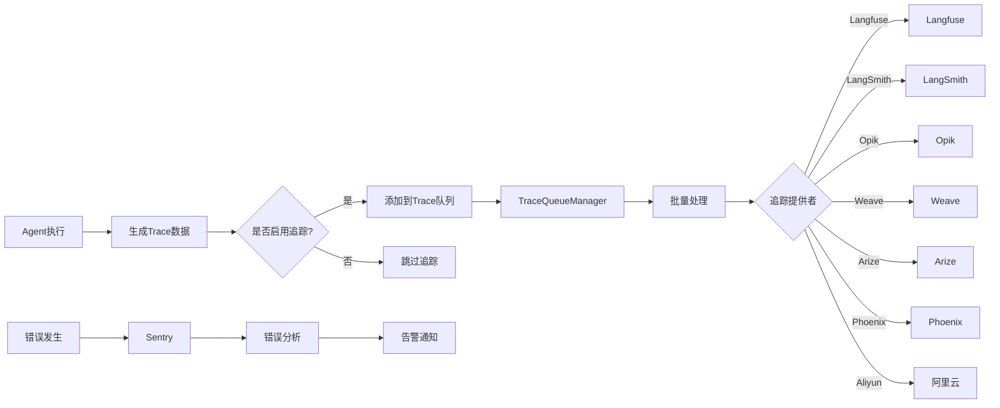

**Diagram sources**
- [ops_trace_manager.py](file://api/core/ops/ops_trace_manager.py#L1-L898)
- [sentry_config.py](file://api/configs/extra/sentry_config.py#L1-L27)

**Section sources**
- [ops_trace_manager.py](file://api/core/ops/ops_trace_manager.py#L1-L898)

## 配置管理

### 重试配置

系统允许配置重试相关的参数：

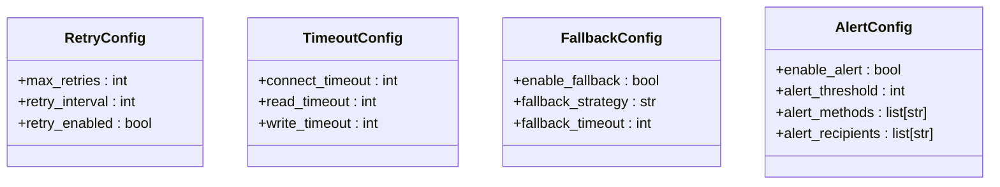

**Diagram sources**
- [base_agent_runner.py](file://api/core/agent/base_agent_runner.py#L1-L527)

### 配置参数说明

| 配置项 | 参数名称 | 默认值 | 说明 |
|--------|---------|--------|------|
| 重试次数 | max_retries | 3 | 最大重试次数，范围1-10 |
| 重试间隔 | retry_interval | 1000 | 重试间隔时间（毫秒），范围100-5000 |
| 重试启用 | retry_enabled | true | 是否启用重试机制 |
| 连接超时 | connect_timeout | 30 | 连接超时时间（秒） |
| 读取超时 | read_timeout | 60 | 读取超时时间（秒） |
| 写入超时 | write_timeout | 60 | 写入超时时间（秒） |
| 告警阈值 | alert_threshold | 5 | 错误次数告警阈值 |
| 告警方式 | alert_methods | ["email"] | 告警通知方式 |

**Section sources**
- [base_agent_runner.py](file://api/core/agent/base_agent_runner.py#L1-L527)

## 常见错误处理最佳实践

### API限流处理

当遇到API限流错误时，建议采取以下措施：

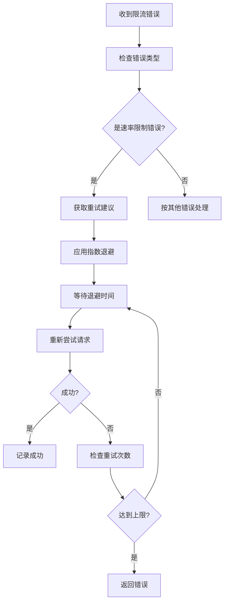

**最佳实践建议：**
1. 实现指数退避算法，避免连续重试加剧服务压力
2. 记录限流事件，用于后续容量规划
3. 向用户显示友好的提示信息
4. 考虑降级到备用API或服务

**Section sources**
- [error.py](file://api/core/errors/error.py#L1-L58)
- [base_agent_runner.py](file://api/core/agent/base_agent_runner.py#L1-L527)

### 凭证失效处理

凭证失效是常见的认证问题，处理流程如下：

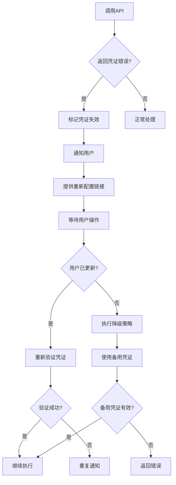

**最佳实践建议：**
1. 提前检测凭证有效期，避免在关键时刻失效
2. 提供清晰的凭证配置指引
3. 实现凭证轮换机制
4. 记录凭证使用情况，便于审计

**Section sources**
- [error.py](file://api/core/errors/error.py#L1-L58)
- [base_agent_runner.py](file://api/core/agent/base_agent_runner.py#L1-L527)

## 结论

Dify Agent系统通过多层次的错误恢复机制，确保了在各种异常情况下的稳定运行。系统实现了完善的重试逻辑、超时控制和降级策略，结合详细的错误分类和强大的监控能力，为用户提供可靠的AI服务。通过合理配置重试次数、超时阈值和告警规则，并遵循最佳实践处理常见错误，可以最大限度地提高系统的可用性和用户体验。