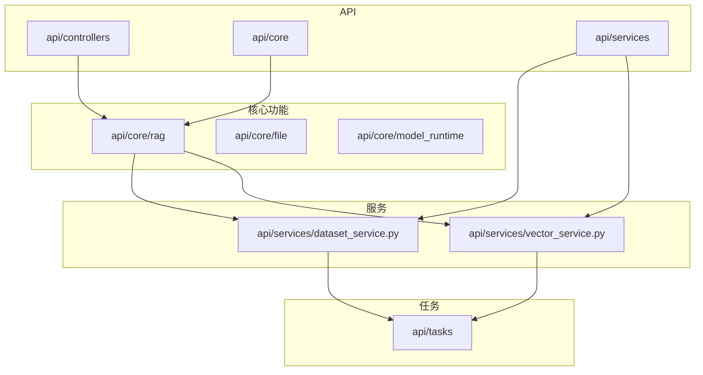
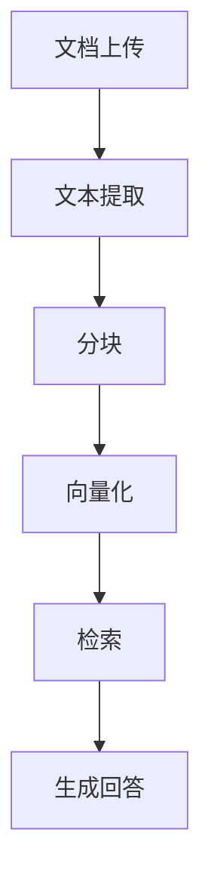
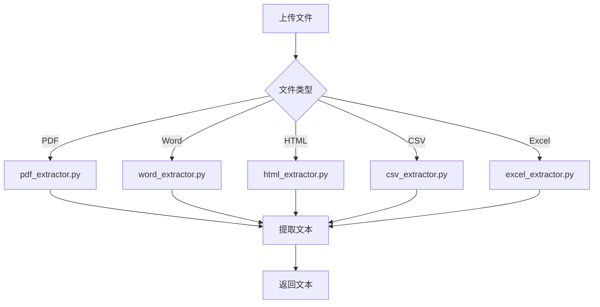
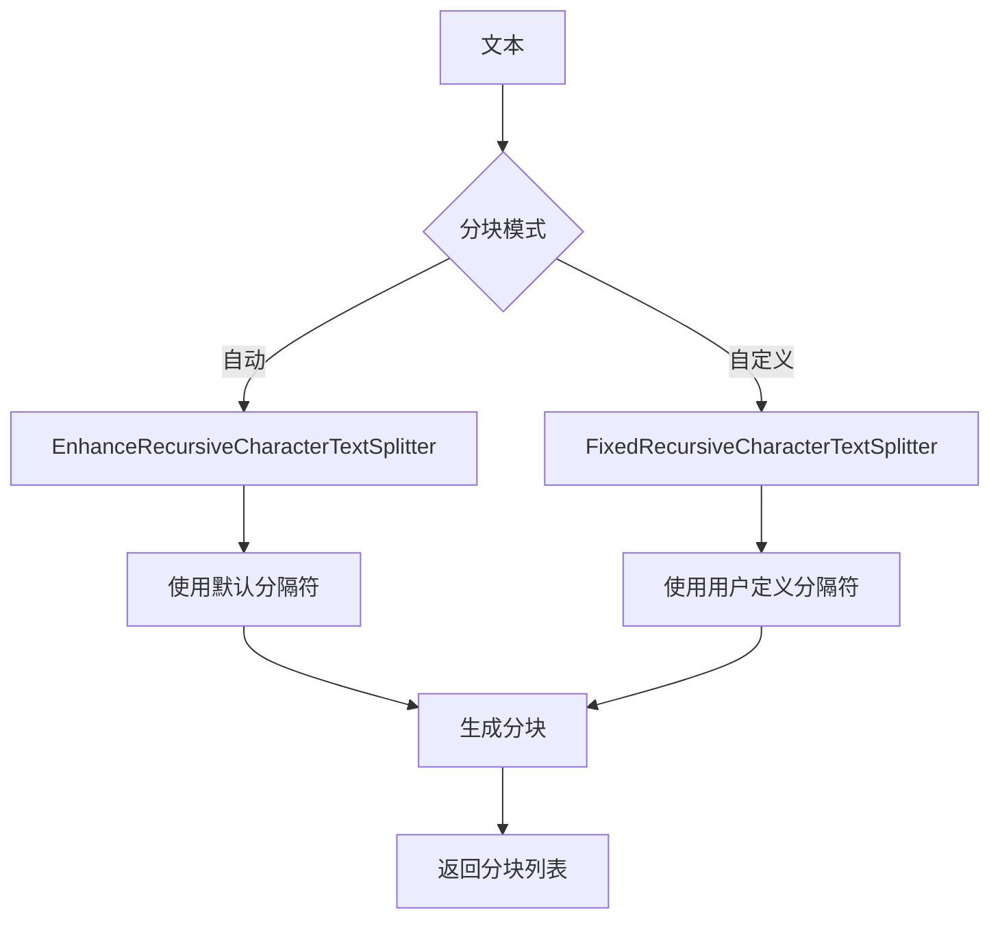
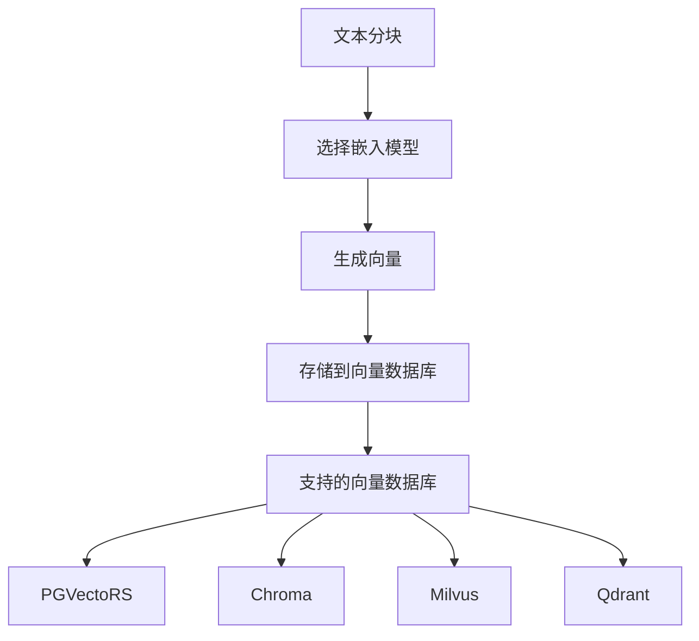
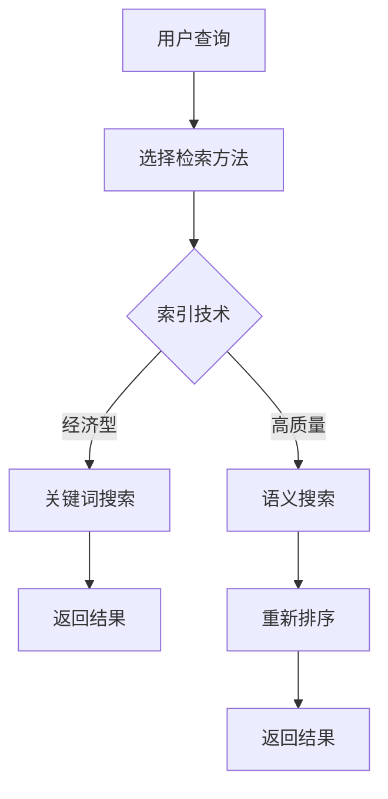

# RAG管道

<cite>
**本文档引用的文件**
- [indexing_runner.py](file://api/core/indexing_runner.py)
- [extract_processor.py](file://api/core/rag/extractor/extract_processor.py)
- [text_splitter.py](file://api/core/rag/splitter/text_splitter.py)
- [vector_factory.py](file://api/core/rag/datasource/vdb/vector_factory.py)
- [retrieval_service.py](file://api/core/rag/datasource/retrieval_service.py)
- [dataset_retrieval.py](file://api/core/rag/retrieval/dataset_retrieval.py)
- [vector_service.py](file://api/services/vector_service.py)
- [dataset_service.py](file://api/services/dataset_service.py)
- [parent_child_index_processor.py](file://api/core/rag/index_processor/processor/parent_child_index_processor.py)
- [qa_index_processor.py](file://api/core/rag/index_processor/processor/qa_index_processor.py)
- [clickzetta_vector.py](file://api/core/rag/datasource/vdb/clickzetta/clickzetta_vector.py)
- [pgvecto_rs.py](file://api/core/rag/datasource/vdb/pgvecto_rs/pgvecto_rs.py)
</cite>

## 目录
1. [简介](#简介)
2. [项目结构](#项目结构)
3. [核心组件](#核心组件)
4. [架构概述](#架构概述)
5. [详细组件分析](#详细组件分析)
6. [依赖分析](#依赖分析)
7. [性能考虑](#性能考虑)
8. [故障排除指南](#故障排除指南)
9. [结论](#结论)

## 简介
Dify的RAG（检索增强生成）管道是一个全面的系统，用于处理文档上传、文本提取、分块、向量化和检索。该系统支持多种文档格式，包括PDF、Word、HTML等，并提供灵活的检索参数配置。知识库的构建过程包括索引更新策略和权限管理。本文档详细说明了这些功能，并提供性能优化建议和实际应用案例。

## 项目结构
Dify的项目结构清晰，主要分为API、核心功能、服务、任务和Web界面等部分。核心的RAG功能位于`api/core/rag`目录下，包括提取器、分块器、向量化和检索服务。

**图表来源**
- [indexing_runner.py](file://api/core/indexing_runner.py)
- [vector_service.py](file://api/services/vector_service.py)

**章节来源**
- [indexing_runner.py](file://api/core/indexing_runner.py)
- [vector_service.py](file://api/services/vector_service.py)

## 核心组件
RAG管道的核心组件包括文档提取、分块、向量化和检索。这些组件协同工作，确保文档能够被高效地处理和检索。

**章节来源**
- [extract_processor.py](file://api/core/rag/extractor/extract_processor.py)
- [text_splitter.py](file://api/core/rag/splitter/text_splitter.py)
- [vector_factory.py](file://api/core/rag/datasource/vdb/vector_factory.py)
- [retrieval_service.py](file://api/core/rag/datasource/retrieval_service.py)

## 架构概述
RAG管道的架构分为几个主要部分：文档上传、文本提取、分块、向量化和检索。每个部分都有其特定的功能和责任。

**图表来源**
- [indexing_runner.py](file://api/core/indexing_runner.py)
- [extract_processor.py](file://api/core/rag/extractor/extract_processor.py)

## 详细组件分析

### 文档提取分析
文档提取组件负责从各种格式的文件中提取文本内容。支持的格式包括PDF、Word、HTML等。

#### 文档提取流程

**图表来源**
- [extract_processor.py](file://api/core/rag/extractor/extract_processor.py)
- [pdf_extractor.py](file://api/core/rag/extractor/pdf_extractor.py)
- [word_extractor.py](file://api/core/rag/extractor/word_extractor.py)
- [html_extractor.py](file://api/core/rag/extractor/html_extractor.py)
- [csv_extractor.py](file://api/core/rag/extractor/csv_extractor.py)
- [excel_extractor.py](file://api/core/rag/extractor/excel_extractor.py)

**章节来源**
- [extract_processor.py](file://api/core/rag/extractor/extract_processor.py)

### 分块策略分析
分块策略决定了如何将提取的文本分割成适合向量化的小块。Dify支持自动和自定义分块策略。

#### 分块策略

**图表来源**
- [text_splitter.py](file://api/core/rag/splitter/text_splitter.py)
- [index_processor_base.py](file://api/core/rag/index_processor/index_processor_base.py)

**章节来源**
- [text_splitter.py](file://api/core/rag/splitter/text_splitter.py)

### 向量化处理分析
向量化处理组件负责将文本分块转换为向量，以便在向量数据库中存储和检索。

#### 向量化流程

**图表来源**
- [vector_factory.py](file://api/core/rag/datasource/vdb/vector_factory.py)
- [pgvecto_rs.py](file://api/core/rag/datasource/vdb/pgvecto_rs/pgvecto_rs.py)

**章节来源**
- [vector_factory.py](file://api/core/rag/datasource/vdb/vector_factory.py)

### 检索机制分析
检索机制负责根据用户查询从向量数据库中检索相关文档。

#### 检索流程

**图表来源**
- [retrieval_service.py](file://api/core/rag/datasource/retrieval_service.py)
- [dataset_retrieval.py](file://api/core/rag/retrieval/dataset_retrieval.py)

**章节来源**
- [retrieval_service.py](file://api/core/rag/datasource/retrieval_service.py)

## 依赖分析
RAG管道的各个组件之间存在紧密的依赖关系。文档提取依赖于文件类型识别，分块依赖于提取的文本，向量化依赖于分块结果，检索依赖于向量化数据。

**图表来源**
- [indexing_runner.py](file://api/core/indexing_runner.py)
- [vector_service.py](file://api/services/vector_service.py)

**章节来源**
- [indexing_runner.py](file://api/core/indexing_runner.py)
- [vector_service.py](file://api/services/vector_service.py)

## 性能考虑
为了优化RAG管道的性能，建议选择合适的分块大小和向量模型。较小的分块可以提高检索精度，但会增加存储和计算开销。选择高效的向量数据库和嵌入模型也可以显著提升性能。

## 故障排除指南
常见问题包括文档上传失败、文本提取错误、分块失败和检索结果不准确。检查文件格式、编码和网络连接，确保所有依赖服务正常运行。

**章节来源**
- [errors.py](file://api/controllers/common/errors.py)
- [debug.py](file://api/services/debug.py)

## 结论
Dify的RAG管道提供了一个强大而灵活的框架，用于处理和检索文档。通过合理配置和优化，可以显著提升LLM的回答准确性和上下文理解能力。