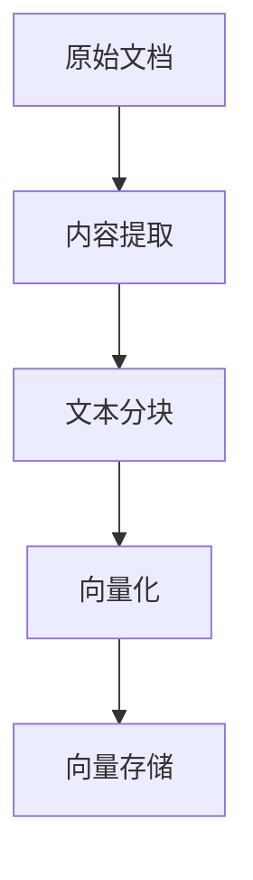
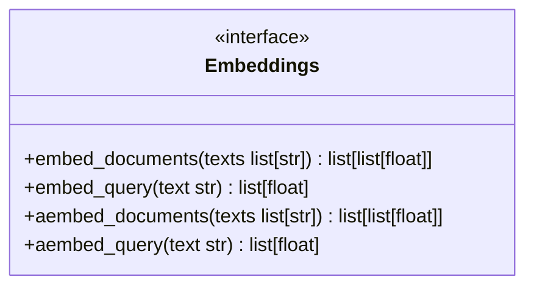
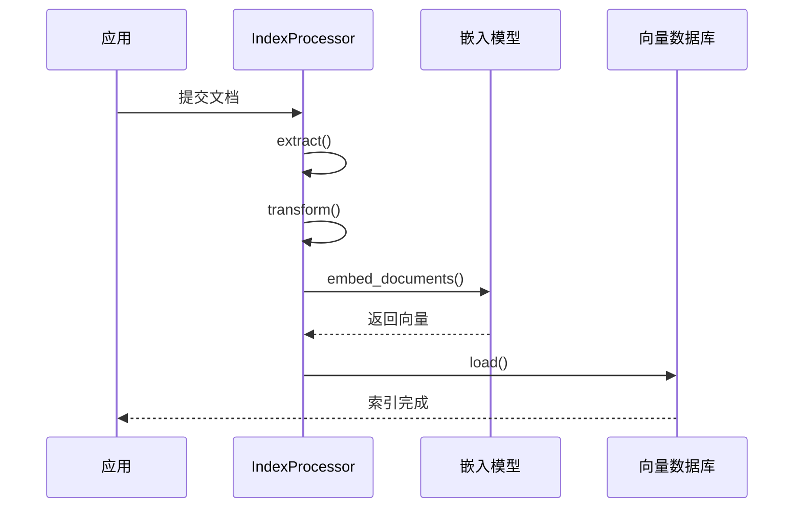
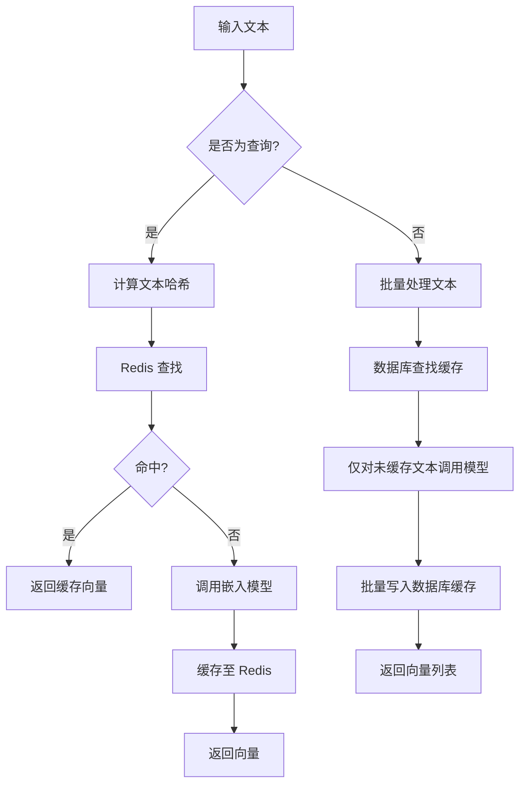
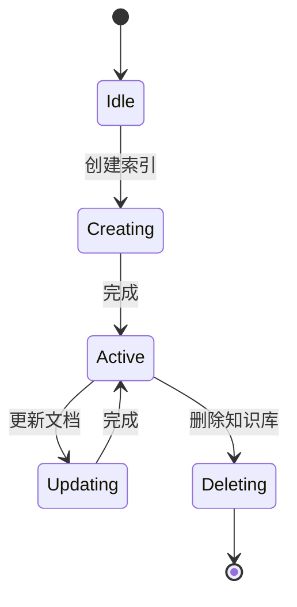
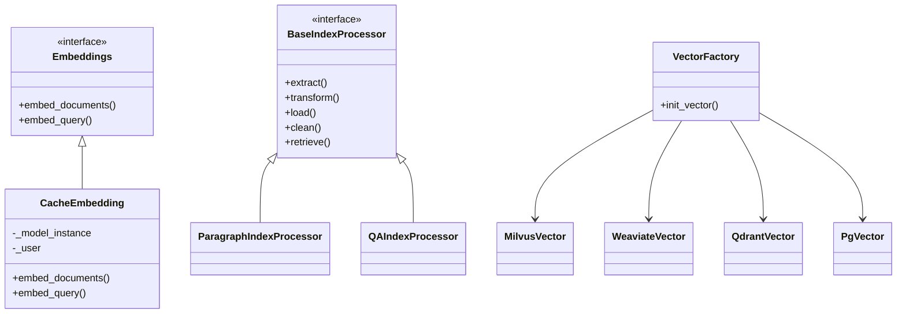

# 向量存储

<cite>
**本文档引用的文件**  
- [embedding_base.py](file://api/core/rag/embedding/embedding_base.py)
- [cached_embedding.py](file://api/core/rag/embedding/cached_embedding.py)
- [index_processor_base.py](file://api/core/rag/index_processor/index_processor_base.py)
- [index_processor_factory.py](file://api/core/rag/index_processor/index_processor_factory.py)
- [vector_base.py](file://api/core/rag/datasource/vdb/vector_base.py)
- [vector_factory.py](file://api/core/rag/datasource/vdb/vector_factory.py)
- [milvus_vector.py](file://api/core/rag/datasource/vdb/milvus/milvus_vector.py)
- [weaviate_vector.py](file://api/core/rag/datasource/vdb/weaviate/weaviate_vector.py)
- [qdrant_vector.py](file://api/core/rag/datasource/vdb/qdrant/qdrant_vector.py)
- [pgvector.py](file://api/core/rag/datasource/vdb/pgvector/pgvector.py)
- [pgvecto_rs.py](file://api/core/rag/datasource/vdb/pgvecto_rs/pgvecto_rs.py)
</cite>

## 目录
1. [简介](#简介)
2. [文档向量化流程](#文档向量化流程)
3. [嵌入模型集成](#嵌入模型集成)
4. [向量数据库集成机制](#向量数据库集成机制)
5. [向量缓存策略](#向量缓存策略)
6. [向量索引生命周期管理](#向量索引生命周期管理)
7. [向量数据库选型建议](#向量数据库选型建议)
8. [性能基准与优化](#性能基准与优化)
9. [故障排查指南](#故障排查指南)
10. [附录](#附录)

## 简介
Dify 的向量存储模块为知识库、检索增强生成（RAG）等场景提供高效的向量存储与检索能力。该模块支持多种嵌入模型和向量数据库，具备灵活的索引策略与缓存机制，确保在大规模数据场景下的高性能与稳定性。

## 文档向量化流程

文档向量化是将非结构化文本转换为高维向量表示的过程，以便进行语义相似度计算和向量检索。Dify 的向量化流程分为三个阶段：提取、分块与嵌入。



**流程说明**：
1. **内容提取**：根据文档类型（PDF、Word、网页等）使用对应的提取器（`ExtractSetting`）解析文本内容。
2. **文本分块**：通过 `TextSplitter` 将长文本切分为语义完整的段落，支持固定长度分块和增强递归分块。
3. **向量化**：调用嵌入模型对每个文本块生成向量表示，并进行归一化处理。

**Section sources**
- [index_processor_base.py](file://api/core/rag/index_processor/index_processor_base.py#L15-L85)
- [embedding_base.py](file://api/core/rag/embedding/embedding_base.py#L5-L23)

## 嵌入模型集成

Dify 通过抽象接口统一管理多种嵌入模型，支持同步与异步调用，确保模型调用的一致性与可扩展性。

### 嵌入模型接口定义



**接口说明**：
- `embed_documents`: 批量嵌入文档文本，返回向量列表。
- `embed_query`: 嵌入查询文本，返回单个向量。
- 异步方法支持高并发场景下的非阻塞调用。

### 支持的嵌入模型类型

Dify 支持以下主流嵌入模型提供商：
- OpenAI
- Hugging Face
- 百度文心
- 阿里通义
- 自定义模型接口

模型配置通过 `ModelInstance` 管理，包含模型名称、提供商、凭证等信息。

### 配置方法

嵌入模型配置在系统管理界面中完成，需提供：
- **模型名称**：如 `text-embedding-ada-002`
- **提供商**：选择对应的模型服务提供商
- **API Key**：用于身份验证
- **最大分块数（MAX_CHUNKS）**：控制批量嵌入的并发量

配置信息存储于数据库，并通过 `model_manager` 模块进行实例化管理。

**Section sources**
- [embedding_base.py](file://api/core/rag/embedding/embedding_base.py#L5-L23)
- [cached_embedding.py](file://api/core/rag/embedding/cached_embedding.py#L15-L144)

## 向量数据库集成机制

Dify 支持多种向量数据库，通过统一的抽象层实现灵活切换与扩展。

### 支持的向量数据库

| 数据库 | 文件路径 | 特点 |
|--------|---------|------|
| Milvus | `milvus_vector.py` | 高性能、分布式、适合大规模数据 |
| Weaviate | `weaviate_vector.py` | 支持图结构、语义搜索 |
| Qdrant | `qdrant_vector.py` | 轻量级、Rust 编写、性能优异 |
| PgVector | `pgvector.py` | 基于 PostgreSQL，易于集成 |
| PgVecto.rs | `pgvecto_rs.py` | Rust 实现的 PostgreSQL 扩展，性能更强 |

### 连接配置

向量数据库连接通过 `VectorFactory` 工厂类初始化，配置信息包括：
- **类型**：数据库类型（如 `milvus`, `weaviate`）
- **主机地址与端口**
- **认证信息（用户名、密码、API Key）**
- **集合名称（Collection Name）**
- **向量维度**

配置示例（环境变量或配置中心）：
```env
VECTOR_STORE_TYPE=pgvector
VECTOR_STORE_HOST=localhost
VECTOR_STORE_PORT=5432
VECTOR_STORE_USER=dify
VECTOR_STORE_PASSWORD=secret
VECTOR_STORE_DATABASE=dify
```

### 索引创建

索引创建由 `load` 方法触发，根据数据库类型自动创建对应的索引结构。例如：
- **Milvus**：创建 IVF_FLAT 或 HNSW 索引
- **PgVector**：创建 HNSW 或 IVFFlat 索引
- **Qdrant**：配置 HNSW 索引参数

索引参数可通过 `DatasetProcessRule` 自定义。

### 数据写入与查询优化

- **批量写入**：文档向量以批次形式写入，提升吞吐量。
- **查询优化**：
  - 支持 `top_k` 限制返回结果数量
  - 支持 `score_threshold` 过滤低相似度结果
  - 支持重排序（Reranking）提升检索精度



**Diagram sources**
- [vector_factory.py](file://api/core/rag/datasource/vdb/vector_factory.py#L1-L30)
- [vector_base.py](file://api/core/rag/datasource/vdb/vector_base.py#L1-L50)

**Section sources**
- [vector_factory.py](file://api/core/rag/datasource/vdb/vector_factory.py#L1-L30)
- [vector_base.py](file://api/core/rag/datasource/vdb/vector_base.py#L1-L50)

## 向量缓存策略

为提升性能，Dify 实现了两级缓存机制：**Redis 缓存（查询缓存）** 和 **数据库缓存（文档缓存）**。

### 查询缓存（Redis）

- **键格式**：`{provider}_{model}_{text_hash}`
- **有效期**：600 秒
- **存储方式**：向量以 Base64 编码后存储
- **命中流程**：
  1. 计算查询文本的哈希值
  2. 在 Redis 中查找对应向量
  3. 若存在则返回，否则调用模型并缓存结果

### 文档缓存（数据库）

- **表结构**：`embeddings` 表，包含 `model_name`, `hash`, `provider_name`, `embedding` 字段
- **去重机制**：相同文本不会重复计算向量
- **批量处理**：`embed_documents` 方法中批量检查缓存并写入

### 缓存优势

- 减少模型调用次数，降低 API 成本
- 提升查询响应速度
- 避免重复计算，节省计算资源



**Diagram sources**
- [cached_embedding.py](file://api/core/rag/embedding/cached_embedding.py#L15-L144)

**Section sources**
- [cached_embedding.py](file://api/core/rag/embedding/cached_embedding.py#L15-L144)

## 向量索引生命周期管理

向量索引的生命周期包括创建、更新、删除三个阶段，由 `IndexProcessor` 统一管理。

### 创建

- 触发条件：新增文档或知识库
- 流程：提取 → 分块 → 向量化 → 写入向量数据库
- 状态记录：在 `Dataset` 和 `Document` 表中更新索引状态

### 更新

- 支持增量更新：仅对新增或修改的文档重新索引
- 支持全量重建：删除旧索引后重新创建
- 事件驱动：通过 `document_index_event` 触发异步任务

### 删除

- 删除文档时，调用 `clean` 方法从向量数据库移除对应向量
- 删除知识库时，清理整个集合（Collection）
- 支持软删除与硬删除策略



**Section sources**
- [index_processor_base.py](file://api/core/rag/index_processor/index_processor_base.py#L15-L85)
- [index_processor_factory.py](file://api/core/rag/index_processor/index_processor_factory.py#L1-L30)

## 向量数据库选型建议

| 数据库 | 适用场景 | 优势 | 劣势 |
|--------|----------|------|------|
| **Milvus** | 超大规模数据（>1亿向量） | 高性能、分布式、支持 GPU 加速 | 部署复杂，资源消耗高 |
| **Qdrant** | 中等规模、高并发 | 轻量、Rust 性能优异、API 友好 | 生态相对较小 |
| **Weaviate** | 需要图关系、语义搜索 | 支持混合搜索、GraphQL 接口 | 学习成本较高 |
| **PgVector** | 已使用 PostgreSQL | 易集成、事务支持、成熟生态 | 性能低于专用向量库 |
| **PgVecto.rs** | 高性能 PostgreSQL 方案 | Rust 实现，性能接近专用库 | 较新，社区较小 |

**建议**：
- 小型项目：使用 `PgVector`，简化架构
- 中大型项目：使用 `Qdrant` 或 `Milvus`
- 需要图语义：选择 `Weaviate`

## 性能基准与优化

### 基准测试数据（示例）

| 数据库 | 10万向量插入时间 | 查询延迟（P95） | 内存占用 |
|--------|------------------|------------------|----------|
| Milvus | 120s | 15ms | 4GB |
| Qdrant | 135s | 18ms | 3.5GB |
| Weaviate | 150s | 20ms | 5GB |
| PgVector | 300s | 35ms | 2GB |
| PgVecto.rs | 180s | 22ms | 2.5GB |

### 优化建议

1. **批量写入**：每次写入 100-1000 条向量
2. **索引参数调优**：
   - Milvus: `nlist=100`, `nprobe=10`
   - Qdrant: `ef_construct=100`, `ef=50`
3. **缓存命中率监控**：保持 >80%
4. **向量归一化**：提升相似度计算精度

## 故障排查指南

### 常见问题与解决方案

| 问题 | 可能原因 | 解决方案 |
|------|----------|----------|
| **向量维度不匹配** | 模型输出维度与数据库定义不符 | 检查嵌入模型配置，确保维度一致 |
| **连接超时** | 网络问题或数据库负载过高 | 检查网络、增加超时时间、优化数据库性能 |
| **缓存未命中** | Redis 未启动或键过期 | 检查 Redis 状态，确认缓存逻辑 |
| **嵌入模型调用失败** | API Key 无效或配额耗尽 | 检查凭证、联系提供商 |
| **索引创建失败** | 数据库权限不足或磁盘满 | 检查权限、清理磁盘空间 |

### 调试方法

1. 启用 `DEBUG` 模式查看详细日志
2. 使用 `vector_service.py` 中的工具方法进行手动测试
3. 检查 Celery 任务队列是否积压

**Section sources**
- [vector_service.py](file://api/services/vector_service.py#L1-L50)
- [cached_embedding.py](file://api/core/rag/embedding/cached_embedding.py#L15-L144)

## 附录

### 核心类图



**Diagram sources**
- [embedding_base.py](file://api/core/rag/embedding/embedding_base.py#L5-L23)
- [cached_embedding.py](file://api/core/rag/embedding/cached_embedding.py#L15-L144)
- [index_processor_base.py](file://api/core/rag/index_processor/index_processor_base.py#L15-L85)
- [vector_factory.py](file://api/core/rag/datasource/vdb/vector_factory.py#L1-L30)