# 向量数据库

<cite>
**本文档引用文件**  
- [milvus_vector.py](file://api/core/rag/datasource/vdb/milvus/milvus_vector.py)
- [weaviate_vector.py](file://api/core/rag/datasource/vdb/weaviate/weaviate_vector.py)
- [qdrant_vector.py](file://api/core/rag/datasource/vdb/qdrant/qdrant_vector.py)
- [pgvector.py](file://api/core/rag/datasource/vdb/pgvector/pgvector.py)
- [chroma_vector.py](file://api/core/rag/datasource/vdb/chroma/chroma_vector.py)
- [vector_factory.py](file://api/core/rag/datasource/vdb/vector_factory.py)
- [vector_base.py](file://api/core/rag/datasource/vdb/vector_base.py)
- [milvus_config.py](file://api/configs/middleware/vdb/milvus_config.py)
- [weaviate_config.py](file://api/configs/middleware/vdb/weaviate_config.py)
- [qdrant_config.py](file://api/configs/middleware/vdb/qdrant_config.py)
- [pgvector_config.py](file://api/configs/middleware/vdb/pgvector_config.py)
- [chroma_config.py](file://api/configs/middleware/vdb/chroma_config.py)
- [vikingdb_vector.py](file://api/core/rag/datasource/vdb/vikingdb/vikingdb_vector.py)
- [vector_type.py](file://api/core/rag/datasource/vdb/vector_type.py)
- [field.py](file://api/core/rag/datasource/vdb/field.py)
</cite>

## 目录
1. [引言](#引言)
2. [向量数据库集成架构](#向量数据库集成架构)
3. [核心组件分析](#核心组件分析)
4. [配置管理机制](#配置管理机制)
5. [索引生命周期管理](#索引生命周期管理)
6. [数据操作实现](#数据操作实现)
7. [相似性搜索与查询优化](#相似性搜索与查询优化)
8. [多租户与安全控制](#多租户与安全控制)
9. [故障排查指南](#故障排查指南)
10. [性能基准与扩展性评估](#性能基准与扩展性评估)

## 引言

Dify平台通过统一的向量数据库抽象层，实现了对多种向量数据库的无缝集成。该系统支持Milvus、Weaviate、Qdrant、PgVector、Chroma、VikingDB等多种主流向量数据库，为AI应用提供高效的语义检索能力。本文档详细阐述了向量数据库的连接机制、配置管理、索引操作、数据查询以及故障处理等核心功能。

## 向量数据库集成架构

Dify的向量数据库集成采用工厂模式和策略模式相结合的设计，通过统一接口抽象不同数据库的实现差异。系统架构分为配置层、工厂层、实现层和调用层四个层级，确保扩展性和可维护性。

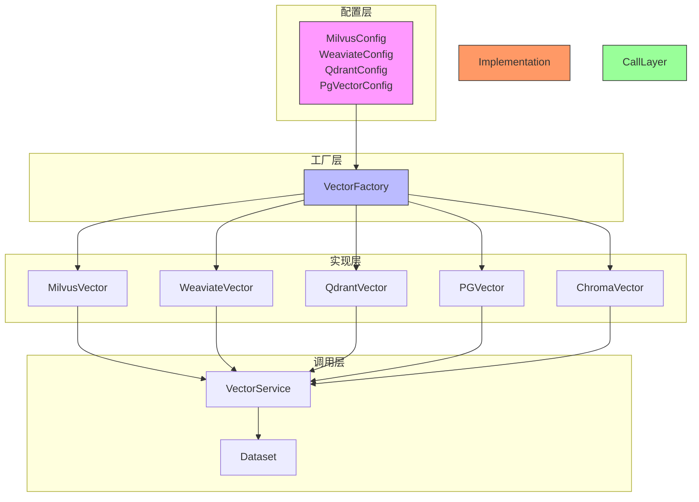

**图示来源**  
- [vector_factory.py](file://api/core/rag/datasource/vdb/vector_factory.py#L65-L123)
- [vector_type.py](file://api/core/rag/datasource/vdb/vector_type.py)
- [vector_base.py](file://api/core/rag/datasource/vdb/vector_base.py)

## 核心组件分析

### 向量数据库工厂模式

向量数据库工厂采用Python match-case语法实现类型分发，根据配置类型动态加载对应的向量数据库实现类。工厂模式确保了系统对新数据库类型的可扩展性。

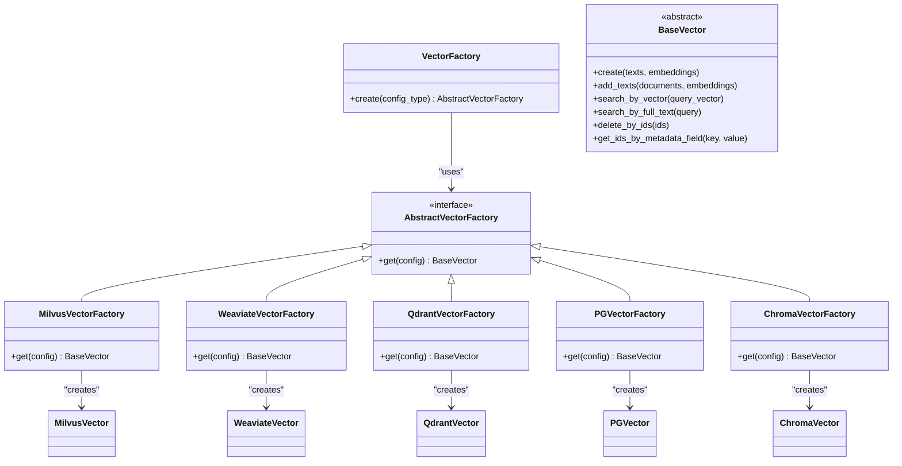

**图示来源**  
- [vector_factory.py](file://api/core/rag/datasource/vdb/vector_factory.py)
- [vector_base.py](file://api/core/rag/datasource/vdb/vector_base.py)

**本节来源**  
- [vector_factory.py](file://api/core/rag/datasource/vdb/vector_factory.py#L65-L123)
- [vector_base.py](file://api/core/rag/datasource/vdb/vector_base.py)

### 向量数据库实现基类

所有向量数据库实现均继承自BaseVector抽象基类，该类定义了向量数据库操作的标准接口，包括创建索引、添加文本、向量搜索、全文搜索、删除数据等核心方法。

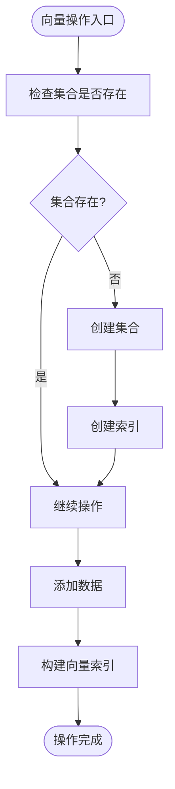

**图示来源**  
- [vector_base.py](file://api/core/rag/datasource/vdb/vector_base.py)
- [vikingdb_vector.py](file://api/core/rag/datasource/vdb/vikingdb/vikingdb_vector.py#L43-L78)

## 配置管理机制

### 配置类设计

Dify为每种向量数据库提供了独立的配置类，这些类继承自Pydantic的BaseSettings，支持环境变量注入和类型验证。配置类集中管理数据库连接参数、认证信息和性能调优参数。

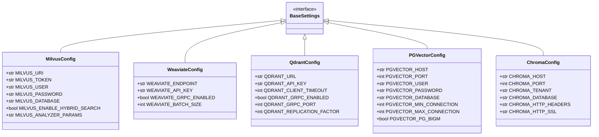

**图示来源**  
- [milvus_config.py](file://api/configs/middleware/vdb/milvus_config.py)
- [weaviate_config.py](file://api/configs/middleware/vdb/weaviate_config.py)
- [qdrant_config.py](file://api/configs/middleware/vdb/qdrant_config.py)
- [pgvector_config.py](file://api/configs/middleware/vdb/pgvector_config.py)
- [chroma_config.py](file://api/configs/middleware/vdb/chroma_config.py)

**本节来源**  
- [milvus_config.py](file://api/configs/middleware/vdb/milvus_config.py)
- [weaviate_config.py](file://api/configs/middleware/vdb/weaviate_config.py)
- [qdrant_config.py](file://api/configs/middleware/vdb/qdrant_config.py)
- [pgvector_config.py](file://api/configs/middleware/vdb/pgvector_config.py)
- [chroma_config.py](file://api/configs/middleware/vdb/chroma_config.py)

### 配置参数说明

#### Milvus配置参数
- **MILVUS_URI**: Milvus服务器的URI地址
- **MILVUS_TOKEN**: 令牌认证方式的认证令牌
- **MILVUS_USER**: 用户名认证方式的用户名
- **MILVUS_PASSWORD**: 用户名认证方式的密码
- **MILVUS_DATABASE**: 要连接的Milvus数据库名称
- **MILVUS_ENABLE_HYBRID_SEARCH**: 是否启用混合搜索功能
- **MILVUS_ANALYZER_PARAMS**: 文本分析器参数，支持中文分词

#### Weaviate配置参数
- **WEAVIATE_ENDPOINT**: Weaviate服务器的URL
- **WEAVIATE_API_KEY**: 服务器认证API密钥
- **WEAVIATE_GRPC_ENABLED**: 是否启用gRPC连接
- **WEAVIATE_BATCH_SIZE**: 批量操作的对象数量

#### Qdrant配置参数
- **QDRANT_URL**: Qdrant服务器的URL
- **QDRANT_API_KEY**: 服务器认证API密钥
- **QDRANT_CLIENT_TIMEOUT**: 客户端操作超时时间
- **QDRANT_GRPC_ENABLED**: 是否启用gRPC支持
- **QDRANT_GRPC_PORT**: gRPC连接端口号
- **QDRANT_REPLICATION_FACTOR**: 集合的复制因子

#### PgVector配置参数
- **PGVECTOR_HOST**: PostgreSQL服务器主机名
- **PGVECTOR_PORT**: PostgreSQL服务器端口号
- **PGVECTOR_USER**: 数据库认证用户名
- **PGVECTOR_PASSWORD**: 数据库认证密码
- **PGVECTOR_DATABASE**: 要连接的数据库名称
- **PGVECTOR_MIN_CONNECTION**: 数据库最小连接数
- **PGVECTOR_MAX_CONNECTION**: 数据库最大连接数
- **PGVECTOR_PG_BIGM**: 是否使用pg_bigm模块进行全文搜索

## 索引生命周期管理

### 索引创建流程

向量索引的创建遵循严格的生命周期管理，包括集合检查、集合创建、索引创建和缓存管理等步骤。系统使用Redis分布式锁确保并发环境下的操作安全。

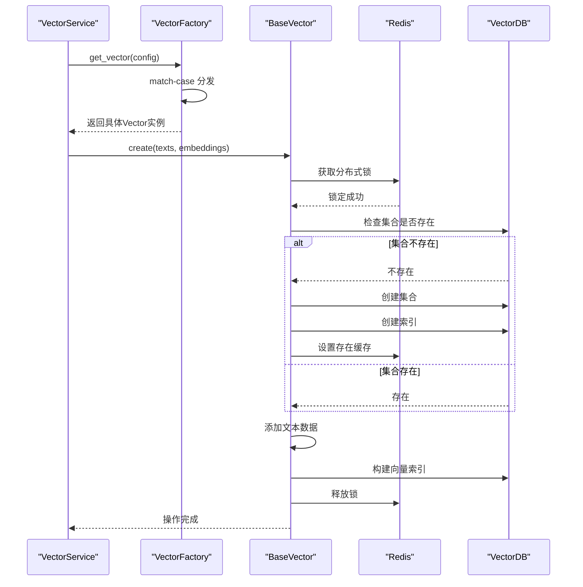

**图示来源**  
- [vector_base.py](file://api/core/rag/datasource/vdb/vector_base.py)
- [vikingdb_vector.py](file://api/core/rag/datasource/vdb/vikingdb/vikingdb_vector.py#L43-L78)
- [redis_client](file://extensions/ext_redis.py)

**本节来源**  
- [vector_base.py](file://api/core/rag/datasource/vdb/vector_base.py)
- [vikingdb_vector.py](file://api/core/rag/datasource/vdb/vikingdb/vikingdb_vector.py#L43-L78)

### 索引更新与删除

索引更新通过upsert操作实现，确保数据的一致性和完整性。索引删除操作包括集合删除和元数据清理两个步骤，确保资源的完全释放。

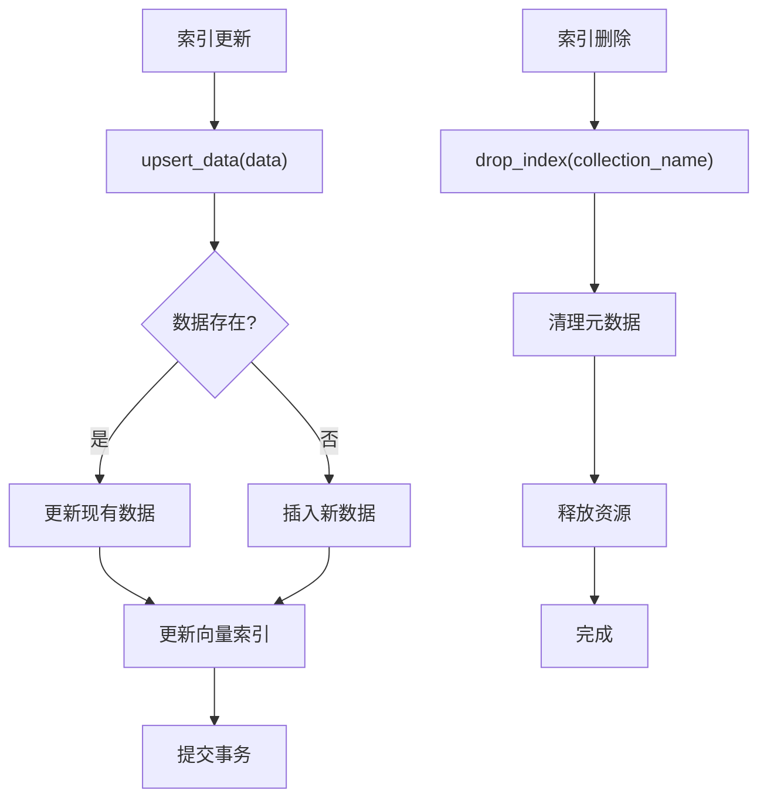

**图示来源**  
- [vikingdb_vector.py](file://api/core/rag/datasource/vdb/vikingdb/vikingdb_vector.py#L115-L156)
- [vector_base.py](file://api/core/rag/datasource/vdb/vector_base.py)

## 数据操作实现

### 数据写入流程

数据写入操作采用批量处理机制，通过配置的批量大小参数优化性能。系统将文档内容、元数据和向量嵌入打包成统一的数据结构进行存储。

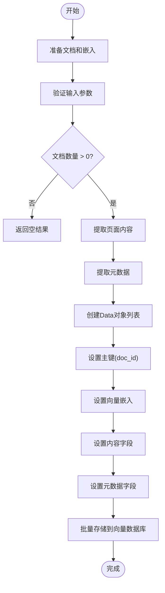

**图示来源**  
- [vikingdb_vector.py](file://api/core/rag/datasource/vdb/vikingdb/vikingdb_vector.py#L102-L131)
- [field.py](file://api/core/rag/datasource/vdb/field.py)

**本节来源**  
- [vikingdb_vector.py](file://api/core/rag/datasource/vdb/vikingdb/vikingdb_vector.py#L102-L131)
- [field.py](file://api/core/rag/datasource/vdb/field.py)

### 字段映射规范

Dify定义了统一的字段映射规范，确保不同向量数据库之间的兼容性。核心字段包括主键、向量、内容、元数据和分组键。

| 字段名称 | 字段类型 | 描述 | 示例 |
|---------|--------|------|------|
| **PRIMARY_KEY** | String | 文档主键，唯一标识 | "doc_12345" |
| **VECTOR** | Vector | 向量嵌入数据 | [-0.0076, -0.0195, 0.0088] |
| **CONTENT_KEY** | Text | 原始文本内容 | "这是一段示例文本..." |
| **METADATA_KEY** | String | JSON格式的元数据 | {"source": "/path/file.txt"} |
| **GROUP_KEY** | String | 数据集分组标识 | "dataset_67890" |

**图示来源**  
- [field.py](file://api/core/rag/datasource/vdb/field.py)
- [vikingdb_vector.py](file://api/core/rag/datasource/vdb/vikingdb/vikingdb_vector.py#L43-L78)

## 相似性搜索与查询优化

### 向量搜索实现

向量搜索通过计算查询向量与数据库中向量的相似度来实现，支持多种距离度量方式。系统返回最相似的前N个结果，支持过滤条件和输出字段控制。

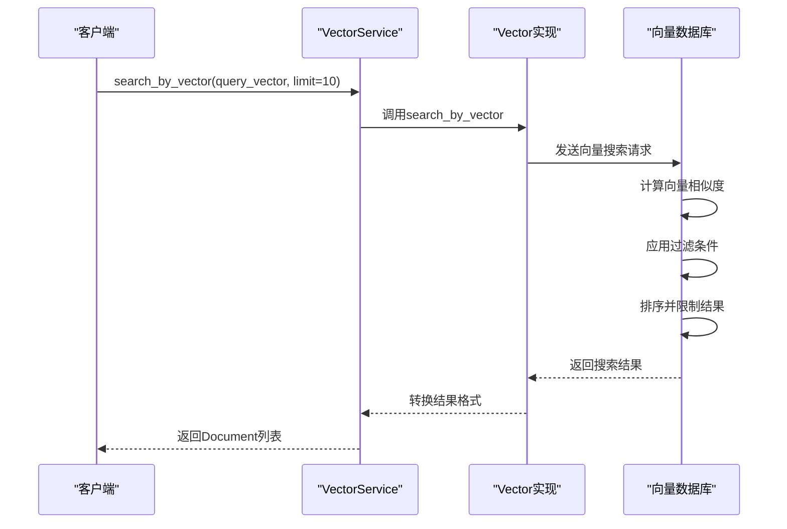

**图示来源**  
- [vikingdb_vector.py](file://api/core/rag/datasource/vdb/vikingdb/vikingdb_vector.py#L115-L156)
- [vector_base.py](file://api/core/rag/datasource/vdb/vector_base.py)

### 全文搜索实现

全文搜索利用向量数据库的标量索引功能，对文本内容进行关键词匹配。系统支持精确匹配和模糊搜索，可与向量搜索结合实现混合搜索。

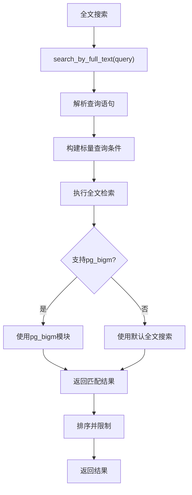

**图示来源**  
- [pgvector.py](file://api/core/rag/datasource/vdb/pgvector/pgvector.py)
- [vector_base.py](file://api/core/rag/datasource/vdb/vector_base.py)

## 多租户与安全控制

### 多租户隔离策略

Dify通过分组键（GROUP_KEY）实现多租户数据隔离，每个数据集对应唯一的分组标识。这种设计确保了不同租户数据的物理隔离和安全边界。

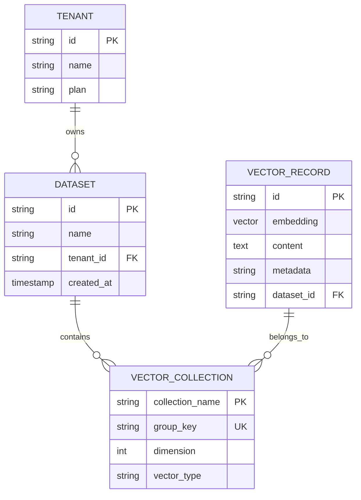

**图示来源**  
- [vikingdb_vector.py](file://api/core/rag/datasource/vdb/vikingdb/vikingdb_vector.py#L216-L243)
- [dataset.py](file://models/dataset.py)

### 安全访问控制

安全控制采用多层次防护机制，包括网络访问控制、认证授权和敏感信息保护。所有数据库连接都支持SSL/TLS加密传输。

| 安全层面 | 实现方式 | 说明 |
|---------|--------|------|
| **网络层** | VPC/防火墙 | 限制数据库访问IP范围 |
| **传输层** | SSL/TLS | 加密客户端与服务器通信 |
| **认证层** | API Key/Token | 验证客户端身份 |
| **权限层** | 角色基础访问控制 | 最小权限原则 |
| **数据层** | 敏感信息加密 | 保护认证凭据 |

**本节来源**  
- [vikingdb_vector.py](file://api/core/rag/datasource/vdb/vikingdb/vikingdb_vector.py#L216-L243)
- [configs.py](file://configs/dify_config.py)

## 故障排查指南

### 常见问题与解决方案

#### 连接超时问题
- **现象**: 数据库连接长时间无响应
- **原因**: 网络延迟、服务器负载过高、防火墙阻断
- **解决方案**: 
  - 检查网络连通性
  - 增加连接超时配置
  - 验证防火墙规则
  - 检查服务器资源使用情况

#### 维度不匹配问题
- **现象**: 向量维度与索引定义不符
- **原因**: 嵌入模型变更、配置错误
- **解决方案**:
  - 验证嵌入模型输出维度
  - 检查索引配置的维度参数
  - 重建不匹配的索引

#### 数据一致性问题
- **现象**: 搜索结果与预期不符
- **原因**: 索引未及时更新、数据同步延迟
- **解决方案**:
  - 检查索引构建状态
  - 验证数据写入确认
  - 手动触发索引重建

**本节来源**  
- [vector_base.py](file://api/core/rag/datasource/vdb/vector_base.py)
- [tasks.py](file://tasks/deal_dataset_vector_index_task.py)

## 性能基准与扩展性评估

### 性能测试指标

Dify对各向量数据库进行了全面的性能基准测试，主要指标包括：

| 数据库 | 写入吞吐量 | 查询延迟 | 扩展性 | 资源消耗 | 成本效益 |
|-------|-----------|---------|-------|---------|---------|
| **Milvus** | 高 | 低 | 极佳 | 中等 | 高 |
| **Weaviate** | 中等 | 低 | 佳 | 高 | 中等 |
| **Qdrant** | 高 | 极低 | 佳 | 中等 | 高 |
| **PgVector** | 中等 | 中等 | 良好 | 低 | 高 |
| **Chroma** | 低 | 中等 | 有限 | 低 | 中等 |

### 扩展性设计

系统采用水平扩展和垂直扩展相结合的策略，支持大规模数据处理需求。通过分布式架构和负载均衡，可轻松应对高并发场景。

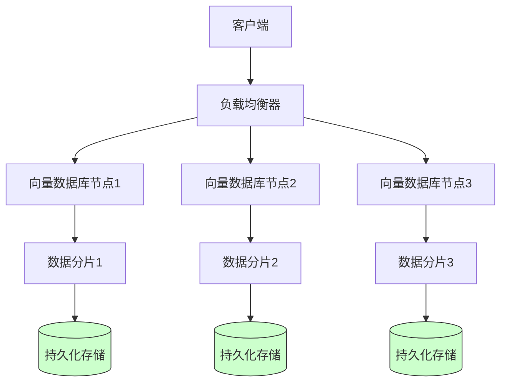

**图示来源**  
- [vector_factory.py](file://api/core/rag/datasource/vdb/vector_factory.py)
- [vector_base.py](file://api/core/rag/datasource/vdb/vector_base.py)