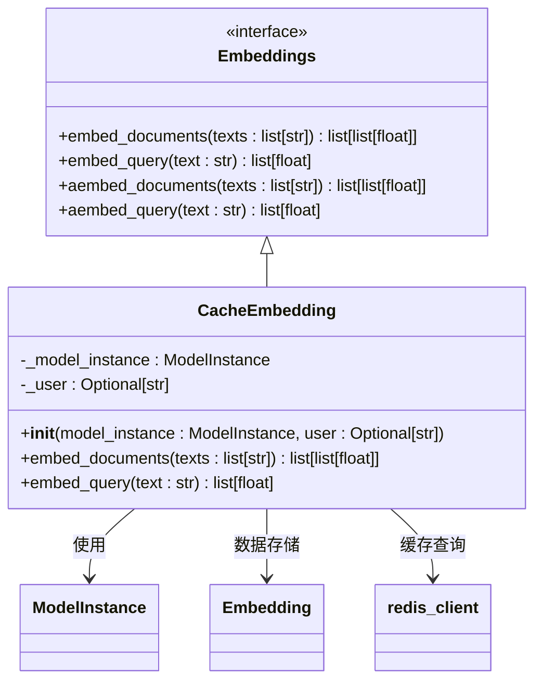
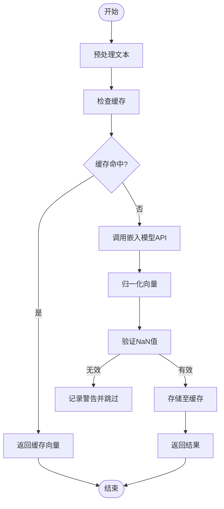
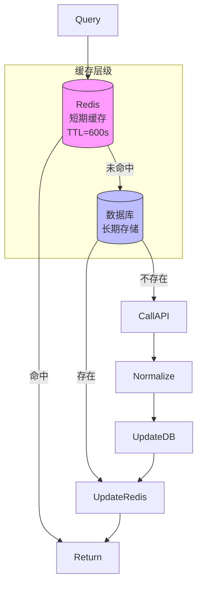
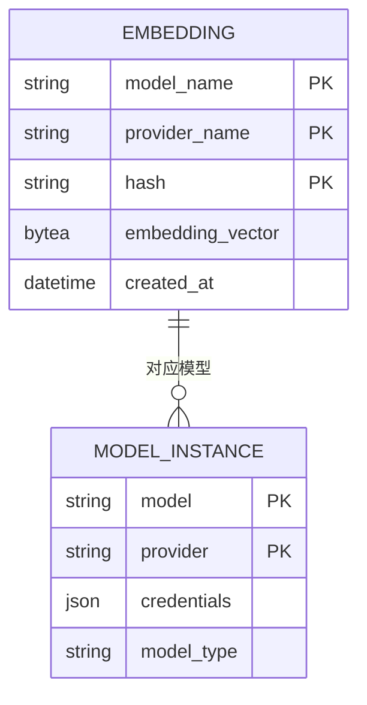
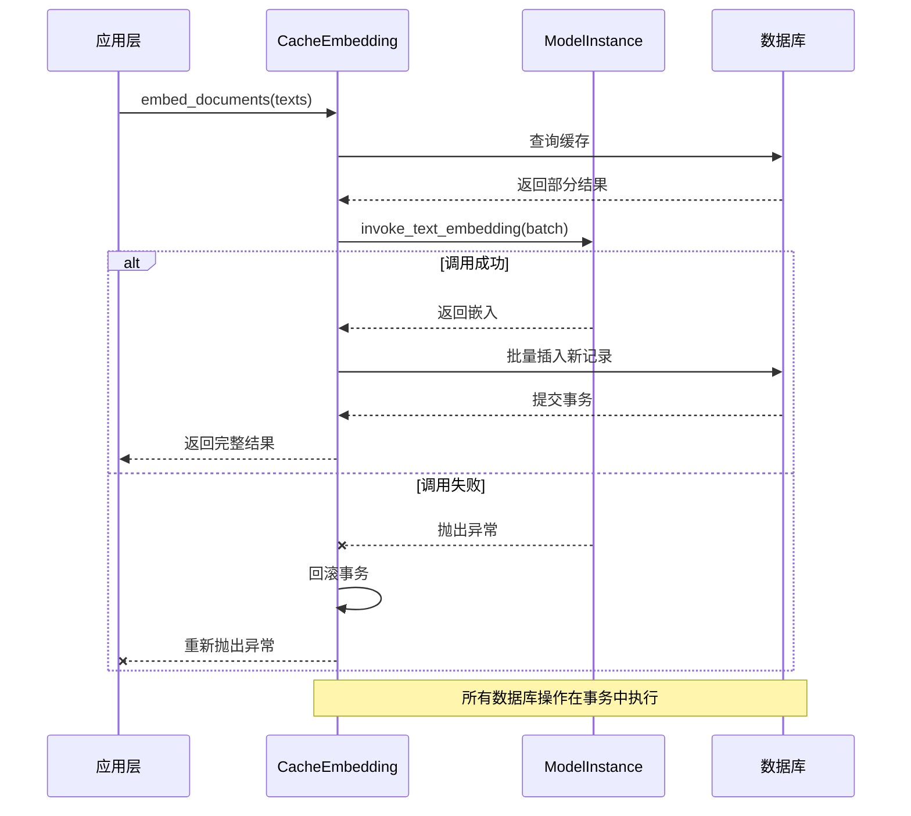

# 嵌入模型

<cite>
**本文档引用文件**  
- [embedding_base.py](file://api/core/rag/embedding/embedding_base.py)
- [cached_embedding.py](file://api/core/rag/embedding/cached_embedding.py)
- [embedding_type.py](file://api/core/entities/embedding_type.py)
- [model_manager.py](file://api/core/model_manager.py)
- [text_embedding_model.py](file://api/core/model_runtime/model_providers/__base/text_embedding_model.py)
- [models.py](file://api/models/dataset.py)
</cite>

## 目录
1. [简介](#简介)
2. [核心架构与实现机制](#核心架构与实现机制)
3. [文本向量化流程详解](#文本向量化流程详解)
4. [缓存策略分析](#缓存策略分析)
5. [支持的嵌入模型类型与配置](#支持的嵌入模型类型与配置)
6. [性能优化与调优建议](#性能优化与调优建议)
7. [扩展新嵌入模型的方法](#扩展新嵌入模型的方法)
8. [容错与异常处理机制](#容错与异常处理机制)
9. [结论](#结论)

## 简介
Dify平台提供了一套完整的嵌入模型集成方案，用于将文本内容转换为高维向量表示。该系统通过`embedding_base.py`定义统一接口，并在`cached_embedding.py`中实现具体的向量化与缓存逻辑。本技术文档详细解析其内部工作机制，涵盖预处理、分块、向量化、缓存策略及错误处理等关键环节。

## 核心架构与实现机制

**图示来源**  
- [embedding_base.py](file://api/core/rag/embedding/embedding_base.py#L1-L24)
- [cached_embedding.py](file://api/core/rag/embedding/cached_embedding.py#L1-L144)

**本节来源**  
- [embedding_base.py](file://api/core/rag/embedding/embedding_base.py#L1-L24)
- [cached_embedding.py](file://api/core/rag/embedding/cached_embedding.py#L1-L144)

### 接口抽象层设计
`Embeddings` 是一个抽象基类，定义了所有嵌入模型必须实现的接口方法：
- `embed_documents`: 批量嵌入文档文本
- `embed_query`: 嵌入查询文本
- 异步版本支持非阻塞调用

该设计遵循依赖倒置原则，使得上层应用无需关心具体模型实现。

### 模型实例管理
`ModelInstance` 类负责封装模型调用所需的所有上下文信息：
- 模型名称与提供者
- 认证凭证
- 负载均衡配置
- 实际模型运行时实例

通过统一的 `invoke_text_embedding` 方法发起向量转换请求。

## 文本向量化流程详解

**图示来源**  
- [cached_embedding.py](file://api/core/rag/embedding/cached_embedding.py#L30-L144)

**本节来源**  
- [cached_embedding.py](file://api/core/rag/embedding/cached_embedding.py#L30-L144)
- [text_embedding_model.py](file://api/core/model_runtime/model_providers/__base/text_embedding_model.py#L11-L104)

### 文档嵌入流程（批量处理）
1. **输入处理**：接收文本列表，初始化空嵌入结果数组
2. **数据库缓存检查**：对每段文本生成哈希值，在数据库中查找已有嵌入
3. **缺失项补全**：
   - 收集未命中缓存的文本索引
   - 按模型最大分块数（MAX_CHUNKS）分批调用API
   - 归一化输出向量并验证数值有效性
4. **持久化存储**：将新生成的嵌入写入数据库，确保后续可复用

### 查询嵌入流程（单次处理）
1. **Redis缓存查询**：使用“提供者_模型_哈希”作为键名快速检索
2. **缓存未命中处理**：
   - 调用模型API获取嵌入
   - 归一化并Base64编码后存入Redis（TTL=600秒）
3. **缓存更新**：成功后延长缓存有效期

## 缓存策略分析

**图示来源**  
- [cached_embedding.py](file://api/core/rag/embedding/cached_embedding.py#L100-L144)

**本节来源**  
- [cached_embedding.py](file://api/core/rag/embedding/cached_embedding.py#L50-L144)
- [models.py](file://api/models/dataset.py#L1-L1)

### 双层缓存架构
系统采用两级缓存机制以平衡性能与成本：
- **Redis缓存**：用于高频访问的查询向量，设置600秒过期时间
- **数据库持久化**：用于文档嵌入的长期存储，避免重复计算

### 缓存键设计
- **Redis键格式**：`{provider}_{model}_{text_hash}`
- **数据库唯一约束**：`(model_name, hash)` 组合保证唯一性

### 缓存失效与清理
系统通过定时任务定期清理过期嵌入缓存，防止数据库膨胀。

## 支持的嵌入模型类型与配置

**图示来源**  
- [cached_embedding.py](file://api/core/rag/embedding/cached_embedding.py#L30-L80)
- [model_manager.py](file://api/core/model_manager.py#L29-L392)

**本节来源**  
- [model_manager.py](file://api/core/model_manager.py#L29-L392)
- [text_embedding_model.py](file://api/core/model_runtime/model_providers/__base/text_embedding_model.py#L11-L104)

### 支持的模型类型
根据代码分析，系统支持以下类型的嵌入模型：
- **OpenAI**：text-embedding-ada-002 等官方模型
- **Hugging Face**：通过API集成的开源模型
- **本地部署模型**：支持OpenAI兼容接口的自托管服务
- **专用提供商**：如Cohere、Tencent等商业API

### 配置方法
1. **API密钥管理**：
   - 通过`ProviderConfiguration`集中管理
   - 支持租户级隔离与权限控制
2. **模型参数调优**：
   - `MAX_CHUNKS`：控制单次API调用的文本数量
   - `CONTEXT_SIZE`：影响分块策略的上下文长度
3. **输入类型区分**：
   - `EmbeddingInputType.DOCUMENT`：文档嵌入
   - `EmbeddingInputType.QUERY`：查询嵌入

## 性能优化与调优建议

| 优化维度 | 建议措施 | 效果评估 |
|---------|--------|--------|
| **批处理** | 合并小批量请求为大批次 | 减少网络开销，提升吞吐量 |
| **缓存命中率** | 预加载常用文档嵌入 | 降低API调用频率 |
| **向量归一化** | 统一使用L2归一化 | 提升检索准确性 |
| **错误容忍** | 对NaN向量进行过滤 | 防止异常数据污染索引 |
| **连接池** | 复用HTTP连接 | 降低延迟 |

**本节来源**  
- [cached_embedding.py](file://api/core/rag/embedding/cached_embedding.py#L60-L90)
- [model_manager.py](file://api/core/model_manager.py#L350-L392)

## 扩展新嵌入模型的方法

### 接口定义
新模型需实现 `TextEmbeddingModel` 抽象类，重写 `invoke` 和 `get_num_tokens` 方法。

### 适配器开发步骤
1. 创建新的模型提供者模块
2. 实现模型发现与元数据获取逻辑
3. 封装API调用协议（REST/gRPC）
4. 注册到全局模型管理器

### 测试验证流程
1. 单元测试：验证基本嵌入功能
2. 集成测试：检查缓存一致性
3. 性能测试：测量延迟与吞吐量
4. 准确性测试：使用标准数据集评估语义相似度

**本节来源**  
- [text_embedding_model.py](file://api/core/model_runtime/model_providers/__base/text_embedding_model.py#L11-L104)
- [model_manager.py](file://api/core/model_manager.py#L29-L392)

## 容错与异常处理机制

**图示来源**  
- [cached_embedding.py](file://api/core/rag/embedding/cached_embedding.py#L70-L100)
- [model_manager.py](file://api/core/model_manager.py#L350-L370)

**本节来源**  
- [cached_embedding.py](file://api/core/rag/embedding/cached_embedding.py#L70-L144)
- [model_manager.py](file://api/core/model_manager.py#L350-L392)

### 异常类型处理
- **数据库完整性错误**：捕获`IntegrityError`并回滚事务
- **API调用失败**：记录日志并在DEBUG模式下抛出详细信息
- **数值异常**：检测NaN值并拒绝存储无效嵌入
- **连接超时**：由底层HTTP客户端处理重试逻辑

### 负载均衡与降级
`ModelInstance` 支持多凭证轮询调用，在遇到速率限制时自动切换到备用凭证。

## 结论
Dify的嵌入模型集成系统采用清晰的分层架构，通过抽象接口与具体实现分离，实现了高可扩展性。其双层缓存策略有效降低了API成本，而完善的错误处理机制保障了系统的稳定性。开发者可基于现有框架轻松集成新的嵌入模型，满足多样化的应用场景需求。