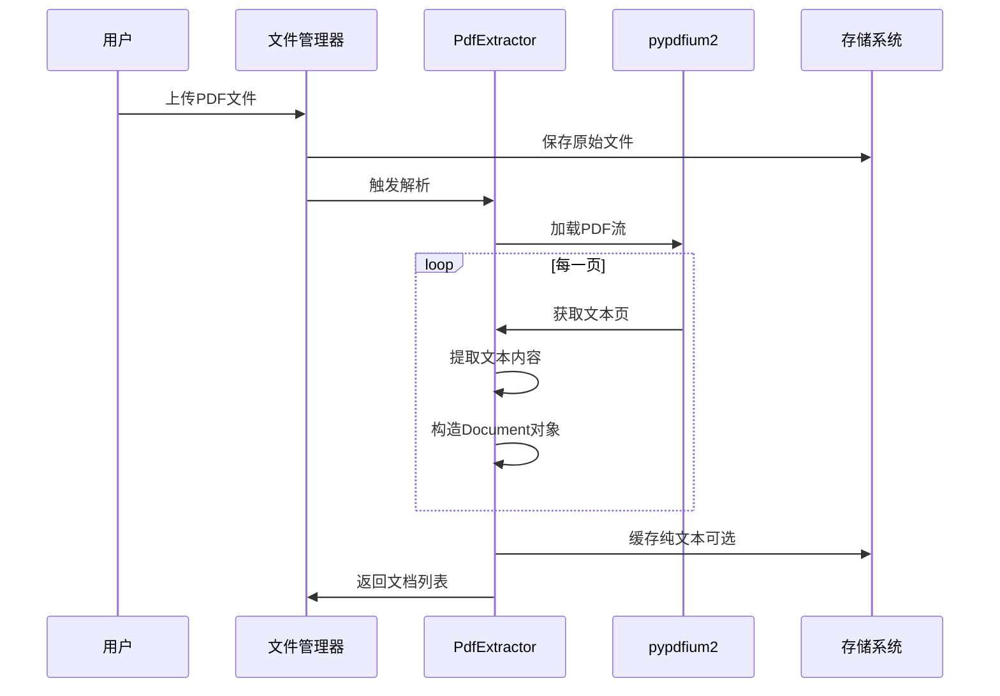

# 数据预处理

<cite>
**本文档中引用的文件**  
- [pdf_extractor.py](file://api/core/rag/extractor/pdf_extractor.py)
- [word_extractor.py](file://api/core/rag/extractor/word_extractor.py)
- [excel_extractor.py](file://api/core/rag/extractor/excel_extractor.py)
- [html_extractor.py](file://api/core/rag/extractor/html_extractor.py)
- [markdown_extractor.py](file://api/core/rag/extractor/markdown_extractor.py)
- [text_extractor.py](file://api/core/rag/extractor/text_extractor.py)
- [fixed_text_splitter.py](file://api/core/rag/splitter/fixed_text_splitter.py)
- [text_splitter.py](file://api/core/rag/splitter/text_splitter.py)
- [extractor_base.py](file://api/core/rag/extractor/extractor_base.py)
- [document.py](file://api/core/rag/models/document.py)
</cite>

## 目录
1. [简介](#简介)
2. [文档上传与格式解析](#文档上传与格式解析)
3. [内容提取机制](#内容提取机制)
4. [文本分块策略](#文本分块策略)
5. [异常处理与性能优化](#异常处理与性能优化)
6. [常见问题与解决方案](#常见问题与解决方案)
7. [总结](#总结)

## 简介

Dify RAG（检索增强生成）管道中的数据预处理环节是确保高质量检索结果的关键步骤。该流程涵盖从文档上传、格式解析、内容提取到文本分块的完整链条，支持多种文件类型，包括PDF、Word、Excel、HTML、Markdown和纯文本等。本文档详细说明各环节的技术实现、所用解析库、异常处理机制及优化策略，旨在为开发者提供全面的技术参考。

## 文档上传与格式解析

文档上传是RAG管道的第一步，系统通过统一接口接收用户上传的文件，并根据文件MIME类型自动识别其格式。上传后的文件被暂存于分布式存储系统中，供后续处理使用。

系统支持以下主要文件格式及其对应的解析器：

- **PDF**：使用 `pypdfium2` 库进行解析，逐页提取文本内容。
- **Word (.docx)**：使用 `python-docx` 库解析文档结构，提取段落、表格和图片链接。
- **Excel (.xlsx/.xls)**：使用 `pandas` 和 `openpyxl` 解析工作表数据，保留单元格超链接信息。
- **HTML**：使用 `BeautifulSoup` 提取页面正文文本，去除标签。
- **Markdown**：自定义解析器处理标题层级、超链接和图片引用。
- **纯文本**：直接读取文件内容，支持编码自动检测。

**Section sources**
- [pdf_extractor.py](file://api/core/rag/extractor/pdf_extractor.py#L1-L67)
- [word_extractor.py](file://api/core/rag/extractor/word_extractor.py#L1-L289)
- [excel_extractor.py](file://api/core/rag/extractor/excel_extractor.py#L1-L77)
- [html_extractor.py](file://api/core/rag/extractor/html_extractor.py#L1-L32)
- [markdown_extractor.py](file://api/core/rag/extractor/markdown_extractor.py#L1-L122)
- [text_extractor.py](file://api/core/rag/extractor/text_extractor.py#L1-L49)

## 内容提取机制

### PDF内容提取

PDF文件通过 `PdfExtractor` 类进行处理。该类利用 `pypdfium2` 库加载PDF文档，逐页调用 `get_textpage().get_text_range()` 方法提取纯文本内容。每页内容作为独立的 `Document` 对象输出，附带页码和源文件路径元数据。



**Diagram sources**
- [pdf_extractor.py](file://api/core/rag/extractor/pdf_extractor.py#L1-L67)

### Word文档提取

`WordExtractor` 类负责处理 `.docx` 文件。它不仅提取文本内容，还解析表格并将其转换为Markdown格式。此外，系统会提取嵌入的图片，上传至对象存储，并在文档中替换为可访问的URL链接。超链接信息也被保留并格式化为 `[文本](链接)` 形式。

**Section sources**
- [word_extractor.py](file://api/core/rag/extractor/word_extractor.py#L1-L289)

### Excel数据提取

Excel文件由 `ExcelExtractor` 处理，支持 `.xlsx` 和 `.xls` 格式。系统遍历每个工作表，将每一行数据转换为键值对字符串（如 `"列名":"值"`），并以分号连接形成段落内容。单元格中的超链接会被保留并嵌入到输出文本中。

**Section sources**
- [excel_extractor.py](file://api/core/rag/extractor/excel_extractor.py#L1-L77)

### HTML与Markdown提取

HTML文件通过 `BeautifulSoup` 解析，提取 `<body>` 内的纯文本内容，去除所有HTML标签。Markdown文件则使用自定义解析器，支持按标题层级分割内容，并可选择性移除超链接或图片引用。系统还支持编码自动检测，以应对不同语言环境下的乱码问题。

**Section sources**
- [html_extractor.py](file://api/core/rag/extractor/html_extractor.py#L1-L32)
- [markdown_extractor.py](file://api/core/rag/extractor/markdown_extractor.py#L1-L122)

### 纯文本提取

`TextExtractor` 类用于处理 `.txt` 文件。它尝试使用指定编码读取文件，若失败则启用编码自动检测功能（基于 `chardet` 或类似库），确保中文、日文等多语言文本能正确解码。

**Section sources**
- [text_extractor.py](file://api/core/rag/extractor/text_extractor.py#L1-L49)

## 文本分块策略

文本分块是RAG管道中的关键步骤，直接影响检索的精度与效率。Dify提供了两种主要的分块方式：固定长度分块和语义分块。

### 固定长度分块

固定长度分块由 `fixed_text_splitter.py` 实现，将文本按指定字符数（如512或1024）切分为块，并设置重叠长度（如50字符）以保持上下文连贯性。该方法简单高效，适用于大多数场景。

```python
# 示例：配置固定分块器
splitter = FixedTextSplitter(chunk_size=512, chunk_overlap=50)
documents = splitter.split_text(raw_text)
```

### 语义分块

语义分块（在 `text_splitter.py` 中扩展实现）基于自然语言边界（如句子、段落）进行切分，优先在句号、换行符等位置断开，避免在单词或短语中间切割。此方法能更好地保持语义完整性，提升检索相关性。

#### 参数配置建议：
- **分块大小（chunk_size）**：推荐512~1024字符，平衡上下文长度与检索效率。
- **重叠长度（chunk_overlap）**：建议为分块大小的10%~20%，防止关键信息被截断。
- **语言适配**：中文文本应避免在词语中间切分，需结合中文分词逻辑优化。

**Section sources**
- [fixed_text_splitter.py](file://api/core/rag/splitter/fixed_text_splitter.py)
- [text_splitter.py](file://api/core/rag/splitter/text_splitter.py)

## 异常处理与性能优化

### 异常处理策略

- **文件路径无效**：检查是否为本地路径或有效URL，网络文件需通过SSRF代理安全下载。
- **编码错误**：启用 `autodetect_encoding` 自动探测文件编码，支持UTF-8、GBK、Shift_JIS等常见编码。
- **格式不支持**：对非标准扩展名文件，通过魔数（magic number）识别真实格式。
- **资源释放**：使用 `contextlib` 确保PDF句柄、临时文件等资源及时关闭。

### 性能优化建议

- **缓存机制**：已解析的PDF纯文本可缓存至对象存储，避免重复解析。
- **异步处理**：大文件解析任务放入Celery队列，防止阻塞主线程。
- **批量处理**：支持多文档并行解析，充分利用多核CPU资源。
- **内存控制**：对超大Excel文件，采用流式读取而非全量加载。

## 常见问题与解决方案

| 问题现象 | 可能原因 | 解决方案 |
|--------|--------|--------|
| 中文乱码 | 文件编码未正确识别 | 启用 `autodetect_encoding=True` |
| 图片丢失 | 图片未上传或URL生成失败 | 检查存储配置及 `dify_config.FILES_URL` 设置 |
| 表格格式错乱 | 表格合并单元格未正确处理 | 优化 `_parse_row` 逻辑，支持 `grid_span` 属性 |
| 超链接失效 | HYPERLINK字段解析失败 | 增强XML解析健壮性，捕获异常并降级处理 |
| 解析速度慢 | 单线程处理大量文件 | 启用异步任务队列，实现并发处理 |

## 总结

Dify RAG管道的数据预处理模块具备强大的多格式支持能力与灵活的文本分块策略。通过合理的参数配置与异常处理机制，能够有效应对各种实际应用场景中的挑战。未来可进一步引入AI驱动的语义分块算法，提升检索质量。