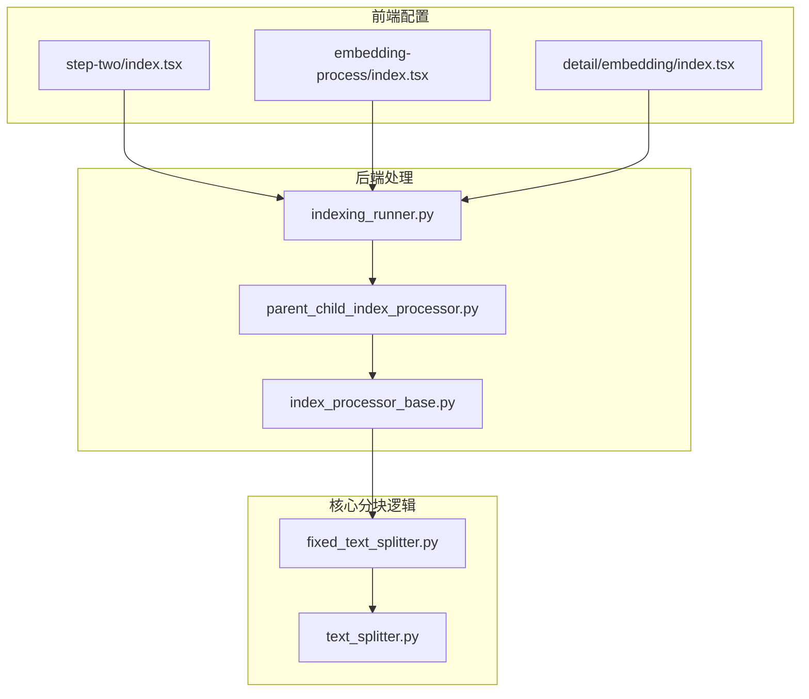
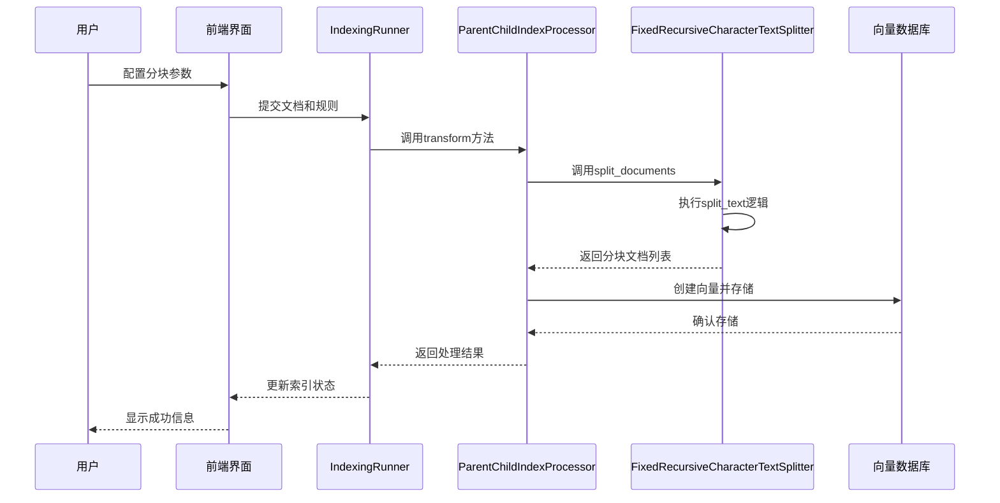
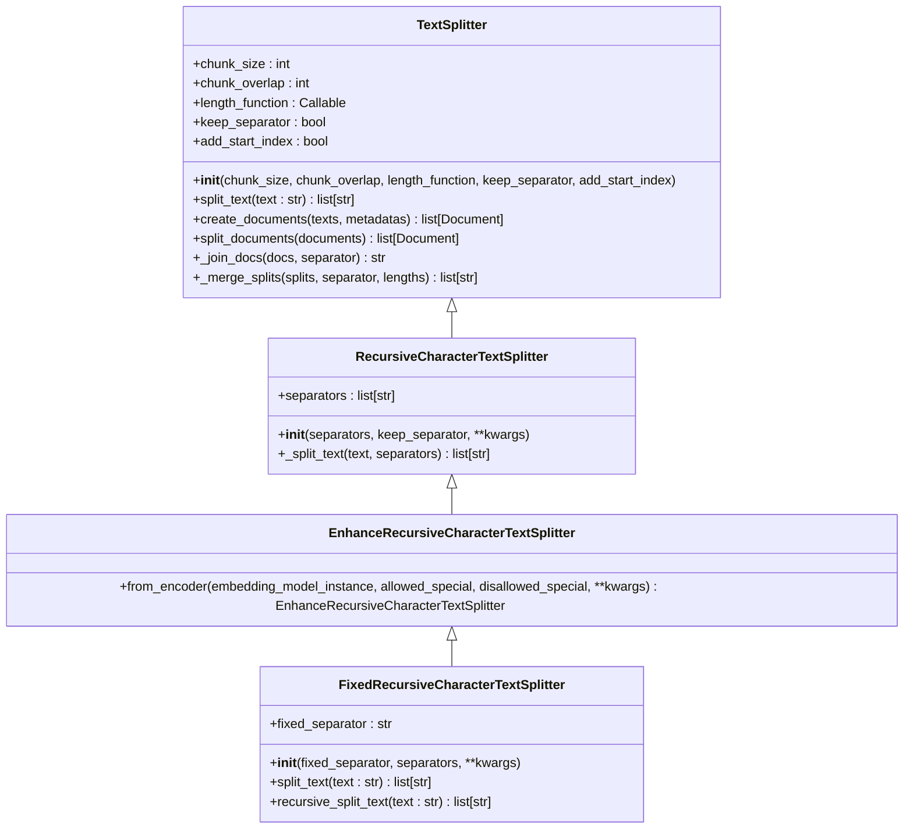
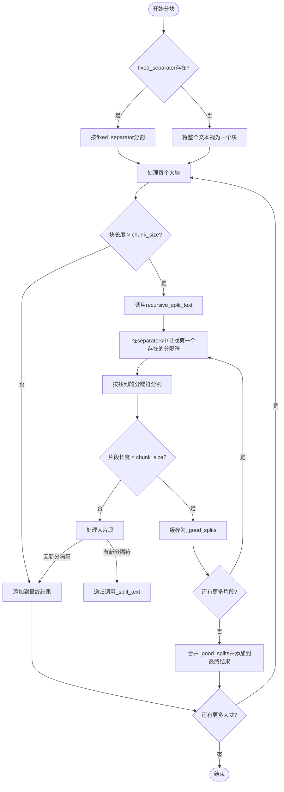
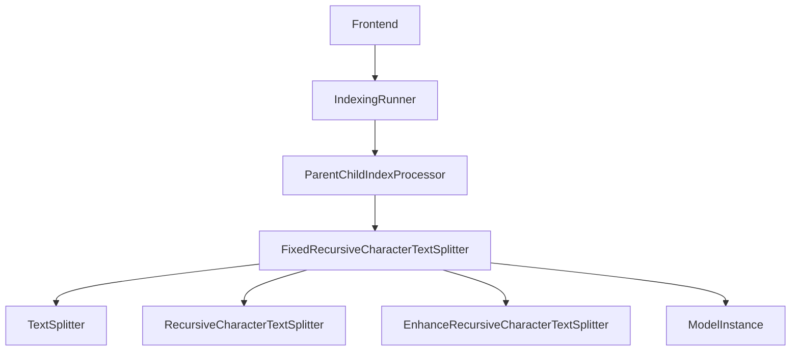

# 文本分块

<cite>
**本文档引用的文件**  
- [fixed_text_splitter.py](file://api/core/rag/splitter/fixed_text_splitter.py)
- [text_splitter.py](file://api/core/rag/splitter/text_splitter.py)
- [indexing_runner.py](file://api/core/indexing_runner.py)
- [parent_child_index_processor.py](file://api/core/rag/index_processor/processor/parent_child_index_processor.py)
- [index_processor_base.py](file://api/core/rag/index_processor/index_processor_base.py)
- [step-two/index.tsx](file://web/app/components/datasets/create/step-two/index.tsx)
- [embedding-process/index.tsx](file://web/app/components/datasets/create/embedding-process/index.tsx)
- [detail/embedding/index.tsx](file://web/app/components/datasets/documents/detail/embedding/index.tsx)
</cite>

## 目录
1. [引言](#引言)
2. [项目结构](#项目结构)
3. [核心组件](#核心组件)
4. [架构概述](#架构概述)
5. [详细组件分析](#详细组件分析)
6. [依赖分析](#依赖分析)
7. [性能考虑](#性能考虑)
8. [故障排除指南](#故障排除指南)
9. [结论](#结论)

## 引言
本文档深入探讨Dify RAG（检索增强生成）管道中的文本分块环节，重点分析固定长度分块和语义分块的实现原理与配置方法。详细说明`fixed_text_splitter.py`中分块大小、重叠长度等参数的设置对检索效果的影响，以及如何根据文档类型和应用场景进行优化。阐述文本分块在索引构建流程中的作用，包括与向量化、检索阶段的协同工作方式。提供实际配置示例和代码片段，展示如何在不同场景下调整分块策略。讨论长文档处理、段落完整性保持、特殊符号处理等高级话题，并提供性能调优建议和常见问题（如信息割裂、上下文丢失）的解决方案。

## 项目结构
Dify的文本分块功能主要集中在`api/core/rag/splitter/`目录下，核心实现位于`fixed_text_splitter.py`和`text_splitter.py`文件中。该功能通过`indexing_runner.py`和`parent_child_index_processor.py`等模块集成到整体的索引构建流程中。前端配置界面位于`web/app/components/datasets/create/`目录下，允许用户自定义分块参数。



**图示来源**
- [step-two/index.tsx](file://web/app/components/datasets/create/step-two/index.tsx)
- [indexing_runner.py](file://api/core/indexing_runner.py)
- [parent_child_index_processor.py](file://api/core/rag/index_processor/processor/parent_child_index_processor.py)
- [index_processor_base.py](file://api/core/rag/index_processor/index_processor_base.py)
- [fixed_text_splitter.py](file://api/core/rag/splitter/fixed_text_splitter.py)
- [text_splitter.py](file://api/core/rag/splitter/text_splitter.py)

## 核心组件
文本分块的核心组件是`FixedRecursiveCharacterTextSplitter`类，它继承自`EnhanceRecursiveCharacterTextSplitter`，并最终实现`TextSplitter`接口。该组件负责将原始文档文本分割成适合向量化和检索的较小片段。关键参数包括`chunk_size`（分块大小）、`chunk_overlap`（重叠长度）和`fixed_separator`（固定分隔符），这些参数直接影响最终的检索效果和上下文连贯性。

**节来源**
- [fixed_text_splitter.py](file://api/core/rag/splitter/fixed_text_splitter.py)
- [text_splitter.py](file://api/core/rag/splitter/text_splitter.py)

## 架构概述
文本分块是Dify RAG管道中索引构建阶段的关键步骤。当用户上传文档或设置数据集时，系统会根据预设的处理规则（`DatasetProcessRule`）创建一个`FixedRecursiveCharacterTextSplitter`实例。该实例随后被`ParentChildIndexProcessor`等索引处理器调用，对文档内容进行分割。分块后的文本片段被送入向量模型进行嵌入，最终存储到向量数据库中，为后续的检索阶段提供支持。



**图示来源**
- [indexing_runner.py](file://api/core/indexing_runner.py)
- [parent_child_index_processor.py](file://api/core/rag/index_processor/processor/parent_child_index_processor.py)
- [fixed_text_splitter.py](file://api/core/rag/splitter/fixed_text_splitter.py)

## 详细组件分析

### 固定长度分块器分析
`FixedRecursiveCharacterTextSplitter`实现了两种分块策略：首先使用用户指定的`fixed_separator`进行初步分割，然后对每个过大的片段递归地应用`separators`列表（如`["\n\n", "\n", " ", ""]`）进行进一步分割。这种方法结合了语义分块和固定长度分块的优点，既能在段落、句子等自然边界处进行分割以保持上下文，又能通过`chunk_size`参数确保最终的块大小适合模型处理。

#### 类图


**图示来源**
- [text_splitter.py](file://api/core/rag/splitter/text_splitter.py)
- [fixed_text_splitter.py](file://api/core/rag/splitter/fixed_text_splitter.py)

#### 分块流程分析
分块的核心逻辑在`split_text`和`recursive_split_text`方法中。首先，文本会根据`fixed_separator`被分割成大块。然后，对于每一个大块，如果其长度超过`chunk_size`，就会进入`recursive_split_text`方法。该方法会遍历`separators`列表，寻找文本中存在的第一个分隔符，并据此进行分割。分割后的片段会尝试合并，直到总长度接近`chunk_size`，然后作为一个完整的块输出。`chunk_overlap`参数确保了相邻块之间有部分内容重叠，有助于缓解信息割裂问题。



**图示来源**
- [fixed_text_splitter.py](file://api/core/rag/splitter/fixed_text_splitter.py)

### 配置与优化
用户可以通过前端界面（如`step-two/index.tsx`）配置`max_tokens`（即`chunk_size`）、`overlap`（即`chunk_overlap`）和`segmentIdentifier`（即`fixed_separator`）等参数。对于技术文档或代码，建议使用较小的`chunk_size`（如512）和特定的`fixed_separator`（如"```"）以保持代码块的完整性。对于长篇小说或报告，可以使用较大的`chunk_size`（如1024）和`\n\n`作为`fixed_separator`，以确保段落的完整性。`chunk_overlap`通常设置为`chunk_size`的10%-20%，以平衡上下文连贯性和存储成本。

**节来源**
- [step-two/index.tsx](file://web/app/components/datasets/create/step-two/index.tsx)
- [embedding-process/index.tsx](file://web/app/components/datasets/create/embedding-process/index.tsx)
- [detail/embedding/index.tsx](file://web/app/components/datasets/documents/detail/embedding/index.tsx)

## 依赖分析
文本分块组件依赖于`TextSplitter`基类提供的通用功能，如`_merge_splits`和`create_documents`。它通过`embedding_model_instance`与模型运行时模块交互，以获取准确的token计数。索引处理器（如`ParentChildIndexProcessor`）依赖于分块器来提供结构化的输入。前端组件依赖于后端API来获取和提交分块配置。



**图示来源**
- [fixed_text_splitter.py](file://api/core/rag/splitter/fixed_text_splitter.py)
- [text_splitter.py](file://api/core/rag/splitter/text_splitter.py)
- [parent_child_index_processor.py](file://api/core/rag/index_processor/processor/parent_child_index_processor.py)
- [indexing_runner.py](file://api/core/indexing_runner.py)

## 性能考虑
分块操作的性能主要受文档大小和`chunk_size`的影响。过小的`chunk_size`会导致生成大量的向量，增加存储和检索的开销。过大的`chunk_size`则可能超出模型的上下文窗口，导致信息丢失。建议根据实际使用的嵌入模型的最大token限制来设置`chunk_size`，并留有一定的余量。对于超长文档，可以考虑使用分层索引（Hierarchical Indexing），先将文档分割成大段落，再对每个段落进行细粒度分块。

## 故障排除指南
常见的文本分块问题包括信息割裂和上下文丢失。信息割裂通常由`chunk_overlap`设置过小或`fixed_separator`选择不当引起，解决方案是适当增加重叠长度或选择更合适的分隔符。上下文丢失则可能是因为`chunk_size`过大，导致单个块内信息过于分散，应减小分块大小或将文档按章节等逻辑单元预先分割。此外，应确保`fixed_separator`在文档中真实存在，否则分块器会退化为纯递归字符分割，可能导致在单词中间被切断。

**节来源**
- [fixed_text_splitter.py](file://api/core/rag/splitter/fixed_text_splitter.py)
- [parent_child_index_processor.py](file://api/core/rag/index_processor/processor/parent_child_index_processor.py)

## 结论
Dify的文本分块机制通过`FixedRecursiveCharacterTextSplitter`类提供了一个灵活且强大的解决方案，能够有效平衡语义完整性和固定长度的要求。通过合理配置`chunk_size`、`chunk_overlap`和`fixed_separator`等参数，用户可以针对不同类型的文档和应用场景优化其RAG系统的检索效果。未来可以考虑引入更先进的语义分块算法，如基于句子嵌入相似度的分块，以进一步提升长文档处理的质量。