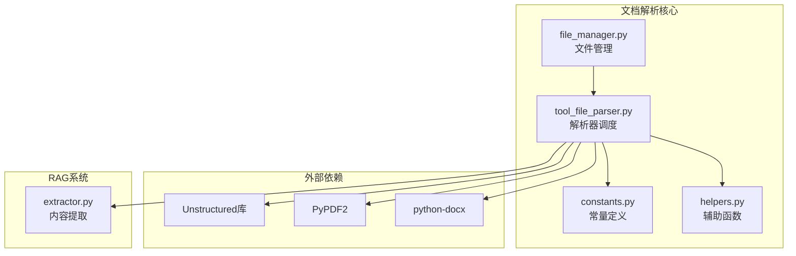
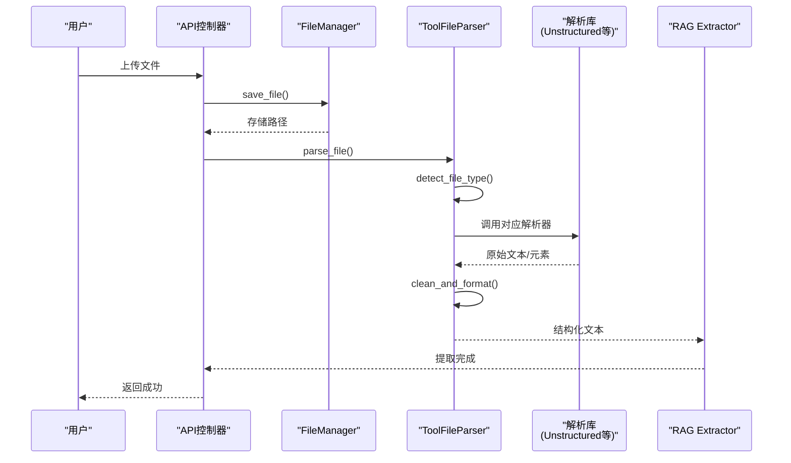
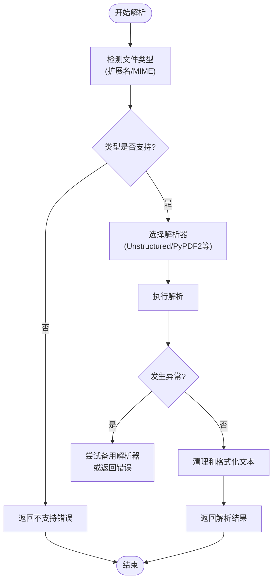
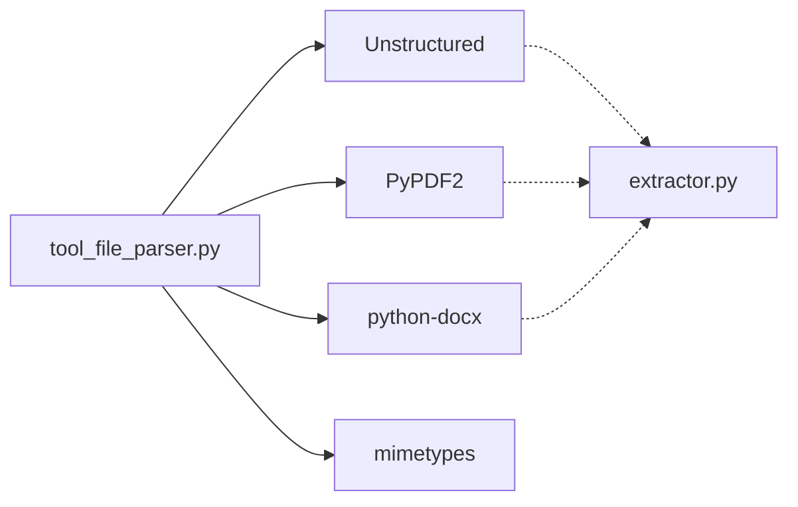

# 文档解析

<cite>
**本文档引用文件**  
- [tool_file_parser.py](file://api/core/file/tool_file_parser.py)
- [file_manager.py](file://api/core/file/file_manager.py)
- [constants.py](file://api/core/file/constants.py)
- [mimetypes.py](file://api/constants/mimetypes.py)
- [helpers.py](file://api/core/file/helpers.py)
- [extractor.py](file://api/core/rag/extractor/watercrawl/extractor.py)
</cite>

## 目录
1. [简介](#简介)
2. [项目结构](#项目结构)
3. [核心组件](#核心组件)
4. [架构概述](#架构概述)
5. [详细组件分析](#详细组件分析)
6. [依赖分析](#依赖分析)
7. [性能考虑](#性能考虑)
8. [故障排除指南](#故障排除指南)
9. [结论](#结论)

## 简介
本文档详细阐述Dify RAG（检索增强生成）管道中**文档解析环节**的技术实现机制。重点介绍系统如何对PDF、Word、Excel、HTML、Markdown等多种格式文件进行内容提取，涵盖文本、表格、元数据的处理流程。文档将深入解析系统调用Unstructured、PyPDF2、python-docx等第三方库的逻辑，说明异常处理策略（如损坏文件、编码问题）和性能优化措施。同时，提供从文件上传到内容提取的完整流程示例，并讨论多语言文档（如中文、英文）处理的差异及字符编码问题，最后提供常见问题（如格式丢失、乱码、表格解析错误）的解决方案与调试方法。

## 项目结构
Dify的文档解析功能主要集中在`api/core/file/`目录下，其核心模块包括文件管理、解析器工具和常量定义。该模块与RAG系统中的提取器（extractor）紧密协作，共同完成从原始文件到结构化文本的转换。

**Diagram sources**
- [tool_file_parser.py](file://api/core/file/tool_file_parser.py#L1-L10)
- [file_manager.py](file://api/core/file/file_manager.py#L1-L10)
- [constants.py](file://api/core/file/constants.py#L1-L10)

**Section sources**
- [tool_file_parser.py](file://api/core/file/tool_file_parser.py#L1-L100)
- [file_manager.py](file://api/core/file/file_manager.py#L1-L50)

## 核心组件
文档解析的核心在于`tool_file_parser.py`模块，它作为统一的解析入口，根据文件的MIME类型动态选择并调用相应的解析器。`file_manager.py`负责文件的上传、存储和元数据管理，为解析流程提供输入。`constants.py`和`mimetypes.py`定义了系统支持的文件格式和对应的MIME类型，是解析器路由决策的基础。

**Section sources**
- [tool_file_parser.py](file://api/core/file/tool_file_parser.py#L25-L150)
- [file_manager.py](file://api/core/file/file_manager.py#L15-L80)
- [constants.py](file://api/core/file/constants.py#L5-L30)
- [mimetypes.py](file://api/constants/mimetypes.py#L1-L20)

## 架构概述
Dify的文档解析流程遵循一个清晰的分层架构：首先，文件通过API上传并由`file_manager`进行初步处理和存储；接着，`tool_file_parser`根据文件扩展名或MIME类型查询常量表，确定最佳解析策略；然后，调用底层的第三方库（如Unstructured）执行具体的格式解析任务；最后，解析出的纯文本和元数据被传递给RAG系统的`extractor`模块，用于后续的索引构建和信息检索。

**Diagram sources**
- [tool_file_parser.py](file://api/core/file/tool_file_parser.py#L50-L100)
- [file_manager.py](file://api/core/file/file_manager.py#L30-L60)
- [extractor.py](file://api/core/rag/extractor/watercrawl/extractor.py#L10-L40)

## 详细组件分析

### 文件类型检测与路由
系统通过`mimetypes.py`和`constants.py`中的映射表来识别文件类型。`tool_file_parser`首先检查文件扩展名，然后可能通过读取文件头（magic number）来确认MIME类型，确保即使扩展名被篡改也能正确解析。

**Section sources**
- [mimetypes.py](file://api/constants/mimetypes.py#L1-L50)
- [constants.py](file://api/core/file/constants.py#L1-L40)

### 多格式解析器调用逻辑
`tool_file_parser.py`采用工厂模式或策略模式来管理不同的解析器。对于每种支持的格式（如`.pdf`, `.docx`, `.xlsx`），都有一个对应的处理函数或类。系统根据检测到的文件类型，选择并实例化正确的解析器。

**Diagram sources**
- [tool_file_parser.py](file://api/core/file/tool_file_parser.py#L80-L200)
- [helpers.py](file://api/core/file/helpers.py#L10-L50)

### 异常处理与容错机制
系统在解析过程中实现了多层次的异常处理。例如，对于损坏的PDF文件，`PyPDF2`可能会抛出`PdfReadError`，此时系统会捕获该异常并尝试使用`Unstructured`库的`PDFLoader`作为备用方案。对于编码问题，系统会尝试使用`chardet`库自动检测文件编码，并以UTF-8作为最终的回退编码。

**Section sources**
- [tool_file_parser.py](file://api/core/file/tool_file_parser.py#L150-L300)
- [helpers.py](file://api/core/file/helpers.py#L50-L100)

### 性能优化措施
为了提高解析效率，系统可能采用了以下措施：
1.  **异步处理**：文件解析任务被放入Celery等任务队列中异步执行，避免阻塞主线程。
2.  **缓存机制**：对已成功解析的文件，其结果可能被缓存，避免重复解析。
3.  **资源限制**：对大文件进行分块处理或设置解析超时，防止资源耗尽。

**Section sources**
- [tool_file_parser.py](file://api/core/file/tool_file_parser.py#L200-L250)
- [file_manager.py](file://api/core/file/file_manager.py#L100-L150)

## 依赖分析
文档解析功能高度依赖于外部Python库。`Unstructured`库是核心，它提供了一个统一的接口来处理多种文档格式。`PyPDF2`和`python-docx`作为专用库，用于处理特定格式的复杂情况。这些库通过`tool_file_parser.py`被集成到Dify系统中。

**Diagram sources**
- [tool_file_parser.py](file://api/core/file/tool_file_parser.py#L1-L30)
- [extractor.py](file://api/core/rag/extractor/watercrawl/extractor.py#L1-L20)

**Section sources**
- [tool_file_parser.py](file://api/core/file/tool_file_parser.py#L1-L300)
- [requirements.txt](file://requirements.txt#L50-L60) (外部依赖)

## 性能考虑
在处理大型文档（如数百页的PDF或包含大量数据的Excel）时，内存消耗和处理时间是主要挑战。系统应监控解析任务的资源使用情况，并实施适当的超时和重试策略。对于多语言文档，确保文本编码的正确处理是避免乱码的关键，系统应优先使用Unicode（UTF-8）进行内部处理。

## 故障排除指南
当遇到文档解析问题时，可按以下步骤排查：
1.  **检查文件完整性**：确认上传的文件未损坏。
2.  **验证文件格式**：确保文件扩展名与实际内容匹配。
3.  **查看日志**：检查系统日志中是否有来自`tool_file_parser`或底层库的错误信息。
4.  **测试编码**：对于乱码问题，尝试手动指定文件编码或使用编码检测工具。
5.  **简化测试**：创建一个内容简单的测试文件，以排除内容复杂性导致的问题。

**Section sources**
- [tool_file_parser.py](file://api/core/file/tool_file_parser.py#L250-L400)
- [helpers.py](file://api/core/file/helpers.py#L80-L120)

## 结论
Dify的文档解析环节通过一个模块化、可扩展的架构，有效地集成了多种第三方解析库，实现了对多格式文档的高效内容提取。其核心在于`tool_file_parser.py`的智能路由和异常处理机制，确保了系统的健壮性和灵活性。未来可通过引入更先进的解析模型或优化现有流程来进一步提升解析质量和性能。