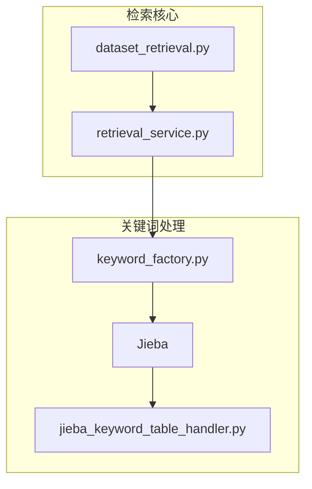
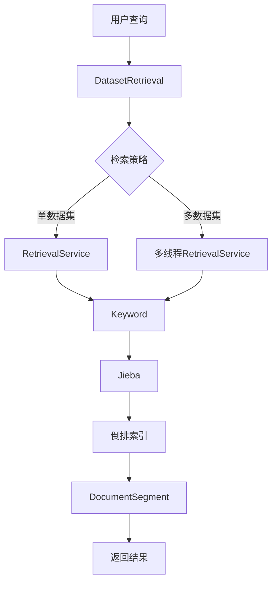
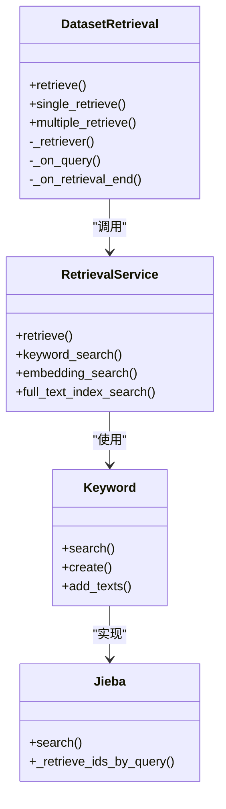
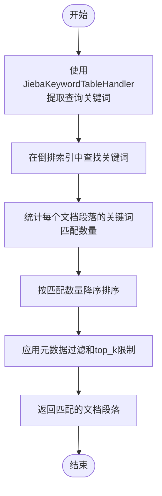
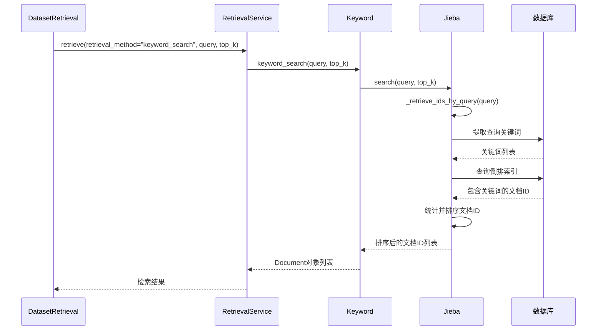
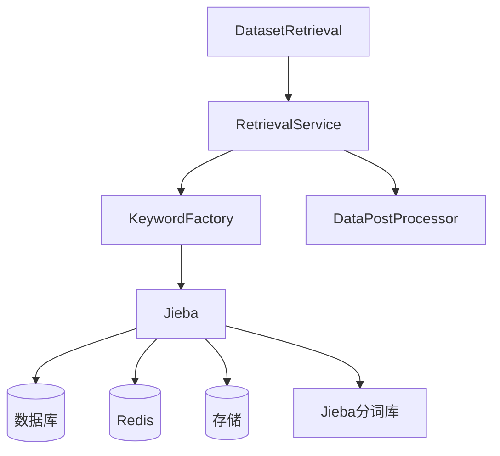

# 关键词检索

<cite>
**本文档中引用的文件**  
- [dataset_retrieval.py](file://api/core/rag/retrieval/dataset_retrieval.py)
- [jieba_keyword_table_handler.py](file://api/core/rag/datasource/keyword/jieba/jieba_keyword_table_handler.py)
- [retrieval_service.py](file://api/core/rag/datasource/retrieval_service.py)
- [keyword_factory.py](file://api/core/rag/datasource/keyword/keyword_factory.py)
- [jieba.py](file://api/core/rag/datasource/keyword/jieba/jieba.py)
</cite>

## 目录
1. [简介](#简介)
2. [项目结构](#项目结构)
3. [核心组件](#核心组件)
4. [架构概述](#架构概述)
5. [详细组件分析](#详细组件分析)
6. [依赖分析](#依赖分析)
7. [性能考虑](#性能考虑)
8. [故障排除指南](#故障排除指南)
9. [结论](#结论)

## 简介
本文档深入解析 Dify RAG（检索增强生成）管道中的关键词检索机制。重点阐述基于倒排索引的全文搜索实现、分词器（Tokenizer）的选择与配置、查询解析与匹配算法，以及在 `dataset_retrieval.py` 中如何调用关键词检索服务进行精确和模糊搜索。文档还说明了关键词检索在处理布尔查询、短语匹配和通配符搜索时的具体实现方式，并讨论其在精确信息定位和结构化数据查询中的优势与局限性。

## 项目结构
Dify 的关键词检索功能主要位于 `api/core/rag/` 目录下，其核心模块包括 `retrieval`（检索逻辑）、`datasource`（数据源与索引）和 `keyword`（关键词处理）。该结构实现了检索逻辑与数据存储的分离，便于扩展和维护。

**图示来源**  
- [dataset_retrieval.py](file://api/core/rag/retrieval/dataset_retrieval.py)
- [retrieval_service.py](file://api/core/rag/datasource/retrieval_service.py)
- [keyword_factory.py](file://api/core/rag/datasource/keyword/keyword_factory.py)
- [jieba.py](file://api/core/rag/datasource/keyword/jieba/jieba.py)
- [jieba_keyword_table_handler.py](file://api/core/rag/datasource/keyword/jieba/jieba_keyword_table_handler.py)

**本节来源**  
- [dataset_retrieval.py](file://api/core/rag/retrieval/dataset_retrieval.py)
- [retrieval_service.py](file://api/core/rag/datasource/retrieval_service.py)

## 核心组件
关键词检索的核心组件包括 `DatasetRetrieval` 类（负责检索流程控制）、`RetrievalService` 类（提供统一的检索接口）、`Keyword` 工厂类（根据配置创建具体的关键词处理器）以及 `Jieba` 实现类（基于结巴分词的具体实现）。这些组件协同工作，完成从查询解析到结果返回的全过程。

**本节来源**  
- [dataset_retrieval.py](file://api/core/rag/retrieval/dataset_retrieval.py#L1-L100)
- [retrieval_service.py](file://api/core/rag/datasource/retrieval_service.py#L1-L50)
- [keyword_factory.py](file://api/core/rag/datasource/keyword/keyword_factory.py#L1-L20)

## 架构概述
Dify 的关键词检索采用分层架构。上层是 `DatasetRetrieval`，它根据应用配置决定使用单数据集还是多数据集检索策略。中间层是 `RetrievalService`，它作为统一入口，根据检索方法（关键词、语义、全文）分发请求。底层是具体的索引实现，如 `Jieba`，它负责与倒排索引进行交互，执行实际的搜索操作。

**图示来源**  
- [dataset_retrieval.py](file://api/core/rag/retrieval/dataset_retrieval.py#L100-L200)
- [retrieval_service.py](file://api/core/rag/datasource/retrieval_service.py#L50-L100)
- [keyword_factory.py](file://api/core/rag/datasource/keyword/keyword_factory.py#L20-L30)
- [jieba.py](file://api/core/rag/datasource/keyword/jieba/jieba.py#L1-L50)

## 详细组件分析

### DatasetRetrieval 分析
`DatasetRetrieval` 类是关键词检索的入口。它首先根据配置判断是执行单数据集检索还是多数据集检索。在单数据集模式下，它会调用 `RetrievalService` 进行搜索；在多数据集模式下，它会为每个数据集启动一个线程并行执行检索，最后进行结果合并与重排序。

#### 检索流程类图

**图示来源**  
- [dataset_retrieval.py](file://api/core/rag/retrieval/dataset_retrieval.py#L100-L300)
- [retrieval_service.py](file://api/core/rag/datasource/retrieval_service.py#L1-L50)
- [keyword_factory.py](file://api/core/rag/datasource/keyword/keyword_factory.py#L1-L20)
- [jieba.py](file://api/core/rag/datasource/keyword/jieba/jieba.py#L1-L50)

### Jieba 关键词处理分析
`Jieba` 类是关键词检索的核心实现。它使用结巴分词（Jieba）库对文本进行分词，并构建和维护一个倒排索引（`keyword_table`），该索引将关键词映射到包含该关键词的文档段落（`DocumentSegment`）ID列表。

#### 关键词提取与搜索流程

**图示来源**  
- [jieba.py](file://api/core/rag/datasource/keyword/jieba/jieba.py#L150-L200)
- [jieba_keyword_table_handler.py](file://api/core/rag/datasource/keyword/jieba/jieba_keyword_table_handler.py#L1-L20)

### 检索服务调用分析
`dataset_retrieval.py` 文件中的 `retrieve` 方法是调用关键词检索服务的关键。当数据集的索引技术（`indexing_technique`）为 "economy" 时，系统会强制使用 `keyword_search` 方法。

#### 检索服务调用序列图

**图示来源**  
- [dataset_retrieval.py](file://api/core/rag/retrieval/dataset_retrieval.py#L200-L250)
- [retrieval_service.py](file://api/core/rag/datasource/retrieval_service.py#L100-L150)
- [jieba.py](file://api/core/rag/datasource/keyword/jieba/jieba.py#L150-L200)

**本节来源**  
- [dataset_retrieval.py](file://api/core/rag/retrieval/dataset_retrieval.py#L1-L1216)
- [jieba_keyword_table_handler.py](file://api/core/rag/datasource/keyword/jieba/jieba_keyword_table_handler.py#L1-L38)
- [retrieval_service.py](file://api/core/rag/datasource/retrieval_service.py#L1-L431)
- [keyword_factory.py](file://api/core/rag/datasource/keyword/keyword_factory.py#L1-L55)
- [jieba.py](file://api/core/rag/datasource/keyword/jieba/jieba.py#L1-L264)

## 依赖分析
关键词检索模块依赖于多个外部库和内部服务。它依赖 `jieba` 库进行中文分词，依赖 `redis` 和 `storage` 服务来缓存和持久化倒排索引。在数据库层面，它通过 `sqlalchemy` 与 `DocumentSegment` 和 `DatasetKeywordTable` 表进行交互。此外，它还依赖 `DataPostProcessor` 进行结果重排序。

**图示来源**  
- [dataset_retrieval.py](file://api/core/rag/retrieval/dataset_retrieval.py)
- [retrieval_service.py](file://api/core/rag/datasource/retrieval_service.py)
- [keyword_factory.py](file://api/core/rag/datasource/keyword/keyword_factory.py)
- [jieba.py](file://api/core/rag/datasource/keyword/jieba/jieba.py)

**本节来源**  
- [dataset_retrieval.py](file://api/core/rag/retrieval/dataset_retrieval.py)
- [retrieval_service.py](file://api/core/rag/datasource/retrieval_service.py)
- [keyword_factory.py](file://api/core/rag/datasource/keyword/keyword_factory.py)
- [jieba.py](file://api/core/rag/datasource/keyword/jieba/jieba.py)

## 性能考虑
关键词检索的性能主要受倒排索引的大小和查询复杂度影响。Dify 通过以下方式优化性能：
1.  **多线程检索**：在多数据集检索时，使用 `ThreadPoolExecutor` 并行执行，显著减少总耗时。
2.  **索引缓存**：使用 Redis 锁和缓存机制，避免在索引构建时的并发冲突和重复加载。
3.  **批量操作**：在格式化检索结果时，使用批量查询（`in_`）来获取 `DocumentSegment`，减少数据库交互次数。
4.  **高效数据结构**：使用 `set` 和 `defaultdict` 来高效地处理关键词和文档ID的集合运算。

## 故障排除指南
- **问题：关键词检索返回空结果**
  - **检查**：确认数据集的索引技术是否为 "economy"。
  - **检查**：确认 `DocumentSegment` 表中是否存在已启用且状态为 "completed" 的段落。
  - **检查**：确认 `DatasetKeywordTable` 是否已成功创建并包含数据。
- **问题：检索速度慢**
  - **检查**：查看 `RetrievalService` 的日志，确认是否因 `ThreadPoolExecutor` 超时而失败。
  - **检查**：评估倒排索引的大小，过大的索引可能导致内存压力。
- **问题：分词结果不准确**
  - **检查**：确认 `jieba` 库已正确安装。
  - **检查**：查看 `core/rag/datasource/keyword/jieba/stopwords.py` 中的停用词列表，确认没有误删关键词。

**本节来源**  
- [dataset_retrieval.py](file://api/core/rag/retrieval/dataset_retrieval.py#L500-L600)
- [retrieval_service.py](file://api/core/rag/datasource/retrieval_service.py#L300-L400)
- [jieba.py](file://api/core/rag/datasource/keyword/jieba/jieba.py#L200-L250)

## 结论
Dify 的关键词检索机制通过基于 Jieba 的倒排索引，为用户提供了一种高效、精确的文本匹配方式。它特别适用于需要进行精确关键词匹配或在计算资源受限（"economy" 模式）的场景。该机制与语义搜索相结合，构成了 Dify RAG 管道中强大的混合检索能力。其模块化的设计和清晰的分层架构，使得功能易于维护和扩展。