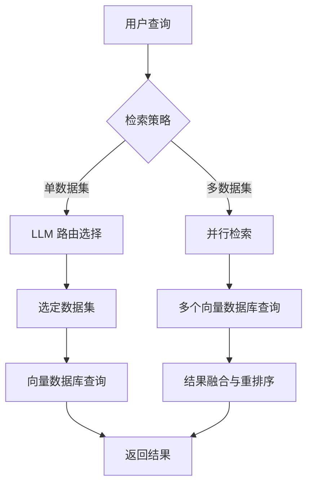
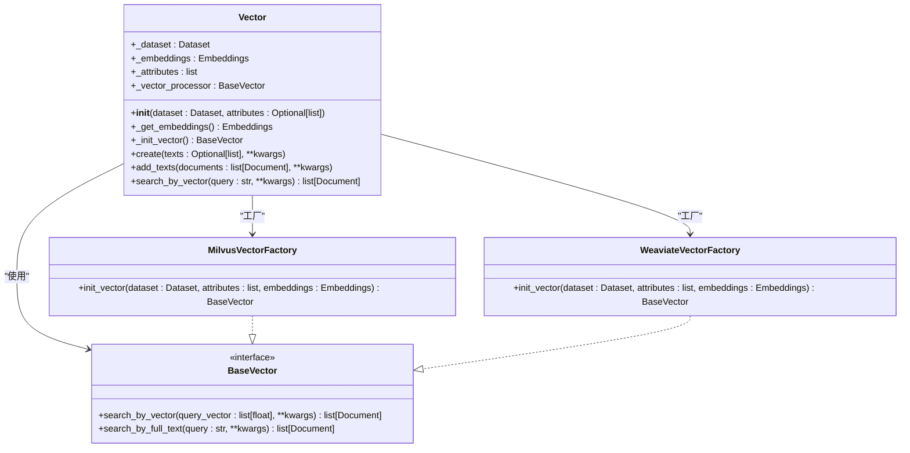
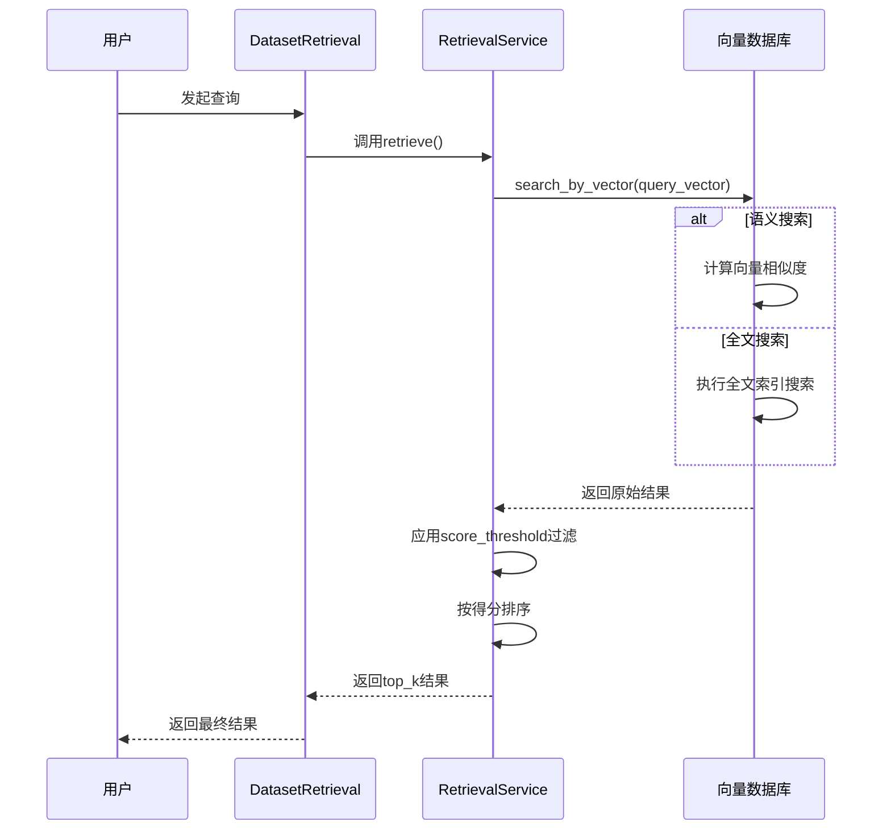
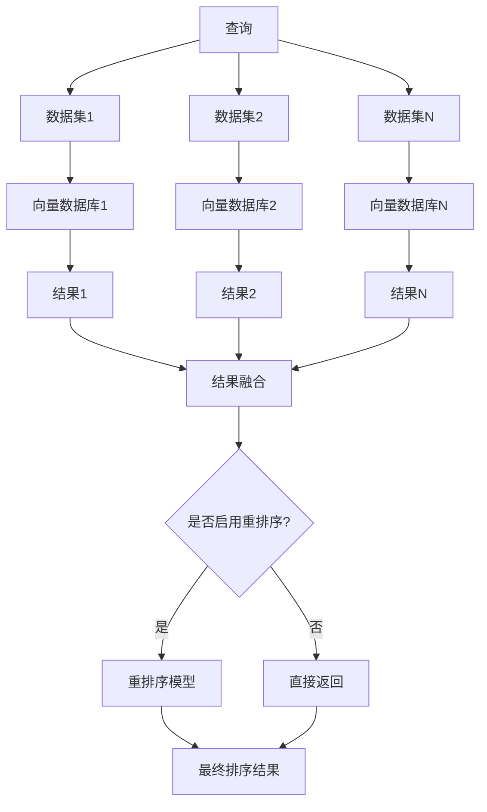
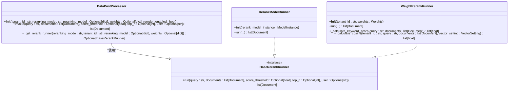

# 向量检索

<cite>
**本文档中引用的文件**   
- [dataset_retrieval.py](file://api/core/rag/retrieval/dataset_retrieval.py)
- [retrieval_methods.py](file://api/core/rag/retrieval/retrieval_methods.py)
- [vector_factory.py](file://api/core/rag/datasource/vdb/vector_factory.py)
- [vector_base.py](file://api/core/rag/datasource/vdb/vector_base.py)
- [data_post_processor.py](file://api/core/rag/data_post_processor/data_post_processor.py)
- [retrieval_service.py](file://api/core/rag/datasource/retrieval_service.py)
</cite>

## 目录
1. [引言](#引言)
2. [向量检索核心机制](#向量检索核心机制)
3. [文本嵌入与向量索引](#文本嵌入与向量索引)
4. [相似度计算与查询执行](#相似度计算与查询执行)
5. [多向量数据库查询路由](#多向量数据库查询路由)
6. [检索结果后处理与重排序](#检索结果后处理与重排序)
7. [配置与优化](#配置与优化)
8. [结论](#结论)

## 引言

向量检索是Dify RAG（检索增强生成）管道中的核心组件，负责从知识库中高效地检索与用户查询最相关的信息。该机制通过将文本转换为高维向量，并在向量数据库中进行相似度搜索，从而实现语义层面的信息匹配。本技术文档将深入剖析Dify向量检索的工作原理，涵盖从文本嵌入、索引构建到查询执行和结果重排序的完整流程。

## 向量检索核心机制

Dify的向量检索机制由`DatasetRetrieval`类驱动，该类位于`dataset_retrieval.py`文件中。其核心功能是根据用户查询，从一个或多个数据集中检索相关文档。检索过程支持两种策略：单数据集检索（SINGLE）和多数据集检索（MULTIPLE）。

在单数据集检索模式下，系统会利用大语言模型（LLM）的工具调用能力，通过`ReactMultiDatasetRouter`或`FunctionCallMultiDatasetRouter`来决定使用哪个数据集进行查询。而在多数据集检索模式下，系统会并行地从所有配置的数据集中检索结果，然后通过重排序模型（reranking model）对结果进行融合和重新排序。

**Diagram sources**
- [dataset_retrieval.py](file://api/core/rag/retrieval/dataset_retrieval.py#L75-L279)

**Section sources**
- [dataset_retrieval.py](file://api/core/rag/retrieval/dataset_retrieval.py#L75-L279)

## 文本嵌入与向量索引

文本嵌入是将文本转换为数值向量的过程，这是向量检索的基础。Dify通过`Vector`类来管理向量索引的创建和操作。该类位于`vector_factory.py`文件中，它是一个工厂模式的实现，能够根据配置动态地初始化不同类型的向量数据库。

向量索引的构建过程如下：
1.  **模型获取**：`Vector`类通过`ModelManager`获取指定的文本嵌入模型实例。
2.  **向量生成**：调用嵌入模型的`embed_documents`方法，将文档的文本内容批量转换为向量。
3.  **索引创建**：将生成的向量和对应的元数据（如文档ID、数据集ID等）传递给底层的向量数据库工厂（如`MilvusVectorFactory`、`WeaviateVectorFactory`等）进行存储。

**Diagram sources**
- [vector_factory.py](file://api/core/rag/datasource/vdb/vector_factory.py#L33-L258)
- [vector_base.py](file://api/core/rag/datasource/vdb/vector_base.py#L40-L41)

**Section sources**
- [vector_factory.py](file://api/core/rag/datasource/vdb/vector_factory.py#L33-L258)

## 相似度计算与查询执行

Dify支持多种检索方法，这些方法在`retrieval_methods.py`文件中通过`RetrievalMethod`枚举类定义，包括语义搜索（SEMANTIC_SEARCH）、全文搜索（FULL_TEXT_SEARCH）和混合搜索（HYBRID_SEARCH）。

查询执行的核心是`RetrievalService`类。当收到一个查询请求时，`RetrievalService.retrieve`方法会根据指定的`retrieval_method`参数，启动一个或多个线程来执行相应的搜索任务：
-   **语义搜索**：调用`embedding_search`方法，该方法首先使用嵌入模型将查询转换为向量，然后在向量数据库中进行向量相似度搜索。
-   **全文搜索**：调用`full_text_index_search`方法，利用向量数据库内置的全文索引功能进行关键词匹配。
-   **混合搜索**：同时执行语义搜索和全文搜索，然后将结果合并。

相似度计算的具体实现由底层的向量数据库完成。例如，在`pgvector.py`中，使用欧氏距离（`<=>`操作符）来计算向量间的距离，并将其转换为余弦相似度得分（`score = 1 - distance`）。查询结果会根据`score_threshold`进行过滤，并按得分排序后返回前`top_k`个结果。

**Diagram sources**
- [retrieval_methods.py](file://api/core/rag/retrieval/retrieval_methods.py#L1-L16)
- [retrieval_service.py](file://api/core/rag/datasource/retrieval_service.py#L32-L429)

**Section sources**
- [retrieval_service.py](file://api/core/rag/datasource/retrieval_service.py#L32-L429)

## 多向量数据库查询路由

当配置了多个数据集时，Dify采用多数据集检索策略。`DatasetRetrieval.multiple_retrieve`方法会为每个可用的数据集创建一个独立的线程，并调用`_retriever`方法进行并行查询。

这种并行查询机制实现了负载均衡，能够充分利用系统资源，显著提高检索效率。所有线程的查询结果最终会汇集到一个列表中。如果启用了重排序（reranking），则会使用一个专门的重排序模型对所有结果进行统一的重新排序和融合，确保最终结果的相关性。

**Section sources**
- [dataset_retrieval.py](file://api/core/rag/retrieval/dataset_retrieval.py#L281-L429)

## 检索结果后处理与重排序

检索结果的后处理是提升检索质量的关键步骤。Dify通过`DataPostProcessor`类来实现这一功能，该类位于`data_post_processor.py`文件中。

`DataPostProcessor`支持两种重排序模式：
1.  **重排序模型模式 (RERANKING_MODEL)**：使用一个专门的重排序模型（如BGE Reranker）对初步检索结果进行精排。该模型通常比嵌入模型更小、更高效，但能提供更精确的相关性评分。
2.  **加权得分模式 (WEIGHTED_SCORE)**：当多个数据集使用不同的嵌入模型时，直接比较它们的原始得分是不公平的。加权得分模式会计算关键词匹配得分（TF-IDF）和向量相似度得分，并根据配置的权重进行加权求和，从而得到一个统一的、可比较的最终得分。

**Diagram sources**
- [data_post_processor.py](file://api/core/rag/data_post_processor/data_post_processor.py#L13-L98)

**Section sources**
- [data_post_processor.py](file://api/core/rag/data_post_processor/data_post_processor.py#L13-L98)

## 配置与优化

为了优化向量检索的召回率和精确度，可以通过配置以下参数进行调整：
-   **top_k**：控制返回的最相关结果的数量。增加`top_k`可以提高召回率，但可能降低精确度。
-   **score_threshold**：设置一个相似度得分阈值，低于此阈值的结果将被过滤掉。提高阈值可以提高精确度，但可能降低召回率。
-   **reranking_model**：启用重排序模型可以显著提升结果的相关性排序质量。
-   **retrieval_method**：根据应用场景选择合适的检索方法。对于语义理解要求高的场景，应使用`SEMANTIC_SEARCH`或`HYBRID_SEARCH`。

不同向量数据库的性能特点各异。例如，`Milvus`和`Weaviate`在处理大规模向量数据时性能优异，而`PGVector`则与PostgreSQL深度集成，便于管理。选择合适的向量数据库需要综合考虑数据规模、查询延迟、成本和运维复杂度等因素。

## 结论

Dify的向量检索机制是一个功能强大且高度可配置的系统。它通过将文本嵌入、多策略查询、并行执行和智能重排序相结合，实现了高效、准确的知识检索。理解其内部工作原理有助于开发者更好地配置和优化RAG应用，从而为用户提供更高质量的问答体验。