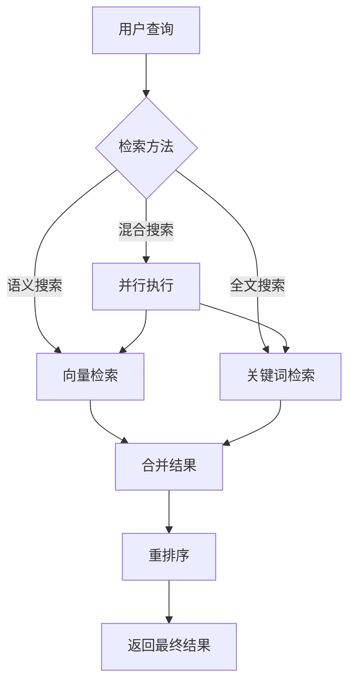

# 基础检索

<cite>
**本文档引用的文件**
- [retrieval_service.py](file://api/core/rag/datasource/retrieval_service.py)
- [dataset_retrieval.py](file://api/core/rag/retrieval/dataset_retrieval.py)
- [jieba.py](file://api/core/rag/datasource/keyword/jieba/jieba.py)
- [clickzetta_vector.py](file://api/core/rag/datasource/vdb/clickzetta/clickzetta_vector.py)
- [retrieval_methods.py](file://api/core/rag/retrieval/retrieval_methods.py)
</cite>

## 目录
1. [向量检索机制](#向量检索机制)
2. [关键词检索机制](#关键词检索机制)
3. [混合检索策略](#混合检索策略)
4. [相似度计算与阈值控制](#相似度计算与阈值控制)
5. [检索参数配置](#检索参数配置)

## 向量检索机制

向量检索是Dify RAG管道的核心检索方式，通过将文本转换为高维向量进行语义相似度匹配。系统支持多种向量数据库，如ClickZetta，通过`Vector`工厂类实现统一接口。向量检索首先通过嵌入模型将查询文本转换为向量，然后在向量数据库中进行相似度搜索。在ClickZetta实现中，使用HNSW（Hierarchical Navigable Small World）算法构建向量索引，支持余弦距离和L2距离两种相似度计算方式。查询时，系统会根据配置的`top_k`参数返回最相似的前K个结果，并可通过`score_threshold`设置相似度阈值来过滤低质量匹配。

**Section sources**
- [retrieval_service.py](file://api/core/rag/datasource/retrieval_service.py#L29-L128)
- [clickzetta_vector.py](file://api/core/rag/datasource/vdb/clickzetta/clickzetta_vector.py#L801-L825)

## 关键词检索机制

关键词检索采用基于Jieba分词的倒排索引机制，适用于精确匹配和关键词搜索场景。系统在索引阶段为每个文档片段提取关键词，构建关键词到文档ID的映射表（keyword_table），并存储在数据库或文件系统中。查询时，首先对查询语句进行分词，然后在倒排索引中查找包含这些关键词的文档片段。匹配度通过关键词的TF-IDF（词频-逆文档频率）加权计算，其中TF反映关键词在查询中的重要性，IDF反映关键词在整个知识库中的区分度。最终结果按匹配度排序返回。

**Section sources**
- [jieba.py](file://api/core/rag/datasource/keyword/jieba/jieba.py#L86-L119)
- [dataset_retrieval.py](file://api/core/rag/retrieval/dataset_retrieval.py#L746-L814)

## 混合检索策略

混合检索策略结合了向量检索和关键词检索的优势，通过`RetrievalMethod.HYBRID_SEARCH`模式实现。当启用混合检索时，系统会并行执行向量搜索和关键词搜索，将两路结果合并后进行重排序。重排序过程由`DataPostProcessor`组件处理，支持多种重排序模式，如基于重排序模型（reranking_model）或加权得分（weighted_score）。这种策略既能利用向量检索的语义理解能力，又能保留关键词检索的精确匹配优势，有效提升检索结果的全面性和准确性。混合检索特别适用于复杂查询场景，能够同时捕捉语义相似性和关键词匹配。

**Diagram sources**
- [retrieval_service.py](file://api/core/rag/datasource/retrieval_service.py#L93-L128)
- [retrieval_methods.py](file://api/core/rag/retrieval/retrieval_methods.py#L0-L14)

## 相似度计算与阈值控制

相似度计算是向量检索的核心，Dify支持余弦相似度和欧氏距离两种算法。余弦相似度通过计算查询向量与文档向量的夹角余弦值来衡量相似度，值域为[0,1]，值越大表示越相似；欧氏距离则计算向量间的直线距离，值越小表示越相似。在ClickZetta实现中，余弦距离的阈值处理采用`2 - score_threshold`的转换，确保距离越小越匹配。系统通过`score_threshold`参数控制结果质量，只有相似度得分高于阈值的文档才会被返回。此外，`top_k`参数控制返回结果的数量，防止结果过多影响性能。这些参数可在知识库的检索模型配置中进行调整。

**Section sources**
- [clickzetta_vector.py](file://api/core/rag/datasource/vdb/clickzetta/clickzetta_vector.py#L801-L825)
- [dataset_retrieval.py](file://api/core/rag/retrieval/dataset_retrieval.py#L355-L381)

## 检索参数配置

检索参数的配置主要通过`retrieval_model`对象进行，该对象定义了检索方法、返回数量、相似度阈值和重排序模型等关键参数。在代码中，这些参数通过`RetrievalService.retrieve`方法的参数传递，包括`retrieval_method`、`top_k`、`score_threshold`和`reranking_model`。开发者可以通过API或管理界面调整这些参数，以适应不同的应用场景。例如，在需要高召回率的场景下，可以降低`score_threshold`；在需要高精度的场景下，可以增加`top_k`并启用重排序。参数配置的灵活性使得Dify能够满足从简单问答到复杂信息检索的各种需求。

**Section sources**
- [retrieval_service.py](file://api/core/rag/datasource/retrieval_service.py#L29-L68)
- [dataset_retrieval.py](file://api/core/rag/retrieval/dataset_retrieval.py#L174-L199)