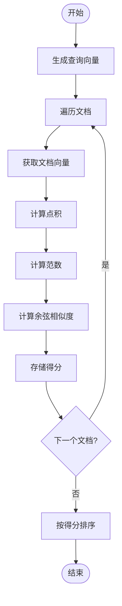
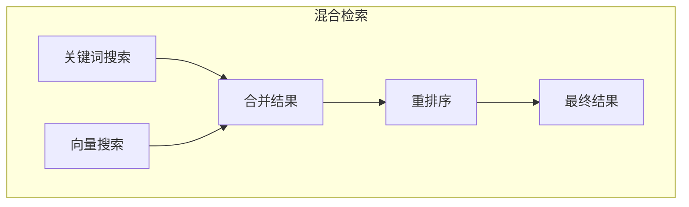
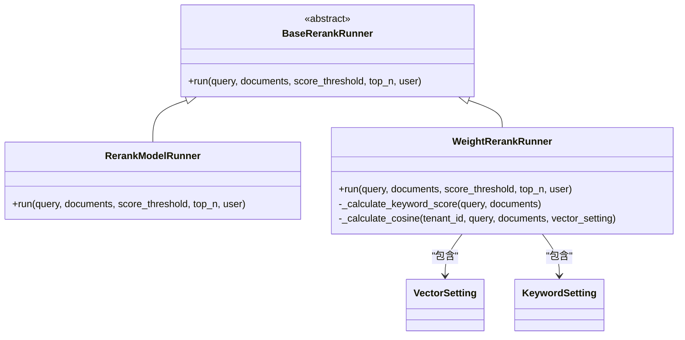

# 检索策略

<cite>
**本文档引用的文件**
- [retrieval_service.py](file://api/core/rag/datasource/retrieval_service.py)
- [dataset_retrieval.py](file://api/core/rag/retrieval/dataset_retrieval.py)
- [retrieval_methods.py](file://api/core/rag/retrieval/retrieval_methods.py)
- [weight_rerank.py](file://api/core/rag/rerank/weight_rerank.py)
- [data_post_processor.py](file://api/core/rag/data_post_processor/data_post_processor.py)
- [rerank_factory.py](file://api/core/rag/rerank/rerank_factory.py)
- [rerank_type.py](file://api/core/rag/rerank/rerank_type.py)
</cite>

## 目录
1. [简介](#简介)
2. [检索机制](#检索机制)
3. [相似度计算](#相似度计算)
4. [混合检索策略](#混合检索策略)
5. [重排序模块](#重排序模块)
6. [性能优化建议](#性能优化建议)
7. [应用场景与诊断](#应用场景与诊断)
8. [结论](#结论)

## 简介
Dify RAG管道的检索策略旨在通过多种技术手段提高信息检索的准确性和效率。该策略结合了基于向量相似度的检索、关键词检索以及结果重排序技术，以确保用户能够获得最相关的信息。本文档将深入探讨这些技术的具体实现，包括相似度计算方法、混合检索策略的应用、重排序模块的工作原理，以及如何通过调整参数来优化检索性能。

## 检索机制
Dify RAG管道的检索机制主要依赖于向量相似度和关键词匹配两种方式。当用户提出查询时，系统首先根据配置选择合适的检索方法。对于高质量索引（high_quality），系统采用语义搜索；而对于经济型索引（economy），则使用关键词搜索。此外，还支持全文搜索和混合搜索，允许同时利用向量和关键词的优势。

在执行检索之前，系统会检查查询是否为空，并获取相关的数据集。如果数据集存在，则启动多线程处理，分别进行关键词搜索、向量搜索或全文搜索。最终结果会被合并并经过后处理步骤，如重排序等，以提供最佳答案。

**Section sources**
- [retrieval_service.py](file://api/core/rag/datasource/retrieval_service.py#L29-L68)
- [dataset_retrieval.py](file://api/core/rag/retrieval/dataset_retrieval.py#L355-L381)

## 相似度计算
### 余弦相似度
余弦相似度是衡量两个非零向量之间角度的余弦值，用于评估它们之间的相似性。在Dify中，余弦相似度被广泛应用于向量搜索过程中。具体来说，系统会计算查询向量与文档向量之间的余弦相似度得分，然后根据得分对文档进行排序。

实现上，系统首先通过嵌入模型生成查询向量和文档向量。接着，利用NumPy库计算这两个向量的点积及其各自的范数，最后得出余弦相似度。此过程不仅考虑了向量的方向，也兼顾了其大小，从而提供了更为精确的相似度度量。

**Diagram sources**
- [weight_rerank.py](file://api/core/rag/rerank/weight_rerank.py#L167-L191)

### 欧氏距离
虽然Dify主要采用余弦相似度作为相似度度量标准，但在某些特定场景下也可能用到欧氏距离。欧氏距离反映了两点间的直线距离，适用于需要考虑绝对位置差异的情况。然而，在文本检索领域，由于更关注方向而非距离本身，因此通常偏好使用余弦相似度。

## 混合检索策略
混合检索策略结合了关键词检索和向量检索的优点，旨在克服单一方法可能存在的局限性。例如，纯向量搜索可能会忽略一些重要的关键词信息，而仅依赖关键词搜索又难以捕捉到深层次的语义关联。通过融合这两种方法，可以显著提升检索效果。

在Dify中，混合检索由`RetrievalService`类中的`retrieve`方法实现。当指定为混合搜索时，系统会并行执行关键词搜索和向量搜索，然后将两组结果合并。接下来，通过`DataPostProcessor`组件应用重排序算法，综合考虑两种来源的结果，最终输出最相关的文档列表。

**Diagram sources**
- [retrieval_service.py](file://api/core/rag/datasource/retrieval_service.py#L93-L128)
- [data_post_processor.py](file://api/core/rag/data_post_processor/data_post_processor.py#L32-L65)

**Section sources**
- [retrieval_methods.py](file://api/core/rag/retrieval/retrieval_methods.py#L0-L14)

## 重排序模块
### 工作原理
重排序模块负责进一步优化初步检索得到的结果，确保返回给用户的文档顺序更加合理。它基于预定义的模型或权重规则重新计算每个文档的相关性得分，并据此调整排序。这一步骤对于提高检索质量至关重要，尤其是在面对大量候选文档时。

Dify提供了两种类型的重排序器：基于模型的重排序器（reranking_model）和加权得分重排序器（weighted_score）。前者利用专门训练过的机器学习模型预测文档的相关性，后者则通过手动设定的权重组合不同特征的得分。

### 集成与权重计算
为了实现灵活的重排序功能，Dify设计了一个工厂模式——`RerankRunnerFactory`，可以根据配置动态创建相应的重排序器实例。对于加权得分重排序器，系统允许用户自定义向量和关键词部分的权重比例，从而平衡两者的影响。

此外，重排序过程中还会考虑其他因素，比如文档的历史点击率、更新频率等，以期达到更好的用户体验。所有这些信息都被整合进一个统一的评分体系中，指导最终的排序决策。

**Diagram sources**
- [rerank_factory.py](file://api/core/rag/rerank/rerank_factory.py#L0-L15)
- [rerank_type.py](file://api/core/rag/rerank/rerank_type.py#L0-L5)
- [weight_rerank.py](file://api/core/rag/rerank/weight_rerank.py#L129-L169)

**Section sources**
- [weight_rerank.py](file://api/core/rag/rerank/weight_rerank.py#L99-L131)

## 性能优化建议
### 索引优化
定期维护和更新索引可以有效提升检索速度和准确性。建议定期检查索引状态，及时清理无效或过期的数据条目。同时，合理规划索引结构，避免过度细分导致查询效率下降。

### 查询缓存
引入查询缓存机制能够大幅减少重复请求的响应时间。对于频繁访问且内容变化不大的查询，可将其结果暂时保存在内存中，下次遇到相同请求时直接返回缓存数据，无需再次执行复杂的检索流程。

### 负载均衡
随着系统规模的增长，单一服务器可能无法承受高并发带来的压力。此时应考虑部署负载均衡器，将流量均匀分配至多个后端节点，保证服务稳定运行的同时也能提高整体吞吐量。

## 应用场景与诊断
### 提高回答准确率
通过调整检索参数，如增加top_k值、设置适当的相似度阈值等，可以在一定程度上改善回答的质量。实验表明，适当放宽筛选条件有助于发现更多潜在的相关信息，但同时也需注意控制噪声水平，防止引入过多无关内容。

### 诊断方法
当遇到检索失败或结果不相关等问题时，首先应检查输入数据的有效性及格式正确性。其次，查看日志文件寻找异常记录，定位问题根源。最后，尝试简化查询语句或更换不同的检索模式，观察是否有改观。必要时还可以联系技术支持团队寻求帮助。

**Section sources**
- [dataset_retrieval.py](file://api/core/rag/retrieval/dataset_retrieval.py#L380-L414)
- [hit_testing_service.py](file://api/services/hit_testing_service.py#L64-L98)

## 结论
综上所述，Dify RAG管道的检索策略通过集成多种先进技术，实现了高效精准的信息检索。无论是基于向量的语义理解还是基于关键词的精确匹配，亦或是结合两者优势的混合检索，都体现了系统设计者对用户体验的高度重视。未来，随着算法不断进步和完善，相信Dify将在更多应用场景下展现出卓越的表现。