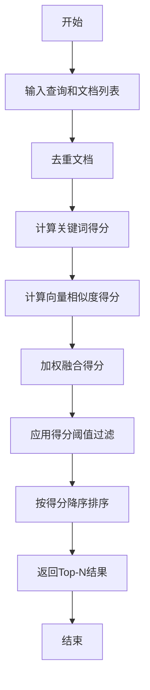

# 结果融合策略

<cite>
**本文档中引用的文件**  
- [weight_rerank.py](file://api/core/rag/rerank/weight_rerank.py)
- [weight.py](file://api/core/rag/rerank/entity/weight.py)
- [rerank_factory.py](file://api/core/rag/rerank/rerank_factory.py)
- [rerank_type.py](file://api/core/rag/rerank/rerank_type.py)
- [rerank_base.py](file://api/core/rag/rerank/rerank_base.py)
</cite>

## 目录
1. [引言](#引言)
2. [核心组件](#核心组件)
3. [权重计算机制](#权重计算机制)
4. [结果融合算法流程](#结果融合算法流程)
5. [权重参数配置与调优](#权重参数配置与调优)
6. [应用场景与效果对比](#应用场景与效果对比)
7. [性能优化建议](#性能优化建议)
8. [诊断与参数调整指南](#诊断与参数调整指南)
9. [结论](#结论)

## 引言
本文档深入解析 Dify RAG 管道中的结果融合策略，重点阐述基于权重的重排序算法实现。该策略通过融合向量相似度与关键词匹配得分，提升检索结果的相关性与准确性。文档将详细说明权重计算机制、融合算法流程、参数配置方式，并提供调优建议与实际应用示例。

## 核心组件

Dify 的结果融合策略主要由以下几个核心组件构成：
- **WeightRerankRunner**：基于权重的重排序执行器，负责计算综合得分并重新排序文档。
- **Weights**：权重配置模型，定义向量和关键词的权重参数。
- **RerankRunnerFactory**：重排序执行器工厂，根据配置创建相应的重排序器。
- **RerankMode**：枚举类型，标识不同的重排序模式，如加权得分模式。

**Section sources**
- [weight_rerank.py](file://api/core/rag/rerank/weight_rerank.py#L15-L191)
- [weight.py](file://api/core/rag/rerank/entity/weight.py#L1-L21)
- [rerank_factory.py](file://api/core/rag/rerank/rerank_factory.py#L1-L16)
- [rerank_type.py](file://api/core/rag/rerank/rerank_type.py#L1-L6)

## 权重计算机制

### 基于模型置信度的动态加权
系统通过 `Weights` 模型配置向量和关键词的权重。`vector_weight` 和 `keyword_weight` 分别控制向量相似度和关键词匹配在最终得分中的占比。用户可根据数据特征和检索需求调整这两个参数，实现动态加权。

### 基于结果位置的衰减函数
当前实现中未显式使用位置衰减函数，排序完全依赖于计算出的综合得分。高分文档将排在前面，位置本身不参与衰减计算。

### 多模型结果的归一化处理
向量相似度通过余弦相似度计算，得分范围为 [0,1]。关键词匹配得分通过 TF-IDF 与余弦相似度结合计算，同样归一化到 [0,1] 区间。两者在相同量纲下进行加权求和，确保了归一化处理。

**Section sources**
- [weight.py](file://api/core/rag/rerank/entity/weight.py#L1-L21)
- [weight_rerank.py](file://api/core/rag/rerank/weight_rerank.py#L75-L78)

## 结果融合算法流程

### 数学模型
最终得分计算公式如下：
```
score = vector_weight × vector_similarity + keyword_weight × keyword_similarity
```
其中：
- `vector_similarity` 为查询向量与文档向量的余弦相似度。
- `keyword_similarity` 为查询与文档在关键词空间的 TF-IDF 向量余弦相似度。

### 算法流程


**Diagram sources**
- [weight_rerank.py](file://api/core/rag/rerank/weight_rerank.py#L35-L78)

## 权重参数配置与调优

### 配置方式
权重参数通过 `Weights` Pydantic 模型进行配置，包含：
- **vector_setting**: 向量相关设置，包括 `vector_weight`、嵌入模型提供者和模型名称。
- **keyword_setting**: 关键词相关设置，包括 `keyword_weight`。

### 调优建议
- **高精度场景**：若文档向量化质量高，可提高 `vector_weight`（如 0.7-0.9），侧重语义匹配。
- **关键词敏感场景**：若查询包含特定术语且需精确匹配，可提高 `keyword_weight`（如 0.6-0.8）。
- **平衡场景**：通常设置 `vector_weight` 和 `keyword_weight` 之和为 1.0，如 (0.5, 0.5) 或 (0.6, 0.4)。

**Section sources**
- [weight.py](file://api/core/rag/rerank/entity/weight.py#L1-L21)
- [weight_rerank.py](file://api/core/rag/rerank/weight_rerank.py#L75-L78)

## 应用场景与效果对比

### 实际应用场景
- **技术文档检索**：关键词权重可适当提高，确保专业术语精确匹配。
- **开放域问答**：向量权重应占主导，以捕捉语义相似性。
- **混合内容检索**：采用均衡权重，兼顾精确与语义匹配。

### 不同权重策略对比
| 权重策略 | 适用场景 | 优点 | 缺点 |
|---------|--------|------|------|
| `vector_weight=0.8, keyword_weight=0.2` | 语义搜索 | 强语义理解，泛化能力强 | 可能忽略关键词精确匹配 |
| `vector_weight=0.3, keyword_weight=0.7` | 精确查询 | 关键词命中率高 | 语义灵活性差 |
| `vector_weight=0.5, keyword_weight=0.5` | 通用场景 | 平衡性好 | 特定场景非最优 |

**Section sources**
- [weight_rerank.py](file://api/core/rag/rerank/weight_rerank.py#L75-L78)

## 性能优化建议

### 结果缓存
对频繁查询的嵌入向量使用 `CacheEmbedding` 进行缓存，避免重复计算，显著提升响应速度。

### 异步融合计算
在高并发场景下，可将重排序过程异步化，避免阻塞主请求流程。

### 资源消耗监控
监控嵌入模型调用频率与耗时，合理配置 `top_n` 参数，防止返回过多文档导致计算资源浪费。

**Section sources**
- [weight_rerank.py](file://api/core/rag/rerank/weight_rerank.py#L130-L135)

## 诊断与参数调整指南

### 融合效果不佳的诊断方法
1. **检查得分分布**：分析 `vector_similarity` 和 `keyword_similarity` 的分布，判断是否存在某一项普遍过低。
2. **验证嵌入模型**：确认使用的嵌入模型适合当前语料，必要时更换模型。
3. **审查关键词提取**：检查 `JiebaKeywordTableHandler` 提取的关键词是否合理，特别是中文分词效果。

### 参数调整步骤
1. 固定向量权重，调整关键词权重，观察精确匹配结果变化。
2. 固定关键词权重，调整向量权重，观察语义相关结果变化。
3. 综合评估，找到最佳平衡点。

**Section sources**
- [weight_rerank.py](file://api/core/rag/rerank/weight_rerank.py#L80-L125)
- [weight_rerank.py](file://api/core/rag/rerank/weight_rerank.py#L50-L65)

## 结论
Dify 的基于权重的重排序算法通过融合向量与关键词两种信号，有效提升了 RAG 系统的检索质量。通过灵活配置权重参数，用户可针对不同应用场景优化检索效果。结合缓存与异步计算等优化手段，该策略在保证准确性的同时也具备良好的性能表现。