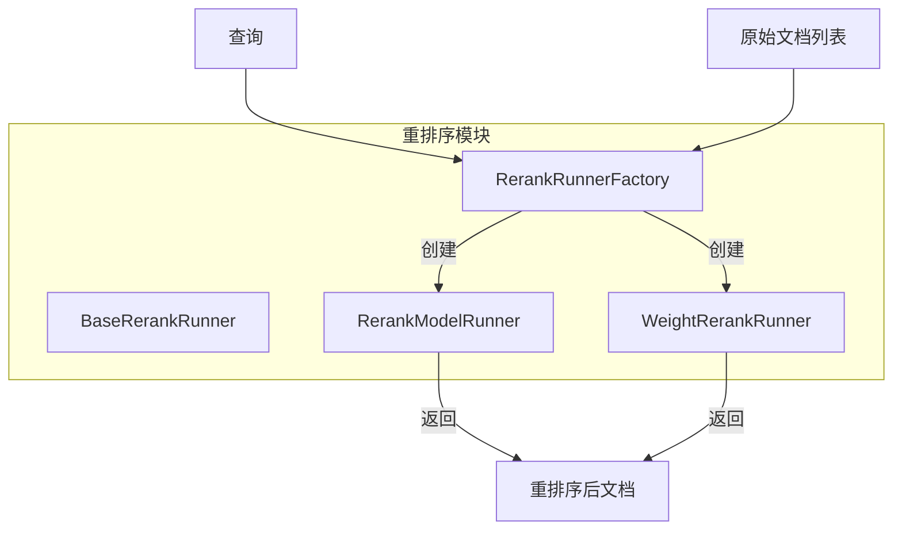
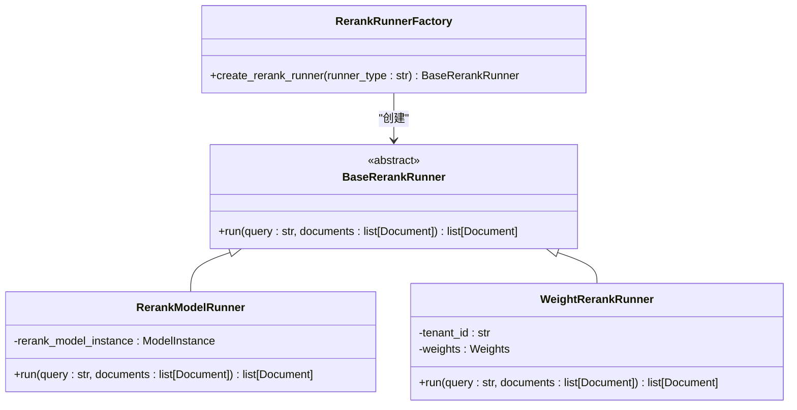
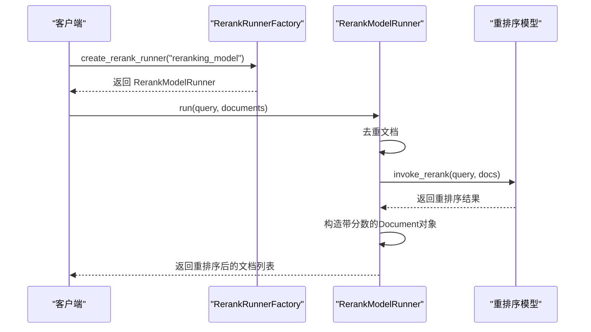
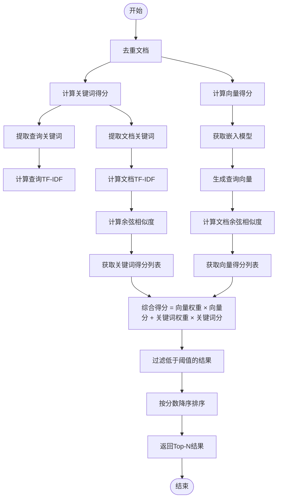
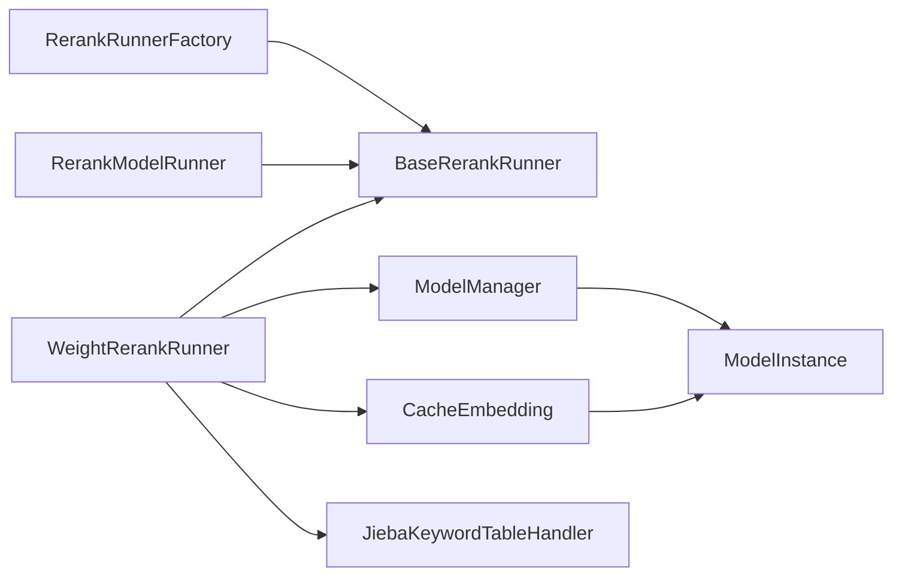

# 结果重排序

<cite>
**本文档引用的文件**   
- [rerank_factory.py](file://api/core/rag/rerank/rerank_factory.py)
- [rerank_base.py](file://api/core/rag/rerank/rerank_base.py)
- [rerank_model.py](file://api/core/rag/rerank/rerank_model.py)
- [weight_rerank.py](file://api/core/rag/rerank/weight_rerank.py)
- [weight.py](file://api/core/rag/rerank/entity/weight.py)
- [rerank_type.py](file://api/core/rag/rerank/rerank_type.py)
</cite>

## 目录
1. [引言](#引言)
2. [核心组件](#核心组件)
3. [架构概述](#架构概述)
4. [详细组件分析](#详细组件分析)
5. [依赖分析](#依赖分析)
6. [性能考虑](#性能考虑)
7. [故障排除指南](#故障排除指南)
8. [结论](#结论)

## 引言
本文档深入探讨了Dify RAG管道中的结果重排序模块，重点介绍重排序模型的集成机制、权重计算策略以及多模型结果融合方法。文档详细说明了本地模型和远程API的调用方式，阐述了基于置信度加权平均和位置衰减等融合算法，并分析了重排序对检索质量的提升效果。同时提供性能优化建议和实际应用场景示例。

## 核心组件
本节分析Dify中实现结果重排序的核心组件，包括重排序运行器工厂、基础接口、模型驱动的重排序器以及基于权重的混合重排序策略。

**节来源**
- [rerank_factory.py](file://api/core/rag/rerank/rerank_factory.py#L1-L17)
- [rerank_base.py](file://api/core/rag/rerank/rerank_base.py#L1-L27)
- [rerank_model.py](file://api/core/rag/rerank/rerank_model.py#L1-L68)
- [weight_rerank.py](file://api/core/rag/rerank/weight_rerank.py#L1-L193)

## 架构概述
Dify的重排序模块采用工厂模式设计，支持多种重排序策略的动态创建与执行。系统通过统一接口抽象不同类型的重排序逻辑，实现了灵活的扩展性和可插拔性。

**图来源**
- [rerank_factory.py](file://api/core/rag/rerank/rerank_factory.py#L1-L17)
- [rerank_base.py](file://api/core/rag/rerank/rerank_base.py#L1-L27)

## 详细组件分析
本节深入分析各个关键重排序组件的实现原理与交互逻辑。

### 重排序运行器工厂分析
该组件负责根据配置类型动态实例化相应的重排序执行器，是整个重排序系统的入口点。

**图来源**
- [rerank_factory.py](file://api/core/rag/rerank/rerank_factory.py#L1-L17)
- [rerank_base.py](file://api/core/rag/rerank/rerank_base.py#L1-L27)
- [rerank_model.py](file://api/core/rag/rerank/rerank_model.py#L1-L68)
- [weight_rerank.py](file://api/core/rag/rerank/weight_rerank.py#L1-L193)

### 模型驱动重排序分析
此组件封装了外部重排序模型的调用逻辑，支持通过模型实例进行查询-文档相关性重打分。

**图来源**
- [rerank_factory.py](file://api/core/rag/rerank/rerank_factory.py#L1-L17)
- [rerank_model.py](file://api/core/rag/rerank/rerank_model.py#L1-L68)

### 权重融合重排序分析
该组件实现了基于向量相似度和关键词匹配的加权融合重排序策略，结合TF-IDF与余弦相似度进行综合评分。

**图来源**
- [weight_rerank.py](file://api/core/rag/rerank/weight_rerank.py#L1-L193)
- [weight.py](file://api/core/rag/rerank/entity/weight.py#L1-L22)

## 依赖分析
重排序模块依赖于模型管理器、嵌入模型缓存、关键词提取组件等多个核心服务，形成完整的RAG处理链路。

**图来源**
- [rerank_factory.py](file://api/core/rag/rerank/rerank_factory.py#L1-L17)
- [rerank_model.py](file://api/core/rag/rerank/rerank_model.py#L1-L68)
- [weight_rerank.py](file://api/core/rag/rerank/weight_rerank.py#L1-L193)

**节来源**
- [rerank_factory.py](file://api/core/rag/rerank/rerank_factory.py#L1-L17)
- [rerank_model.py](file://api/core/rag/rerank/rerank_model.py#L1-L68)
- [weight_rerank.py](file://api/core/rag/rerank/weight_rerank.py#L1-L193)

## 性能考虑
为提升重排序性能，建议采用以下优化策略：
- 启用嵌入向量缓存以避免重复计算
- 对高频查询实施结果缓存
- 使用异步方式预加载模型资源
- 根据场景选择轻量级重排序模型
- 控制top_n参数防止过度排序开销

## 故障排除指南
当重排序效果不佳时，可按以下步骤诊断：
1. 检查模型实例是否正常加载
2. 验证嵌入模型与重排序模型的一致性
3. 分析关键词提取是否准确
4. 调整向量与关键词的权重配比
5. 检查score_threshold阈值设置是否合理
6. 确认文档元数据完整性

**节来源**
- [rerank_model.py](file://api/core/rag/rerank/rerank_model.py#L1-L68)
- [weight_rerank.py](file://api/core/rag/rerank/weight_rerank.py#L1-L193)

## 结论
Dify的结果重排序模块通过灵活的工厂模式支持多种重排序策略，有效提升了检索结果的相关性。其融合式加权算法结合了语义向量与关键词匹配的优势，为用户提供更精准的信息检索体验。未来可通过引入更多重排序模型和优化融合策略进一步提升效果。