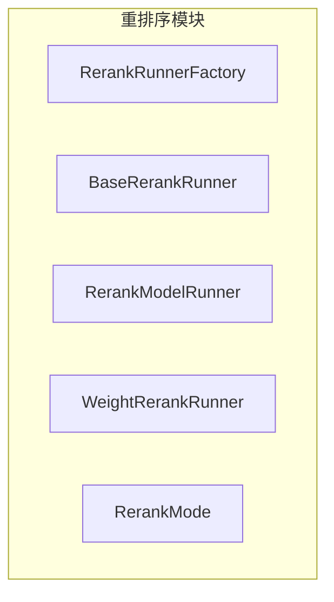
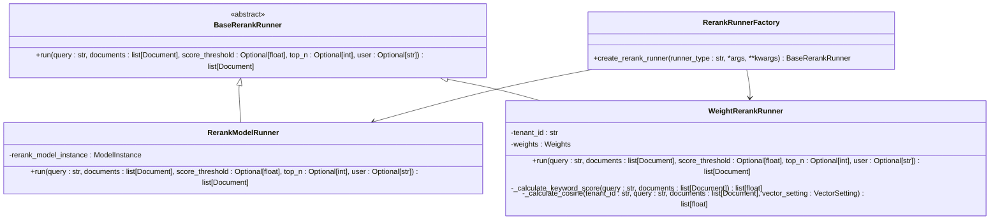
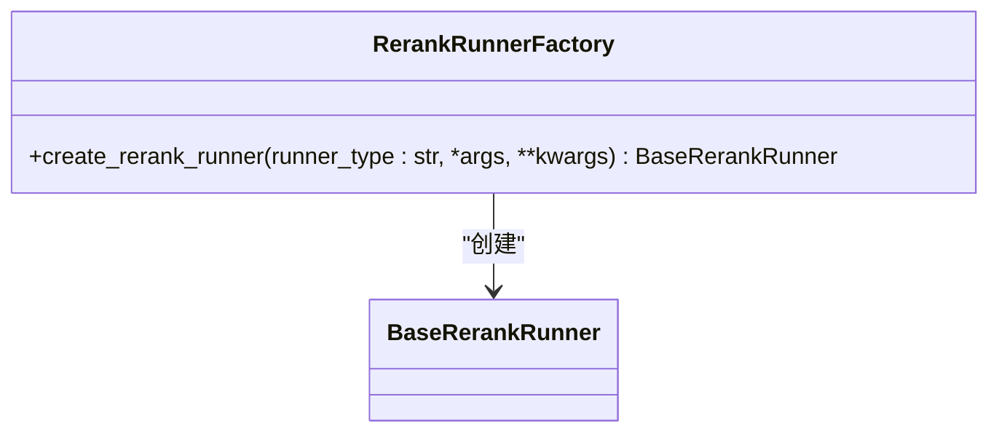
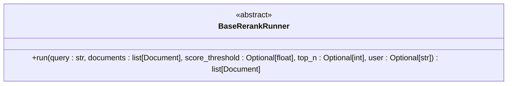
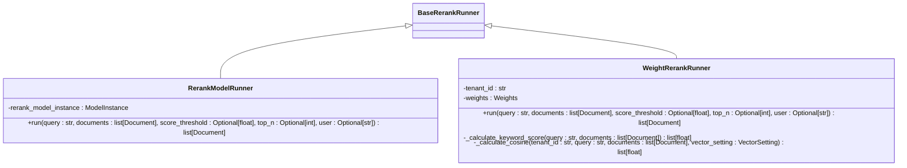
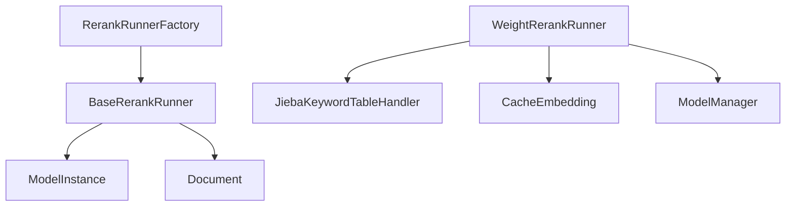

# 重排序模型集成

<cite>
**本文档中引用的文件**
- [rerank_factory.py](file://api/core/rag/rerank/rerank_factory.py)
- [rerank_base.py](file://api/core/rag/rerank/rerank_base.py)
- [rerank_model.py](file://api/core/rag/rerank/rerank_model.py)
- [weight_rerank.py](file://api/core/rag/rerank/weight_rerank.py)
- [rerank_type.py](file://api/core/rag/rerank/rerank_type.py)
</cite>

## 目录
1. [简介](#简介)
2. [项目结构](#项目结构)
3. [核心组件](#核心组件)
4. [架构概述](#架构概述)
5. [详细组件分析](#详细组件分析)
6. [依赖分析](#依赖分析)
7. [性能考虑](#性能考虑)
8. [故障排除指南](#故障排除指南)
9. [结论](#结论)

## 简介
本文档详细介绍了 Dify RAG 管道中重排序模型的集成机制，重点阐述了重排序工厂模式（RerankFactory）的实现原理和调用流程。文档涵盖重排序模型接口的统一抽象设计、模型配置管理、性能调优策略以及故障排查方法，旨在为开发者提供全面的技术指导。

## 项目结构
重排序功能模块位于 `api/core/rag/rerank` 目录下，包含工厂类、基础接口、具体实现和类型定义等核心组件。

**图示来源**
- [rerank_factory.py](file://api/core/rag/rerank/rerank_factory.py#L1-L16)
- [rerank_base.py](file://api/core/rag/rerank/rerank_base.py#L1-L26)
- [rerank_model.py](file://api/core/rag/rerank/rerank_model.py#L1-L67)
- [weight_rerank.py](file://api/core/rag/rerank/weight_rerank.py#L1-L192)
- [rerank_type.py](file://api/core/rag/rerank/rerank_type.py#L1-L6)

**节来源**
- [rerank_factory.py](file://api/core/rag/rerank/rerank_factory.py#L1-L16)
- [rerank_type.py](file://api/core/rag/rerank/rerank_type.py#L1-L6)

## 核心组件
本节分析重排序系统的核心组件，包括工厂模式、抽象基类和具体实现类。

**节来源**
- [rerank_factory.py](file://api/core/rag/rerank/rerank_factory.py#L6-L15)
- [rerank_base.py](file://api/core/rag/rerank/rerank_base.py#L6-L25)
- [rerank_model.py](file://api/core/rag/rerank/rerank_model.py#L7-L66)
- [weight_rerank.py](file://api/core/rag/rerank/weight_rerank.py#L15-L191)

## 架构概述
重排序系统采用工厂模式实现不同重排序策略的动态加载，通过统一接口抽象本地模型和远程API服务。

**图示来源**
- [rerank_base.py](file://api/core/rag/rerank/rerank_base.py#L6-L25)
- [rerank_model.py](file://api/core/rag/rerank/rerank_model.py#L7-L66)
- [weight_rerank.py](file://api/core/rag/rerank/weight_rerank.py#L15-L191)
- [rerank_factory.py](file://api/core/rag/rerank/rerank_factory.py#L6-L15)

## 详细组件分析
本节深入分析重排序系统的各个关键组件。

### 重排序工厂模式分析
重排序工厂模式通过 `RerankRunnerFactory` 类实现，支持动态创建不同类型的重排序执行器。

#### 对象导向组件：

**图示来源**
- [rerank_factory.py](file://api/core/rag/rerank/rerank_factory.py#L6-L15)

**节来源**
- [rerank_factory.py](file://api/core/rag/rerank/rerank_factory.py#L6-L15)

### 重排序模型接口设计
系统通过 `BaseRerankRunner` 抽象基类定义统一的重排序接口。

#### 对象导向组件：

**图示来源**
- [rerank_base.py](file://api/core/rag/rerank/rerank_base.py#L6-L25)

**节来源**
- [rerank_base.py](file://api/core/rag/rerank/rerank_base.py#L6-L25)

### 重排序实现分析
系统提供了两种重排序实现：基于模型的重排序和基于权重的重排序。

#### 对象导向组件：

**图示来源**
- [rerank_model.py](file://api/core/rag/rerank/rerank_model.py#L7-L66)
- [weight_rerank.py](file://api/core/rag/rerank/weight_rerank.py#L15-L191)

**节来源**
- [rerank_model.py](file://api/core/rag/rerank/rerank_model.py#L7-L66)
- [weight_rerank.py](file://api/core/rag/rerank/weight_rerank.py#L15-L191)

## 依赖分析
重排序系统依赖于模型管理器、嵌入模型和关键词提取等核心组件。

**图示来源**
- [rerank_factory.py](file://api/core/rag/rerank/rerank_factory.py#L1-L16)
- [rerank_model.py](file://api/core/rag/rerank/rerank_model.py#L1-L67)
- [weight_rerank.py](file://api/core/rag/rerank/weight_rerank.py#L1-L192)

**节来源**
- [rerank_factory.py](file://api/core/rag/rerank/rerank_factory.py#L1-L16)
- [rerank_model.py](file://api/core/rag/rerank/rerank_model.py#L1-L67)
- [weight_rerank.py](file://api/core/rag/rerank/weight_rerank.py#L1-L192)

## 性能考虑
重排序系统通过缓存嵌入向量、去重文档和批量处理等机制优化性能。基于权重的重排序还结合了关键词匹配和向量相似度计算，通过可配置的权重参数实现性能与精度的平衡。

## 故障排除指南
本节提供重排序系统常见问题的诊断和解决方案。

**节来源**
- [rerank_model.py](file://api/core/rag/rerank/rerank_model.py#L7-L66)
- [weight_rerank.py](file://api/core/rag/rerank/weight_rerank.py#L15-L191)

## 结论
Dify RAG 管道的重排序系统通过工厂模式实现了灵活的模型集成，支持本地部署模型和远程API服务。统一的接口设计和可配置的权重策略为开发者提供了强大的扩展能力，同时保证了系统的高性能和可靠性。