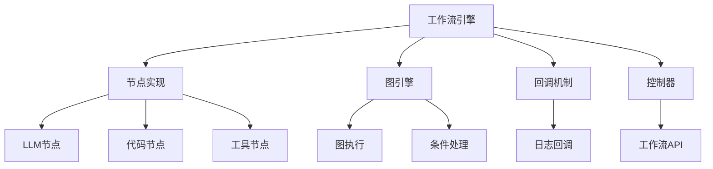
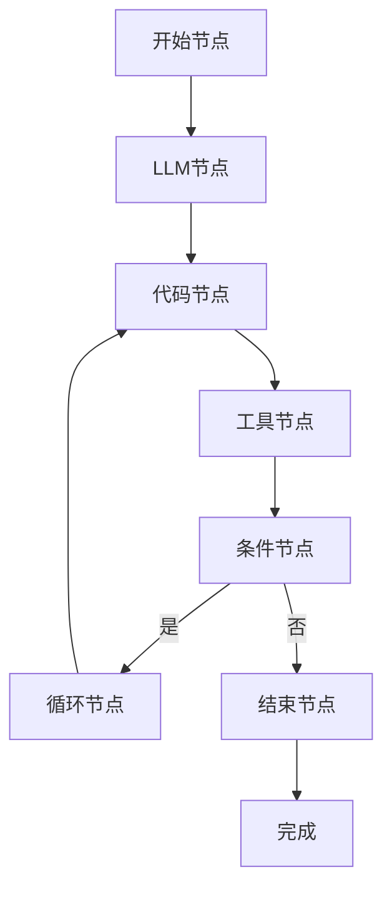
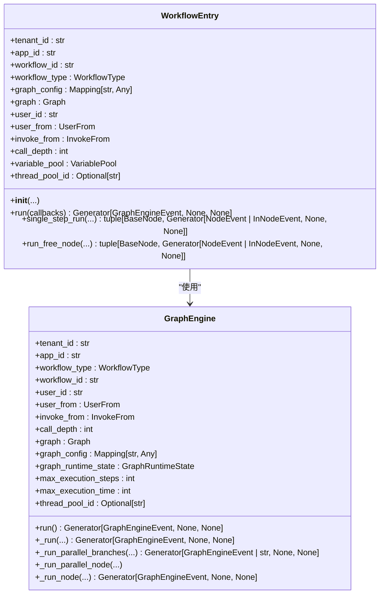
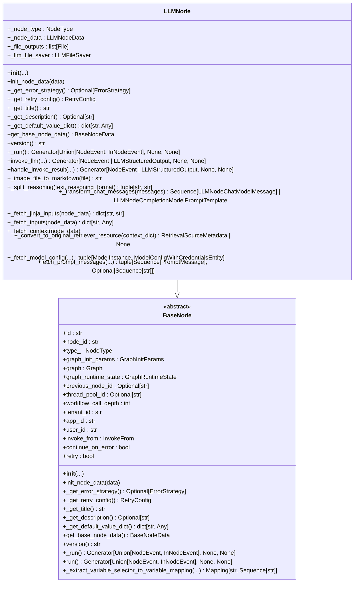
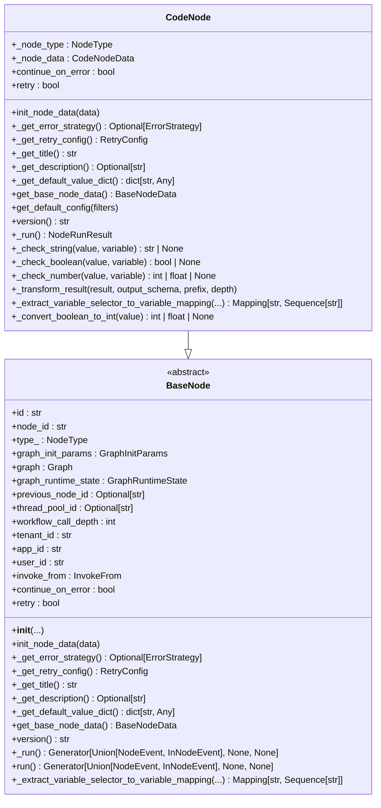
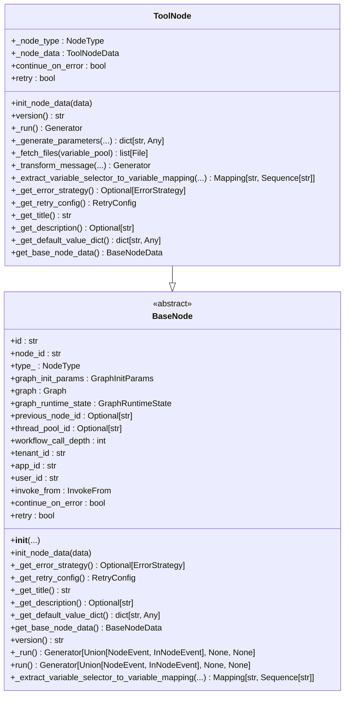
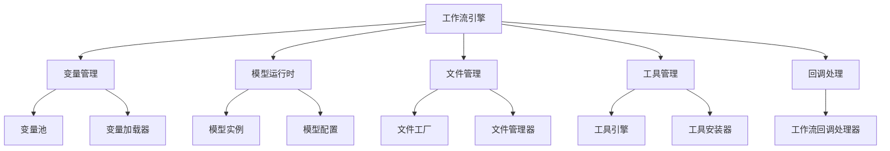

# 工作流引擎

<cite>
**本文档引用的文件**
- [workflow_entry.py](file://api/core/workflow/workflow_entry.py)
- [graph_engine.py](file://api/core/workflow/graph_engine/graph_engine.py)
- [node_mapping.py](file://api/core/workflow/nodes/node_mapping.py)
- [llm/node.py](file://api/core/workflow/nodes/llm/node.py)
- [code/code_node.py](file://api/core/workflow/nodes/code/code_node.py)
- [tool/tool_node.py](file://api/core/workflow/nodes/tool/tool_node.py)
- [workflow.py](file://api/controllers/web/workflow.py)
</cite>

## 目录
1. [简介](#简介)
2. [项目结构](#项目结构)
3. [核心组件](#核心组件)
4. [架构概述](#架构概述)
5. [详细组件分析](#详细组件分析)
6. [依赖分析](#依赖分析)
7. [性能考虑](#性能考虑)
8. [故障排除指南](#故障排除指南)
9. [结论](#结论)

## 简介
Dify工作流引擎是一个强大的可视化编排系统，允许用户通过拖拽界面构建复杂的AI应用。该引擎支持多种节点类型，包括LLM、代码执行、工具调用等，并提供了循环、条件分支和并行执行等高级功能。工作流引擎还集成了知识库、模型配置等应用组件，支持从简单问答到复杂多步骤决策的各种应用场景。

## 项目结构
Dify工作流引擎的代码主要位于`api/core/workflow`目录下，包含节点实现、图引擎、回调机制等核心组件。控制器层位于`api/controllers/web`目录下，负责处理工作流相关的API请求。

**图源**
- [workflow_entry.py](file://api/core/workflow/workflow_entry.py)
- [graph_engine.py](file://api/core/workflow/graph_engine/graph_engine.py)
- [node_mapping.py](file://api/core/workflow/nodes/node_mapping.py)

**节源**
- [workflow_entry.py](file://api/core/workflow/workflow_entry.py)
- [graph_engine.py](file://api/core/workflow/graph_engine/graph_engine.py)

## 核心组件
工作流引擎的核心组件包括工作流入口、图引擎、节点映射和各种节点实现。这些组件协同工作，实现了工作流的可视化编排和执行。

**节源**
- [workflow_entry.py](file://api/core/workflow/workflow_entry.py#L1-L50)
- [graph_engine.py](file://api/core/workflow/graph_engine/graph_engine.py#L1-L50)

## 架构概述
Dify工作流引擎采用基于图的执行模型，其中每个节点代表一个处理单元，节点之间的边定义了数据流和控制流。引擎通过深度优先遍历图来执行工作流，支持条件分支、循环和并行执行等复杂逻辑。

**图源**
- [workflow_entry.py](file://api/core/workflow/workflow_entry.py#L1-L20)
- [graph_engine.py](file://api/core/workflow/graph_engine/graph_engine.py#L10-L30)

## 详细组件分析

### 工作流入口分析
工作流入口是工作流执行的起点，负责初始化执行环境并启动图引擎。

**图源**
- [workflow_entry.py](file://api/core/workflow/workflow_entry.py#L1-L394)
- [graph_engine.py](file://api/core/workflow/graph_engine/graph_engine.py#L1-L799)

**节源**
- [workflow_entry.py](file://api/core/workflow/workflow_entry.py#L1-L394)
- [graph_engine.py](file://api/core/workflow/graph_engine/graph_engine.py#L1-L799)

### 节点类型分析

#### LLM节点分析
LLM节点负责调用大语言模型进行文本生成和处理。

**图源**
- [llm/node.py](file://api/core/workflow/nodes/llm/node.py#L1-L799)

**节源**
- [llm/node.py](file://api/core/workflow/nodes/llm/node.py#L1-L799)

#### 代码节点分析
代码节点允许在工作流中执行自定义代码。

**图源**
- [code/code_node.py](file://api/core/workflow/nodes/code/code_node.py#L1-L433)

**节源**
- [code/code_node.py](file://api/core/workflow/nodes/code/code_node.py#L1-L433)

#### 工具节点分析
工具节点用于调用外部工具或插件。

**图源**
- [tool/tool_node.py](file://api/core/workflow/nodes/tool/tool_node.py#L1-L466)

**节源**
- [tool/tool_node.py](file://api/core/workflow/nodes/tool/tool_node.py#L1-L466)

### 节点映射分析
节点映射模块定义了所有节点类型及其对应的实现类。

```mermaid
classDiagram
class NodeType {
+START : str
+END : str
+ANSWER : str
+LLM : str
+KNOWLEDGE_RETRIEVAL : str
+IF_ELSE : str
+CODE : str
+TEMPLATE_TRANSFORM : str
+QUESTION_CLASSIFIER : str
+HTTP_REQUEST : str
+TOOL : str
+VARIABLE_AGGREGATOR : str
+LEGACY_VARIABLE_AGGREGATOR : str
+ITERATION : str
+ITERATION_START : str
+LOOP : str
+LOOP_START : str
+LOOP_END : str
+PARAMETER_EXTRACTOR : str
+VARIABLE_ASSIGNER : str
+DOCUMENT_EXTRACTOR : str
+LIST_OPERATOR : str
+AGENT : str
}
class NODE_TYPE_CLASSES_MAPPING {
+NodeType.START : Mapping[str, type[BaseNode]]
+NodeType.END : Mapping[str, type[BaseNode]]
+NodeType.ANSWER : Mapping[str, type[BaseNode]]
+NodeType.LLM : Mapping[str, type[BaseNode]]
+NodeType.KNOWLEDGE_RETRIEVAL : Mapping[str, type[BaseNode]]
+NodeType.IF_ELSE : Mapping[str, type[BaseNode]]
+NodeType.CODE : Mapping[str, type[BaseNode]]
+NodeType.TEMPLATE_TRANSFORM : Mapping[str, type[BaseNode]]
+NodeType.QUESTION_CLASSIFIER : Mapping[str, type[BaseNode]]
+NodeType.HTTP_REQUEST : Mapping[str, type[BaseNode]]
+NodeType.TOOL : Mapping[str, type[BaseNode]]
+NodeType.VARIABLE_AGGREGATOR : Mapping[str, type[BaseNode]]
+NodeType.LEGACY_VARIABLE_AGGREGATOR : Mapping[str, type[BaseNode]]
+NodeType.ITERATION : Mapping[str, type[BaseNode]]
+NodeType.ITERATION_START : Mapping[str, type[BaseNode]]
+NodeType.LOOP : Mapping[str, type[BaseNode]]
+NodeType.LOOP_START : Mapping[str, type[BaseNode]]
+NodeType.LOOP_END : Mapping[str, type[BaseNode]]
+NodeType.PARAMETER_EXTRACTOR : Mapping[str, type[BaseNode]]
+NodeType.VARIABLE_ASSIGNER : Mapping[str, type[BaseNode]]
+NodeType.DOCUMENT_EXTRACTOR : Mapping[str, type[BaseNode]]
+NodeType.LIST_OPERATOR : Mapping[str, type[BaseNode]]
+NodeType.AGENT : Mapping[str, type[BaseNode]]
}
class BaseNode {
<<abstract>>
+id : str
+node_id : str
+type_ : NodeType
+graph_init_params : GraphInitParams
+graph : Graph
+graph_runtime_state : GraphRuntimeState
+previous_node_id : Optional[str]
+thread_pool_id : Optional[str]
+workflow_call_depth : int
+tenant_id : str
+app_id : str
+user_id : str
+invoke_from : InvokeFrom
+__init__(...)
+init_node_data(data)
+_get_error_strategy() Optional[ErrorStrategy]
+_get_retry_config() RetryConfig
+_get_title() str
+_get_description() Optional[str]
+_get_default_value_dict() dict[str, Any]
+get_base_node_data() BaseNodeData
+version() str
+_run() Generator[Union[NodeEvent, InNodeEvent], None, None]
+run() Generator[Union[NodeEvent, InNodeEvent], None, None]
+_extract_variable_selector_to_variable_mapping(...) Mapping[str, Sequence[str]]
+continue_on_error : bool
+retry : bool
}
class StartNode {
+_node_type : NodeType
+_node_data : StartNodeData
+init_node_data(data)
+_get_error_strategy() Optional[ErrorStrategy]
+_get_retry_config() RetryConfig
+_get_title() str
+_get_description() Optional[str]
+_get_default_value_dict() dict[str, Any]
+get_base_node_data() BaseNodeData
+version() str
+_run() Generator[Union[NodeEvent, InNodeEvent], None, None]
}
class EndNode {
+_node_type : NodeType
+_node_data : EndNodeData
+init_node_data(data)
+_get_error_strategy() Optional[ErrorStrategy]
+_get_retry_config() RetryConfig
+_get_title() str
+_get_description() Optional[str]
+_get_default_value_dict() dict[str, Any]
+get_base_node_data() BaseNodeData
+version() str
+_run() Generator[Union[NodeEvent, InNodeEvent], None, None]
}
class AnswerNode {
+_node_type : NodeType
+_node_data : AnswerNodeData
+init_node_data(data)
+_get_error_strategy() Optional[ErrorStrategy]
+_get_retry_config() RetryConfig
+_get_title() str
+_get_description() Optional[str]
+_get_default_value_dict() dict[str, Any]
+get_base_node_data() BaseNodeData
+version() str
+_run() Generator[Union[NodeEvent, InNodeEvent], None, None]
}
class LLMNode {
+_node_type : NodeType
+_node_data : LLMNodeData
+_file_outputs : list[File]
+_llm_file_saver : LLMFileSaver
+__init__(...)
+init_node_data(data)
+_get_error_strategy() Optional[ErrorStrategy]
+_get_retry_config() RetryConfig
+_get_title() str
+_get_description() Optional[str]
+_get_default_value_dict() dict[str, Any]
+get_base_node_data() BaseNodeData
+version() str
+_run() Generator[Union[NodeEvent, InNodeEvent], None, None]
+invoke_llm(...) Generator[NodeEvent | LLMStructuredOutput, None, None]
+handle_invoke_result(...) Generator[NodeEvent | LLMStructuredOutput, None, None]
+_image_file_to_markdown(file) str
+_split_reasoning(text, reasoning_format) tuple[str, str]
+_transform_chat_messages(messages) Sequence[LLMNodeChatModelMessage] | LLMNodeCompletionModelPromptTemplate
+_fetch_jinja_inputs(node_data) dict[str, str]
+_fetch_inputs(node_data) dict[str, Any]
+_fetch_context(node_data)
+_convert_to_original_retriever_resource(context_dict) RetrievalSourceMetadata | None
+_fetch_model_config(...) tuple[ModelInstance, ModelConfigWithCredentialsEntity]
+fetch_prompt_messages(...) tuple[Sequence[PromptMessage], Optional[Sequence[str]]]
}
class KnowledgeRetrievalNode {
+_node_type : NodeType
+_node_data : KnowledgeRetrievalNodeData
+init_node_data(data)
+_get_error_strategy() Optional[ErrorStrategy]
+_get_retry_config() RetryConfig
+_get_title() str
+_get_description() Optional[str]
+_get_default_value_dict() dict[str, Any]
+get_base_node_data() BaseNodeData
+version() str
+_run() Generator[Union[NodeEvent, InNodeEvent], None, None]
}
class IfElseNode {
+_node_type : NodeType
+_node_data : IfElseNodeData
+init_node_data(data)
+_get_error_strategy() Optional[ErrorStrategy]
+_get_retry_config() RetryConfig
+_get_title() str
+_get_description() Optional[str]
+_get_default_value_dict() dict[str, Any]
+get_base_node_data() BaseNodeData
+version() str
+_run() Generator[Union[NodeEvent, InNodeEvent], None, None]
}
class CodeNode {
+_node_type : NodeType
+_node_data : CodeNodeData
+init_node_data(data)
+_get_error_strategy() Optional[ErrorStrategy]
+_get_retry_config() RetryConfig
+_get_title() str
+_get_description() Optional[str]
+_get_default_value_dict() dict[str, Any]
+get_base_node_data() BaseNodeData
+get_default_config(filters)
+version() str
+_run() NodeRunResult
+_check_string(value, variable) str | None
+_check_boolean(value, variable) bool | None
+_check_number(value, variable) int | float | None
+_transform_result(result, output_schema, prefix, depth)
+_extract_variable_selector_to_variable_mapping(...) Mapping[str, Sequence[str]]
+continue_on_error : bool
+retry : bool
+_convert_boolean_to_int(value) int | float | None
}
class TemplateTransformNode {
+_node_type : NodeType
+_node_data : TemplateTransformNodeData
+init_node_data(data)
+_get_error_strategy() Optional[ErrorStrategy]
+_get_retry_config() RetryConfig
+_get_title() str
+_get_description() Optional[str]
+_get_default_value_dict() dict[str, Any]
+get_base_node_data() BaseNodeData
+version() str
+_run() Generator[Union[NodeEvent, InNodeEvent], None, None]
}
class QuestionClassifierNode {
+_node_type : NodeType
+_node_data : QuestionClassifierNodeData
+init_node_data(data)
+_get_error_strategy() Optional[ErrorStrategy]
+_get_retry_config() RetryConfig
+_get_title() str
+_get_description() Optional[str]
+_get_default_value_dict() dict[str, Any]
+get_base_node_data() BaseNodeData
+version() str
+_run() Generator[Union[NodeEvent, InNodeEvent], None, None]
}
class HttpRequestNode {
+_node_type : NodeType
+_node_data : HttpRequestNodeData
+init_node_data(data)
+_get_error_strategy() Optional[ErrorStrategy]
+_get_retry_config() RetryConfig
+_get_title() str
+_get_description() Optional[str]
+_get_default_value_dict() dict[str, Any]
+get_base_node_data() BaseNodeData
+version() str
+_run() Generator[Union[NodeEvent, InNodeEvent], None, None]
}
class ToolNode {
+_node_type : NodeType
+_node_data : ToolNodeData
+init_node_data(data)
+version() str
+_run() Generator
+_generate_parameters(...) dict[str, Any]
+_fetch_files(variable_pool) list[File]
+_transform_message(...) Generator
+_extract_variable_selector_to_variable_mapping(...) Mapping[str, Sequence[str]]
+_get_error_strategy() Optional[ErrorStrategy]
+_get_retry_config() RetryConfig
+_get_title() str
+_get_description() Optional[str]
+_get_default_value_dict() dict[str, Any]
+get_base_node_data() BaseNodeData
+continue_on_error : bool
+retry : bool
}
class VariableAggregatorNode {
+_node_type : NodeType
+_node_data : VariableAggregatorNodeData
+init_node_data(data)
+_get_error_strategy() Optional[ErrorStrategy]
+_get_retry_config() RetryConfig
+_get_title() str
+_get_description() Optional[str]
+_get_default_value_dict() dict[str, Any]
+get_base_node_data() BaseNodeData
+version() str
+_run() Generator[Union[NodeEvent, InNodeEvent], None, None]
}
class IterationNode {
+_node_type : NodeType
+_node_data : IterationNodeData
+init_node_data(data)
+_get_error_strategy() Optional[ErrorStrategy]
+_get_retry_config() RetryConfig
+_get_title() str
+_get_description() Optional[str]
+_get_default_value_dict() dict[str, Any]
+get_base_node_data() BaseNodeData
+version() str
+_run() Generator[Union[NodeEvent, InNodeEvent], None, None]
}
class IterationStartNode {
+_node_type : NodeType
+_node_data : IterationStartNodeData
+init_node_data(data)
+_get_error_strategy() Optional[ErrorStrategy]
+_get_retry_config() RetryConfig
+_get_title() str
+_get_description() Optional[str]
+_get_default_value_dict() dict[str, Any]
+get_base_node_data() BaseNodeData
+version() str
+_run() Generator[Union[NodeEvent, InNodeEvent], None, None]
}
class LoopNode {
+_node_type : NodeType
+_node_data : LoopNodeData
+init_node_data(data)
+_get_error_strategy() Optional[ErrorStrategy]
+_get_retry_config() RetryConfig
+_get_title() str
+_get_description() Optional[str]
+_get_default_value_dict() dict[str, Any]
+get_base_node_data() BaseNodeData
+version() str
+_run() Generator[Union[NodeEvent, InNodeEvent], None, None]
}
class LoopStartNode {
+_node_type : NodeType
+_node_data : LoopStartNodeData
+init_node_data(data)
+_get_error_strategy() Optional[ErrorStrategy]
+_get_retry_config() RetryConfig
+_get_title() str
+_get_description() Optional[str]
+_get_default_value_dict() dict[str, Any]
+get_base_node_data() BaseNodeData
+version() str
+_run() Generator[Union[NodeEvent, InNodeEvent], None, None]
}
class LoopEndNode {
+_node_type : NodeType
+_node_data : LoopEndNodeData
+init_node_data(data)
+_get_error_strategy() Optional[ErrorStrategy]
+_get_retry_config() RetryConfig
+_get_title() str
+_get_description() Optional[str]
+_get_default_value_dict() dict[str, Any]
+get_base_node_data() BaseNodeData
+version() str
+_run() Generator[Union[NodeEvent, InNodeEvent], None, None]
}
class ParameterExtractorNode {
+_node_type : NodeType
+_node_data : ParameterExtractorNodeData
+init_node_data(data)
+_get_error_strategy() Optional[ErrorStrategy]
+_get_retry_config() RetryConfig
+_get_title() str
+_get_description() Optional[str]
+_get_default_value_dict() dict[str, Any]
+get_base_node_data() BaseNodeData
+version() str
+_run() Generator[Union[NodeEvent, InNodeEvent], None, None]
}
class VariableAssignerNodeV1 {
+_node_type : NodeType
+_node_data : VariableAssignerNodeData
+init_node_data(data)
+_get_error_strategy() Optional[ErrorStrategy]
+_get_retry_config() RetryConfig
+_get_title() str
+_get_description() Optional[str]
+_get_default_value_dict() dict[str, Any]
+get_base_node_data() BaseNodeData
+version() str
+_run() Generator[Union[NodeEvent, InNodeEvent], None, None]
}
class VariableAssignerNodeV2 {
+_node_type : NodeType
+_node_data : VariableAssignerNodeData
+init_node_data(data)
+_get_error_strategy() Optional[ErrorStrategy]
+_get_retry_config() RetryConfig
+_get_title() str
+_get_description() Optional[str]
+_get_default_value_dict() dict[str, Any]
+get_base_node_data() BaseNodeData
+version() str
+_run() Generator[Union[NodeEvent, InNodeEvent], None, None]
}
class DocumentExtractorNode {
+_node_type : NodeType
+_node_data : DocumentExtractorNodeData
+init_node_data(data)
+_get_error_strategy() Optional[ErrorStrategy]
+_get_retry_config() RetryConfig
+_get_title() str
+_get_description() Optional[str]
+_get_default_value_dict() dict[str, Any]
+get_base_node_data() BaseNodeData
+version() str
+_run() Generator[Union[NodeEvent, InNodeEvent], None, None]
}
class ListOperatorNode {
+_node_type : NodeType
+_node_data : ListOperatorNodeData
+init_node_data(data)
+_get_error_strategy() Optional[ErrorStrategy]
+_get_retry_config() RetryConfig
+_get_title() str
+_get_description() Optional[str]
+_get_default_value_dict() dict[str, Any]
+get_base_node_data() BaseNodeData
+version() str
+_run() Generator[Union[NodeEvent, InNodeEvent], None, None]
}
class AgentNode {
+_node_type : NodeType
+_node_data : AgentNodeData
+init_node_data(data)
+_get_error_strategy() Optional[ErrorStrategy]
+_get_retry_config() RetryConfig
+_get_title() str
+_get_description() Optional[str]
+_get_default_value_dict() dict[str, Any]
+get_base_node_data() BaseNodeData
+version() str
+_run() Generator[Union[NodeEvent, InNodeEvent], None, None]
}
BaseNode <|-- StartNode
BaseNode <|-- EndNode
BaseNode <|-- AnswerNode
BaseNode <|-- LLMNode
BaseNode <|-- KnowledgeRetrievalNode
BaseNode <|-- IfElseNode
BaseNode <|-- CodeNode
BaseNode <|-- TemplateTransformNode
BaseNode <|-- QuestionClassifierNode
BaseNode <|-- HttpRequestNode
BaseNode <|-- ToolNode
BaseNode <|-- VariableAggregatorNode
BaseNode <|-- IterationNode
BaseNode <|-- IterationStartNode
BaseNode <|-- LoopNode
BaseNode <|-- LoopStartNode
BaseNode <|-- LoopEndNode
BaseNode <|-- ParameterExtractorNode
BaseNode <|-- VariableAssignerNodeV1
BaseNode <|-- VariableAssignerNodeV2
BaseNode <|-- DocumentExtractorNode
BaseNode <|-- ListOperatorNode
BaseNode <|-- AgentNode
```

**图源**
- [node_mapping.py](file://api/core/workflow/nodes/node_mapping.py#L1-L135)

**节源**
- [node_mapping.py](file://api/core/workflow/nodes/node_mapping.py#L1-L135)

## 依赖分析
工作流引擎依赖于多个核心模块，包括变量管理、模型运行时、文件管理等。这些模块通过清晰的接口与工作流引擎交互，确保了系统的可扩展性和可维护性。

**图源**
- [workflow_entry.py](file://api/core/workflow/workflow_entry.py#L1-L394)
- [graph_engine.py](file://api/core/workflow/graph_engine/graph_engine.py#L1-L799)
- [llm/node.py](file://api/core/workflow/nodes/llm/node.py#L1-L799)
- [code/code_node.py](file://api/core/workflow/nodes/code/code_node.py#L1-L433)
- [tool/tool_node.py](file://api/core/workflow/nodes/tool/tool_node.py#L1-L466)

**节源**
- [workflow_entry.py](file://api/core/workflow/workflow_entry.py#L1-L394)
- [graph_engine.py](file://api/core/workflow/graph_engine/graph_engine.py#L1-L799)
- [llm/node.py](file://api/core/workflow/nodes/llm/node.py#L1-L799)
- [code/code_node.py](file://api/core/workflow/nodes/code/code_node.py#L1-L433)
- [tool/tool_node.py](file://api/core/workflow/nodes/tool/tool_node.py#L1-L466)

## 性能考虑
工作流引擎在设计时考虑了性能优化，包括线程池管理、异步执行、缓存机制等。通过限制最大执行步骤和执行时间，防止无限循环和长时间运行的工作流影响系统稳定性。

## 故障排除指南
当工作流执行出现问题时，可以通过检查执行日志、验证节点配置、测试单个节点等方式进行排查。常见的错误包括变量未定义、模型调用失败、代码执行错误等。

**节源**
- [workflow_entry.py](file://api/core/workflow/workflow_entry.py#L1-L394)
- [graph_engine.py](file://api/core/workflow/graph_engine/graph_engine.py#L1-L799)
- [llm/node.py](file://api/core/workflow/nodes/llm/node.py#L1-L799)
- [code/code_node.py](file://api/core/workflow/nodes/code/code_node.py#L1-L433)
- [tool/tool_node.py](file://api/core/workflow/nodes/tool/tool_node.py#L1-L466)

## 结论
Dify工作流引擎提供了一个强大而灵活的平台，用于构建和执行复杂的AI应用。通过可视化编排界面，用户可以轻松地组合各种节点类型，实现从简单问答到复杂决策的各种功能。引擎的设计注重可扩展性和可维护性，为未来的功能扩展奠定了坚实的基础。