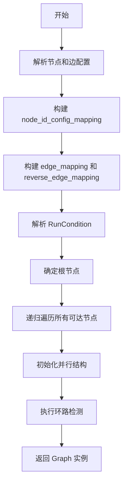
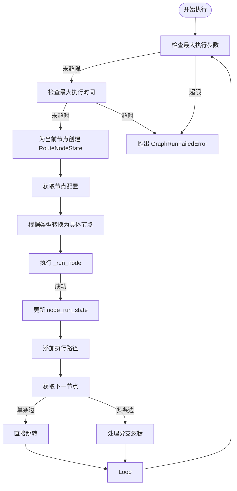
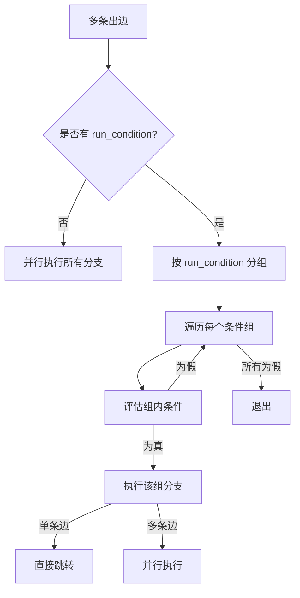
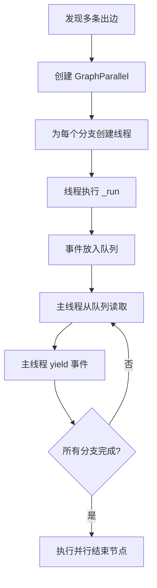
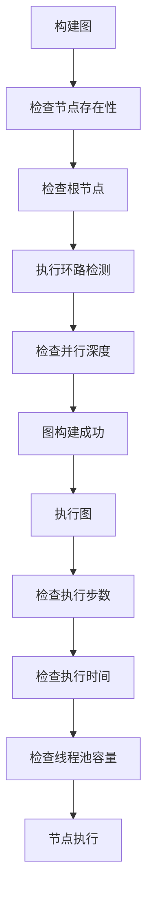
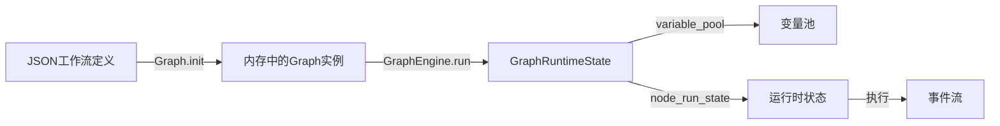

# 图引擎解析

<cite>
**本文档引用的文件**  
- [graph_engine.py](file://api/core/workflow/graph_engine/graph_engine.py)
- [graph.py](file://api/core/workflow/graph_engine/entities/graph.py)
- [graph_runtime_state.py](file://api/core/workflow/graph_engine/entities/graph_runtime_state.py)
- [runtime_route_state.py](file://api/core/workflow/graph_engine/entities/runtime_route_state.py)
- [run_condition.py](file://api/core/workflow/graph_engine/entities/run_condition.py)
- [condition_manager.py](file://api/core/workflow/graph_engine/condition_handlers/condition_manager.py)
- [branch_identify_handler.py](file://api/core/workflow/graph_engine/condition_handlers/branch_identify_handler.py)
- [condition_handler.py](file://api/core/workflow/graph_engine/condition_handlers/condition_handler.py)
- [node_mapping.py](file://api/core/workflow/nodes/node_mapping.py)
</cite>

## 目录
1. [引言](#引言)
2. [工作流DAG构建与解析](#工作流dag构建与解析)
3. [节点依赖关系识别与执行路径拓扑排序](#节点依赖关系识别与执行路径拓扑排序)
4. [条件分支动态路由策略](#条件分支动态路由策略)
5. [循环结构与并行分支处理](#循环结构与并行分支处理)
6. [图结构验证与环路检测](#图结构验证与环路检测)
7. [图优化策略](#图优化策略)
8. [JSON工作流定义到内存执行图的转换](#json工作流定义到内存执行图的转换)
9. [图引擎与执行调度器的交互协议](#图引擎与执行调度器的交互协议)

## 引言
Dify工作流系统依赖于一个强大的图引擎来解析和执行复杂的有向无环图（DAG）工作流。该引擎负责将用户定义的JSON工作流配置转换为内存中的可执行图结构，并管理其运行时状态。本文档深入分析该图引擎的核心机制，包括DAG的构建、节点依赖解析、条件分支、循环与并行处理、图验证以及与调度器的交互。

## 工作流DAG构建与解析

Dify的图引擎通过`Graph`类来表示和管理整个工作流的DAG结构。`Graph`的构建始于`Graph.init()`方法，该方法接收原始的JSON格式工作流配置。

构建过程首先解析配置中的`nodes`和`edges`数组。`node_id_config_mapping`字典用于存储每个节点ID到其完整配置的映射。`edge_mapping`和`reverse_edge_mapping`则分别存储了从源节点到目标节点的边，以及从目标节点到源节点的反向边，这为后续的路径遍历和依赖分析提供了基础。

在构建边时，系统会解析`sourceHandle`字段来生成`RunCondition`对象。例如，当`sourceHandle`为`fail-branch`时，会创建一个`branch_identify`类型的条件，其值为`fail-branch`，这用于实现错误分支的路由。对于非`source`的句柄，也会创建相应的`branch_identify`条件。

构建完成后，引擎会通过`_check_connected_to_previous_node`方法进行环路检测，确保图中不存在指向已访问节点的边，从而保证了DAG的无环性。

**图来源**
- [graph.py](file://api/core/workflow/graph_engine/entities/graph.py#L100-L200)

## 节点依赖关系识别与执行路径拓扑排序

图引擎的执行核心是`GraphEngine`类的`_run`方法。该方法实现了对DAG的深度优先遍历，并隐式地完成了拓扑排序。

执行从`root_node_id`开始，通过`edge_mapping`查找当前节点的出边。如果只有一个出边，则直接进入下一个节点。如果有多个出边，则意味着存在并行分支或条件分支，此时会进入分支处理逻辑。

该遍历过程本质上是一种拓扑排序：它从入度为0的根节点出发，沿着边的方向推进，确保在执行一个节点之前，其所有前置节点（通过反向边`reverse_edge_mapping`可追溯）都已被处理。`GraphRuntimeState`中的`node_run_steps`计数器记录了执行的步数，用于防止无限循环。

**图来源**
- [graph_engine.py](file://api/core/workflow/graph_engine/graph_engine.py#L200-L400)

## 条件分支动态路由策略

Dify的条件分支由`RunCondition`实体和`ConditionManager`协同处理。`RunCondition`有两种类型：`branch_identify`和`condition`。

对于`branch_identify`类型（如`success-branch`或`fail-branch`），`BranchIdentifyRunConditionHandler`会检查前一个节点的执行结果`NodeRunResult`中的`edge_source_handle`字段是否与条件中的`branch_identify`值匹配。

对于`condition`类型，`ConditionRunConditionHandlerHandler`会使用`ConditionProcessor`来评估一组复杂的条件表达式。这些条件可以基于工作流变量池（`VariablePool`）中的数据进行判断，例如`{{#sys.query#}} contains "价格"`。处理器会递归地计算所有条件的布尔值，并根据`and`或`or`操作符得出最终结果。

在`_run`方法中，当遇到多条出边时，引擎会检查每条边上的`run_condition`。它会按顺序评估这些条件，一旦某个条件为真，就会选择该分支并执行。如果多条边共享同一个`run_condition`（通过`hash`值判断），则这些边会被视为一个并行分支组。

**图来源**
- [condition_manager.py](file://api/core/workflow/graph_engine/condition_handlers/condition_manager.py#L10-L25)
- [branch_identify_handler.py](file://api/core/workflow/graph_engine/condition_handlers/branch_identify_handler.py#L10-L25)
- [condition_handler.py](file://api/core/workflow/graph_engine/condition_handlers/condition_handler.py#L10-L25)

## 循环结构与并行分支处理

### 并行分支处理
并行分支由`GraphParallel`和`node_parallel_mapping`管理。`_recursively_add_parallels`方法在构建图时分析结构，为每个并行开始的节点创建一个`GraphParallel`实例，并将属于该并行的所有节点ID记录在`node_parallel_mapping`中。

执行时，`_run_parallel_branches`方法使用`ThreadPoolExecutor`来并发执行各个分支。它为每个分支创建一个线程，通过一个`queue.Queue`来收集各分支产生的事件。主线程从队列中读取事件并将其`yield`出去，实现了事件的实时流式传输。当所有分支都成功完成时，才会继续执行并行结束后的节点。

### 循环结构处理
虽然提供的代码片段未直接展示循环节点的实现，但`IterationNode`和`LoopNode`的存在表明系统支持循环。循环的实现通常依赖于特殊的节点类型和状态管理。例如，`IterationNode`可能会在每次迭代时修改变量池中的列表，并通过条件判断来决定是否继续循环。`GraphRuntimeState`中的`variable_pool`是实现循环状态传递的关键。

**图来源**
- [graph.py](file://api/core/workflow/graph_engine/entities/graph.py#L300-L500)
- [graph_engine.py](file://api/core/workflow/graph_engine/graph_engine.py#L500-L700)

## 图结构验证与环路检测

图引擎在构建和执行阶段都实施了严格的验证规则。

**构建时验证**：
1.  **节点存在性**：确保每个边的源和目标节点ID都存在于`node_id_config_mapping`中。
2.  **根节点有效性**：必须存在一个根节点，且该节点不能有入边。
3.  **环路检测**：`_check_connected_to_previous_node`方法通过深度优先遍历，检查是否存在指向已访问节点的边。如果存在，则抛出`ValueError`，阻止DAG的创建。
4.  **并行深度限制**：`_check_exceed_parallel_limit`方法递归检查并行嵌套的层数，防止过深的嵌套导致性能问题或栈溢出。

**运行时验证**：
1.  **执行步数限制**：`max_execution_steps`参数限制了工作流的最大执行步数。
2.  **执行时间限制**：`max_execution_time`参数限制了工作流的总执行时间。
3.  **线程池限制**：`GraphEngineThreadPool`通过`max_submit_count`限制了并发提交的任务数，防止资源耗尽。

这些验证机制共同确保了工作流的健壮性和安全性。

**图来源**
- [graph.py](file://api/core/workflow/graph_engine/entities/graph.py#L200-L300)
- [graph_engine.py](file://api/core/workflow/graph_engine/graph_engine.py#L100-L200)

## 图优化策略

Dify图引擎的优化策略主要体现在以下几个方面：

1.  **并行结构预计算**：在图构建阶段，`_recursively_add_parallels`方法就预先计算并存储了`parallel_mapping`和`node_parallel_mapping`。这避免了在运行时进行复杂的结构分析，提高了执行效率。
2.  **条件哈希缓存**：`RunCondition`类通过`hash`属性（基于`model_dump_json()`的SHA256）为每个条件生成唯一哈希值。这使得系统可以快速判断两个条件是否相同，从而对共享条件的分支进行分组，优化了分支处理逻辑。
3.  **事件流式处理**：`GraphEngine.run()`方法返回一个生成器（Generator），能够实时`yield`执行过程中的事件（如`NodeRunStartedEvent`, `NodeRunStreamChunkEvent`）。这种流式处理避免了在内存中累积大量中间结果，降低了内存占用，并支持了实时的前端更新。
4.  **线程池复用**：`GraphEngine`使用静态的`workflow_thread_pool_mapping`来管理线程池，实现了线程资源的复用，减少了频繁创建和销毁线程的开销。

## JSON工作流定义到内存执行图的转换

从JSON定义到内存执行图的转换是一个多步骤的过程：

1.  **初始化**：调用`Graph.init()`，传入JSON配置。
2.  **解析与映射**：解析`nodes`和`edges`，构建`node_id_config_mapping`和`edge_mapping`。
3.  **条件提取**：从`sourceHandle`中提取并创建`RunCondition`对象。
4.  **根节点确定**：寻找没有入边的节点，或类型为`START`的节点作为根节点。
5.  **拓扑遍历**：从根节点开始，递归遍历所有可达节点，确保图的连通性。
6.  **并行分析**：分析图结构，识别并行分支，构建`parallel_mapping`。
7.  **验证**：执行环路检测和并行深度检查。
8.  **返回**：返回一个完全构建好的`Graph`实例。

随后，`GraphEngine`接收这个`Graph`实例和`GraphRuntimeState`（包含`VariablePool`），开始执行`_run`方法，将静态的图结构转化为动态的执行流程。

**图来源**
- [graph.py](file://api/core/workflow/graph_engine/entities/graph.py#L100-L200)
- [graph_engine.py](file://api/core/workflow/graph_engine/graph_engine.py#L150-L200)

## 图引擎与执行调度器的交互协议

图引擎与执行调度器的交互主要通过**事件流（Event Stream）** 进行。`GraphEngine.run()`方法返回一个生成器，该生成器`yield`一系列`GraphEngineEvent`子类的实例。

这些事件构成了一个标准化的协议，调度器通过监听这个事件流来获取工作流的执行状态：
-   **GraphRunStartedEvent**: 工作流开始执行。
-   **NodeRunStartedEvent**: 某个节点开始执行。
-   **NodeRunStreamChunkEvent**: 节点产生流式输出（如LLM的逐字输出）。
-   **NodeRunSucceededEvent**: 节点执行成功。
-   **NodeRunFailedEvent**: 节点执行失败。
-   **GraphRunSucceededEvent**: 整个工作流执行成功。
-   **GraphRunFailedEvent**: 整个工作流执行失败。

调度器可以根据这些事件更新数据库中的执行记录、向客户端推送实时状态、或触发后续的回调操作。这种基于事件的异步通信模式解耦了图引擎和调度器，使得系统更加灵活和可扩展。

**节来源**
- [graph_engine.py](file://api/core/workflow/graph_engine/graph_engine.py#L150-L200)
- [graph_engine.py](file://api/core/workflow/graph_engine/entities/event.py)