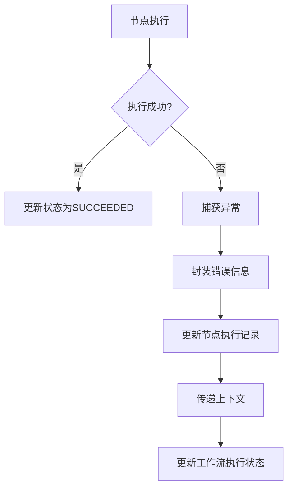
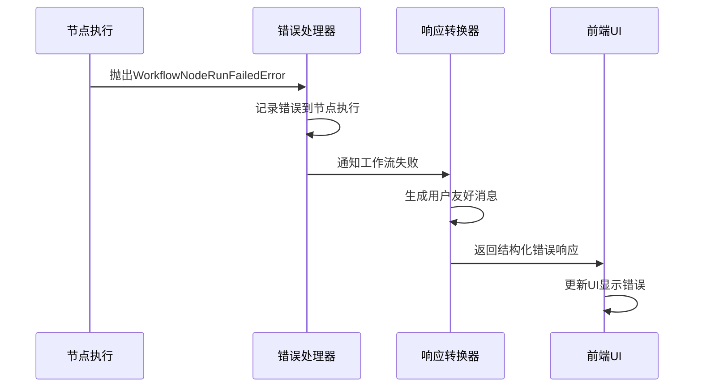
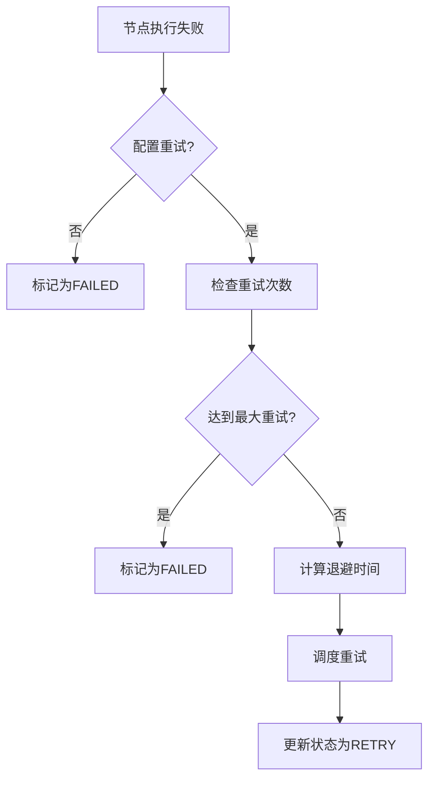

# 异常处理与重试

<cite>
**本文档引用文件**  
- [workflow.py](file://api/controllers/console/app/workflow.py)
- [workflow_run.py](file://api/controllers/console/app/workflow_run.py)
- [workflow_app_log.py](file://api/controllers/console/app/workflow_app_log.py)
- [workflow_entry.py](file://api/core/workflow/workflow_entry.py)
- [workflow_execution_repository.py](file://api/core/workflow/repositories/workflow_execution_repository.py)
- [workflow_node_execution_repository.py](file://api/core/workflow/repositories/workflow_node_execution_repository.py)
- [workflow_execution.py](file://api/core/workflow/entities/workflow_execution.py)
- [workflow_node_execution.py](file://api/core/workflow/entities/workflow_node_execution.py)
- [workflow_logging_callback.py](file://api/core/workflow/callbacks/workflow_logging_callback.py)
- [workflow_tool_callback_handler.py](file://api/core/callback_handler/workflow_tool_callback_handler.py)
- [errors.py](file://api/core/workflow/errors.py)
- [workflow_response_converter.py](file://api/core/app/apps/common/workflow_response_converter.py)
- [workflow_app_runner.py](file://api/core/app/apps/workflow_app_runner.py)
- [use-workflow-failed.ts](file://web/app/components/workflow/hooks/use-workflow-run-event/use-workflow-failed.ts)
</cite>

## 目录
1. [引言](#引言)
2. [执行错误的捕获与分类](#执行错误的捕获与分类)
3. [错误信息封装与上下文传递](#错误信息封装与上下文传递)
4. [用户友好的错误提示生成](#用户友好的错误提示生成)
5. [自动重试机制](#自动重试机制)
6. [错误日志记录与监控告警](#错误日志记录与监控告警)
7. [根因分析方法](#根因分析方法)
8. [补偿节点与错误恢复流程](#补偿节点与错误恢复流程)
9. [结论](#结论)

## 引言
Dify 工作流系统在执行过程中可能遇到多种异常情况，包括节点执行失败、网络超时、资源不足等。为确保系统的健壮性和用户体验，Dify 实现了一套完整的异常处理与重试机制。本文档深入分析该机制的设计与实现，涵盖错误捕获、分类、封装、重试策略、日志记录、监控告警及复杂恢复流程。

## 执行错误的捕获与分类

Dify 工作流系统通过分层机制捕获和分类执行错误。核心错误类型定义在 `api/core/workflow/errors.py` 中，其中 `WorkflowNodeRunFailedError` 是节点执行失败的主要异常类，封装了失败节点和错误信息。

节点执行状态由 `WorkflowNodeExecutionStatus` 枚举定义，包含 `RUNNING`、`SUCCEEDED`、`FAILED`、`EXCEPTION` 和 `RETRY` 五种状态。当节点执行失败时，系统将其状态更新为 `FAILED` 或 `EXCEPTION`，并记录错误详情。

工作流整体执行状态由 `WorkflowExecutionStatus` 枚举管理，包括 `RUNNING`、`SUCCEEDED`、`FAILED`、`STOPPED` 和 `PARTIAL_SUCCEEDED`。当任意节点失败且未配置容错策略时，整个工作流将标记为 `FAILED`。

**Section sources**
- [errors.py](file://api/core/workflow/errors.py#L0-L8)
- [workflow_node_execution.py](file://api/core/workflow/entities/workflow_node_execution.py#L0-L132)
- [workflow_execution.py](file://api/core/workflow/entities/workflow_execution.py#L0-L89)

## 错误信息封装与上下文传递

Dify 采用结构化方式封装错误信息，并通过上下文机制在执行链路中传递。每个节点执行实例 `WorkflowNodeExecution` 包含 `error` 字段用于存储错误消息，`metadata` 字段用于携带额外的诊断信息，如 `total_tokens`、`tool_info`、`agent_log` 等。

当节点执行失败时，`workflow_tool_callback_handler.py` 中的回调处理器会捕获异常，将其转换为标准错误格式，并更新节点执行记录。错误信息包含节点ID、标题、输入参数、错误类型和详细消息，确保上下文完整。

工作流执行上下文通过 `WorkflowExecution` 实体传递，其中 `exceptions_count` 字段统计异常次数，`error_message` 存储摘要信息。这些数据在执行过程中持续更新，供后续节点和监控系统使用。

**Diagram sources**
- [workflow_node_execution.py](file://api/core/workflow/entities/workflow_node_execution.py#L0-L132)
- [workflow_execution.py](file://api/core/workflow/entities/workflow_execution.py#L0-L89)
- [workflow_tool_callback_handler.py](file://api/core/callback_handler/workflow_tool_callback_handler.py)

**Section sources**
- [workflow_node_execution.py](file://api/core/workflow/entities/workflow_node_execution.py#L0-L132)
- [workflow_execution.py](file://api/core/workflow/entities/workflow_execution.py#L0-L89)
- [workflow_tool_callback_handler.py](file://api/core/callback_handler/workflow_tool_callback_handler.py)

## 用户友好的错误提示生成

Dify 通过 `workflow_response_converter.py` 将底层错误信息转换为用户可理解的提示。系统根据错误类型和上下文生成简洁明了的错误消息，避免暴露技术细节。

前端组件 `use-workflow-failed.ts` 监听工作流失败事件，触发UI状态更新。当工作流状态变为 `FAILED` 时，前端展示错误摘要，并提供查看详细日志的入口。

错误提示遵循国际化原则，通过 `i18n` 模块支持多语言。系统根据用户语言偏好选择合适的错误描述，提升用户体验。

**Diagram sources**
- [workflow_response_converter.py](file://api/core/app/apps/common/workflow_response_converter.py)
- [use-workflow-failed.ts](file://web/app/components/workflow/hooks/use-workflow-run-event/use-workflow-failed.ts)
- [errors.py](file://api/core/workflow/errors.py#L0-L8)

**Section sources**
- [workflow_response_converter.py](file://api/core/app/apps/common/workflow_response_converter.py)
- [use-workflow-failed.ts](file://web/app/components/workflow/hooks/use-workflow-run-event/use-workflow-failed.ts)

## 自动重试机制

Dify 工作流支持自动重试机制，通过配置触发条件、退避算法和最大重试次数来提高系统弹性。重试策略在节点级别配置，支持指数退避算法。

当节点执行失败时，系统检查其 `error_strategy` 配置。若配置为重试，节点状态将被设置为 `RETRY`，并根据退避算法计算下次执行时间。重试次数由 `max_retries` 参数限制，防止无限循环。

重试逻辑由 `workflow_entry.py` 中的执行引擎管理，结合 `workflow_execution_repository.py` 持久化重试状态。每次重试都会生成新的节点执行记录，保留历史尝试信息。

**Diagram sources**
- [workflow_entry.py](file://api/core/workflow/workflow_entry.py)
- [workflow_execution_repository.py](file://api/core/workflow/repositories/workflow_execution_repository.py)
- [workflow_node_execution.py](file://api/core/workflow/entities/workflow_node_execution.py#L0-L132)

**Section sources**
- [workflow_entry.py](file://api/core/workflow/workflow_entry.py)
- [workflow_execution_repository.py](file://api/core/workflow/repositories/workflow_execution_repository.py)

## 错误日志记录与监控告警

Dify 通过 `workflow_logging_callback.py` 实现结构化日志记录。所有节点执行事件（包括错误）都被记录到 `workflow_node_execution` 表中，包含时间戳、状态、输入输出和错误详情。

日志数据用于监控和告警。系统统计 `exceptions_count` 和 `error_message`，当异常率超过阈值时触发告警。日志与 OpenTelemetry 集成，支持分布式追踪和性能分析。

`workflow_app_log.py` 提供日志查询接口，支持按工作流ID、节点ID、时间范围等条件过滤。日志条目包含完整的执行上下文，便于问题排查。

**Section sources**
- [workflow_logging_callback.py](file://api/core/workflow/callbacks/workflow_logging_callback.py)
- [workflow_app_log.py](file://api/controllers/console/app/workflow_app_log.py)
- [workflow_node_execution_repository.py](file://api/core/workflow/repositories/workflow_node_execution_repository.py)

## 根因分析方法

Dify 提供多层次的根因分析能力。通过 `workflow_execution` 和 `workflow_node_execution` 的关联数据，可以重建失败工作流的完整执行路径。

系统分析节点输入、处理数据和输出，识别数据异常。结合 `metadata` 中的 `tool_info` 和 `agent_log`，可定位到具体工具调用或代理决策环节。

对于复杂错误，系统支持回放功能，允许在调试模式下重新执行失败节点，观察变量变化。日志中的 `elapsed_time` 和 `total_tokens` 有助于识别性能瓶颈。

**Section sources**
- [workflow_execution.py](file://api/core/workflow/entities/workflow_execution.py#L0-L89)
- [workflow_node_execution.py](file://api/core/workflow/entities/workflow_node_execution.py#L0-L132)
- [workflow_logging_callback.py](file://api/core/workflow/callbacks/workflow_logging_callback.py)

## 补偿节点与错误恢复流程

Dify 支持通过补偿节点实现复杂错误恢复。当关键节点失败时，可配置替代路径执行补偿操作，如发送通知、回滚状态或调用备用服务。

补偿逻辑在工作流图中显式定义，通过条件分支连接到失败节点。系统在检测到失败后，根据预设规则激活补偿路径，确保业务连续性。

`workflow_app_runner.py` 管理补偿流程的执行，确保补偿节点获得必要的上下文数据。补偿结果被记录到执行历史中，形成完整的错误处理闭环。

**Section sources**
- [workflow_app_runner.py](file://api/core/app/apps/workflow_app_runner.py)
- [workflow_entry.py](file://api/core/workflow/workflow_entry.py)
- [workflow_execution.py](file://api/core/workflow/entities/workflow_execution.py#L0-L89)

## 结论
Dify 工作流的异常处理机制通过分层设计实现了高可靠性和可观测性。从错误捕获、封装、重试到补偿恢复，系统提供了一套完整的解决方案。结构化日志和上下文传递确保了问题可追溯，而用户友好的提示提升了使用体验。该机制为构建健壮的AI工作流应用奠定了坚实基础。