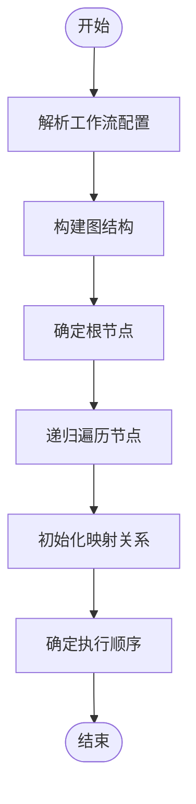
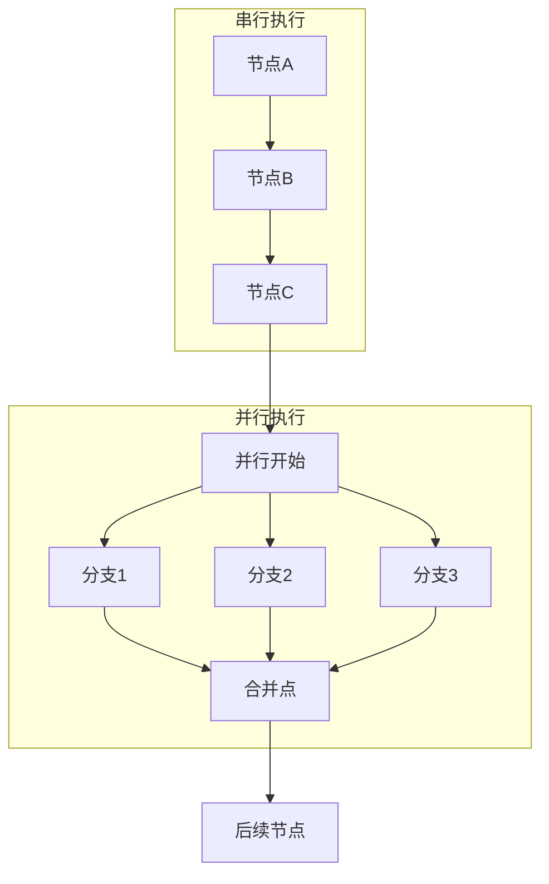
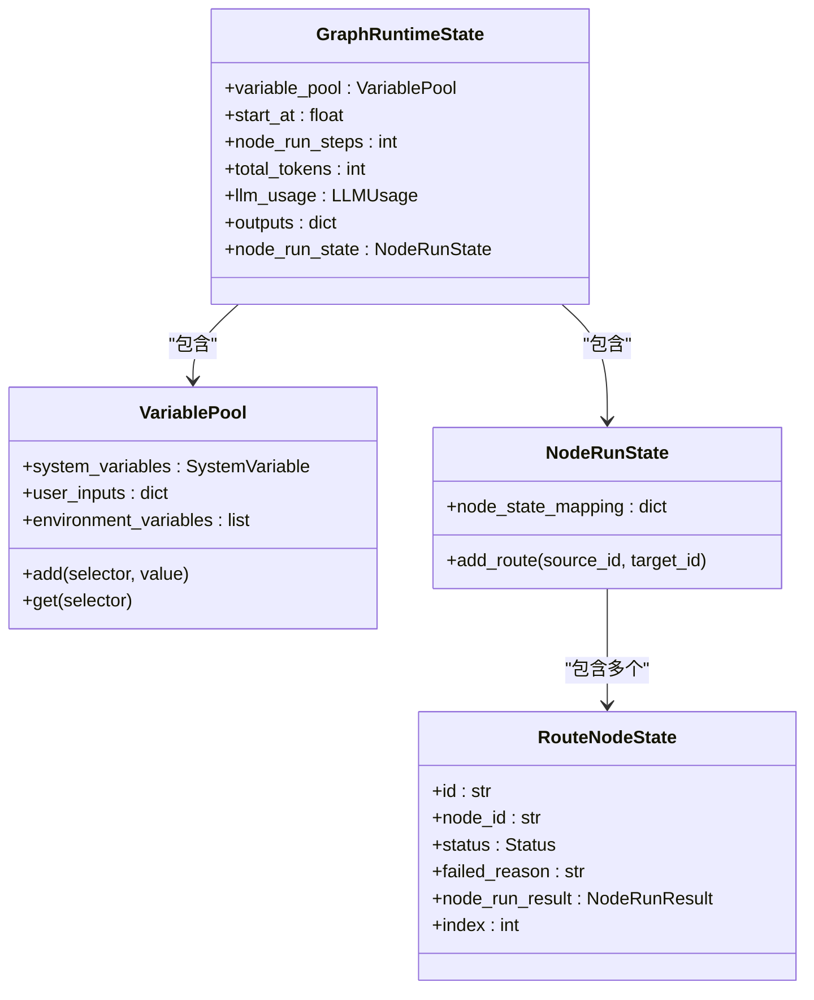
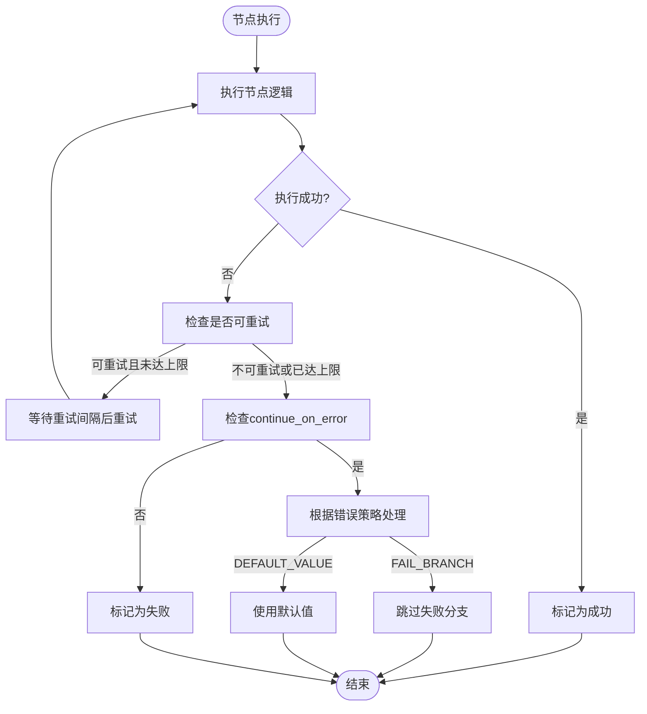

# 执行流程与调度

<cite>
**本文档中引用的文件**  
- [workflow_entry.py](file://api/core/workflow/workflow_entry.py)
- [graph_engine.py](file://api/core/workflow/graph_engine/graph_engine.py)
- [graph.py](file://api/core/workflow/graph_engine/entities/graph.py)
- [workflow_cycle_manager.py](file://api/core/workflow/workflow_cycle_manager.py)
- [workflow_app_service.py](file://api/services/workflow_app_service.py)
- [workflow_run_service.py](file://api/services/workflow_run_service.py)
- [workflow_execution_tasks.py](file://api/tasks/workflow_execution_tasks.py)
- [sqlalchemy_workflow_node_execution_repository.py](file://api/core/repositories/sqlalchemy_workflow_node_execution_repository.py)
</cite>

## 目录
1. [工作流执行生命周期](#工作流执行生命周期)
2. [工作流图解析与执行顺序确定](#工作流图解析与执行顺序确定)
3. [并行与串行调度策略](#并行与串行调度策略)
4. [执行上下文与状态管理](#执行上下文与状态管理)
5. [异常处理机制](#异常处理机制)
6. [性能指标与优化建议](#性能指标与优化建议)
7. [复杂工作流执行路径分析](#复杂工作流执行路径分析)
8. [异步执行与超时控制](#异步执行与超时控制)

## 工作流执行生命周期

Dify工作流引擎的执行生命周期始于工作流的触发，终于执行完成或失败。整个过程由`WorkflowEntry`类驱动，通过`run`方法启动执行流程。执行开始时，系统会创建`GraphEngine`实例，该实例负责管理图的运行状态、节点执行和事件分发。执行过程中，引擎会生成一系列事件（如`GraphRunStartedEvent`、`NodeRunStartedEvent`等），这些事件通过回调机制通知外部系统。执行结束时，根据最终状态触发`GraphRunSucceededEvent`、`GraphRunFailedEvent`或`GraphRunPartialSucceededEvent`事件，标志着工作流生命周期的终结。

**Section sources**
- [workflow_entry.py](file://api/core/workflow/workflow_entry.py#L35-L393)
- [graph_engine.py](file://api/core/workflow/graph_engine/graph_engine.py#L87-L908)

## 工作流图解析与执行顺序确定

工作流图的解析由`Graph`类的`init`方法完成。该方法接收工作流配置（`graph_config`），构建包含节点、边、并行结构等信息的图模型。解析过程首先建立边映射（`edge_mapping`）和反向边映射（`reverse_edge_mapping`），然后确定根节点（`root_node_id`），通常为类型为"START"的节点。接着，通过递归遍历确定所有可达节点，并构建`node_id_config_mapping`。执行顺序的确定依赖于`_run`方法中的循环逻辑，该方法根据当前节点的出边（`edge_mappings`）决定下一个执行的节点。如果只有一个出边，则直接跳转；如果有多个出边，则根据条件（`run_condition`）或并行策略决定执行路径。

**Diagram sources**
- [graph.py](file://api/core/workflow/graph_engine/entities/graph.py#L34-L673)

**Section sources**
- [graph.py](file://api/core/workflow/graph_engine/entities/graph.py#L34-L673)

## 并行与串行调度策略

Dify工作流引擎支持复杂的并行与串行混合调度。并行结构的识别和管理在`Graph`类的`_recursively_add_parallels`方法中实现。当一个节点有多个出边时，系统会创建一个`GraphParallel`对象，将这些分支标记为并行执行。并行执行通过`_run_parallel_branches`方法实现，该方法使用线程池（`GraphEngineThreadPool`）为每个分支创建独立线程，并通过队列（`queue.Queue`）收集执行结果。串行执行则通过`_run`方法中的循环逻辑自然实现，即按顺序执行单个出边的节点。并行与串行的切换由`in_parallel_id`参数控制，当节点处于并行分支内时，其后续节点也将在同一并行上下文中执行，直到遇到并行结束节点。

**Diagram sources**
- [graph_engine.py](file://api/core/workflow/graph_engine/graph_engine.py#L87-L908)

**Section sources**
- [graph_engine.py](file://api/core/workflow/graph_engine/graph_engine.py#L87-L908)

## 执行上下文与状态管理

执行上下文由`GraphRuntimeState`类管理，它贯穿整个工作流执行过程。上下文包含`VariablePool`（变量池），用于存储和传递节点间的输入输出数据。每个节点执行时，其输出会被添加到变量池中，供后续节点通过变量选择器（variable selector）访问。状态管理还包括`node_run_state`，用于跟踪每个节点的执行状态（如`RouteNodeState`），记录执行步骤、耗时和路由信息。此外，`GraphEngine`还维护总耗时、总Token数等聚合指标。状态的持久化通过`WorkflowNodeExecutionRepository`实现，每次节点执行完成后，其输入、输出、状态和元数据都会被序列化并存储到数据库。

**Diagram sources**
- [graph_engine.py](file://api/core/workflow/graph_engine/graph_engine.py#L87-L908)
- [workflow_entry.py](file://api/core/workflow/workflow_entry.py#L35-L393)

**Section sources**
- [graph_engine.py](file://api/core/workflow/graph_engine/graph_engine.py#L87-L908)

## 异常处理机制

Dify工作流引擎提供了多层次的异常处理机制。在节点级别，通过`try-except`块捕获执行异常，并生成`NodeRunFailedEvent`事件。在工作流级别，支持两种错误策略（`ErrorStrategy`）：`FAIL_BRANCH`（失败分支）和`DEFAULT_VALUE`（默认值）。当节点配置为`continue_on_error`且策略为`FAIL_BRANCH`时，执行会跳过该节点的失败分支，继续执行其他路径。如果策略为`DEFAULT_VALUE`，则使用预设的默认值作为输出。此外，系统还实现了重试机制，通过`retry_config`配置最大重试次数和重试间隔，在节点执行失败后自动进行重试。所有异常信息都会被记录在`node_run_result`中，并最终反映在工作流的执行状态里。

**Diagram sources**
- [graph_engine.py](file://api/core/workflow/graph_engine/graph_engine.py#L87-L908)

**Section sources**
- [graph_engine.py](file://api/core/workflow/graph_engine/graph_engine.py#L87-L908)

## 性能指标与优化建议

工作流执行的关键性能指标包括执行延迟、资源消耗和错误率。执行延迟可通过`max_execution_time`配置项进行监控，超过阈值会触发超时异常。资源消耗主要体现在Token使用量（`total_tokens`）和线程池使用情况（`submit_count`）。错误率则通过统计`NodeRunFailedEvent`和`GraphRunFailedEvent`事件的数量来衡量。优化建议包括：合理设置`WORKFLOW_MAX_EXECUTION_STEPS`和`WORKFLOW_MAX_EXECUTION_TIME`以防止无限循环；利用并行执行提高效率，但需注意`WORKFLOW_PARALLEL_DEPTH_LIMIT`限制；通过`retry_config`配置合理的重试策略以应对临时性故障；监控线程池的`MAX_SUBMIT_COUNT`，避免资源耗尽。

**Section sources**
- [graph_engine.py](file://api/core/workflow/graph_engine/graph_engine.py#L87-L908)
- [workflow_entry.py](file://api/core/workflow/workflow_entry.py#L35-L393)

## 复杂工作流执行路径分析

对于包含嵌套循环和条件跳转的复杂工作流，Dify引擎通过递归解析和条件判断来确定执行路径。条件跳转由`RunCondition`和`ConditionManager`处理，系统会根据变量池中的值动态计算条件表达式的结果，从而决定分支走向。嵌套循环的实现依赖于图的递归遍历机制，当执行到循环结束节点时，引擎会根据条件判断是否需要回到循环开始节点重新执行。执行路径的追踪通过`node_run_state`中的`add_route`方法实现，形成一个有向无环图（DAG），清晰地记录了从开始到结束的所有执行步骤。

**Section sources**
- [graph.py](file://api/core/workflow/graph_engine/entities/graph.py#L34-L673)
- [graph_engine.py](file://api/core/workflow/graph_engine/graph_engine.py#L87-L908)

## 异步执行与超时控制

工作流的异步执行由Celery任务队列驱动，`workflow_execution_tasks.py`中的任务负责启动和监控工作流。`GraphEngine`内部使用线程池实现并行分支的异步执行，确保高并发场景下的性能。超时控制通过`_is_timed_out`方法实现，该方法在每次节点执行前检查当前时间与开始时间的差值，一旦超过`max_execution_time`（默认值由`dify_config.WORKFLOW_MAX_EXECUTION_TIME`配置），则立即抛出`GraphRunFailedError`异常，终止整个工作流的执行。这种机制有效防止了长时间运行或死循环的工作流占用系统资源。

**Section sources**
- [graph_engine.py](file://api/core/workflow/graph_engine/graph_engine.py#L87-L908)
- [workflow_execution_tasks.py](file://api/tasks/workflow_execution_tasks.py)