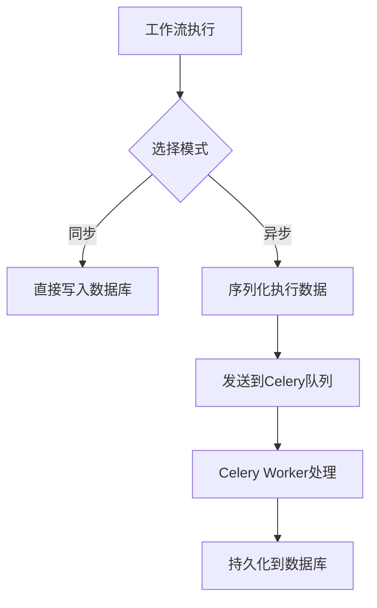
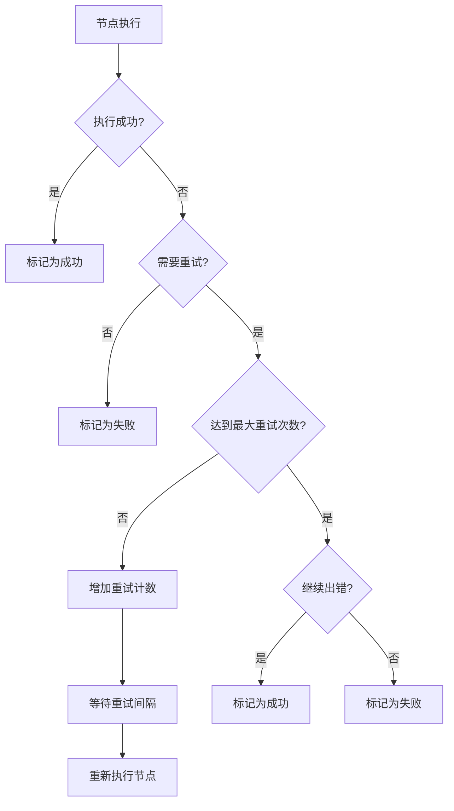

# 执行调度器

<cite>
**本文档中引用的文件**  
- [workflow_cycle_manager.py](file://api/core/workflow/workflow_cycle_manager.py)
- [variable_pool.py](file://api/core/workflow/entities/variable_pool.py)
- [workflow_execution.py](file://api/core/workflow/entities/workflow_execution.py)
- [celery_workflow_execution_repository.py](file://api/core/repositories/celery_workflow_execution_repository.py)
- [celery_workflow_node_execution_repository.py](file://api/core/repositories/celery_workflow_node_execution_repository.py)
- [workflow_execution_tasks.py](file://api/tasks/workflow_execution_tasks.py)
- [workflow_node_execution_tasks.py](file://api/tasks/workflow_node_execution_tasks.py)
- [graph_engine.py](file://api/core/workflow/graph_engine/graph_engine.py)
</cite>

## 目录
1. [简介](#简介)
2. [工作流执行生命周期管理](#工作流执行生命周期管理)
3. [执行上下文与变量池](#执行上下文与变量池)
4. [同步与异步执行模式](#同步与异步执行模式)
5. [任务队列与Celery分发机制](#任务队列与celery分发机制)
6. [错误处理与重试策略](#错误处理与重试策略)
7. [执行性能监控与优化](#执行性能监控与优化)
8. [结论](#结论)

## 简介
本文档深入分析Dify工作流调度器的核心机制，重点阐述工作流执行的生命周期管理、上下文传递、任务调度、错误处理和性能监控等关键方面。文档基于代码库中的核心组件，详细说明系统如何管理执行实例的创建、启动、暂停和终止流程，并解释异步任务处理、变量传递、重试逻辑和性能优化策略。

## 工作流执行生命周期管理

工作流执行生命周期由`WorkflowCycleManager`类统一管理，负责协调整个执行过程的状态流转。执行实例的创建通过`WorkflowExecution.new()`方法完成，该方法初始化执行ID、工作流ID、版本、图结构、输入参数和开始时间，并将状态设置为`RUNNING`。

执行的启动由`WorkflowEntry`入口点触发，通过`WorkflowCycleManager`协调执行上下文和系统变量。执行过程中，节点的启动事件由`handle_node_execution_start`方法处理，记录节点执行ID、类型、标题、前置节点等信息，并更新执行状态为`RUNNING`。

暂停和终止操作通过控制执行状态实现。当执行被终止时，系统会将`finished_at`时间戳设置为当前时间，并更新状态为`FAILED`或`TERMINATED`。执行完成后，`elapsed_time`属性自动计算从开始到结束的总耗时。

**Section sources**
- [workflow_cycle_manager.py](file://api/core/workflow/workflow_cycle_manager.py#L28-L61)
- [workflow_execution.py](file://api/core/workflow/entities/workflow_execution.py#L50-L88)

## 执行上下文与变量池

执行上下文通过`VariablePool`类实现，负责管理执行过程中所有变量的存储与传递。变量池整合了系统变量、用户输入、环境变量和对话变量，确保节点间的数据一致性。

`VariablePool`构造函数接受`system_variables`作为必需参数，同时可选地接收`variable_dictionary`、`user_inputs`、`environment_variables`和`conversation_variables`。系统变量包含用户ID、应用ID和工作流ID等关键上下文信息，用于跨节点共享。

变量池支持变量的动态更新和聚合，通过`segment_to_variable`等工具方法将分段数据转换为可管理的变量对象。这种设计确保了复杂工作流中变量的可追溯性和一致性。

**Section sources**
- [variable_pool.py](file://api/core/workflow/entities/variable_pool.py#L80-L116)
- [system_variable.py](file://api/core/workflow/system_variable.py)

## 同步与异步执行模式

Dify工作流支持同步与异步两种执行模式，通过执行仓库的实现选择来切换。同步模式直接将执行数据持久化到数据库，而异步模式通过Celery任务队列进行解耦。

异步执行由`CeleryWorkflowExecutionRepository`和`CeleryWorkflowNodeExecutionRepository`实现。这些仓库在`save`方法中将执行数据序列化后，通过`save_workflow_execution_task`或`save_workflow_node_execution_task` Celery任务进行异步处理，实现"即发即忘"（fire-and-forget）的高性能写入。

同步模式适用于需要立即确认写入结果的场景，而异步模式适用于高吞吐量场景，可显著降低请求延迟。

**Section sources**
- [celery_workflow_execution_repository.py](file://api/core/repositories/celery_workflow_execution_repository.py#L98-L125)
- [celery_workflow_node_execution_repository.py](file://api/core/repositories/celery_workflow_node_execution_repository.py#L94-L125)

## 任务队列与Celery分发机制

任务队列管理基于Celery框架实现，核心任务定义在`workflow_execution_tasks.py`和`workflow_node_execution_tasks.py`文件中。所有任务被分配到名为`workflow_storage`的专用队列中，确保工作流执行任务的优先级和隔离性。

Celery任务配置了最大重试次数（`max_retries=3`）和默认重试延迟（`default_retry_delay=60`秒），提供基本的故障恢复能力。任务参数包括序列化的执行数据、租户ID、应用ID、触发来源和创建者信息，确保上下文完整性。

任务分发机制采用"即发即忘"模式，`save`方法调用`delay()`后立即返回，不跟踪任务状态。这种设计优化了响应时间，但依赖于Celery worker的可靠性和监控。

**Diagram sources**
- [workflow_execution_tasks.py](file://api/tasks/workflow_execution_tasks.py#L0-L41)
- [workflow_node_execution_tasks.py](file://api/tasks/workflow_node_execution_tasks.py#L0-L42)

**Section sources**
- [celery_workflow_execution_repository.py](file://api/core/repositories/celery_workflow_execution_repository.py#L65-L99)

## 错误处理与重试策略

错误处理和重试策略在`graph_engine.py`中实现。当节点执行失败时，系统根据节点配置的`retry`属性和`max_retries`限制决定是否重试。HTTP请求节点在达到最大重试次数后，若配置了`continue_on_error`，可转为成功状态。

重试间隔由`retry_interval`参数控制，单位为毫秒。系统通过`NodeRunRetryEvent`事件记录每次重试，包含重试索引、错误信息和开始时间。重试逻辑在节点执行循环中实现，通过`time.sleep(retry_interval)`实现延迟重试。

**Diagram sources**
- [graph_engine.py](file://api/core/workflow/graph_engine/graph_engine.py#L658-L698)

**Section sources**
- [test_retry.py](file://api/tests/unit_tests/core/workflow/nodes/test_retry.py#L34-L64)
- [types.ts](file://web/app/components/workflow/nodes/_base/components/retry/types.ts)

## 执行性能监控与优化

执行性能监控的关键指标包括：
- **执行时长**：通过`elapsed_time`属性计算，表示从开始到结束的总时间
- **节点延迟**：通过`created_at`和`finished_at`时间戳计算单个节点的执行时间
- **总步数**：`total_steps`字段记录工作流执行的总节点数
- **总令牌数**：`total_tokens`字段跟踪LLM调用的令牌消耗

性能优化建议：
1. **资源隔离**：为`workflow_storage`队列配置专用Celery worker，避免与其他任务竞争资源
2. **并发控制**：通过Celery的`worker_concurrency`参数限制并发任务数，防止数据库过载
3. **批量处理**：在监控任务中实现批量读取和处理，减少数据库查询次数
4. **缓存策略**：利用`CeleryWorkflowNodeExecutionRepository`中的`_execution_cache`缓存最近的执行实例，加速读取

**Section sources**
- [workflow_execution.py](file://api/core/workflow/entities/workflow_execution.py#L50-L88)
- [arize_phoenix_trace.py](file://api/core/ops/arize_phoenix_trace/arize_phoenix_trace.py#L183-L210)

## 结论
Dify工作流调度器通过`WorkflowCycleManager`统一管理执行生命周期，利用`VariablePool`确保上下文一致性。系统通过Celery实现高效的异步任务处理，支持灵活的同步/异步模式切换。完善的重试策略和错误处理机制提高了工作流的可靠性，而详细的性能监控指标为系统优化提供了数据支持。整体架构设计平衡了性能、可靠性和可维护性，适用于复杂的自动化工作流场景。