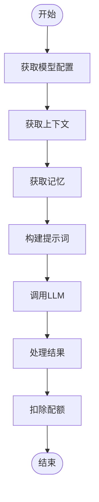

# LLM节点

<cite>
**本文档中引用的文件**  
- [node.py](file://api/core/workflow/nodes/llm/node.py)
- [entities.py](file://api/core/workflow/nodes/llm/entities.py)
- [llm_utils.py](file://api/core/workflow/nodes/llm/llm_utils.py)
- [file_saver.py](file://api/core/workflow/nodes/llm/file_saver.py)
- [exc.py](file://api/core/workflow/nodes/llm/exc.py)
</cite>

## 目录
1. [简介](#简介)
2. [核心功能](#核心功能)
3. [输入输出数据格式](#输入输出数据格式)
4. [可视化编辑器交互](#可视化编辑器交互)
5. [执行流程与错误处理](#执行流程与错误处理)
6. [性能优化建议](#性能优化建议)
7. [常见问题解决方案](#常见问题解决方案)
8. [结论](#结论)

## 简介
LLM节点是Dify工作流引擎中的核心组件，负责与大型语言模型进行交互。该节点提供了丰富的配置选项，包括模型参数设置、提示词模板管理、上下文长度控制和流式响应处理。通过LLM节点，用户可以构建复杂的AI工作流，实现智能对话、内容生成和数据分析等功能。

## 核心功能

### 模型参数配置
LLM节点支持灵活的模型参数配置，允许用户根据具体需求调整模型行为。在`entities.py`中定义的`ModelConfig`类包含了模型提供者、模型名称、模式和补全参数等关键属性。用户可以通过可视化界面或API配置这些参数，以优化模型输出质量和性能。

### 提示词模板设置
提示词模板是LLM节点的核心配置之一，支持两种模式：聊天模型和补全模型。在聊天模型模式下，用户可以定义包含系统、用户和助手角色的消息序列；在补全模型模式下，用户可以创建包含变量占位符的模板。模板支持Jinja2语法，允许动态插入变量值。

### 上下文长度管理
LLM节点通过`fetch_prompt_messages`方法管理上下文长度。该方法会根据模型的能力和配置，智能地截断或压缩输入内容，确保不超过模型的最大上下文限制。同时，节点支持从变量池中获取上下文信息，并将其整合到提示词中。

### 流式响应处理
LLM节点支持流式响应处理，通过`RunStreamChunkEvent`事件实时传递模型输出。这种机制不仅提高了用户体验，还允许下游节点及时处理部分结果。在`handle_invoke_result`方法中，节点会逐块处理模型返回的内容，并将其转换为Markdown格式。

**Section sources**
- [node.py](file://api/core/workflow/nodes/llm/node.py#L97-L1172)
- [entities.py](file://api/core/workflow/nodes/llm/entities.py#L60-L97)

## 输入输出数据格式

### 系统提示
系统提示通过`SystemPromptMessage`类定义，通常包含角色设定和行为准则。这些提示在对话开始时发送给模型，用于指导其行为。系统提示可以包含变量引用，如`{{#sys.query#}}`，这些变量会在运行时被实际值替换。

### 用户输入
用户输入通过`UserPromptMessage`类表示，可以是纯文本或包含多媒体内容的复合消息。当启用视觉功能时，用户输入还可以包含图像、视频等文件。文件信息通过`File`对象传递，包含URL、MIME类型和元数据。

### 模型输出
模型输出由`LLMResult`或`LLMResultChunk`对象表示，包含生成的文本、使用统计和完成原因。输出文本可能包含`<think>`标签，用于标记模型的思考过程。根据`reasoning_format`配置，节点会提取或保留这些标签。

### Token统计
Token统计信息通过`LLMUsage`对象提供，包括提示Token数、补全Token数和总Token数。这些数据对于监控成本和优化性能至关重要。统计信息会作为元数据附加到节点执行结果中。

**Section sources**
- [node.py](file://api/core/workflow/nodes/llm/node.py#L434-L457)
- [entities.py](file://api/core/workflow/nodes/llm/entities.py#L60-L97)

## 可视化编辑器交互

### 模型选择器
可视化编辑器提供直观的模型选择器，允许用户从支持的模型列表中选择合适的LLM。选择器显示模型名称、提供者和模式信息，并根据用户权限过滤可用选项。选择模型后，编辑器会自动加载其默认参数配置。

### 参数滑块
对于常见的模型参数，如温度、最大Token数和top_p，编辑器提供滑块控件。这些控件允许用户通过拖拽方式快速调整参数值，并实时预览调整效果。参数值的变化会立即反映在生成的代码和API调用中。

### 提示词编辑区域
提示词编辑区域支持富文本编辑，允许用户创建复杂的提示词模板。编辑器提供语法高亮、自动补全和错误检查功能。对于Jinja2模板，编辑器还会显示变量引用的上下文信息，帮助用户正确使用变量。

**Section sources**
- [node.py](file://api/core/workflow/nodes/llm/node.py#L366-L402)
- [entities.py](file://api/core/workflow/nodes/llm/entities.py#L60-L97)

## 执行流程与错误处理

### 执行流程
LLM节点的执行流程始于`_run`方法，该方法负责协调各个子组件的工作。首先，节点会获取模型配置、上下文信息和内存数据。然后，通过`fetch_prompt_messages`方法构建最终的提示词消息序列。最后，调用`invoke_llm`方法与模型交互，并处理返回结果。

**Diagram sources**
- [node.py](file://api/core/workflow/nodes/llm/node.py#L97-L1172)

### 错误处理机制
LLM节点实现了多层次的错误处理机制。在`_run`方法中，节点使用try-catch块捕获和处理各种异常。对于可恢复的错误，如变量未找到或上下文结构无效，节点会抛出特定的异常类型，如`VariableNotFoundError`或`InvalidContextStructureError`。对于不可恢复的错误，节点会记录异常并返回失败状态。

**Section sources**
- [node.py](file://api/core/workflow/nodes/llm/node.py#L97-L1172)
- [exc.py](file://api/core/workflow/nodes/llm/exc.py#L1-L45)

## 性能优化建议

### 缓存策略
建议启用结果缓存，特别是对于重复性高的查询。通过`ModelManager`和`provider_cache`模块，可以实现模型实例和配置的缓存，减少重复初始化的开销。对于频繁使用的提示词模板，也可以考虑缓存其解析结果。

### 并发限制
为了防止系统过载，应设置合理的并发限制。可以通过配置工作线程池大小和请求队列长度来控制并发度。对于高负载场景，建议使用分布式任务队列来分散压力。

### 超时设置
合理的超时设置对于保证系统稳定性至关重要。建议根据模型响应时间和网络延迟设置适当的超时值。过短的超时可能导致正常请求被中断，而过长的超时则会影响用户体验。

**Section sources**
- [llm_utils.py](file://api/core/workflow/nodes/llm/llm_utils.py#L1-L156)
- [node.py](file://api/core/workflow/nodes/llm/node.py#L97-L1172)

## 常见问题解决方案

### 响应延迟
响应延迟可能由多种因素引起，包括模型复杂度、网络延迟和系统负载。解决方案包括优化提示词以减少生成长度、使用更快的模型实例，或增加缓存命中率。

### 内容过滤
内容过滤问题通常与模型的安全策略有关。可以通过调整敏感词过滤配置或使用自定义过滤规则来解决。在`moderation`模块中，提供了输入和输出内容的过滤功能。

### Token超限
Token超限是常见的限制问题。解决方案包括压缩输入内容、使用更高效的编码方式，或分批处理长文本。在`fetch_prompt_messages`方法中，实现了智能的上下文截断逻辑。

**Section sources**
- [node.py](file://api/core/workflow/nodes/llm/node.py#L455-L489)
- [llm_utils.py](file://api/core/workflow/nodes/llm/llm_utils.py#L1-L156)

## 结论
LLM节点作为Dify工作流引擎的核心组件，提供了强大而灵活的LLM交互能力。通过深入理解其核心功能、数据格式、执行流程和优化策略，开发者可以构建高效、可靠的AI应用。未来的工作可以集中在进一步优化性能、增强错误处理能力和扩展功能支持上。