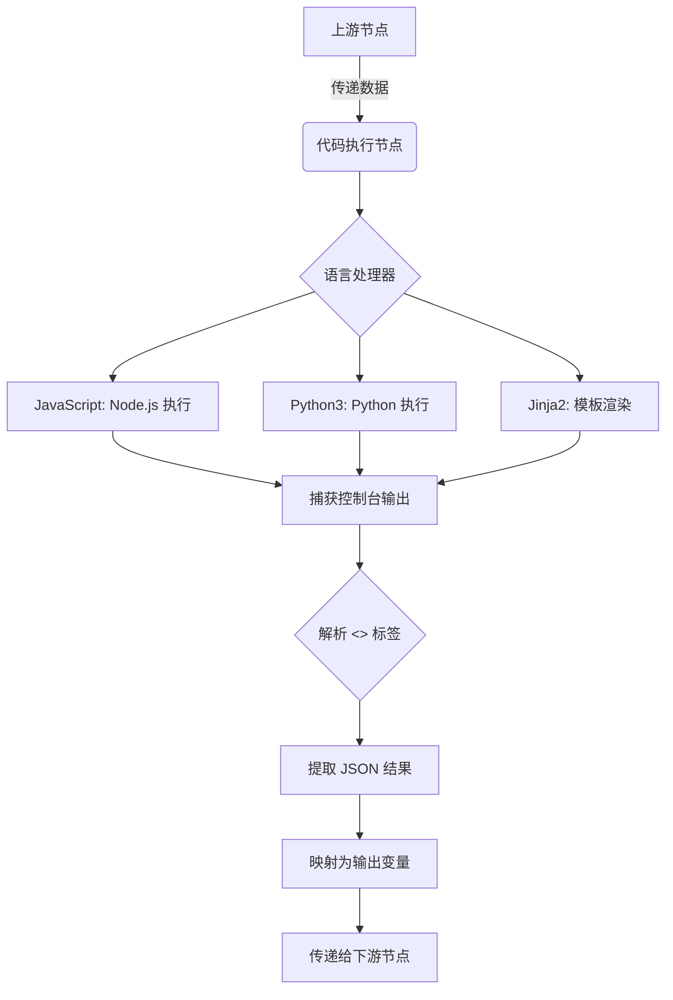
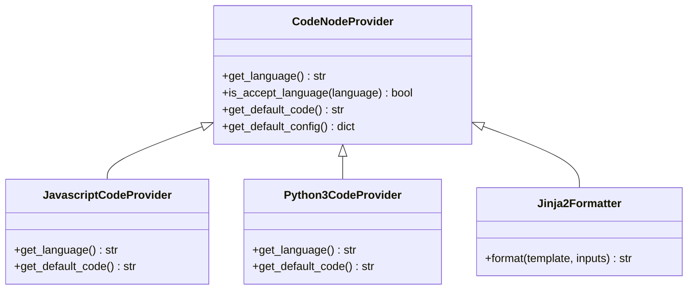
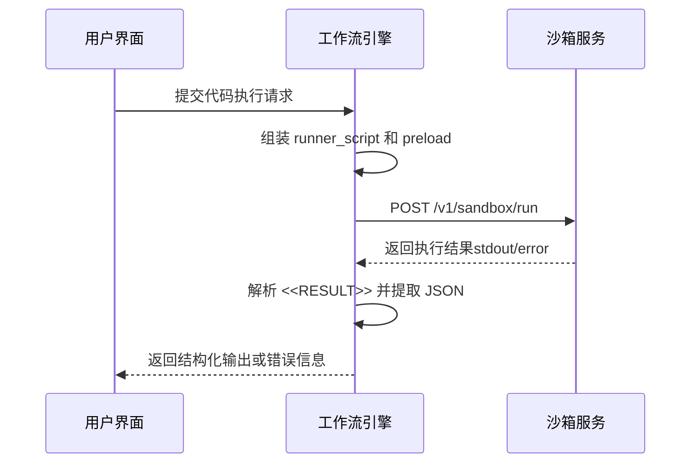

# 代码执行节点

<cite>
**本文档中引用的文件**  
- [code_executor.py](file://api/core/helper/code_executor/code_executor.py)
- [code_node_provider.py](file://api/core/helper/code_executor/code_node_provider.py)
- [javascript_code_provider.py](file://api/core/helper/code_executor/javascript/javascript_code_provider.py)
- [python3_code_provider.py](file://api/core/helper/code_executor/python3/python3_code_provider.py)
- [jinja2_formatter.py](file://api/core/helper/code_executor/jinja2/jinja2_formatter.py)
- [javascript_transformer.py](file://api/core/helper/code_executor/javascript/javascript_transformer.py)
- [python3_transformer.py](file://api/core/helper/code_executor/python3/python3_transformer.py)
- [jinja2_transformer.py](file://api/core/helper/code_executor/jinja2/jinja2_transformer.py)
- [template_transformer.py](file://api/core/helper/code_executor/template_transformer.py)
</cite>

## 目录
1. [简介](#简介)
2. [支持的编程语言](#支持的编程语言)
3. [输入输出变量映射机制](#输入输出变量映射机制)
4. [可视化编辑器功能](#可视化编辑器功能)
5. [代码沙箱机制与异常处理](#代码沙箱机制与异常处理)
6. [使用示例](#使用示例)
7. [安全最佳实践与性能监控建议](#安全最佳实践与性能监控建议)

## 简介
Dify 工作流引擎中的代码执行节点允许用户在工作流中嵌入自定义代码逻辑，以实现数据处理、格式转换、条件计算等复杂功能。该节点支持多种编程语言，并通过安全的沙箱环境执行代码，确保系统稳定性与安全性。本文档详细说明代码执行节点的技术实现、使用方式及最佳实践。

## 支持的编程语言

代码执行节点目前支持三种编程语言：JavaScript、Python3 和 Jinja2。每种语言均通过独立的执行器实现，确保语法兼容性和运行效率。

- **JavaScript**：通过 Node.js 运行时执行，适用于轻量级脚本和异步逻辑处理。
- **Python3**：提供完整的 Python 3 语法支持，适合复杂的数据处理和算法实现。
- **Jinja2**：作为模板语言，用于动态内容生成和字符串替换，常用于文本渲染场景。

语言选择通过 `CodeLanguage` 枚举定义，确保类型安全和一致性。

**Section sources**
- [code_executor.py](file://api/core/helper/code_executor/code_executor.py#L25-L31)

## 输入输出变量映射机制

代码执行节点通过结构化的输入输出机制与上下游节点进行数据交互。输入数据以字典形式传递给代码上下文，输出结果则通过标准格式返回并映射到后续节点可用的变量中。

### 输入机制
上游节点的数据通过 `inputs` 参数传入，系统将其序列化为 Base64 编码的 JSON 字符串，并在运行时解码为原生对象。例如，在 Python 中，输入参数通过 `**inputs_obj` 解包为函数参数。

### 输出机制
代码必须返回一个字典对象，其键值对将作为输出变量暴露给下游节点。系统通过正则表达式提取 `<<RESULT>>` 标签包裹的 JSON 输出，并解析为结构化数据。



**Diagram sources**
- [template_transformer.py](file://api/core/helper/code_executor/template_transformer.py#L80-L100)
- [python3_transformer.py](file://api/core/helper/code_executor/python3/python3_transformer.py#L10-L25)
- [javascript_transformer.py](file://api/core/helper/code_executor/javascript/javascript_transformer.py#L10-L25)

**Section sources**
- [template_transformer.py](file://api/core/helper/code_executor/template_transformer.py#L1-L115)
- [code_executor.py](file://api/core/helper/code_executor/code_executor.py#L100-L140)

## 可视化编辑器功能

在 Dify 的可视化工作流编辑器中，代码执行节点集成了智能代码编辑器，提供以下核心功能：

- **语法高亮**：根据所选语言自动启用对应的语法着色，提升代码可读性。
- **错误提示**：基于语言服务提供实时语法检查和错误定位。
- **依赖管理**：对于支持依赖的语言（如 Python3），可通过配置文件声明第三方库依赖，系统将在执行前自动安装。

默认代码模板由 `CodeNodeProvider` 抽象类定义，各语言实现类提供初始化代码。例如，JavaScript 提供 `main({arg1, arg2})` 函数框架，Python 提供带类型注解的 `def main(arg1: str, arg2: str)`。



**Diagram sources**
- [code_node_provider.py](file://api/core/helper/code_executor/code_node_provider.py#L1-L35)
- [javascript_code_provider.py](file://api/core/helper/code_executor/javascript/javascript_code_provider.py#L1-L23)
- [python3_code_provider.py](file://api/core/helper/code_executor/python3/python3_code_provider.py#L1-L22)

**Section sources**
- [code_node_provider.py](file://api/core/helper/code_executor/code_node_provider.py#L1-L35)

## 代码沙箱机制与异常处理

代码执行节点采用远程沙箱服务进行隔离执行，防止恶意代码对主系统造成影响。所有代码通过 HTTP 请求发送至沙箱运行时，执行结果同步返回。

### 沙箱通信流程
1. 构造包含语言、代码、预加载脚本的请求体。
2. 发送至 `CODE_EXECUTION_ENDPOINT` 指定的沙箱服务。
3. 设置连接、读取、写入超时，防止长时间阻塞。
4. 验证响应状态码与业务错误码。

### 异常处理策略
- **网络异常**：捕获连接失败或超时，提示用户检查沙箱服务状态。
- **沙箱不可用**：HTTP 503 状态码触发服务不可用警告。
- **代码运行错误**：解析沙箱返回的错误信息，原样抛出。
- **响应解析失败**：JSON 解析异常或缺少 `<<RESULT>>` 标签时，返回结构化错误说明。



**Diagram sources**
- [code_executor.py](file://api/core/helper/code_executor/code_executor.py#L50-L100)
- [template_transformer.py](file://api/core/helper/code_executor/template_transformer.py#L80-L100)

**Section sources**
- [code_executor.py](file://api/core/helper/code_executor/code_executor.py#L1-L143)

## 使用示例

### 数据处理：字符串拼接
```python
def main(arg1: str, arg2: str):
    return {
        "result": arg1 + " " + arg2
    }
```

### 格式转换：JSON 到文本
```jinja2
Hello {{ name }}, you have {{ count }} messages.
```

### 条件计算：数值判断
```javascript
function main({score}) {
    return {
        grade: score >= 90 ? 'A' : score >= 80 ? 'B' : 'C'
    };
}
```

上述示例展示了如何利用代码节点实现常见业务逻辑，并通过输入输出变量与整个工作流集成。

## 安全最佳实践与性能监控建议

### 安全最佳实践
- **最小权限原则**：沙箱默认禁用文件系统访问和敏感 API。
- **输入验证**：对所有输入数据进行类型和范围校验，避免注入攻击。
- **依赖审查**：仅允许白名单内的第三方库，防止恶意包引入。
- **超时控制**：设置合理的执行时间限制，防止无限循环。

### 性能监控建议
- **执行耗时监控**：记录每次代码执行的开始与结束时间，识别性能瓶颈。
- **资源使用统计**：监控内存占用和 CPU 消耗，优化高负载脚本。
- **错误率告警**：对频繁失败的代码节点设置告警通知。
- **缓存机制**：对于幂等性操作，可结合缓存减少重复计算。

通过合理配置与监控，可确保代码执行节点在保障安全的前提下高效运行。