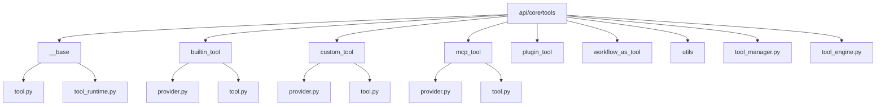
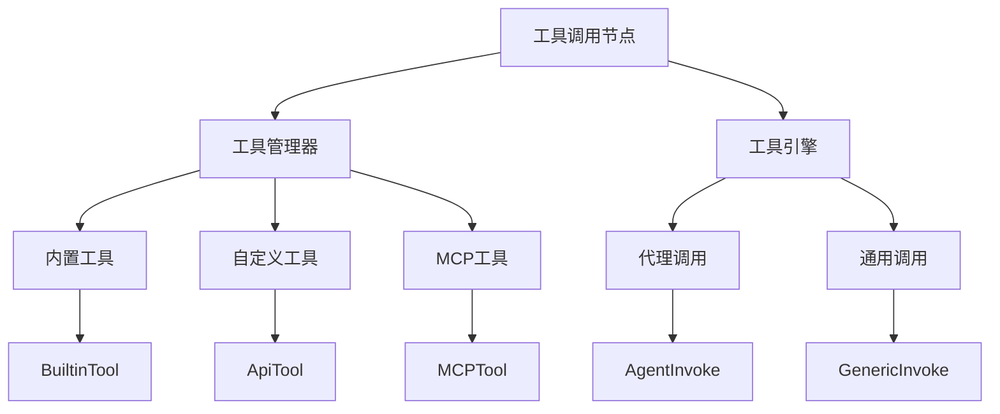
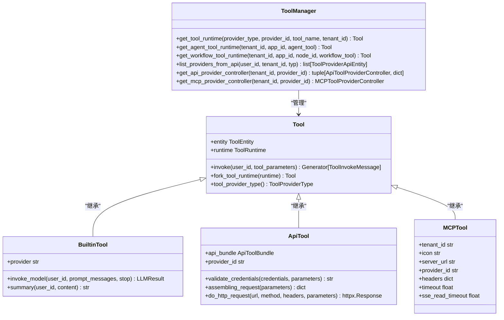
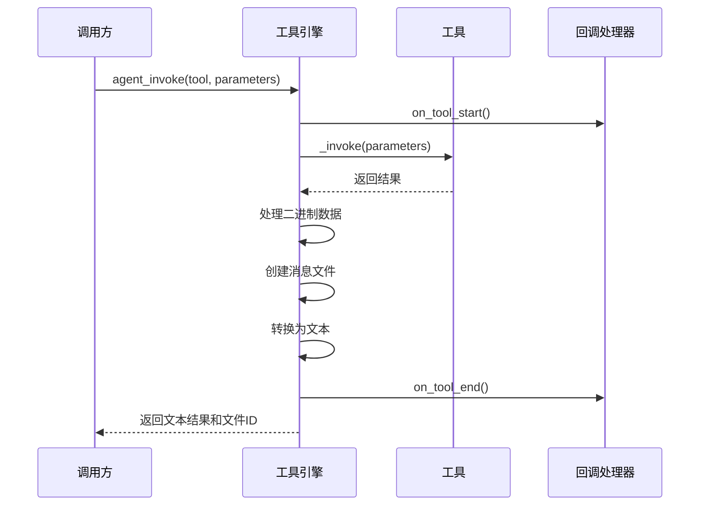
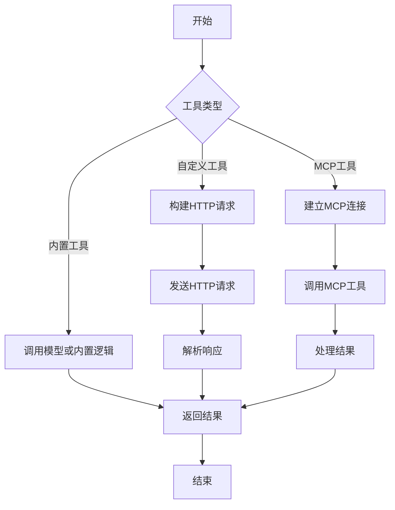
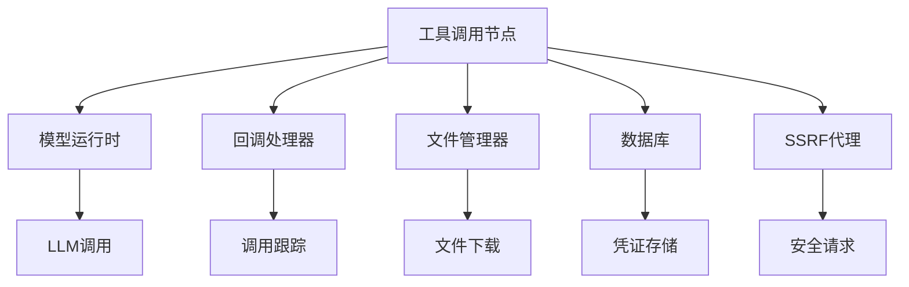

# 工具调用节点

<cite>
**本文档中引用的文件**  
- [tool_manager.py](file://api/core/tools/tool_manager.py)
- [tool_engine.py](file://api/core/tools/tool_engine.py)
- [builtin_tool/tool.py](file://api/core/tools/builtin_tool/tool.py)
- [custom_tool/tool.py](file://api/core/tools/custom_tool/tool.py)
- [mcp_tool/tool.py](file://api/core/tools/mcp_tool/tool.py)
- [tool.py](file://api/core/tools/__base/tool.py)
- [tool_runtime.py](file://api/core/tools/__base/tool_runtime.py)
</cite>

## 目录
1. [简介](#简介)
2. [项目结构](#项目结构)
3. [核心组件](#核心组件)
4. [架构概述](#架构概述)
5. [详细组件分析](#详细组件分析)
6. [依赖分析](#依赖分析)
7. [性能考虑](#性能考虑)
8. [故障排查指南](#故障排查指南)
9. [结论](#结论)

## 简介
本文档详细介绍了Dify工作流引擎中的工具调用节点，涵盖内置工具、自定义工具和MCP工具的集成机制，以及工具发现与权限管理。文档还提供了工具节点的配置方法、执行流程、实现细节、使用示例、故障排查和性能优化建议。

## 项目结构
Dify的工具调用功能主要位于`api/core/tools`目录下，该目录包含多个子模块，分别处理不同类型的工具。

**图示来源**  
- [tool_manager.py](file://api/core/tools/tool_manager.py)
- [tool_engine.py](file://api/core/tools/tool_engine.py)

**本节来源**  
- [tool_manager.py](file://api/core/tools/tool_manager.py)
- [tool_engine.py](file://api/core/tools/tool_engine.py)

## 核心组件
工具调用节点的核心组件包括工具管理器（ToolManager）、工具引擎（ToolEngine）和各种工具实现类。这些组件共同协作，实现工具的注册、调用和结果处理。

**本节来源**  
- [tool_manager.py](file://api/core/tools/tool_manager.py)
- [tool_engine.py](file://api/core/tools/tool_engine.py)

## 架构概述
Dify的工具调用架构采用分层设计，从上到下分为工具管理、工具执行和工具实现三个层次。工具管理负责工具的发现和权限验证，工具执行负责调用流程的控制，工具实现则具体处理不同类型的工具调用。

**图示来源**  
- [tool_manager.py](file://api/core/tools/tool_manager.py)
- [tool_engine.py](file://api/core/tools/tool_engine.py)

## 详细组件分析

### 工具管理器分析
工具管理器（ToolManager）是工具调用的核心组件，负责管理所有类型的工具提供者和工具实例。

#### 类图

**图示来源**  
- [tool_manager.py](file://api/core/tools/tool_manager.py)
- [builtin_tool/tool.py](file://api/core/tools/builtin_tool/tool.py)
- [custom_tool/tool.py](file://api/core/tools/custom_tool/tool.py)
- [mcp_tool/tool.py](file://api/core/tools/mcp_tool/tool.py)

**本节来源**  
- [tool_manager.py](file://api/core/tools/tool_manager.py)

### 工具引擎分析
工具引擎（ToolEngine）负责执行工具调用，处理调用过程中的回调、错误和结果转换。

#### 序列图

**图示来源**  
- [tool_engine.py](file://api/core/tools/tool_engine.py)

**本节来源**  
- [tool_engine.py](file://api/core/tools/tool_engine.py)

### 工具实现分析
Dify支持多种类型的工具实现，包括内置工具、自定义工具和MCP工具，每种工具都有其特定的实现方式。

#### 流程图

**图示来源**  
- [builtin_tool/tool.py](file://api/core/tools/builtin_tool/tool.py)
- [custom_tool/tool.py](file://api/core/tools/custom_tool/tool.py)
- [mcp_tool/tool.py](file://api/core/tools/mcp_tool/tool.py)

**本节来源**  
- [builtin_tool/tool.py](file://api/core/tools/builtin_tool/tool.py)
- [custom_tool/tool.py](file://api/core/tools/custom_tool/tool.py)
- [mcp_tool/tool.py](file://api/core/tools/mcp_tool/tool.py)

## 依赖分析
工具调用节点依赖于多个核心模块，包括模型运行时、回调处理器、文件管理器和数据库。

**图示来源**  
- [tool_manager.py](file://api/core/tools/tool_manager.py)
- [tool_engine.py](file://api/core/tools/tool_engine.py)

**本节来源**  
- [tool_manager.py](file://api/core/tools/tool_manager.py)
- [tool_engine.py](file://api/core/tools/tool_engine.py)

## 性能考虑
工具调用节点的性能主要受网络请求、模型调用和数据处理的影响。建议优化HTTP请求超时设置、合理使用缓存和限制并发调用数量。

## 故障排查指南
常见问题包括凭证验证失败、网络连接超时和参数验证错误。建议检查凭证配置、网络连接和参数格式。

**本节来源**  
- [tool_engine.py](file://api/core/tools/tool_engine.py)
- [custom_tool/tool.py](file://api/core/tools/custom_tool/tool.py)

## 结论
Dify的工具调用节点提供了灵活且强大的工具集成能力，支持多种工具类型和复杂的调用场景。通过合理的配置和优化，可以实现高效稳定的工具调用。