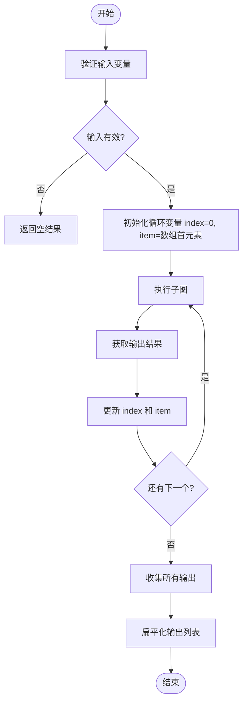
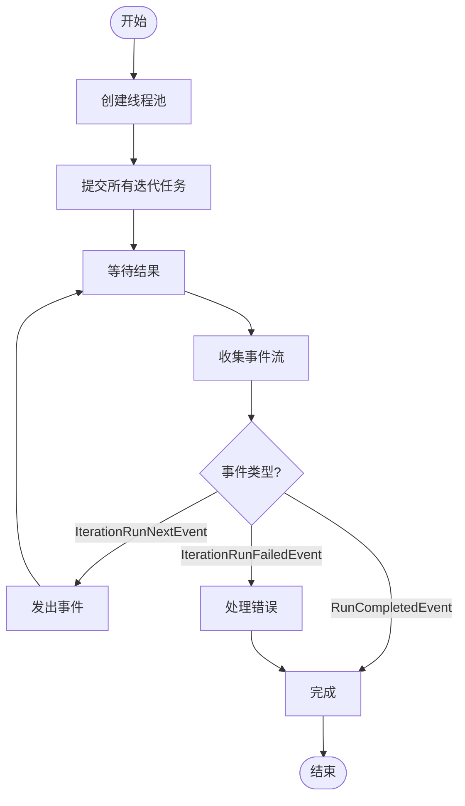
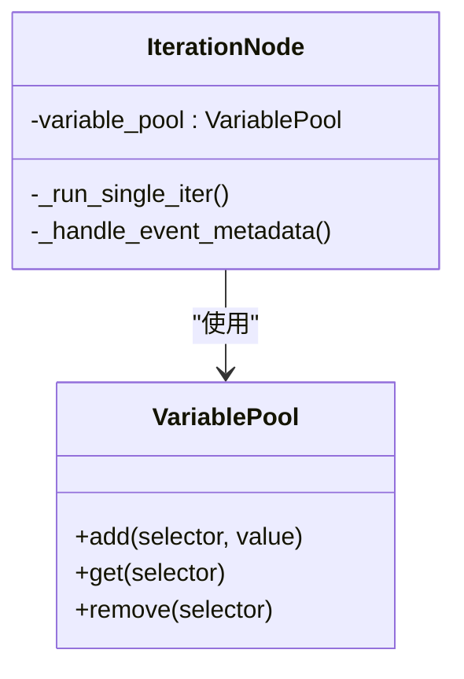
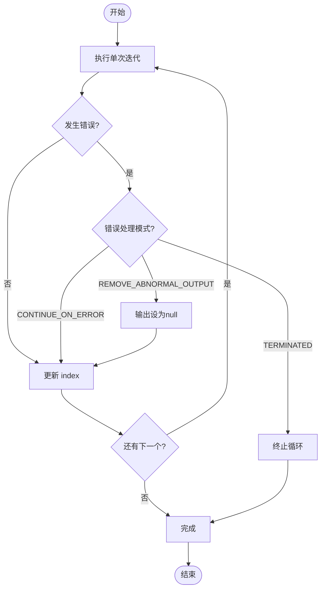
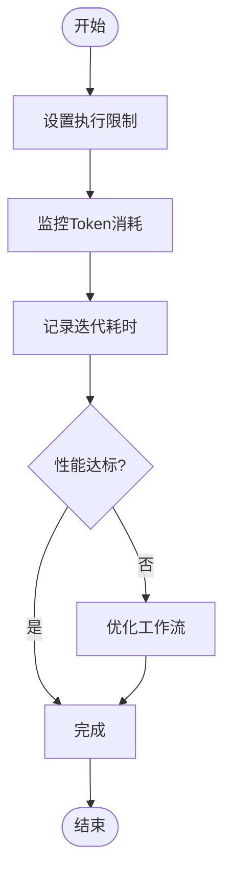

# 循环节点

<cite>
**本文档中引用的文件**  
- [iteration_node.py](file://api/core/workflow/nodes/iteration/iteration_node.py)
- [iteration_start_node.py](file://api/core/workflow/nodes/iteration/iteration_start_node.py)
- [entities.py](file://api/core/workflow/nodes/iteration/entities.py)
- [exc.py](file://api/core/workflow/nodes/iteration/exc.py)
</cite>

## 目录
1. [简介](#简介)
2. [迭代模式](#迭代模式)
3. [循环变量管理](#循环变量管理)
4. [循环上下文与状态保持](#循环上下文与状态保持)
5. [执行调度与资源管理](#执行调度与资源管理)
6. [使用示例](#使用示例)
7. [安全与性能](#安全与性能)

## 简介
循环节点是Dify工作流引擎中的核心控制结构，用于对集合数据进行重复处理。该节点支持多种迭代模式，包括固定次数循环、条件循环和集合遍历，能够满足复杂的数据处理需求。循环节点通过`IterationNode`类实现，位于`api/core/workflow/nodes/iteration/iteration_node.py`文件中，继承自`BaseNode`基类并实现了迭代逻辑的核心功能。

**Section sources**
- [iteration_node.py](file://api/core/workflow/nodes/iteration/iteration_node.py#L1-L50)

## 迭代模式
循环节点支持三种主要的迭代模式，通过配置参数进行切换：

### 集合遍历模式
这是循环节点的默认模式，通过`iterator_selector`指定一个数组类型的变量作为迭代源。节点会自动遍历该数组的每个元素，并在每次迭代中将当前元素赋值给`item`变量，同时维护`index`计数器。



**Diagram sources**
- [iteration_node.py](file://api/core/workflow/nodes/iteration/iteration_node.py#L115-L147)
- [iteration_node.py](file://api/core/workflow/nodes/iteration/iteration_node.py#L597-L627)

### 并行迭代模式
当`is_parallel`配置为`True`时，循环节点会以并行方式执行迭代。通过`parallel_nums`参数控制最大并发数，使用线程池`GraphEngineThreadPool`管理并发执行。每个迭代在独立的线程中运行，拥有自己的变量池副本，确保数据隔离。



**Diagram sources**
- [iteration_node.py](file://api/core/workflow/nodes/iteration/iteration_node.py#L208-L236)
- [iteration_node.py](file://api/core/workflow/nodes/iteration/iteration_node.py#L174-L210)

### 条件循环模式
虽然当前实现主要基于集合遍历，但可以通过在子图中包含条件判断节点来实现类似`while`循环的行为。通过在迭代子图中检查特定条件变量，决定是否继续迭代或提前终止。

**Section sources**
- [iteration_node.py](file://api/core/workflow/nodes/iteration/iteration_node.py#L115-L147)

## 循环变量管理
循环节点提供了一套完整的变量管理机制，确保迭代过程中的状态正确维护。

### 迭代器与计数器
循环节点自动管理两个内置变量：
- `item`：当前迭代的元素值
- `index`：当前迭代的索引（从0开始）

这些变量通过`VariablePool`进行管理，在每次迭代开始时更新，并在循环结束后自动清理。



**Diagram sources**
- [iteration_node.py](file://api/core/workflow/nodes/iteration/iteration_node.py#L597-L627)
- [iteration_node.py](file://api/core/workflow/nodes/iteration/iteration_node.py#L440-L464)

### 中断条件
循环节点支持多种错误处理模式，通过`error_handle_mode`配置：
- `TERMINATED`：遇到错误时立即终止整个循环
- `CONTINUE_ON_ERROR`：遇到错误时跳过当前迭代，继续后续迭代
- `REMOVE_ABNORMAL_OUTPUT`：移除异常迭代的输出，但继续执行



**Diagram sources**
- [entities.py](file://api/core/workflow/nodes/iteration/entities.py#L5-L15)
- [iteration_node.py](file://api/core/workflow/nodes/iteration/iteration_node.py#L529-L553)

## 循环上下文与状态保持
循环节点通过精心设计的上下文管理机制确保数据隔离和状态一致性。

### 数据隔离策略
每次迭代都在独立的上下文中执行，通过以下机制实现：
1. 主循环维护全局变量池
2. 并行模式下为每个迭代创建变量池副本
3. 迭代结束后清理临时变量

### 状态保持机制
循环节点通过`IterationState`类维护执行状态，包括：
- 当前输出结果
- 历史输出列表
- 迭代元数据（如迭代长度）

```mermaid
classDiagram
class IterationState {
+outputs : list[Any]
+current_output : Optional[Any]
+get_last_output()
+get_current_output()
}
class IterationState : : MetaData {
+iterator_length : int
}
class IterationNodeData {
+iterator_selector : list[str]
+output_selector : list[str]
+is_parallel : bool
+parallel_nums : int
+error_handle_mode : ErrorHandleMode
}
IterationState --> IterationState : : MetaData
```

**Diagram sources**
- [entities.py](file://api/core/workflow/nodes/iteration/entities.py#L45-L63)
- [iteration_node.py](file://api/core/workflow/nodes/iteration/iteration_node.py#L290-L321)

## 执行调度与资源管理
循环节点的执行调度机制确保了高效且可靠的迭代执行。

### 调度流程
1. 验证迭代器变量存在且为数组类型
2. 初始化子图执行引擎
3. 设置初始循环变量
4. 依次或并行执行每次迭代
5. 收集并合并所有输出

```mermaid
sequenceDiagram
participant Loop as 循环节点
participant Engine as 图引擎
participant Subgraph as 子图
Loop->>Loop : 验证 iterator_selector
Loop->>Loop : 初始化变量池
Loop->>Engine : 创建 GraphEngine 实例
Loop->>Loop : 发出 IterationRunStartedEvent
loop 每次迭代
Loop->>Subgraph : 执行子图
Subgraph->>Subgraph : 处理节点事件
Subgraph->>Loop : 返回执行结果
Loop->>Loop : 更新 index 和 item
Loop->>Loop : 发出 IterationRunNextEvent
end
Loop->>Loop : 收集所有输出
Loop->>Loop : 发出 IterationRunSucceededEvent
Loop->>Loop : 清理临时变量
```

**Diagram sources**
- [iteration_node.py](file://api/core/workflow/nodes/iteration/iteration_node.py#L174-L210)
- [iteration_node.py](file://api/core/workflow/nodes/iteration/iteration_node.py#L597-L627)

### 资源管理
循环节点通过以下方式管理资源：
- 使用`finally`块确保变量清理
- 限制最大并发数防止资源耗尽
- 跟踪并报告执行过程中的token消耗

**Section sources**
- [iteration_node.py](file://api/core/workflow/nodes/iteration/iteration_node.py#L290-L321)
- [iteration_node.py](file://api/core/workflow/nodes/iteration/iteration_node.py#L621-L627)

## 使用示例
### 批量数据处理
```python
# 处理用户列表
iterator_selector = ["users", "list"]
output_selector = ["process_result", "output"]
# 每次迭代处理一个用户
```

### 分页API调用
```python
# 处理分页数据
iterator_selector = ["pages", "numbers"]
# 在子图中根据页码调用API
```

### 递归算法
```python
# 实现树结构遍历
iterator_selector = ["current_level", "nodes"]
# 每次迭代处理一层节点
```

**Section sources**
- [iteration_node.py](file://api/core/workflow/nodes/iteration/iteration_node.py#L115-L147)

## 安全与性能
### 防止无限循环
- 通过集合长度确定迭代次数，避免无限循环
- 配置`WORKFLOW_MAX_EXECUTION_STEPS`和`WORKFLOW_MAX_EXECUTION_TIME`限制执行
- 使用`StartNodeIdNotFoundError`等异常及时终止错误配置

### 性能监控建议
- 启用`ITERATION_DURATION_MAP`监控每次迭代耗时
- 跟踪`TOTAL_TOKENS`消耗以优化成本
- 使用并行模式时合理设置`parallel_nums`避免资源争用



**Diagram sources**
- [iteration_node.py](file://api/core/workflow/nodes/iteration/iteration_node.py#L174-L210)
- [iteration_node.py](file://api/core/workflow/nodes/iteration/iteration_node.py#L290-L321)