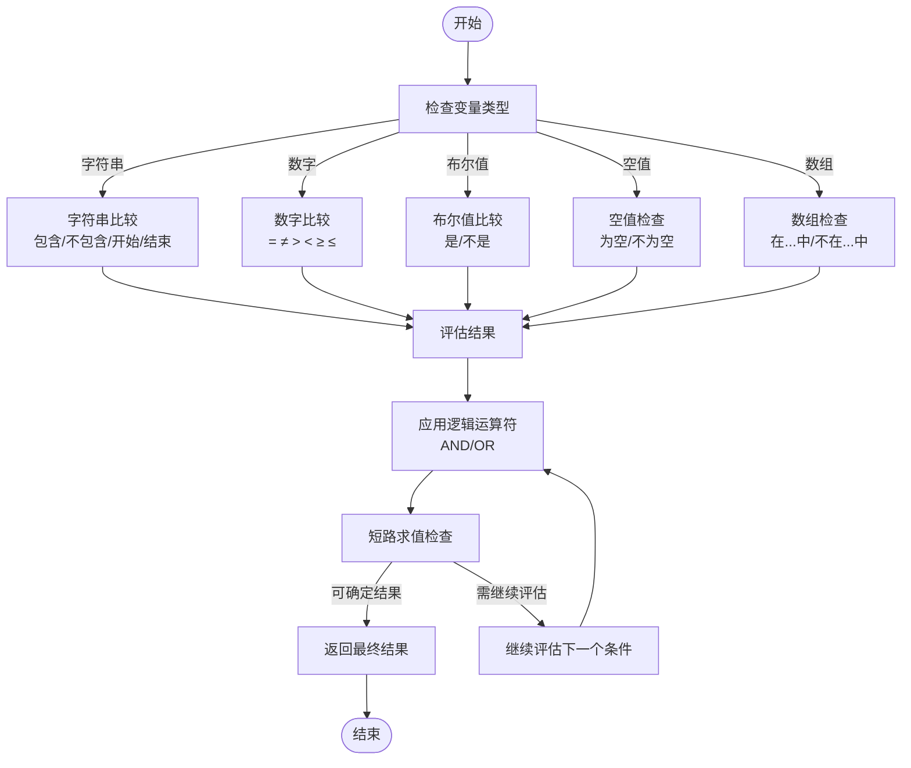
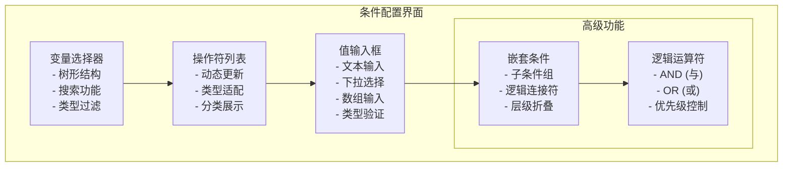
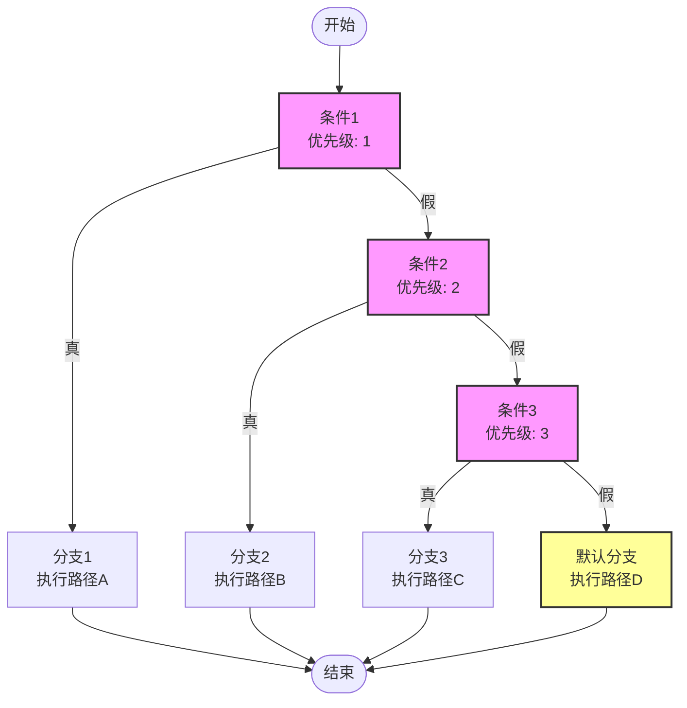
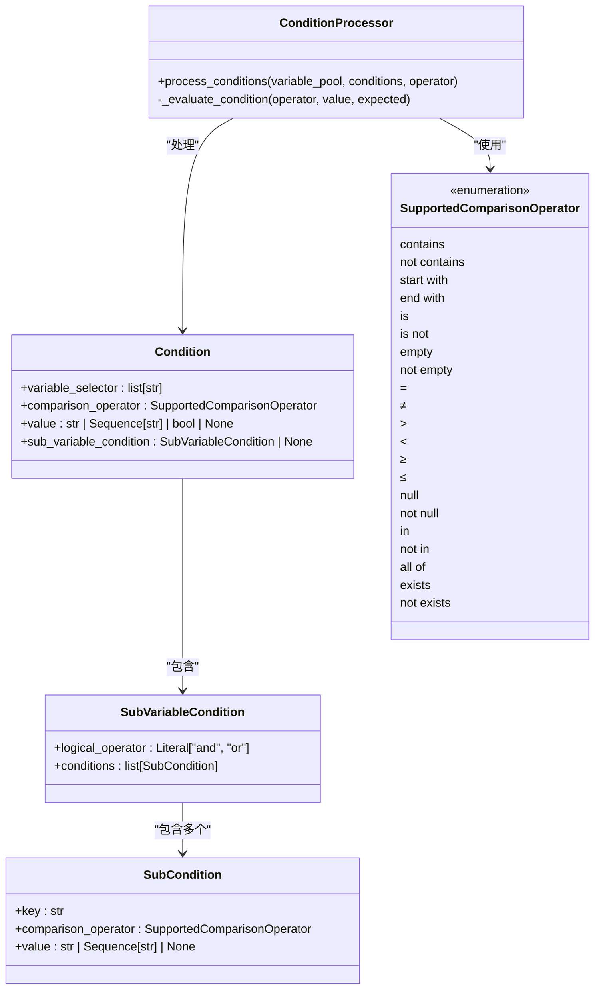

# 条件分支节点

<cite>
**本文档中引用的文件**  
- [condition_manager.py](file://api/core/workflow/graph_engine/condition_handlers/condition_manager.py)
- [condition_handler.py](file://api/core/workflow/graph_engine/condition_handlers/condition_handler.py)
- [processor.py](file://api/core/workflow/utils/condition/processor.py)
- [entities.py](file://api/core/workflow/utils/condition/entities.py)
- [run_condition.py](file://api/core/workflow/graph_engine/entities/run_condition.py)
- [node.tsx](file://web/app/components/workflow/nodes/if-else/node.tsx)
- [condition-item.tsx](file://web/app/components/workflow/nodes/if-else/components/condition-list/condition-item.tsx)
- [index.tsx](file://web/app/components/workflow/nodes/if-else/components/condition-list/index.tsx)
- [workflow.py](file://api/models/workflow.py)
- [workflow.py](file://api/controllers/web/workflow.py)
- [workflow.py](file://api/controllers/console/app/workflow.py)
- [workflow.py](file://api/controllers/service_api/app/workflow.py)
</cite>

## 目录
1. [介绍](#介绍)
2. [条件判断机制](#条件判断机制)
3. [配置界面说明](#配置界面说明)
4. [多分支路径管理](#多分支路径管理)
5. [表达式解析与执行原理](#表达式解析与执行原理)
6. [使用示例](#使用示例)
7. [调试技巧与常见错误解决方案](#调试技巧与常见错误解决方案)
8. [结论](#结论)

## 介绍
条件分支节点是Dify工作流引擎中的核心控制结构，用于根据预定义的条件决定工作流的执行路径。该节点支持复杂的逻辑判断，包括比较运算、布尔表达式和多条件组合，能够灵活地处理基于用户输入、数据状态和外部响应的路由决策。通过可视化配置界面，用户可以轻松设置条件规则，并管理多个分支路径。

**Section sources**
- [node.tsx](file://web/app/components/workflow/nodes/if-else/node.tsx)

## 条件判断机制
条件分支节点的逻辑判断机制基于一系列预定义的比较运算符和布尔逻辑。系统支持多种数据类型的比较，包括字符串、数字、布尔值和数组。对于字符串类型，支持"包含"、"不包含"、"以...开始"、"以...结束"、"等于"和"不等于"等操作。对于数字类型，支持等于、不等于、大于、小于、大于等于和小于等于等数学比较。布尔值支持"是"和"不是"的判断，而空值检查则通过"为空"和"不为空"来实现。

条件判断支持AND和OR逻辑运算符的组合，允许创建复杂的条件表达式。系统采用短路求值策略，在确定最终结果后立即停止后续条件的评估，以提高执行效率。此外，还支持文件属性的条件判断，如文件是否存在、文件扩展名是否匹配等。

**Diagram sources**
- [processor.py](file://api/core/workflow/utils/condition/processor.py)
- [entities.py](file://api/core/workflow/utils/condition/entities.py)

**Section sources**
- [processor.py](file://api/core/workflow/utils/condition/processor.py)
- [entities.py](file://api/core/workflow/utils/condition/entities.py)

## 配置界面说明
条件分支节点的配置界面提供了直观的字段选择器、操作符列表和值输入框，使用户能够轻松构建复杂的条件规则。界面采用分层设计，每个条件由三个主要组件构成：变量选择器、比较操作符和值输入区域。

变量选择器允许用户从工作流上下文中选择可用的变量，包括用户输入、系统变量和前序节点的输出。选择器采用树形结构展示变量层次，支持搜索和过滤功能，便于快速定位目标变量。比较操作符列表根据所选变量的类型动态调整，确保只显示适用的操作符。例如，选择字符串变量时会显示"包含"、"以...开始"等文本操作符，而选择数字变量时则显示数学比较操作符。

值输入框根据操作符的需要提供适当的输入控件，如文本框、下拉列表或复选框。对于"在...中"或"不在...中"等需要多个值的操作，界面提供数组输入功能，允许用户添加多个比较值。此外，界面还支持嵌套条件配置，允许在单个条件项中定义子条件组，并通过AND或OR逻辑连接。

**Diagram sources**
- [condition-item.tsx](file://web/app/components/workflow/nodes/if-else/components/condition-list/condition-item.tsx)
- [index.tsx](file://web/app/components/workflow/nodes/if-else/components/condition-list/index.tsx)

**Section sources**
- [condition-item.tsx](file://web/app/components/workflow/nodes/if-else/components/condition-list/condition-item.tsx)
- [index.tsx](file://web/app/components/workflow/nodes/if-else/components/condition-list/index.tsx)

## 多分支路径管理
条件分支节点支持多分支路径管理，允许工作流根据不同的条件结果跳转到相应的执行路径。系统采用优先级机制来处理多个条件分支，按照条件定义的顺序依次评估，一旦某个条件为真，则执行对应的分支并跳过后续条件的评估。

默认分支（Default Branch）作为最后的备选路径，当所有显式定义的条件都为假时执行。这种设计确保了工作流的完整性，避免了无路径可执行的情况。分支优先级由条件在配置列表中的位置决定，位置越靠前的条件具有越高的优先级。

系统还支持条件组的嵌套管理，允许将多个相关条件组织成逻辑组，并为整个组设置统一的执行策略。这种分层结构提高了复杂条件逻辑的可读性和可维护性。在执行时，系统会先评估组级别的条件，再根据结果决定是否进入组内条件的详细评估。

**Diagram sources**
- [condition_manager.py](file://api/core/workflow/graph_engine/condition_handlers/condition_manager.py)
- [run_condition.py](file://api/core/workflow/graph_engine/entities/run_condition.py)

**Section sources**
- [condition_manager.py](file://api/core/workflow/graph_engine/condition_handlers/condition_manager.py)
- [run_condition.py](file://api/core/workflow/graph_engine/entities/run_condition.py)

## 表达式解析与执行原理
条件分支节点的表达式解析和执行由专门的处理器组件完成，其核心实现位于`api/core/workflow/utils/condition/processor.py`文件中。系统采用分层架构，将条件处理逻辑分解为多个独立的组件，确保代码的可维护性和扩展性。

表达式解析过程始于`ConditionProcessor`类，该类负责协调整个条件评估流程。当工作流引擎需要评估条件时，会创建`ConditionProcessor`实例，并调用其`process_conditions`方法。该方法接收变量池、条件列表和逻辑操作符作为参数，逐个评估每个条件并收集结果。

条件评估的核心是`_evaluate_condition`函数，它根据不同的比较操作符调用相应的断言函数。这些断言函数实现了具体的比较逻辑，如`_assert_contains`用于检查包含关系，`_assert_greater_than`用于数值比较等。系统采用模式匹配（match-case）语法来分发不同操作符的处理，确保代码的清晰性和可读性。

执行过程中，系统实现了短路求值优化。在AND逻辑下，一旦遇到假条件就立即返回假结果；在OR逻辑下，一旦遇到真条件就立即返回真结果。这种优化显著提高了复杂条件表达式的执行效率，特别是在处理大量条件组合时。

**Diagram sources**
- [processor.py](file://api/core/workflow/utils/condition/processor.py)
- [entities.py](file://api/core/workflow/utils/condition/entities.py)

**Section sources**
- [processor.py](file://api/core/workflow/utils/condition/processor.py)
- [entities.py](file://api/core/workflow/utils/condition/entities.py)

## 使用示例
条件分支节点在实际应用中有多种使用场景，以下列举几个典型的使用示例：

**基于用户输入的条件路由**：在客服机器人场景中，可以根据用户输入的关键字决定后续处理流程。例如，当用户输入包含"订单"时，路由到订单查询服务；当输入包含"退货"时，路由到退货处理流程；其他情况则转接到人工客服。

**基于数据状态的条件判断**：在审批工作流中，可以根据申请金额的大小决定审批层级。例如，金额小于1000元的申请自动通过；金额在1000-5000元之间的申请需要部门经理审批；金额大于5000元的申请则需要总经理审批。

**基于外部响应的条件处理**：在集成第三方API的场景中，可以根据API返回的状态码决定后续操作。例如，调用支付接口后，根据返回的"success"、"pending"或"failed"状态，分别执行订单确认、等待支付或支付失败处理流程。

这些示例展示了条件分支节点的灵活性和强大功能，通过合理的条件配置，可以实现复杂而精确的工作流控制逻辑。

**Section sources**
- [workflow.py](file://api/models/workflow.py)
- [workflow.py](file://api/controllers/web/workflow.py)

## 调试技巧与常见错误解决方案
在使用条件分支节点时，可能会遇到各种问题，以下是一些常见的调试技巧和错误解决方案：

**变量未找到错误**：当条件中引用的变量在变量池中不存在时，系统会抛出"Variable not found"异常。解决方案是检查变量选择器中的路径是否正确，确保变量在条件评估时已经由前序节点生成。

**类型不匹配问题**：比较操作要求操作数的类型一致。例如，不能将字符串与数字直接比较。解决方案是在配置条件时注意变量类型，必要时使用类型转换函数。

**空值处理陷阱**：在处理可能为空的变量时，应使用"为空"或"不为空"操作符进行显式检查，避免在其他比较操作中出现空指针异常。

**逻辑优先级混淆**：当使用AND和OR组合条件时，应注意逻辑优先级。建议使用括号明确分组，或将复杂条件分解为多个简单的条件分支。

**调试建议**：利用工作流引擎提供的调试工具，查看变量池中的实际值，逐步跟踪条件评估过程。可以在关键节点添加日志记录，输出变量值和条件评估结果，便于定位问题。

**Section sources**
- [workflow.py](file://api/controllers/console/app/workflow.py)
- [workflow.py](file://api/controllers/service_api/app/workflow.py)

## 结论
条件分支节点作为Dify工作流引擎的核心控制结构，提供了强大而灵活的条件判断能力。通过深入理解其逻辑判断机制、配置界面特性、多分支管理策略以及底层实现原理，开发者可以有效地利用这一功能构建复杂而可靠的工作流应用。合理的使用示例和调试技巧进一步增强了该节点的实用性和可维护性，使其成为实现智能自动化流程的关键组件。