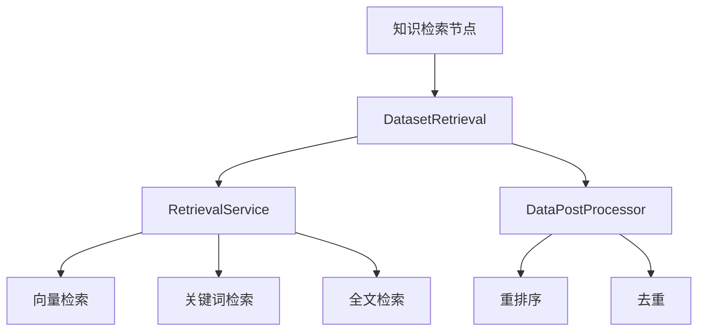
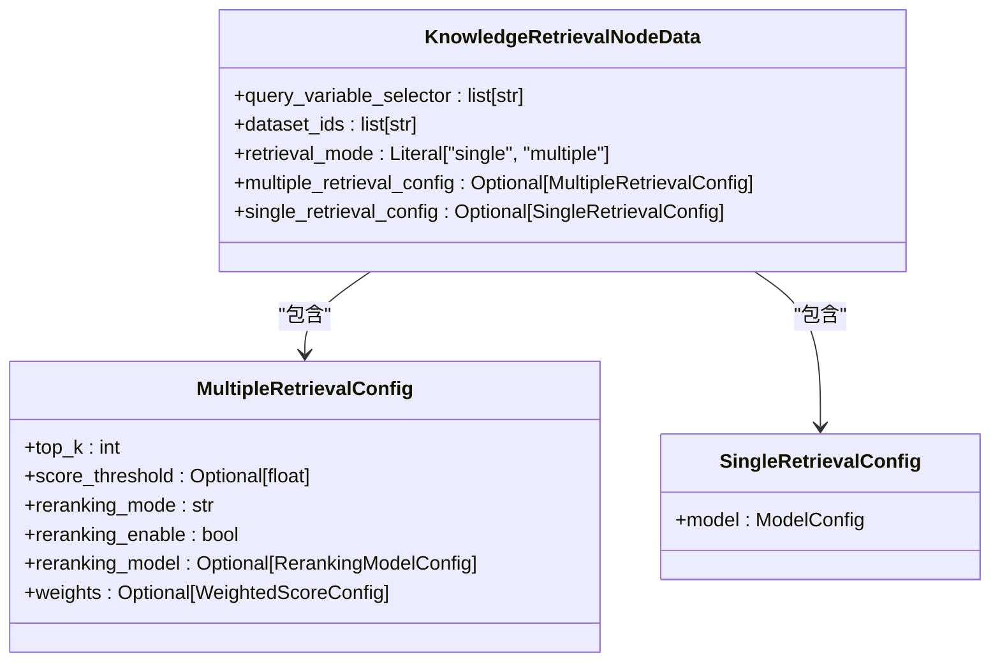
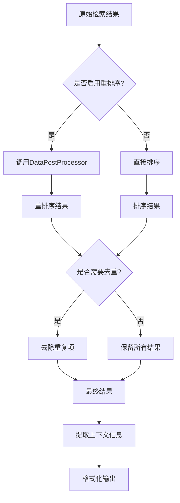
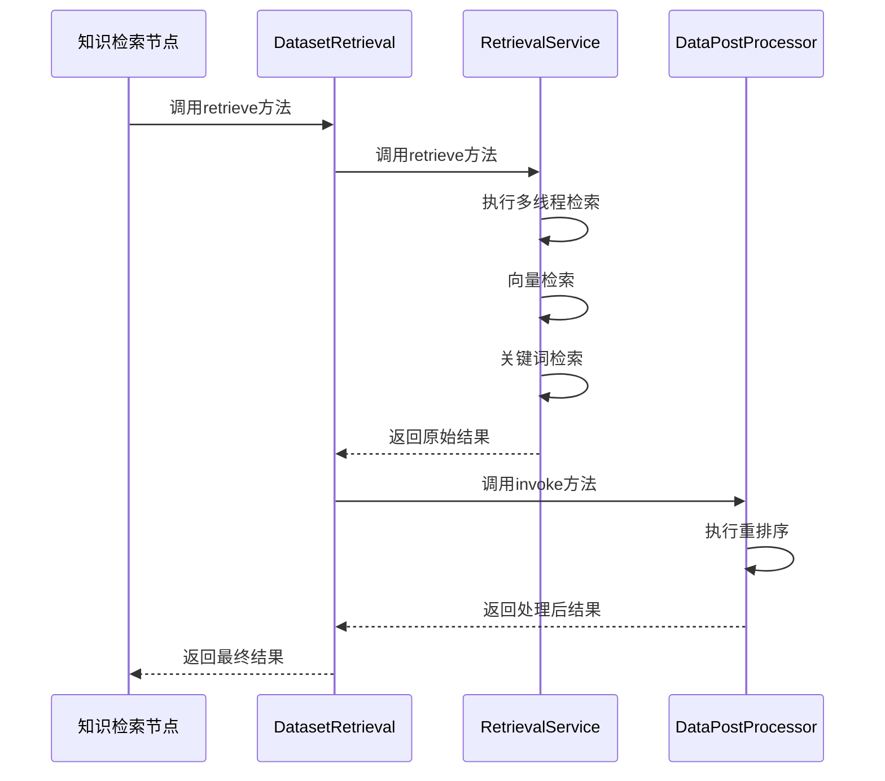

# 知识检索节点

<cite>
**本文档引用的文件**   
- [retrieval_service.py](file://api/core/rag/datasource/retrieval_service.py)
- [knowledge_retrieval_node.py](file://api/core/workflow/nodes/knowledge_retrieval/knowledge_retrieval_node.py)
- [dataset_retrieval.py](file://api/core/rag/retrieval/dataset_retrieval.py)
- [entities.py](file://api/core/workflow/nodes/knowledge_retrieval/entities.py)
</cite>

## 目录
1. [简介](#简介)
2. [知识检索节点与RAG系统集成](#知识检索节点与rag系统集成)
3. [文档集选择与检索策略配置](#文档集选择与检索策略配置)
4. [检索参数详解](#检索参数详解)
5. [检索结果后处理机制](#检索结果后处理机制)
6. [执行流程分析](#执行流程分析)
7. [使用示例](#使用示例)
8. [性能优化建议](#性能优化建议)
9. [结论](#结论)

## 简介

知识检索节点是Dify工作流引擎中的核心组件，负责从知识库中检索相关信息以支持问答系统、文档摘要和信息提取等应用场景。该节点通过与RAG（Retrieval-Augmented Generation）系统的深度集成，实现了高效的文档检索和结果处理。

**Section sources**
- [knowledge_retrieval_node.py](file://api/core/workflow/nodes/knowledge_retrieval/knowledge_retrieval_node.py#L1-L50)

## 知识检索节点与RAG系统集成

知识检索节点通过调用RAG系统的核心服务实现文档检索功能。其主要集成点包括：

- **检索服务调用**：通过`RetrievalService`类提供的接口进行文档检索
- **数据后处理**：利用`DataPostProcessor`对检索结果进行重排序和过滤
- **元数据过滤**：支持基于文档元数据的条件过滤
- **混合检索**：支持向量检索、关键词检索和混合检索模式

该节点通过`DatasetRetrieval`类协调多个检索策略的执行，确保检索结果的质量和相关性。



**Diagram sources**
- [dataset_retrieval.py](file://api/core/rag/retrieval/dataset_retrieval.py#L71-L1214)
- [retrieval_service.py](file://api/core/rag/datasource/retrieval_service.py#L29-L68)

**Section sources**
- [dataset_retrieval.py](file://api/core/rag/retrieval/dataset_retrieval.py#L71-L1214)
- [retrieval_service.py](file://api/core/rag/datasource/retrieval_service.py#L29-L68)

## 文档集选择与检索策略配置

知识检索节点支持灵活的文档集选择和检索策略配置：

### 文档集选择

通过`dataset_ids`参数指定需要检索的文档集ID列表。系统会验证每个文档集的可用性，并过滤掉没有可用文档的集合。

### 检索策略配置

支持两种主要的检索策略：

- **单文档集检索**（Single Retrieval）：从单个文档集中检索相关信息
- **多文档集检索**（Multiple Retrieval）：从多个文档集中并行检索并合并结果

检索策略通过`retrieval_mode`参数配置，支持以下选项：
- `single`：单文档集检索模式
- `multiple`：多文档集检索模式



**Diagram sources**
- [entities.py](file://api/core/workflow/nodes/knowledge_retrieval/entities.py#L110-L133)

**Section sources**
- [entities.py](file://api/core/workflow/nodes/knowledge_retrieval/entities.py#L110-L133)

## 检索参数详解

### 相似度阈值

`score_threshold`参数用于设置检索结果的相似度阈值。只有相似度得分高于该阈值的文档才会被返回。此参数在`multiple_retrieval_config`中配置。

### 返回数量

`top_k`参数控制返回的检索结果数量。系统会根据相关性评分对结果进行排序，并返回前k个最相关的文档。

### 元数据过滤

支持基于文档元数据的条件过滤，包括：
- **禁用过滤**：不进行元数据过滤
- **自动过滤**：通过LLM自动提取过滤条件
- **手动过滤**：用户手动配置过滤条件

过滤条件支持多种比较操作符，如包含、等于、大于等。

**Section sources**
- [entities.py](file://api/core/workflow/nodes/knowledge_retrieval/entities.py#L110-L133)
- [dataset_retrieval.py](file://api/core/rag/retrieval/dataset_retrieval.py#L71-L1214)

## 检索结果后处理机制

### 重排序

通过`DataPostProcessor`对检索结果进行重排序，支持两种重排序模式：
- **重排序模型**：使用专门的重排序模型对结果进行重新评分
- **加权评分**：基于向量和关键词检索结果的加权组合

### 去重

系统自动对检索结果进行去重处理，确保相同内容的文档不会重复出现。

### 上下文提取

从检索到的文档中提取关键上下文信息，包括：
- 文档段落内容
- 答案信息（如果存在）
- 元数据信息
- 相关性评分



**Diagram sources**
- [retrieval_service.py](file://api/core/rag/datasource/retrieval_service.py#L29-L68)
- [dataset_retrieval.py](file://api/core/rag/retrieval/dataset_retrieval.py#L71-L1214)

**Section sources**
- [retrieval_service.py](file://api/core/rag/datasource/retrieval_service.py#L29-L68)
- [dataset_retrieval.py](file://api/core/rag/retrieval/dataset_retrieval.py#L71-L1214)

## 执行流程分析

### 向量检索流程

1. 获取文档集配置
2. 创建向量检索器
3. 执行向量相似度搜索
4. 应用相似度阈值过滤
5. 可选：调用重排序模型
6. 返回最终结果

### 关键词检索流程

1. 获取文档集配置
2. 创建关键词检索器
3. 执行关键词搜索
4. 计算TF-IDF相似度评分
5. 按评分排序结果
6. 返回前k个结果

### 混合检索流程

1. 并行执行向量检索和关键词检索
2. 合并两种检索的结果
3. 应用重排序算法
4. 去重和排序
5. 返回最终结果



**Diagram sources**
- [retrieval_service.py](file://api/core/rag/datasource/retrieval_service.py#L29-L68)
- [dataset_retrieval.py](file://api/core/rag/retrieval/dataset_retrieval.py#L71-L1214)

**Section sources**
- [retrieval_service.py](file://api/core/rag/datasource/retrieval_service.py#L29-L68)
- [dataset_retrieval.py](file://api/core/rag/retrieval/dataset_retrieval.py#L71-L1214)

## 使用示例

### 问答系统

```python
# 配置知识检索节点用于问答系统
node_config = {
    "query_variable_selector": ["sys", "query"],
    "dataset_ids": ["dataset_1", "dataset_2"],
    "retrieval_mode": "multiple",
    "multiple_retrieval_config": {
        "top_k": 5,
        "score_threshold": 0.7,
        "reranking_enable": True,
        "reranking_model": {
            "provider": "cohere",
            "model": "rerank-english-v2.0"
        }
    }
}
```

### 文档摘要

```python
# 配置知识检索节点用于文档摘要
node_config = {
    "query_variable_selector": ["start", "document_content"],
    "dataset_ids": ["summary_dataset"],
    "retrieval_mode": "single",
    "single_retrieval_config": {
        "model": {
            "provider": "openai",
            "name": "gpt-4"
        }
    }
}
```

### 信息提取

```python
# 配置知识检索节点用于信息提取
node_config = {
    "query_variable_selector": ["sys", "extraction_query"],
    "dataset_ids": ["data_dataset"],
    "retrieval_mode": "multiple",
    "multiple_retrieval_config": {
        "top_k": 10,
        "score_threshold": 0.6,
        "reranking_mode": "weighted_score",
        "weights": {
            "vector_setting": {
                "vector_weight": 0.7,
                "embedding_provider_name": "openai",
                "embedding_model_name": "text-embedding-ada-002"
            },
            "keyword_setting": {
                "keyword_weight": 0.3
            }
        }
    }
}
```

**Section sources**
- [knowledge_retrieval_node.py](file://api/core/workflow/nodes/knowledge_retrieval/knowledge_retrieval_node.py#L134-L171)
- [entities.py](file://api/core/workflow/nodes/knowledge_retrieval/entities.py#L110-L133)

## 性能优化建议

### 索引优化

1. **定期更新索引**：确保文档索引与最新内容保持同步
2. **合理分块**：将文档分割为适当大小的段落，提高检索精度
3. **元数据标注**：为文档添加丰富的元数据，支持更精确的过滤

### 查询性能调优

1. **缓存机制**：对频繁查询的结果进行缓存
2. **并行处理**：充分利用多线程进行并行检索
3. **参数调优**：根据实际场景调整`top_k`和`score_threshold`参数
4. **重排序策略**：选择合适的重排序模型和权重配置

5. **监控和分析**：定期分析查询性能，识别瓶颈并进行优化

**Section sources**
- [retrieval_service.py](file://api/core/rag/datasource/retrieval_service.py#L29-L68)
- [dataset_retrieval.py](file://api/core/rag/retrieval/dataset_retrieval.py#L71-L1214)

## 结论

知识检索节点作为Dify工作流引擎的核心组件，通过与RAG系统的深度集成，提供了强大的文档检索能力。其灵活的配置选项和高效的执行流程，使其能够满足各种应用场景的需求。通过合理的参数配置和性能优化，可以显著提升系统的检索效率和准确性。