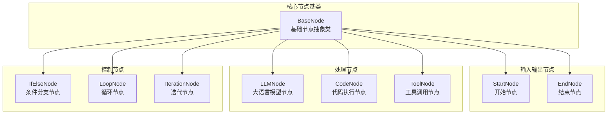
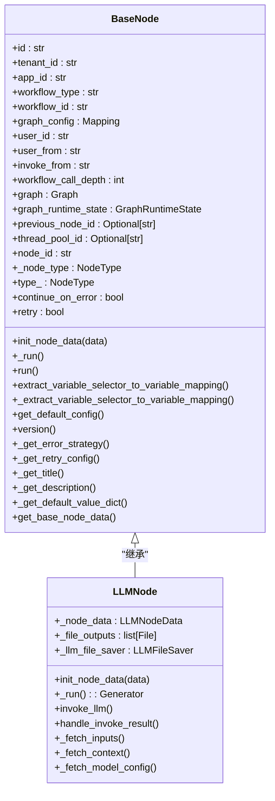
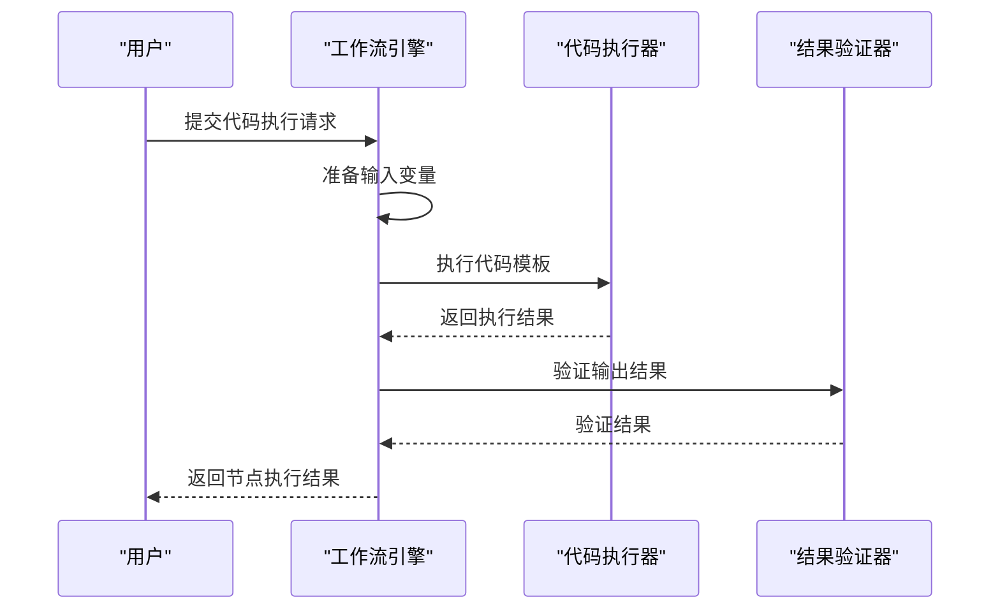
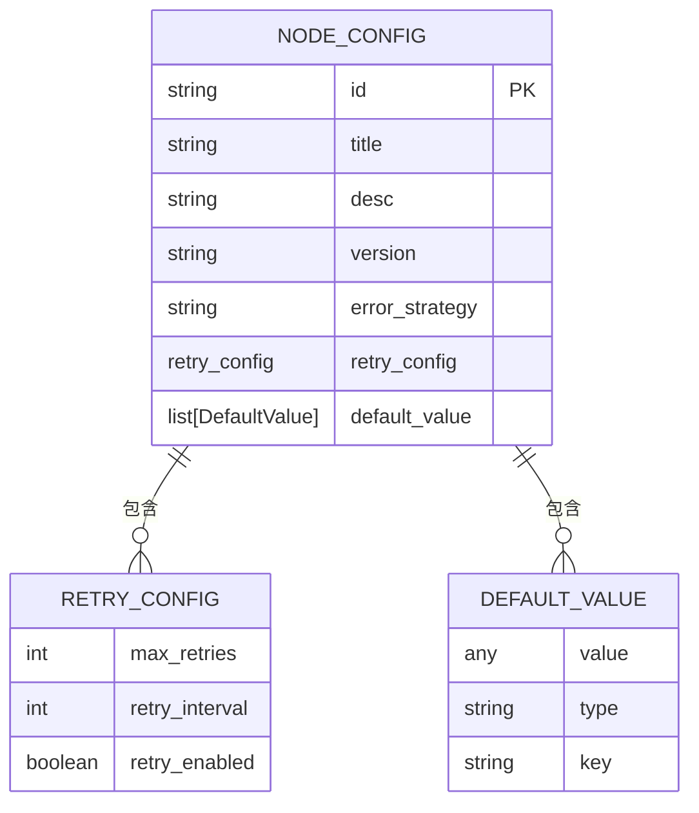
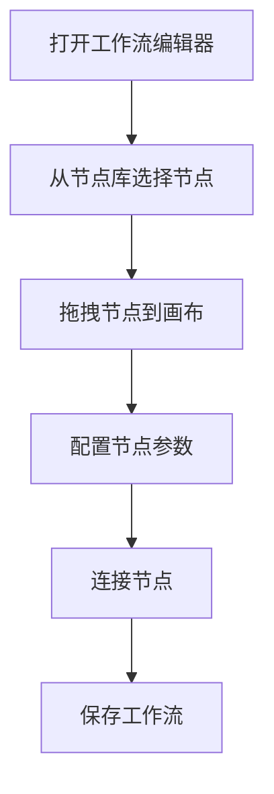
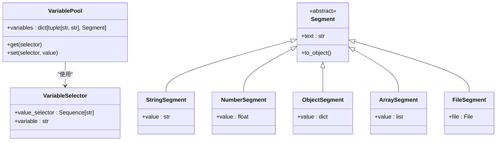

# 节点类型与管理

<cite>
**本文档引用的文件**
- [node.py](file://api/core/workflow/nodes/base/node.py)
- [node_mapping.py](file://api/core/workflow/nodes/node_mapping.py)
- [enums.py](file://api/core/workflow/nodes/enums.py)
- [llm/node.py](file://api/core/workflow/nodes/llm/node.py)
- [code/code_node.py](file://api/core/workflow/nodes/code/code_node.py)
- [if_else/if_else_node.py](file://api/core/workflow/nodes/if_else/if_else_node.py)
- [loop/loop_node.py](file://api/core/workflow/nodes/loop/loop_node.py)
- [iteration/iteration_node.py](file://api/core/workflow/nodes/iteration/iteration_node.py)
- [tool/tool_node.py](file://api/core/workflow/nodes/tool/tool_node.py)
- [base/entities.py](file://api/core/workflow/nodes/base/entities.py)
</cite>

## 目录
1. [简介](#简介)
2. [节点体系架构](#节点体系架构)
3. [核心节点类型详解](#核心节点类型详解)
4. [节点配置与参数](#节点配置与参数)
5. [可视化编辑器交互](#可视化编辑器交互)
6. [节点间数据传递机制](#节点间数据传递机制)
7. [常见配置错误排查](#常见配置错误排查)
8. [性能优化建议](#性能优化建议)

## 简介
Dify工作流引擎提供了一套完整的节点系统，支持构建复杂的人工智能应用工作流。本文档详细介绍了各类节点的功能、配置、使用场景及实现原理，涵盖LLM节点、代码执行节点、工具调用节点、条件分支节点和循环节点等核心组件。

## 节点体系架构



**图示来源**
- [node.py](file://api/core/workflow/nodes/base/node.py#L0-L227)
- [node_mapping.py](file://api/core/workflow/nodes/node_mapping.py#L0-L135)

**本节来源**
- [node.py](file://api/core/workflow/nodes/base/node.py#L0-L227)
- [enums.py](file://api/core/workflow/nodes/enums.py#L0-L37)

## 核心节点类型详解

### LLM节点

LLM节点用于调用大语言模型进行文本生成、对话等任务。该节点支持多种模型配置、提示模板和输出格式。



**图示来源**
- [llm/node.py](file://api/core/workflow/nodes/llm/node.py#L0-L799)
- [node.py](file://api/core/workflow/nodes/base/node.py#L0-L227)

**本节来源**
- [llm/node.py](file://api/core/workflow/nodes/llm/node.py#L0-L799)

### 代码执行节点

代码执行节点允许在工作流中执行Python或JavaScript代码，实现自定义逻辑处理。



**图示来源**
- [code/code_node.py](file://api/core/workflow/nodes/code/code_node.py#L0-L433)
- [node.py](file://api/core/workflow/nodes/base/node.py#L0-L227)

**本节来源**
- [code/code_node.py](file://api/core/workflow/nodes/code/code_node.py#L0-L433)

### 工具调用节点

工具调用节点用于集成和调用外部工具或API，扩展工作流的功能。

**本节来源**
- [tool/tool_node.py](file://api/core/workflow/nodes/tool/tool_node.py)

### 条件分支节点

条件分支节点根据指定条件决定工作流的执行路径，实现条件逻辑控制。

**本节来源**
- [if_else/if_else_node.py](file://api/core/workflow/nodes/if_else/if_else_node.py)

### 循环节点

循环节点支持重复执行特定的节点序列，直到满足终止条件。

**本节来源**
- [loop/loop_node.py](file://api/core/workflow/nodes/loop/loop_node.py)

### 迭代节点

迭代节点用于遍历数组或列表中的每个元素，对每个元素执行相同的操作。

**本节来源**
- [iteration/iteration_node.py](file://api/core/workflow/nodes/iteration/iteration_node.py)

## 节点配置与参数

### 基础配置参数

所有节点都支持以下基础配置参数：



**图示来源**
- [base/entities.py](file://api/core/workflow/nodes/base/entities.py#L0-L164)
- [enums.py](file://api/core/workflow/nodes/enums.py#L0-L37)

**本节来源**
- [base/entities.py](file://api/core/workflow/nodes/base/entities.py#L0-L164)

### 节点类型映射

工作流引擎通过节点类型映射系统管理所有节点类型：

```python
NODE_TYPE_CLASSES_MAPPING: Mapping[NodeType, Mapping[str, type[BaseNode]]] = {
    NodeType.START: {
        LATEST_VERSION: StartNode,
        "1": StartNode,
    },
    NodeType.END: {
        LATEST_VERSION: EndNode,
        "1": EndNode,
    },
    NodeType.LLM: {
        LATEST_VERSION: LLMNode,
        "1": LLMNode,
    },
    NodeType.CODE: {
        LATEST_VERSION: CodeNode,
        "1": CodeNode,
    },
    NodeType.TOOL: {
        LATEST_VERSION: ToolNode,
        "1": ToolNode,
    },
    # ... 其他节点类型
}
```

**本节来源**
- [node_mapping.py](file://api/core/workflow/nodes/node_mapping.py#L0-L135)

## 可视化编辑器交互

### 节点添加与配置



### 节点连接规则

- 节点通过输入输出端口进行连接
- 连接线表示数据流向
- 支持条件分支和并行执行路径
- 循环节点需要配对的开始和结束节点

**本节来源**
- [web/app/components/workflow/store/index.ts](file://web/app/components/workflow/store/index.ts)
- [web/app/components/workflow/hooks/use-workflow-run-event/index.ts](file://web/app/components/workflow/hooks/use-workflow-run-event/index.ts)

## 节点间数据传递机制

### 变量映射系统



**本节来源**
- [core/variables/variables.py](file://api/core/variables/variables.py)
- [core/variables/segments.py](file://api/core/variables/segments.py)

### 上下文共享

工作流中的节点通过共享变量池实现上下文共享，变量池存储所有节点的输入输出数据。

### 类型转换规则

- 字符串：自动转换为文本类型
- 数字：支持整数和浮点数
- 对象：JSON格式化存储
- 数组：支持同类型元素的列表
- 文件：特殊处理，包含元数据和内容

## 常见配置错误排查

### LLM节点常见问题

- 模型配置错误：检查模型名称和提供商配置
- 提示模板错误：验证变量选择器的正确性
- 上下文长度超限：优化提示内容长度
- 权限不足：检查API密钥和访问权限

### 代码执行节点常见问题

- 语法错误：检查代码语法是否正确
- 变量未定义：确保所有输入变量都已定义
- 输出格式错误：验证输出是否符合预期格式
- 超时错误：优化代码执行效率

### 工具调用节点常见问题

- 工具未注册：检查工具是否已正确注册
- 参数错误：验证工具调用参数的正确性
- 认证失败：检查API密钥和认证信息
- 网络连接问题：检查网络连接状态

## 性能优化建议

### 节点执行优化

- 减少不必要的节点调用
- 优化代码执行效率
- 合理设置重试策略
- 使用缓存机制避免重复计算

### 资源管理

- 监控API调用频率和配额
- 优化大模型调用成本
- 合理分配计算资源
- 定期清理无用的工作流

### 工作流设计最佳实践

- 模块化设计，提高复用性
- 清晰的节点命名和描述
- 合理的错误处理策略
- 充分的测试和验证