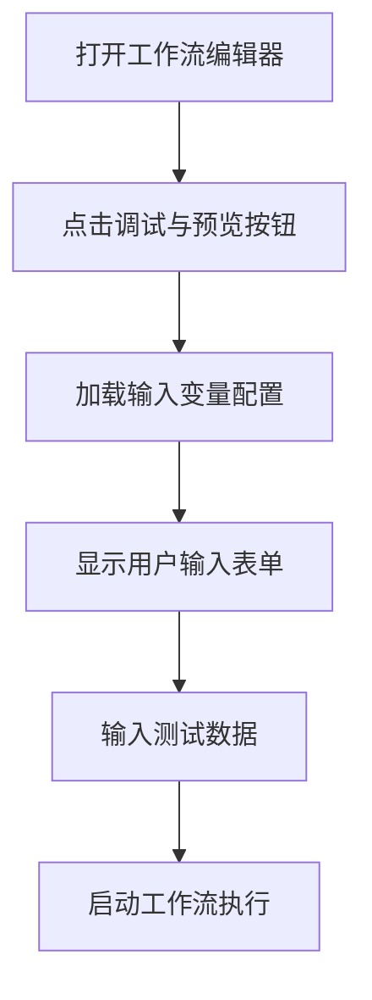
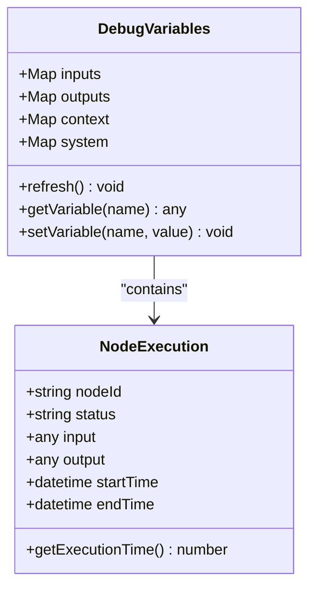
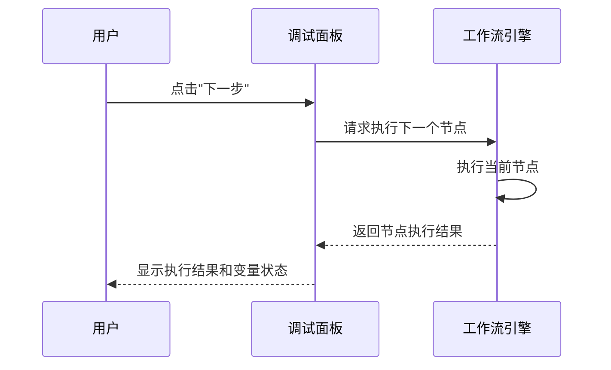

# 实时调试工具

<cite>
**本文档中引用的文件**  
- [index.tsx](file://web\app\components\workflow\panel\debug-and-preview\index.tsx)
- [chat-wrapper.tsx](file://web\app\components\workflow\panel\debug-and-preview\chat-wrapper.tsx)
- [user-input.tsx](file://web\app\components\workflow\panel\debug-and-preview\user-input.tsx)
- [hooks.ts](file://web\app\components\workflow\panel\debug-and-preview\hooks.ts)
- [types.ts](file://web\app\components\workflow\types.ts)
- [store.ts](file://web\app\components\workflow\store\index.ts)
- [use-workflow-run.tsx](file://web\app\components\workflow\hooks\use-workflow-run.tsx)
- [use-inspect-vars-crud.ts](file://web\app\components\workflow\hooks\use-inspect-vars-crud.ts)
</cite>

## 目录
1. [简介](#简介)
2. [启动调试模式](#启动调试模式)
3. [断点设置与管理](#断点设置与管理)
4. [变量查看功能](#变量查看功能)
5. [调试操作控制](#调试操作控制)
6. [调试会话管理](#调试会话管理)
7. [常见问题与解决方案](#常见问题与解决方案)
8. [实际案例演示](#实际案例演示)

## 简介
Dify工作流实时调试工具为开发者提供了在工作流编辑界面中直接进行调试的能力。该工具支持断点设置、变量查看、单步执行等核心调试功能，帮助用户快速定位和修复工作流中的逻辑错误。通过集成在可视化编辑器中的调试面板，用户可以在不离开开发环境的情况下完成完整的调试流程。

**Section sources**
- [index.tsx](file://web\app\components\workflow\panel\debug-and-preview\index.tsx#L1-L142)

## 启动调试模式
在工作流编辑界面中，用户可以通过点击右侧面板的“调试与预览”按钮来启动调试模式。该面板由`DebugAndPreview`组件实现，提供了一个集成的聊天式交互界面，允许用户输入测试数据并观察工作流的执行过程。

调试模式启动后，系统会自动加载工作流的输入变量定义，并在用户输入区域展示可配置的字段。用户输入内容将作为工作流的初始输入参数，触发工作流的执行流程。

**Diagram sources**
- [index.tsx](file://web\app\components\workflow\panel\debug-and-preview\index.tsx#L1-L142)
- [user-input.tsx](file://web\app\components\workflow\panel\debug-and-preview\user-input.tsx#L1-L57)

**Section sources**
- [index.tsx](file://web\app\components\workflow\panel\debug-and-preview\index.tsx#L1-L142)
- [chat-wrapper.tsx](file://web\app\components\workflow\panel\debug-and-preview\chat-wrapper.tsx#L1-L205)

## 断点设置与管理
Dify工作流调试工具支持在特定节点设置断点，当工作流执行到该节点时会自动暂停，允许开发者检查当前的执行状态。断点可以在任何工作流节点上设置，包括开始节点、LLM节点、代码节点、条件判断节点等。

### 断点生效条件
断点仅在调试模式下生效，且需要满足以下条件：
- 工作流处于调试执行状态
- 节点被明确设置为断点
- 节点执行路径被实际触发

### 高级断点功能
系统支持条件断点设置，用户可以定义断点触发的条件表达式。只有当条件表达式评估为真时，执行才会在该节点暂停。这有助于在复杂工作流中精确控制调试流程，避免在无关执行路径上中断。

**Section sources**
- [use-workflow-run.tsx](file://web\app\components\workflow\hooks\use-workflow-run.tsx#L1-L50)
- [types.ts](file://web\app\components\workflow\types.ts#L1-L20)

## 变量查看功能
调试工具提供了全面的变量查看功能，允许用户实时监控工作流执行过程中的各种变量状态。

### 上下文变量查看
在调试过程中，用户可以通过调试面板查看当前的上下文变量。这些变量包括：
- 工作流输入变量
- 节点间传递的中间变量
- 系统自动生成的上下文变量

### 节点输入输出查看
每个工作流节点的输入和输出数据都可以在执行过程中实时查看。当节点执行完成时，其输出结果会立即显示在调试日志中，便于验证节点逻辑的正确性。

### 系统变量查看
系统还提供了对内部系统变量的访问，包括：
- 执行ID
- 时间戳
- 错误状态
- 重试计数

**Diagram sources**
- [use-inspect-vars-crud.ts](file://web\app\components\workflow\hooks\use-inspect-vars-crud.ts#L1-L30)
- [store.ts](file://web\app\components\workflow\store\index.ts#L1-L25)

**Section sources**
- [chat-wrapper.tsx](file://web\app\components\workflow\panel\debug-and-preview\chat-wrapper.tsx#L1-L205)
- [hooks.ts](file://web\app\components\workflow\panel\debug-and-preview\hooks.ts#L1-L516)

## 调试操作控制
调试工具提供了一套完整的控制操作，帮助用户精确管理调试过程。

### 单步执行
用户可以使用单步执行功能逐个节点执行工作流。每次点击"下一步"按钮，工作流将执行一个节点并暂停，允许用户检查该节点的执行结果。

### 跳过执行
对于已验证正确的节点或分支，用户可以选择跳过执行，直接进入下一个断点或工作流结束。这可以显著提高调试效率，特别是在处理长工作流时。

### 继续执行
当用户完成当前断点的检查后，可以使用"继续"按钮让工作流继续执行，直到遇到下一个断点或完成整个流程。

### 重启调试
用户可以随时点击刷新按钮重启调试会话，这将清除所有执行状态并重新开始工作流执行，使用相同的输入参数。

**Diagram sources**
- [hooks.ts](file://web\app\components\workflow\panel\debug-and-preview\hooks.ts#L1-L516)
- [use-workflow-run.tsx](file://web\app\components\workflow\hooks\use-workflow-run.tsx#L1-L50)

**Section sources**
- [hooks.ts](file://web\app\components\workflow\panel\debug-and-preview\hooks.ts#L1-L516)
- [index.tsx](file://web\app\components\workflow\panel\debug-and-preview\index.tsx#L1-L142)

## 调试会话管理
调试工具提供了会话管理功能，帮助用户保存和分享调试状态。

### 保存调试快照
用户可以保存当前的调试快照，包括：
- 输入参数
- 断点配置
- 当前执行状态
- 变量值

这些快照可以用于后续的回归测试或问题复现。

### 分享调试链接
系统支持生成调试会话的分享链接，包含所有调试配置。团队成员可以通过该链接加载相同的调试环境，便于协作排查问题。

### 调试历史记录
所有调试会话都会被记录在历史中，用户可以随时回顾之前的调试过程，比较不同版本的工作流行为差异。

**Section sources**
- [store.ts](file://web\app\components\workflow\store\index.ts#L1-L25)
- [use-workflow-store.ts](file://web\app\components\workflow\store\index.ts#L1-L25)

## 常见问题与解决方案
### 断点不生效
**问题描述**：设置的断点没有触发，工作流直接执行完成。

**解决方案**：
1. 确认工作流处于调试模式而非预览模式
2. 检查断点节点是否在实际执行路径上
3. 验证工作流版本是否已保存并部署
4. 清除浏览器缓存后重试

### 变量值显示异常
**问题描述**：变量查看面板中显示的值与预期不符或为空。

**解决方案**：
1. 确认变量作用域是否正确
2. 检查变量是否在执行路径中被正确赋值
3. 验证变量类型是否匹配
4. 使用"刷新变量"功能重新加载最新状态

### 调试面板无响应
**问题描述**：调试面板卡死或无法交互。

**解决方案**：
1. 点击"停止"按钮终止当前执行
2. 重启调试会话
3. 检查网络连接状态
4. 查看浏览器控制台是否有错误信息

**Section sources**
- [hooks.ts](file://web\app\components\workflow\panel\debug-and-preview\hooks.ts#L1-L516)
- [chat-wrapper.tsx](file://web\app\components\workflow\panel\debug-and-preview\chat-wrapper.tsx#L1-L205)

## 实际案例演示
### 案例：修复条件判断逻辑错误
**场景描述**：一个工作流根据用户输入的情绪判断返回不同的回复，但总是返回默认回复。

**调试步骤**：
1. 在情绪分析节点后设置断点
2. 输入测试文本"我今天很开心"
3. 执行到断点时查看情绪分析节点的输出
4. 发现情绪值被错误地解析为"neutral"而非"positive"
5. 检查情绪分析模型的提示词配置
6. 修正提示词中的分类标准
7. 重新测试验证修复效果

通过使用调试工具，开发者能够在几分钟内定位并修复这个逻辑错误，而无需依赖日志分析或外部调试工具。

**Section sources**
- [hooks.ts](file://web\app\components\workflow\panel\debug-and-preview\hooks.ts#L1-L516)
- [use-inspect-vars-crud.ts](file://web\app\components\workflow\hooks\use-inspect-vars-crud.ts#L1-L30)