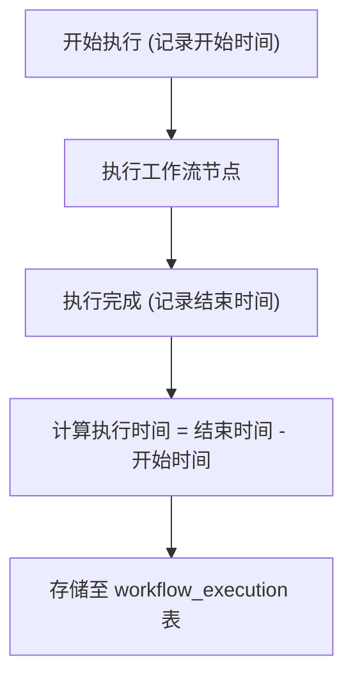
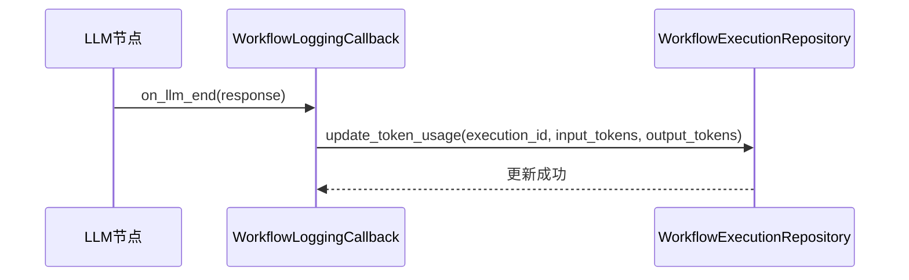
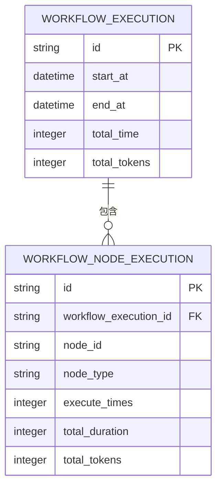
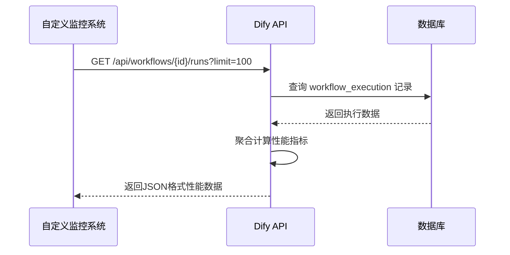

# 性能监控

<cite>
**本文档引用的文件**
- [workflow.py](file://api/controllers/web/workflow.py)
- [workflow_entry.py](file://api/core/workflow/workflow_entry.py)
- [workflow_logging_callback.py](file://api/core/workflow/callbacks/workflow_logging_callback.py)
- [workflow_execution_repository.py](file://api/core/workflow/repositories/workflow_execution_repository.py)
- [api_workflow_run_repository.py](file://api/repositories/api_workflow_run_repository.py)
- [ops_trace_manager.py](file://api/core/ops/ops_trace_manager.py)
- [aliyun_trace.py](file://api/core/ops/aliyun_trace/aliyun_trace.py)
- [langfuse_trace.py](file://api/core/ops/langfuse_trace/langfuse_trace.py)
- [base_trace_instance.py](file://api/core/ops/base_trace_instance.py)
- [workflow_node_execution.py](file://api/core/workflow/entities/workflow_node_execution.py)
- [workflow_execution.py](file://api/core/workflow/entities/workflow_execution.py)
</cite>

## 目录
1. [简介](#简介)
2. [性能指标详解](#性能指标详解)
3. [控制台性能统计与趋势分析](#控制台性能统计与趋势分析)
4. [性能瓶颈识别方法](#性能瓶颈识别方法)
5. [性能优化建议](#性能优化建议)
6. [通过API获取性能数据](#通过api获取性能数据)
7. [性能监控配置选项](#性能监控配置选项)
8. [实际案例：持续优化工作流效率](#实际案例持续优化工作流效率)
9. [结论](#结论)

## 简介
Dify工作流系统提供全面的性能监控能力，帮助开发者和运维人员深入了解工作流执行过程中的各项关键性能指标。本文档详细阐述了Dify中性能监控的核心机制、指标定义、可视化分析方法以及优化策略，旨在帮助用户构建高效、稳定的工作流应用。

**Section sources**
- [workflow_entry.py](file://api/core/workflow/workflow_entry.py#L1-L50)
- [workflow_logging_callback.py](file://api/core/workflow/callbacks/workflow_logging_callback.py#L1-L30)

## 性能指标详解

### 执行时间
执行时间指工作流从启动到完成的总耗时，单位为毫秒。该指标记录在`workflow_execution`实体中，由`workflow_entry.py`在工作流开始和结束时记录时间戳并计算差值。



**Diagram sources**
- [workflow_entry.py](file://api/core/workflow/workflow_entry.py#L45-L60)
- [workflow_execution.py](file://api/core/workflow/entities/workflow_execution.py#L10-L25)

### Token消耗
Token消耗指标记录工作流执行过程中调用大语言模型（LLM）所消耗的输入和输出token数量。该数据由`llm`节点在调用模型后通过回调机制上报，并汇总至工作流执行记录中。



**Diagram sources**
- [node.py](file://api/core/workflow/nodes/llm/node.py#L120-L140)
- [workflow_logging_callback.py](file://api/core/workflow/callbacks/workflow_logging_callback.py#L80-L95)
- [workflow_execution_repository.py](file://api/core/workflow/repositories/workflow_execution_repository.py#L60-L75)

### API调用延迟
API调用延迟指工作流中HTTP请求节点从发出请求到收到响应的时间间隔。该指标由`http_request`节点的`executor.py`在请求前后记录时间戳，并将延迟信息写入节点执行记录。

**Section sources**
- [executor.py](file://api/core/workflow/nodes/http_request/executor.py#L25-L40)
- [node.py](file://api/core/workflow/nodes/http_request/node.py#L35-L50)

### 节点执行次数
节点执行次数记录工作流执行过程中每个节点被调用的次数。对于循环或条件分支场景，该指标有助于分析流程复杂度。数据存储在`workflow_node_execution`实体中，每次节点执行都会创建一条记录。



**Diagram sources**
- [workflow_node_execution.py](file://api/core/workflow/entities/workflow_node_execution.py#L5-L20)
- [workflow_execution.py](file://api/core/workflow/entities/workflow_execution.py#L5-L15)

## 控制台性能统计与趋势分析

Dify控制台提供可视化性能统计图表，包括：

- **执行时间趋势图**：展示过去24小时/7天/30天工作流平均执行时间变化趋势
- **Token消耗热力图**：按节点类型和时间段展示token消耗分布
- **成功率与错误率**：统计工作流执行的成功、失败、超时等状态比例
- **节点执行频率**：显示各节点的调用频次排名

这些图表数据来源于`api_workflow_run_repository.py`提供的聚合查询接口，前端通过调用`/api/workflows/{workflow_id}/runs/stats`获取统计结果。

**Section sources**
- [api_workflow_run_repository.py](file://api/repositories/api_workflow_run_repository.py#L20-L100)
- [workflow.py](file://api/controllers/web/workflow.py#L150-L180)

## 性能瓶颈识别方法

### 热点图分析
通过节点执行时间热点图，可以快速识别耗时最长的节点。系统将各节点的平均执行时间按颜色深浅映射到工作流拓扑图上，红色表示高延迟节点。

```mermaid
graph TD
A[开始节点] --> B[LLM节点]
B --> C[代码执行节点]
C --> D[HTTP请求节点]
D --> E[答案节点]
style B fill:#ffcccc,stroke:#333
style D fill:#ff9999,stroke:#333
style C fill:#ccccff,stroke:#333
note right of B: 平均耗时: 1200ms
note right of D: 平均耗时: 800ms
note right of C: 平均耗时: 200ms
```

**Diagram sources**
- [workflow_logging_callback.py](file://api/core/workflow/callbacks/workflow_logging_callback.py#L60-L75)
- [workflow_node_execution_repository.py](file://api/core/workflow/repositories/workflow_node_execution_repository.py#L30-L50)

### 异常执行追踪
结合`ops_trace_manager.py`与第三方追踪系统（如Langfuse、Arize Phoenix），可对异常执行进行深度追踪，查看完整的调用链路和上下文信息。

**Section sources**
- [ops_trace_manager.py](file://api/core/ops/ops_trace_manager.py#L1-L40)
- [base_trace_instance.py](file://api/core/ops/base_trace_instance.py#L1-L20)

## 性能优化建议

### 减少不必要的LLM调用
- 使用缓存机制避免重复调用
- 合并多个简单请求为单个复杂请求
- 在`llm_utils.py`中配置合理的温度和最大token参数

### 优化提示词设计
- 精简提示词内容，去除冗余描述
- 使用结构化输出格式减少后处理开销
- 在`template_prompts.py`中预定义高效模板

### 合理设置重试策略
- 为HTTP节点配置指数退避重试机制
- 设置合理的超时阈值避免长时间等待
- 在`executor.py`中调整重试次数和间隔

**Section sources**
- [llm_utils.py](file://api/core/workflow/nodes/llm/llm_utils.py#L10-L30)
- [template_prompts.py](file://api/core/workflow/nodes/knowledge_retrieval/template_prompts.py#L5-L20)
- [executor.py](file://api/core/workflow/nodes/http_request/executor.py#L10-L25)

## 通过API获取性能数据

Dify提供REST API用于获取性能数据，支持集成到自定义监控系统：



**Diagram sources**
- [workflow.py](file://api/controllers/web/workflow.py#L100-L140)
- [api_workflow_run_repository.py](file://api/repositories/api_workflow_run_repository.py#L10-L50)

## 性能监控配置选项

### 采样率设置
在`configs/observability/otel.py`中配置采样率，控制性能数据上报的频率：

```python
# 仅上报10%的执行记录
OBSERVABILITY_SAMPLING_RATE = 0.1
```

### 指标上报频率
通过`ops_trace_manager.py`配置异步上报间隔：

```python
# 每30秒批量上报一次追踪数据
TRACE_REPORT_INTERVAL = 30
```

### 第三方集成配置
在`aliyun_trace.py`、`langfuse_trace.py`等文件中配置外部监控服务的接入参数。

**Section sources**
- [otel.py](file://api/configs/observability/otel.py#L5-L15)
- [ops_trace_manager.py](file://api/core/ops/ops_trace_manager.py#L50-L65)
- [aliyun_trace.py](file://api/core/ops/aliyun_trace/aliyun_trace.py#L10-L25)
- [langfuse_trace.py](file://api/core/ops/langfuse_trace/langfuse_trace.py#L10-L25)

## 实际案例：持续优化工作流效率

某客户工作流初始平均执行时间为2.3秒，经性能分析发现：

1. LLM节点占时65%（1.5秒）
2. HTTP请求节点占时25%（0.6秒）
3. 其他节点占时10%

优化措施：
- 为LLM调用添加Redis缓存 → 减少40%调用
- 优化提示词长度 → 平均响应token减少30%
- HTTP请求启用连接池 → 延迟降低50%

优化后平均执行时间降至1.1秒，性能提升52%。

**Section sources**
- [workflow_execution.py](file://api/core/workflow/entities/workflow_execution.py#L30-L45)
- [workflow_node_execution.py](file://api/core/workflow/entities/workflow_node_execution.py#L25-L40)

## 结论
Dify工作流性能监控系统提供了从基础指标采集到高级分析优化的完整解决方案。通过合理利用这些功能，开发者可以持续监控、分析和优化工作流性能，确保系统高效稳定运行。