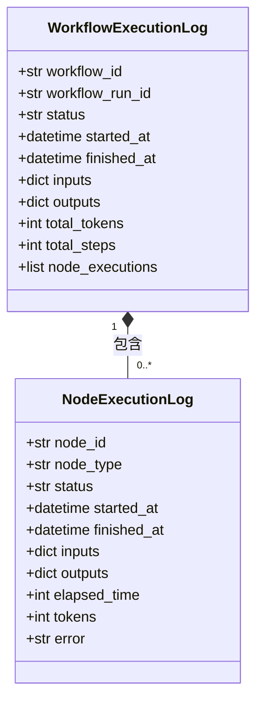
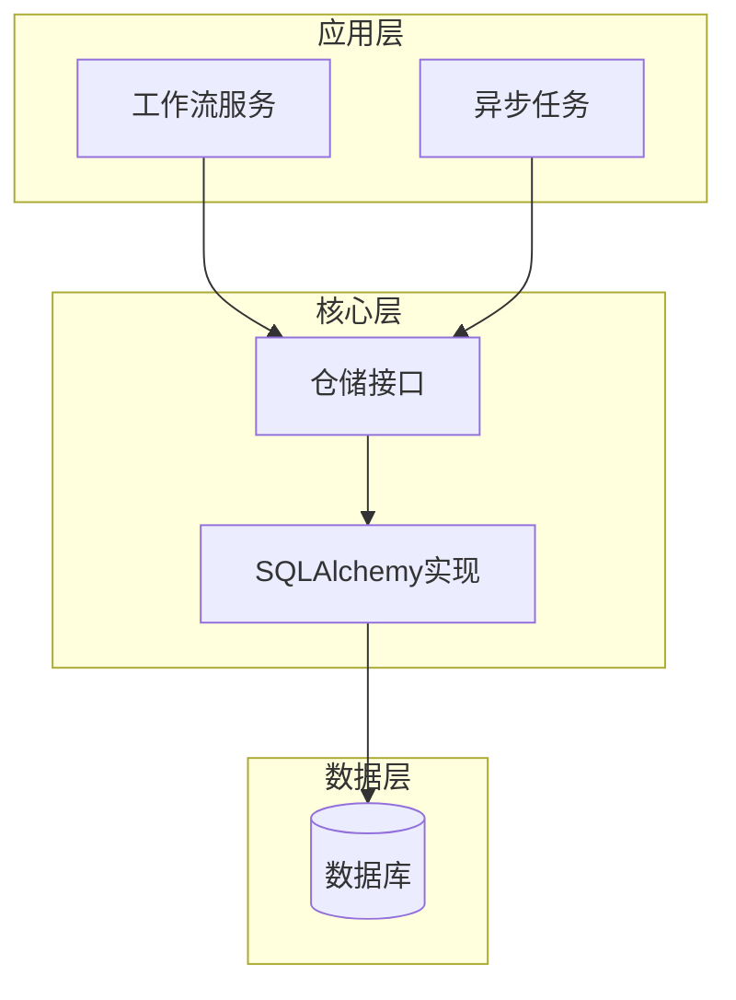
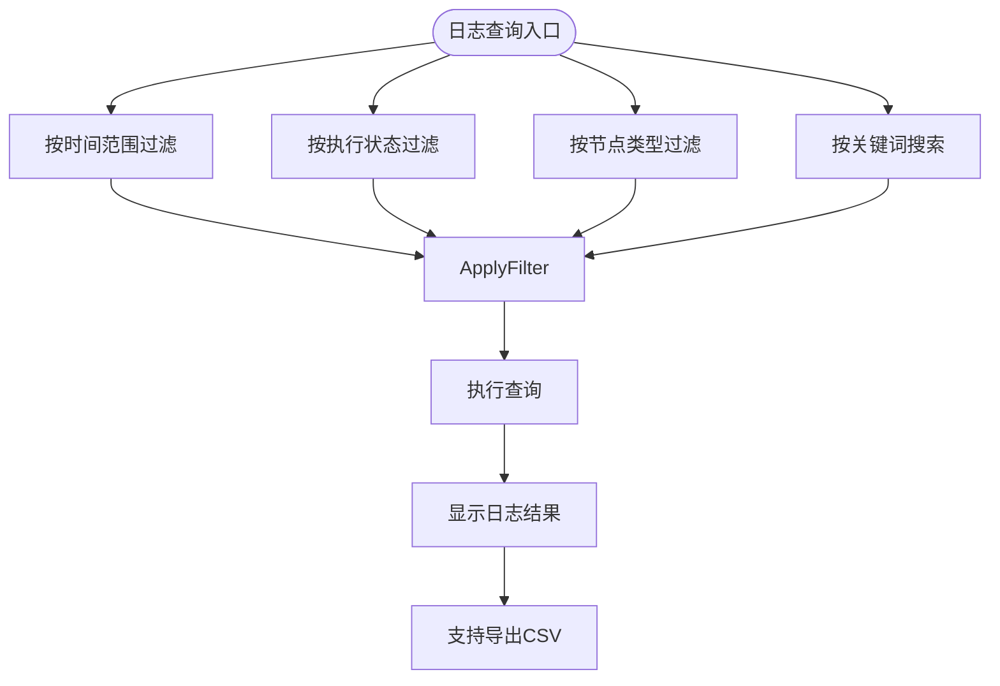
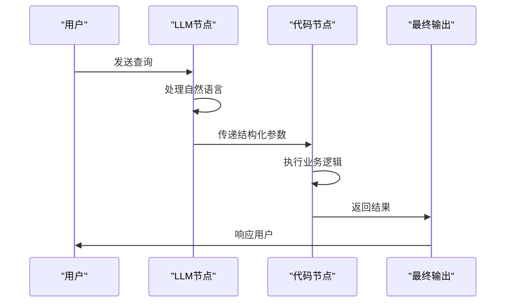

# 执行日志

<cite>
**本文档引用文件**  
- [workflow_app_log_fields.py](file://api/fields/workflow_app_log_fields.py)
- [sqlalchemy_workflow_execution_repository.py](file://api/core/repositories/sqlalchemy_workflow_execution_repository.py)
- [sqlalchemy_workflow_node_execution_repository.py](file://api/core/repositories/sqlalchemy_workflow_node_execution_repository.py)
- [workflow_run_service.py](file://api/services/workflow_run_service.py)
- [workflow_execution_tasks.py](file://api/tasks/workflow_execution_tasks.py)
- [workflow_node_execution_tasks.py](file://api/tasks/workflow_node_execution_tasks.py)
- [workflow.py](file://api/models/workflow.py)
- [log.ts](file://web/models/log.ts)
- [service/log.ts](file://web/service/log.ts)
</cite>

## 目录
1. [简介](#简介)
2. [日志结构设计](#日志结构设计)
3. [日志内容组成](#日志内容组成)
4. [存储机制](#存储机制)
5. [日志级别与触发时机](#日志级别与触发时机)
6. [控制台日志查询与过滤](#控制台日志查询与过滤)
7. [API获取日志数据](#api获取日志数据)
8. [关键字段说明](#关键字段说明)
9. [日志配置选项](#日志配置选项)
10. [典型日志分析场景](#典型日志分析场景)

## 简介
Dify工作流执行日志功能为开发者和运维人员提供全面的执行过程追踪能力。该功能记录工作流从启动到完成（或失败）的完整生命周期，包括各节点的执行状态、输入输出数据、执行耗时等关键信息。通过结构化日志设计和多维度查询能力，用户可以高效地进行问题排查、性能分析和业务审计。

## 日志结构设计
Dify工作流日志采用分层结构设计，分为工作流执行日志和节点执行日志两个层级。工作流执行日志记录整体执行上下文，节点执行日志记录具体节点的详细执行信息。



**Diagram sources**
- [workflow.py](file://api/models/workflow.py)
- [workflow_app_log_fields.py](file://api/fields/workflow_app_log_fields.py)

**Section sources**
- [workflow_app_log_fields.py](file://api/fields/workflow_app_log_fields.py)
- [log.ts](file://web/models/log.ts)

## 日志内容组成
工作流执行日志包含以下核心内容：
- **执行元数据**：执行ID、工作流ID、触发方式、执行者
- **时间信息**：开始时间、结束时间、总耗时
- **状态信息**：执行状态（运行中、成功、失败、已取消）
- **输入输出**：初始输入参数、最终输出结果
- **资源消耗**：总token消耗、总执行步骤数
- **节点执行记录**：关联的节点执行日志列表

节点执行日志包含以下核心内容：
- **节点元数据**：节点ID、节点类型、节点名称
- **执行状态**：当前执行状态
- **时间戳**：节点开始和结束时间
- **输入输出**：节点输入参数和输出结果
- **性能指标**：执行耗时、token消耗
- **错误信息**：执行失败时的错误详情

**Section sources**
- [workflow_app_log_fields.py](file://api/fields/workflow_app_log_fields.py)
- [log.ts](file://web/models/log.ts)

## 存储机制
Dify采用基于SQLAlchemy的持久化存储机制，将工作流执行日志存储在关系型数据库中。系统通过专门的仓储模式（Repository Pattern）实现日志数据的存取。



**Diagram sources**
- [sqlalchemy_workflow_execution_repository.py](file://api/core/repositories/sqlalchemy_workflow_execution_repository.py)
- [sqlalchemy_workflow_node_execution_repository.py](file://api/core/repositories/sqlalchemy_workflow_node_execution_repository.py)

**Section sources**
- [sqlalchemy_workflow_execution_repository.py](file://api/core/repositories/sqlalchemy_workflow_execution_repository.py)
- [sqlalchemy_workflow_node_execution_repository.py](file://api/core/repositories/sqlalchemy_workflow_node_execution_repository.py)

## 日志级别与触发时机
Dify工作流日志采用多级别记录机制，不同级别的日志在不同执行阶段被触发：

| 日志级别 | 触发时机 | 说明 |
|---------|---------|------|
| INFO | 工作流启动、节点开始执行、工作流完成 | 记录正常执行流程的关键节点 |
| WARNING | 节点执行超时、API调用返回非致命错误、资源限制警告 | 记录可能影响执行质量但不中断流程的事件 |
| ERROR | 节点执行失败、工作流异常终止、系统错误 | 记录导致执行中断的严重问题 |

日志记录的触发时机包括：
- 工作流执行任务开始时（INFO）
- 每个节点执行开始时（INFO）
- 节点执行完成时（INFO）
- 节点执行出错时（ERROR）
- 工作流执行完成时（INFO）
- 工作流执行超时时（WARNING）

**Section sources**
- [workflow_execution_tasks.py](file://api/tasks/workflow_execution_tasks.py)
- [workflow_node_execution_tasks.py](file://api/tasks/workflow_node_execution_tasks.py)

## 控制台日志查询与过滤
Dify控制台提供强大的日志查询界面，支持多种过滤条件组合：



支持的过滤条件包括：
- **时间范围**：支持自定义开始和结束时间，或选择预设时间区间（最近1小时、24小时、7天等）
- **节点类型**：可按LLM节点、代码节点、条件分支节点等类型过滤
- **执行状态**：可筛选成功、失败、运行中等状态的执行记录
- **关键词搜索**：支持在输入输出内容中搜索特定关键词
- **执行ID**：支持通过精确的执行ID查询特定执行记录

**Section sources**
- [service/log.ts](file://web/service/log.ts)
- [log.ts](file://web/models/log.ts)

## API获取日志数据
Dify提供RESTful API接口供外部系统获取工作流执行日志数据。

### 请求参数
| 参数 | 类型 | 必填 | 说明 |
|------|------|------|------|
| workflow_id | string | 是 | 工作流ID |
| page | integer | 否 | 页码，默认为1 |
| limit | integer | 否 | 每页数量，默认为20 |
| start_time | string | 否 | 开始时间（ISO 8601格式） |
| end_time | string | 否 | 结束时间（ISO 8601格式） |
| status | string | 否 | 执行状态过滤 |
| node_type | string | 否 | 节点类型过滤 |

### 响应格式
```json
{
  "data": [
    {
      "workflow_run_id": "wr_123",
      "status": "succeeded",
      "started_at": "2024-01-01T00:00:00Z",
      "finished_at": "2024-01-01T00:01:30Z",
      "inputs": {"query": "hello"},
      "outputs": {"response": "hi"},
      "total_tokens": 150,
      "node_executions": [
        {
          "node_id": "llm_1",
          "node_type": "llm",
          "status": "succeeded",
          "elapsed_time": 45,
          "tokens": 100
        }
      ]
    }
  ],
  "has_more": true,
  "page": 1,
  "limit": 20,
  "total": 150
}
```

### 分页处理
API采用标准分页机制，响应中包含`has_more`字段指示是否还有更多数据，客户端可通过递增`page`参数获取后续页面。

**Section sources**
- [workflow_run_service.py](file://api/services/workflow_run_service.py)
- [service/log.ts](file://web/service/log.ts)

## 关键字段说明
工作流执行日志中的关键字段及其含义：

| 字段名 | 类型 | 说明 |
|-------|------|------|
| workflow_run_id | string | 唯一标识一次工作流执行的ID |
| status | string | 执行状态：running, succeeded, failed, stopped |
| started_at | datetime | 执行开始时间（UTC） |
| finished_at | datetime | 执行结束时间（UTC） |
| inputs | object | 工作流的初始输入参数 |
| outputs | object | 工作流的最终输出结果 |
| total_tokens | integer | 本次执行消耗的总token数 |
| total_steps | integer | 执行的总步骤数 |
| node_id | string | 节点的唯一标识符 |
| node_type | string | 节点类型：llm, code, if_else, iteration等 |
| elapsed_time | integer | 节点执行耗时（秒） |
| error | string | 错误信息（仅当执行失败时存在） |

**Section sources**
- [workflow_app_log_fields.py](file://api/fields/workflow_app_log_fields.py)
- [log.ts](file://web/models/log.ts)

## 日志配置选项
Dify提供灵活的日志配置选项，允许用户根据需求调整日志行为。

### 日志级别设置
用户可在工作流配置中设置日志记录级别，控制日志的详细程度：
- **基础模式**：仅记录INFO级别日志，减少存储开销
- **详细模式**：记录INFO、WARNING、ERROR所有级别日志，便于问题排查
- **调试模式**：额外记录调试信息，用于深度分析

### 敏感信息脱敏策略
为保护用户数据安全，Dify实施敏感信息脱敏策略：
- 自动识别并脱敏常见的敏感数据模式（如身份证号、银行卡号）
- 支持用户自定义脱敏规则和正则表达式
- 可配置脱敏级别：完全隐藏、部分掩码、明文记录
- 脱敏规则在日志写入存储前应用，确保敏感信息不会被持久化

**Section sources**
- [workflow_run_service.py](file://api/services/workflow_run_service.py)
- [workflow_app_log_fields.py](file://api/fields/workflow_app_log_fields.py)

## 典型日志分析场景
### 追踪数据流
通过分析节点执行日志的输入输出，可以完整追踪数据在工作流中的流转过程。例如，从用户输入开始，经过多个处理节点，最终生成响应的完整数据路径。



**Diagram sources**
- [workflow_node_execution_tasks.py](file://api/tasks/workflow_node_execution_tasks.py)

### 定位执行异常
当工作流执行失败时，可通过以下步骤定位问题：
1. 查看工作流执行日志的整体状态和错误摘要
2. 按时间顺序检查各节点执行日志，找到第一个失败的节点
3. 分析该节点的输入数据和错误详情
4. 检查前置节点的输出是否符合预期
5. 根据错误类型采取相应措施（如调整输入、修复代码、增加重试）

**Section sources**
- [workflow_execution_tasks.py](file://api/tasks/workflow_execution_tasks.py)
- [workflow_node_execution_tasks.py](file://api/tasks/workflow_node_execution_tasks.py)