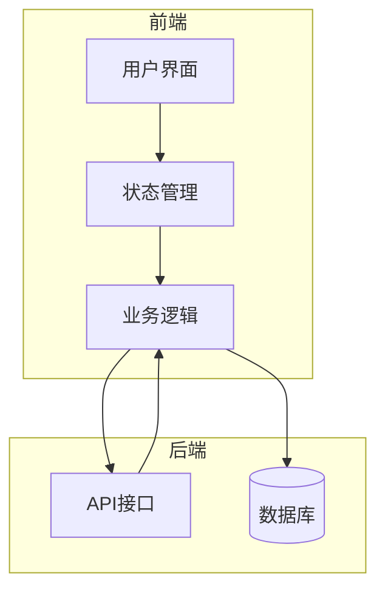
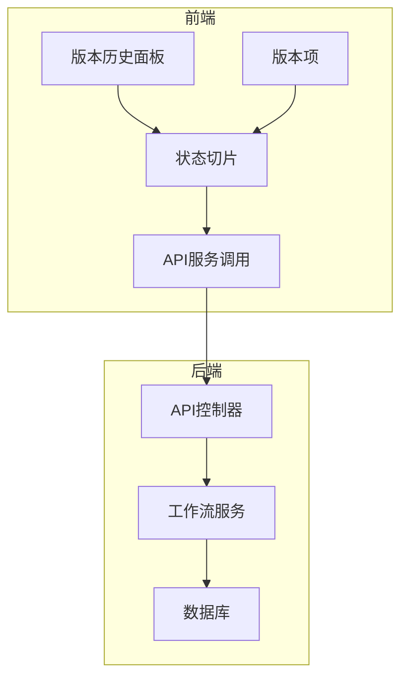
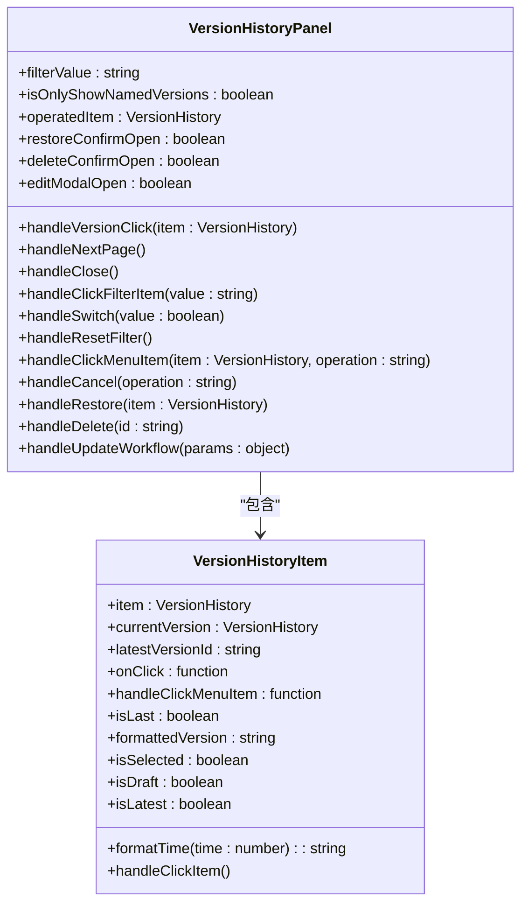
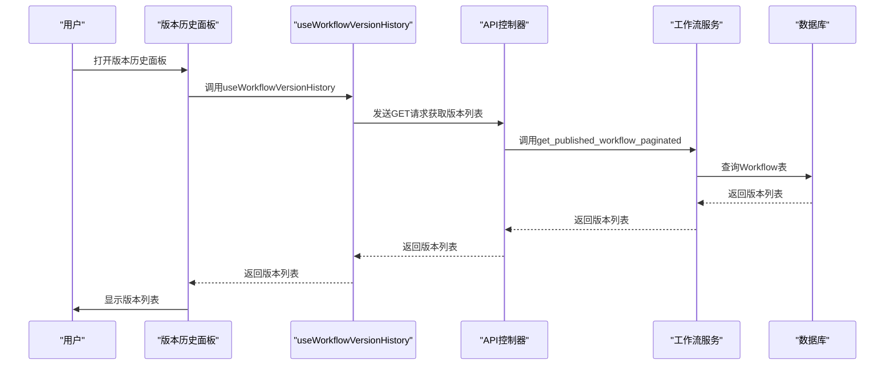
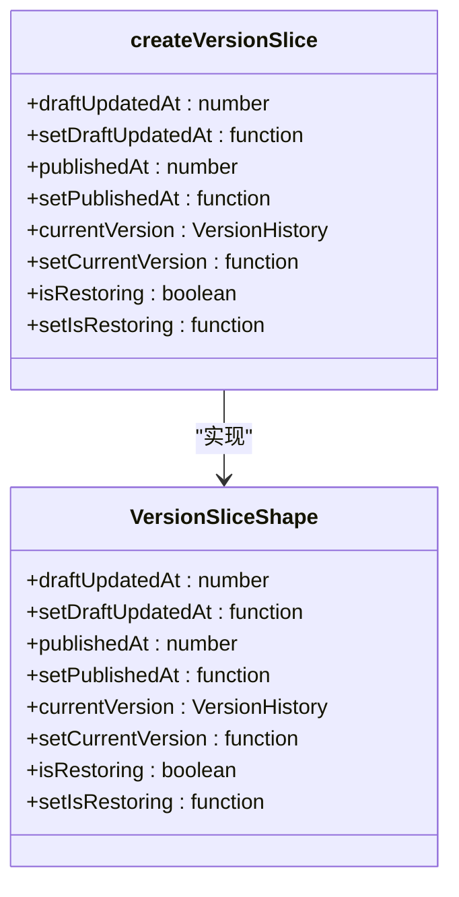
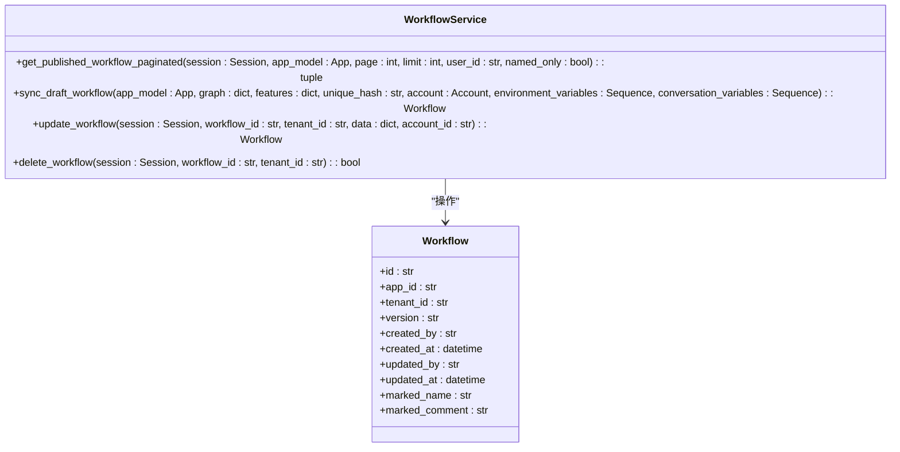
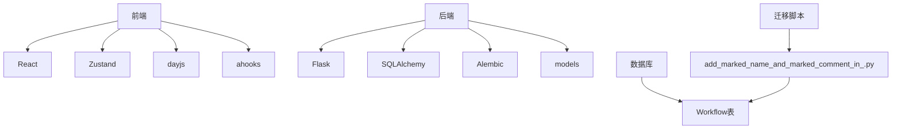

# 版本对比与变更追踪

<cite>
**本文档引用文件**  
- [version-slice.ts](file://web/app/components/workflow/store/workflow/version-slice.ts)
- [version-history-panel.tsx](file://web/app/components/workflow/panel/version-history-panel/index.tsx)
- [version-history-item.tsx](file://web/app/components/workflow/panel/version-history-panel/version-history-item.tsx)
- [use-workflow.ts](file://web/service/use-workflow.ts)
- [workflow_service.py](file://api/services/workflow_service.py)
- [workflow_fields.py](file://api/fields/workflow_fields.py)
- [add_marked_name_and_marked_comment_in_.py](file://api/migrations/versions/2025_03_03_1436-ee79d9b1c156_add_marked_name_and_marked_comment_in_.py)
</cite>

## 目录
1. [简介](#简介)
2. [项目结构](#项目结构)
3. [核心组件](#核心组件)
4. [架构概述](#架构概述)
5. [详细组件分析](#详细组件分析)
6. [依赖分析](#依赖分析)
7. [性能考虑](#性能考虑)
8. [故障排除指南](#故障排除指南)
9. [结论](#结论)
10. [附录](#附录)（如有必要）

## 简介
本文档全面开发Dify工作流版本对比与变更追踪功能的文档，说明工作流版本管理的机制，包括自动保存、手动发布等操作。详细描述版本对比功能的使用方法，如何可视化展示两个版本之间的差异，包括节点增删、参数修改、连接关系变化等。解释变更追踪的实现原理，如何记录每次修改的操作人、时间戳和修改内容。提供版本回滚的操作流程和注意事项。说明如何通过API查询版本历史和获取特定版本的配置。包含版本管理的最佳实践，如版本命名规范、变更说明编写要求等。

## 项目结构
Dify项目的工作流版本管理功能主要分布在前端和后端两个部分。前端代码位于`web/app/components/workflow`目录下，负责版本历史的展示、用户交互和状态管理。后端代码位于`api/services`和`api/fields`目录下，负责版本数据的存储、查询和业务逻辑处理。数据库迁移脚本位于`api/migrations/versions`目录下，用于管理数据库表结构的变更。



**图示来源**
- [version-history-panel.tsx](file://web/app/components/workflow/panel/version-history-panel/index.tsx)
- [use-workflow.ts](file://web/service/use-workflow.ts)
- [workflow_service.py](file://api/services/workflow_service.py)

**章节来源**
- [version-history-panel.tsx](file://web/app/components/workflow/panel/version-history-panel/index.tsx)
- [workflow_service.py](file://api/services/workflow_service.py)

## 核心组件
工作流版本管理的核心组件包括版本历史面板、版本项、状态切片和API服务。版本历史面板负责展示所有版本的列表，版本项用于显示单个版本的详细信息，状态切片管理当前选中的版本和草稿更新时间，API服务提供版本的增删改查功能。

**章节来源**
- [version-history-panel.tsx](file://web/app/components/workflow/panel/version-history-panel/index.tsx)
- [version-history-item.tsx](file://web/app/components/workflow/panel/version-history-panel/version-history-item.tsx)
- [version-slice.ts](file://web/app/components/workflow/store/workflow/version-slice.ts)
- [workflow_service.py](file://api/services/workflow_service.py)

## 架构概述
Dify工作流版本管理采用前后端分离的架构。前端通过React组件和Zustand状态管理库实现用户界面和状态管理，后端使用Python Flask框架提供RESTful API接口。版本数据存储在数据库中，通过SQLAlchemy ORM进行操作。版本对比功能通过前端组件实现，变更追踪功能通过后端服务记录操作日志。



**图示来源**
- [version-history-panel.tsx](file://web/app/components/workflow/panel/version-history-panel/index.tsx)
- [version-slice.ts](file://web/app/components/workflow/store/workflow/version-slice.ts)
- [use-workflow.ts](file://web/service/use-workflow.ts)
- [workflow_service.py](file://api/services/workflow_service.py)

## 详细组件分析

### 版本历史面板分析
版本历史面板是用户查看和管理工作流版本的主要界面。它显示了所有版本的列表，包括草稿版本和已发布的版本。用户可以通过点击版本项来查看版本详情，或通过右键菜单执行恢复、编辑、删除等操作。

#### 对象导向组件：


**图示来源**
- [version-history-panel.tsx](file://web/app/components/workflow/panel/version-history-panel/index.tsx)
- [version-history-item.tsx](file://web/app/components/workflow/panel/version-history-panel/version-history-item.tsx)

#### API/服务组件：


**图示来源**
- [version-history-panel.tsx](file://web/app/components/workflow/panel/version-history-panel/index.tsx)
- [use-workflow.ts](file://web/service/use-workflow.ts)
- [workflow_service.py](file://api/services/workflow_service.py)

### 状态切片分析
状态切片是前端状态管理的核心部分，负责管理当前选中的版本、草稿更新时间和发布时间等状态信息。它使用Zustand库实现，提供了类型安全的状态管理。

#### 对象导向组件：


**图示来源**
- [version-slice.ts](file://web/app/components/workflow/store/workflow/version-slice.ts)

### 工作流服务分析
工作流服务是后端业务逻辑的核心部分，负责处理版本的增删改查操作。它提供了获取分页版本列表、同步草稿工作流、更新工作流和删除工作流等方法。

#### 对象导向组件：


**图示来源**
- [workflow_service.py](file://api/services/workflow_service.py)
- [workflow_fields.py](file://api/fields/workflow_fields.py)

## 依赖分析
工作流版本管理功能依赖于多个组件和服务。前端依赖于React、Zustand、dayjs等库，后端依赖于Flask、SQLAlchemy、Alembic等框架。数据库表结构通过迁移脚本进行管理，确保数据的一致性和完整性。



**图示来源**
- [version-history-panel.tsx](file://web/app/components/workflow/panel/version-history-panel/index.tsx)
- [version-slice.ts](file://web/app/components/workflow/store/workflow/version-slice.ts)
- [workflow_service.py](file://api/services/workflow_service.py)
- [add_marked_name_and_marked_comment_in_.py](file://api/migrations/versions/2025_03_03_1436-ee79d9b1c156_add_marked_name_and_marked_comment_in_.py)

**章节来源**
- [version-history-panel.tsx](file://web/app/components/workflow/panel/version-history-panel/index.tsx)
- [version-slice.ts](file://web/app/components/workflow/store/workflow/version-slice.ts)
- [workflow_service.py](file://api/services/workflow_service.py)
- [add_marked_name_and_marked_comment_in_.py](file://api/migrations/versions/2025_03_03_1436-ee79d9b1c156_add_marked_name_and_marked_comment_in_.py)

## 性能考虑
工作流版本管理功能在设计时考虑了性能优化。前端使用React.memo进行组件记忆化，避免不必要的重新渲染。后端使用分页查询，限制每次返回的版本数量，减少数据库压力。数据库查询使用索引优化，提高查询效率。版本列表按版本号降序排列，确保最新版本优先显示。

## 故障排除指南
当遇到版本管理相关问题时，可以按照以下步骤进行排查：
1. 检查前端网络请求是否正常，查看浏览器开发者工具中的网络面板。
2. 检查后端API接口是否返回预期数据，查看服务器日志。
3. 检查数据库连接是否正常，确认数据库服务正在运行。
4. 检查数据库表结构是否正确，确认迁移脚本已成功执行。
5. 检查用户权限是否足够，确认当前用户有权限执行相关操作。

**章节来源**
- [version-history-panel.tsx](file://web/app/components/workflow/panel/version-history-panel/index.tsx)
- [workflow_service.py](file://api/services/workflow_service.py)

## 结论
Dify工作流版本对比与变更追踪功能通过前后端协作实现了完整的版本管理机制。前端提供友好的用户界面和交互体验，后端提供稳定可靠的业务逻辑和数据存储。通过自动保存、手动发布、版本对比、变更追踪和版本回滚等功能，用户可以有效地管理和维护工作流的版本历史。该功能的设计考虑了性能优化和错误处理，确保系统的稳定性和可靠性。

## 附录
### API定义
| 端点 | 方法 | 描述 | 请求参数 | 响应格式 |
| --- | --- | --- | --- | --- |
| /apps/{app_id}/workflows | GET | 获取版本列表 | page, limit, user_id, named_only | 分页版本列表 |
| /apps/{app_id}/workflows/{workflow_id} | PATCH | 更新工作流 | marked_name, marked_comment | 更新后的工作流 |
| /apps/{app_id}/workflows/{workflow_id} | DELETE | 删除工作流 | 无 | 删除结果 |

**章节来源**
- [workflow_service.py](file://api/services/workflow_service.py)
- [use-workflow.ts](file://web/service/use-workflow.ts)

### 数据库表结构
```sql
CREATE TABLE workflows (
    id VARCHAR(255) PRIMARY KEY,
    app_id VARCHAR(255) NOT NULL,
    tenant_id VARCHAR(255) NOT NULL,
    version VARCHAR(255) NOT NULL,
    created_by VARCHAR(255) NOT NULL,
    created_at TIMESTAMP NOT NULL,
    updated_by VARCHAR(255) NOT NULL,
    updated_at TIMESTAMP NOT NULL,
    marked_name VARCHAR(255) NOT NULL DEFAULT '',
    marked_comment VARCHAR(255) NOT NULL DEFAULT ''
);
```

**章节来源**
- [workflow_fields.py](file://api/fields/workflow_fields.py)
- [add_marked_name_and_marked_comment_in_.py](file://api/migrations/versions/2025_03_03_1436-ee79d9b1c156_add_marked_name_and_marked_comment_in_.py)